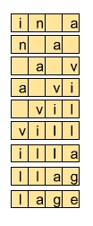
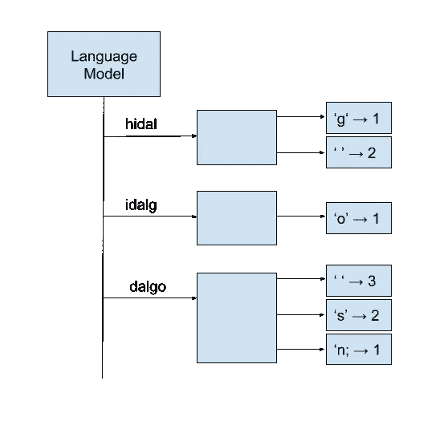

# Kotlin 的 NLP

> 原文：<https://towardsdatascience.com/nlp-with-kotlin-ec84c068650?source=collection_archive---------16----------------------->

## 使用 n 元语法的第一种方法

自然语言处理( **NLP** )是许多打着“机器学习”商标的应用程序的核心，尽管它们是自己的一组算法和接近人工智能的方式(对此有所保留)

NLP 用于创建聊天机器人，当你请求支持时，它可以帮助你提供相似的搜索结果；通过提供更容易处理的文本表示来翻译文本或减轻其他应用程序必须做的工作

NLP 的一个应用是生成或猜测序列中的下一个单词。与其他机器学习过程一样，猜测下一个单词需要训练一个模型，并使用它进行推理。

在这个例子中，您将看到如何构建一个在字符级工作的简单的单词生成器。

完成这项任务有不同的方法。在过去的几年里，不同风格的 RNN 正在击败其他产生文本的机制。然而，在这个项目中，我决定放弃它们，转而采用更简单的 n-gram 表示，因为它更适合解决这个问题

如果你想直接进入代码，可以在这里找到

 [## 麦考比/机器学习

### 在 GitHub 上创建一个帐户，为 mccorby/MachineLearning 的开发做出贡献。

github.com](https://github.com/mccorby/MachineLearning) 

## 什么是 n 元模型？

n-gram 基本上是一种将文本分割成一系列连续标记的方法

例如，对于文本“*在拉曼查的一个村庄，我不想想起它的名字*”，一个 4 克的表示将是

n-gram 语言模型将使用这种表示，通过计算不同的可能延续出现的次数来估计序列中下一个项目(一个单词、一个字符、一个完整的句子)的概率

此项目中使用的 n-gram 语言模型由地图的地图表示，如下图所示

每个条目代表一个 n-gram，带有序列中可能的字符的映射以及在语料库中找到的出现次数

这由一个*映射<字符串、映射<字符、Int > >* 表示

下面的代码用于定型模型

Training process for character-based n-gram language model

在构建更复杂的架构和方法时，n 元模型经常被用作基线模型

## 生成文本

为了使用这个模型生成文本，应用程序将获取一个初始输入(或空字符串)并查找下一个字符的候选字符。该字符被添加到输入中，形成在后续步骤中使用的历史

一个使用 5 克模型的样本没有唐吉诃德的初始种子，如下所示

> 第十章。
> 
> 它的工作是给
> 的黑客装上马鞍，同时处理角色并追逐角色
> 去了拉曼查的一个村庄
> 
> 其中对待角色和追求他，他把角色和实践自己拿起他的收入。这个人物和追求他的那个保持兵刃
> 的人物和追求它的人一样，都曾在他的收入里。所以，对它的追求也是如此，没有被称为 quexana 的欲望。角色的性格和追求，给角色装上马鞍，让自己成为一名骑士，周六吃点残羹剩饭，周六吃点扁豆，周六吃点扁豆，瘦瘦的，一个老圆盾，很久以前就不是他的收入了。这个人物和追求他的那个拉曼查保持兵刃之一

这段文字看起来很像塞万提斯写的东西(如果不是在他最好的时候)

## 缓和

但是当模型没有注册历史时会发生什么呢？然后它将停止工作，因为没有下一个字符

在这些情况下，使用一些技术。其中有平滑，特别是[愚蠢的退避](https://rpubs.com/pferriere/dscapreport)。

简而言之，愚蠢的退避将使用较低阶的 n 元文法来计算丢失条目的概率

## 选择字符

根据用于训练模型的语料库，选择下一个字符可能很棘手。如果总是选择具有最高概率的字符，则模型有可能陷入重复

为了避免这个问题，使用了从与当前历史相关联的一组可能候选中随机选择的字符

## 丰富

*   与任何其他机器学习问题一样，在构建系统时需要一系列步骤:数据检查、清理、模型评估
*   用于训练模型的语料库可以被清理，去除停用词

## 结论

这个项目展示了如何创建一个字符级的 n-gram 语言模型来生成文本。

我将使用这个模型作为该项目的第二部分的基础。

敬请期待！