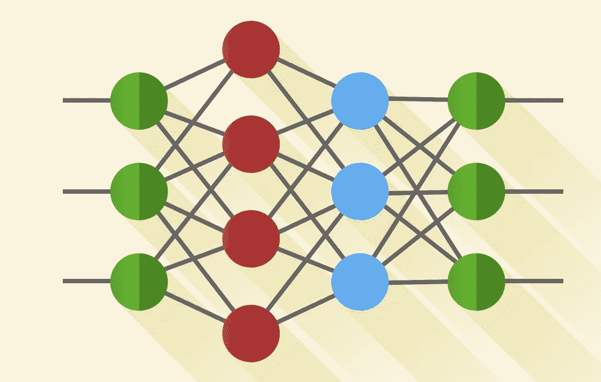
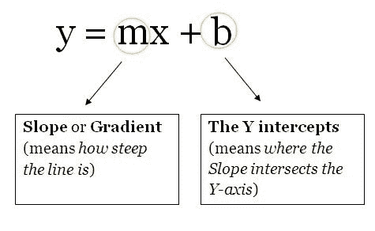
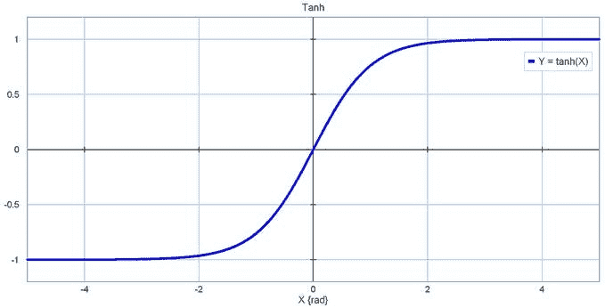
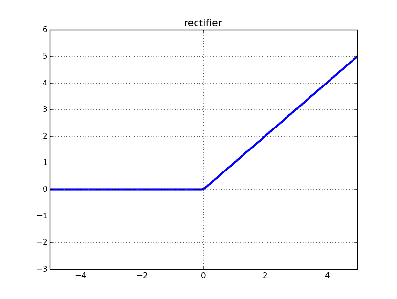
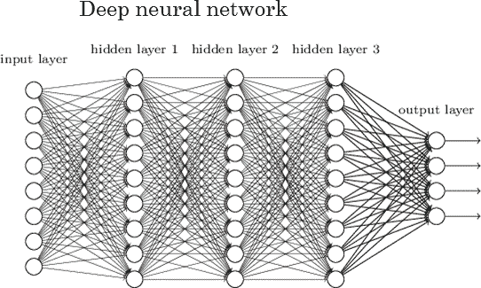

# 神经网络:你需要知道的一切

> 原文：<https://towardsdatascience.com/nns-aynk-c34efe37f15a?source=collection_archive---------1----------------------->

## 任何大型 ML 项目的主干都始于一个网络……一个神经网络，这是你需要了解的所有信息。

A Neural Network performing a prediction

如副标题所述，[神经网络](https://en.wikipedia.org/wiki/Artificial_neural_network) (NNs)正在*几乎任何需要启发式方法来解决问题的地方*被使用。这篇文章将教你所有你*需要*了解的 NN。读完这篇文章后，你应该对神经网络有一个大致的了解，它们是如何工作的，以及如何自己制作一个。

以下是我要复习的内容:

*   **神经网络的历史**
*   **什么是真正的神经网络？**
*   **单位/神经元**
*   **重量/参数/连接**
*   **偏差**
*   **超参数**
*   **激活功能**
*   **层层**
*   **神经网络学习时会发生什么？**
*   **实施细节(如何管理项目中的一切)**
*   **关于神经网络的更多信息(更多资源链接)**

我偶尔会写这些有些简短但内容丰富的文章，以帮助您**了解更多关于 AI 和机器学习的知识**。您可以在 twitter 上关注我的**或在这里关注我的**来了解我的最新文章。你也可以在 twitter 上问我问题，或者在这里发表评论。****

## ****我花了一个多星期才写完这篇文章的所有内容，如果你觉得有帮助就鼓掌吧。我希望这篇文章教你一些新的东西，让我们开始吧！****

# ****神经网络的历史****

****因为，我不想用很多关于 NNs 的历史来烦你，我只会简单回顾一下他们的历史，T42。如果你想更深入地了解他们的历史，这里有一篇关于这个主题的维基文章。这一部分主要基于维基文章。****

****这一切都始于 1943 年沃伦·麦卡洛克 和 [**沃尔特·皮茨**](https://en.wikipedia.org/wiki/Walter_Pitts) 创造了第一个神经网络模型。他们的模型纯粹基于数学和算法，由于缺乏计算资源而无法测试。****

****后来，在 1958 年， [**弗兰克·罗森布拉特**](https://en.wikipedia.org/wiki/Frank_Rosenblatt) 创造了第一个可以进行模式识别的模型。这将改变一切。 [**感知器**](https://en.wikipedia.org/wiki/Perceptron) 。然而，他只给出了符号和模型。实际模型仍然无法测试。在此之前有相对较少的研究。****

****第一个可以测试的多层神经网络由阿列克谢·伊瓦赫年科、T21**和帕拉**于 1965 年发表。****

****此后，由于机器学习模型的高可行性，神经网络的研究停滞不前。这是 1969 年由 [**马文·明斯基**](https://en.wikipedia.org/wiki/Marvin_Minsky) 和 [**西蒙·派珀特**](https://en.wikipedia.org/wiki/Seymour_Papert) 完成的。****

****然而，这种停滞是相对短暂的，因为 6 年后的 1975 年 [**Paul Werbos**](https://en.wikipedia.org/wiki/Paul_Werbos) 提出了 [**反向传播**](https://en.wikipedia.org/wiki/Backpropagation) ，它解决了[**【XOR】**](https://en.wikipedia.org/wiki/Exclusive_or)**问题**，并且总体上使神经网络学习更加有效。****

****[**Max-pooling**](https://en.wikipedia.org/wiki/Convolutional_neural_network#Pooling_layer) 后来在 1992 年引入，它有助于 3D 对象识别，因为它有助于最小平移不变性和对变形的容忍。****

****在 2009 年至 2012 年间，尤尔根·施密德胡伯的 研究小组创造的 [**递归神经网络**](https://en.wikipedia.org/wiki/Recurrent_neural_network) 和深度前馈神经网络在 [**模式识别**](https://en.wikipedia.org/wiki/Pattern_recognition) 和 [**机器学习**](https://en.wikipedia.org/wiki/Machine_learning) **中赢得了 8 项国际比赛。******

****2011 年，Deep NNs 开始将卷积层与最大池层相结合，最大池层的输出随后被传递到几个完全连接的层，这些层之后是输出层。这些被称为 [**卷积神经网络**](https://en.wikipedia.org/wiki/Convolutional_neural_network) **。******

****在这之后还有一些研究，但是这些是你应该知道的主要话题。****

# ****什么是真正的神经网络？****

****一个想到 NN 的好方法是作为一个 [**复合函数**](https://en.wikipedia.org/wiki/Function_composition) 。你给它一些输入，它给你一些输出。****

****基本神经网络的体系结构由三部分组成。这些是:****

*   ******单位/神经元。******
*   ******连接/重量/参数。******
*   ******偏见。******

****上面提到的所有东西都是你构建一个神经网络的基本架构所需要的。****

****你可以把这些想象成一个建筑的**积木/砖块**。根据你对建筑功能的要求，你可以安排砖块，反之亦然。水泥可以被认为是**砝码。不管你的砝码有多重，如果你手头没有足够数量的砖块来解决问题，这座建筑将会倒塌。然而，你可以让建筑以最小的精度运行(用最少的砖)，然后逐步地在这个架构上解决问题。******

****我将在后面的部分中更多地讨论权重、偏差和单位。这些部分可能很短，但是这些部分强调了它们的重要性。****

# ****单位/神经元****

****作为 NNs 架构的三个部分中最不重要的部分，这些函数包含权重和偏差，并等待数据到达它们。数据到达后，它们执行一些计算，然后使用一个激活函数将数据限制在一个范围内(大多数情况下)。****

****把这些单位想象成一个包含权重和偏差的盒子。盒子从两端打开。一端接收数据，另一端输出修改后的数据。然后数据开始进入盒子，盒子将权重与数据相乘，然后将偏差加到相乘后的数据上。这是一个单一的单位，也可以认为是一个功能。此函数与此类似，是直线的函数模板:****

********

****y = mx + b****

****想象一下有多个这样的东西。从现在开始，您将为同一个数据点(输入)计算多个输出。这些输出然后被发送到另一个单元，该单元然后计算神经网络的最终输出。****

****如果这一切都在你眼前一闪而过，那么继续读下去，你应该能理解更多。****

# ****重量/参数/连接****

****作为神经网络最重要的部分，这些(和偏差)是神经网络为了推广到一个问题必须学习的数字。这就是此时你需要知道的全部。****

# ****偏见****

****这些数字代表神经网络“认为”在将权重与数据相乘后应该添加的内容。当然，这些*总是*错误的，但是神经网络也会学习最优偏差。****

# ****超参数****

****这些是您必须手动设置的值。如果你把神经网络想象成一台机器，改变机器行为的节点就是神经网络的超参数。****

****你可以在这里阅读我的另一篇文章[(遗传算法+神经网络=两全其美)](/gas-and-nns-6a41f1e8146d)找出如何让你的计算机学习神经网络的“最佳”超参数。****

# ****激活功能****

****这些也称为映射函数。它们在 x 轴上接受一些输入，并输出一个限定范围内的值(大多数情况下)。大多数情况下，它们用于将单元的大输出转换为较小的值，并提高神经网络的非线性度。你对激活函数的选择可以极大地提高或阻碍你的神经网络的性能。如果您愿意，您可以为不同的单元选择不同的激活功能。****

****以下是一些常见的激活功能:****

*   ****[乙状结肠](https://en.wikipedia.org/wiki/Sigmoid_function)。****

********

****The Sigmoid function****

*   ****[Tanh](https://reference.wolfram.com/language/ref/Tanh.html) 。****

********

****The tanh function****

*   ****[ReLU](https://en.wikipedia.org/wiki/Rectifier_(neural_networks)) :整流线性单元。****

********

****The ReLU function****

*   ****[泄漏的 ReLU](https://en.wikipedia.org/wiki/Rectifier_(neural_networks)) 。****

********

****The Leaky ReLU function****

# ****层****

****这就是帮助神经网络在任何问题中获得复杂性的原因。增加层数(单位)会增加神经网络输出的非线性。****

****每一层都包含一定数量的单元。大多数情况下的数量完全取决于创作者。然而，对于一个简单的任务有太多的层会不必要地增加它的复杂性，并且在大多数情况下会降低它的准确性。反之亦然。****

****每个神经网络都有两层。这些是输入和输出层。这两者之间的任何层都称为隐藏层。下图中的神经网络包含一个输入层(8 个单元)、一个输出层(4 个单元)和 3 个隐藏层，每个隐藏层包含 9 个单元。****

********

****A Deep Neural Net****

****具有两个或更多隐藏层的 NN，每层包含大量单元，称为深度神经网络，它催生了一个新的学习领域，称为[深度学习](https://en.wikipedia.org/wiki/Deep_learning)。图中所示的神经网络就是这样一个例子。****

# ****神经网络学习时会发生什么？****

****教神经网络概括问题的最常见方法是使用[梯度下降](https://en.wikipedia.org/wiki/Gradient_descent)。因为我已经写了一篇关于这个主题的详细文章，你可以阅读来充分理解 GD(梯度下降)，我将不在这篇文章中解释 GD。下面是 GD 文章:[渐变下降:你需要知道的一切](https://hackernoon.com/gradient-descent-aynk-7cbe95a778da)。****

****再加上 GD，另一种教授 NN 的常用方法是使用[反向传播](https://en.wikipedia.org/wiki/Backpropagation)。利用这一点，使用微积分中的[链规则](https://en.wikipedia.org/wiki/Chain_rule)将神经网络输出层的误差向后传播。对于一个没有很好掌握微积分的初学者来说，理解这个很有挑战性，所以不要被它淹没。[点击此处](http://neuralnetworksanddeeplearning.com/chap2.html)查看一篇文章，当我在与反向传播作斗争时，这篇文章确实帮了我大忙。我花了一天半的时间才弄明白错误反向传播时发生了什么。****

****在训练神经网络时有许多不同的注意事项。然而，在一篇面向初学者的文章中浏览它们会非常乏味，而且对初学者来说是不必要的。****

# ****实施细节(如何管理项目中的一切)****

****为了解释项目中的一切是如何管理的，我创建了一个 [JupyterNotebook](https://jupyter.org/) 包含一个学习 [XOR 逻辑门](https://en.wikipedia.org/wiki/Exclusive_or)的小 NN。[点击这里](https://github.com/Frixoe/xor-neural-network/blob/master/XOR-Net-Notebook.ipynb)查看笔记本。****

****在查看并理解笔记本中发生的事情后，您应该对基本神经网络是如何构造的有一个大致的概念。****

****在笔记本中创建的 NN 中的训练数据以矩阵形式排列。这是数据在中的一般排列方式。不同项目中显示的矩阵的维度可能会有所不同。****

****通常对于大量的数据，数据被分成两类:训练数据(60%)和测试数据(40%)。然后，神经网络根据训练数据进行训练，然后根据测试数据测试其准确性。****

# ****关于神经网络的更多内容(更多资源的链接)****

****如果您仍然不明白发生了什么，我建议您查看下面提供的资源链接。****

****YouTube:****

*   ****Siraj Raval****
*   ****[3 蓝色 1 棕色](https://www.youtube.com/channel/UCYO_jab_esuFRV4b17AJtAw)****
*   ****[编码序列](https://www.youtube.com/playlist?list=PLRqwX-V7Uu6aCibgK1PTWWu9by6XFdCfh)****
*   ****布兰登·罗尔****
*   ****[巨型神经网络](https://www.youtube.com/channel/UCrBzGHKmGDcwLFnQGHJ3XYg)****
*   ****雨果·拉罗彻尔****
*   ****[贾布里勒](https://www.youtube.com/channel/UCQALLeQPoZdZC4JNUboVEUg)****
*   ****路易斯·塞拉诺****

****Coursera:****

*   ****[多伦多大学的用于机器学习的神经网络](https://www.coursera.org/learn/neural-networks)****
*   ****[深度学习专业化](https://www.coursera.org/specializations/deep-learning)由吴恩达****
*   ****[深度学习简介](https://www.coursera.org/learn/intro-to-deep-learning)国立研究型大学高等经济学院****

## ****就这样，希望你学到了新的东西！****

## ****如果你觉得这篇文章有帮助，请鼓掌。[在 Twitter 上关注我](https://twitter.com/SuryanshTweets)和[在这里](https://medium.com/@SuryanshWrites)关注我的最新帖子。如果你有任何问题，你可以发微博给我，或者通过评论让我知道。我很乐意回答这些问题。****