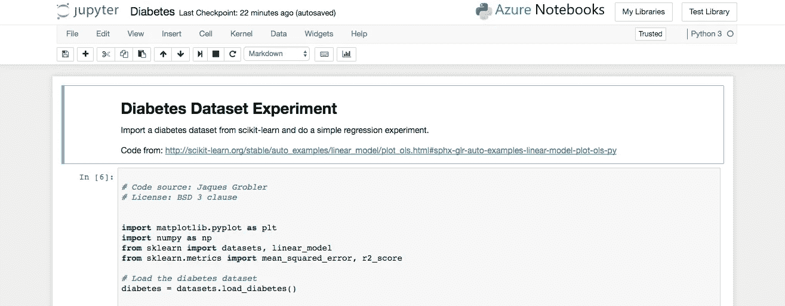
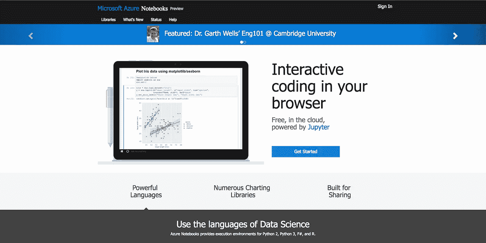
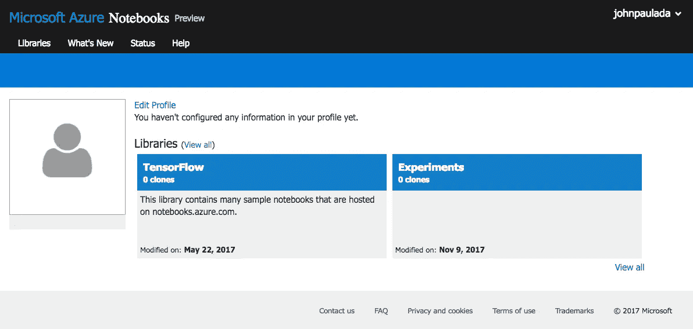
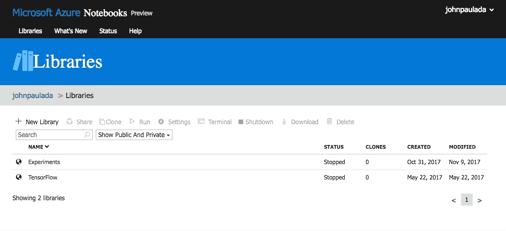
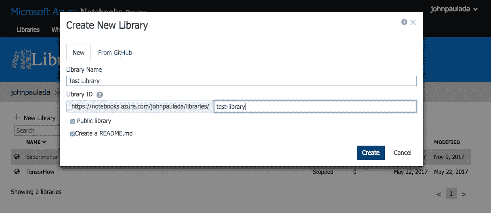
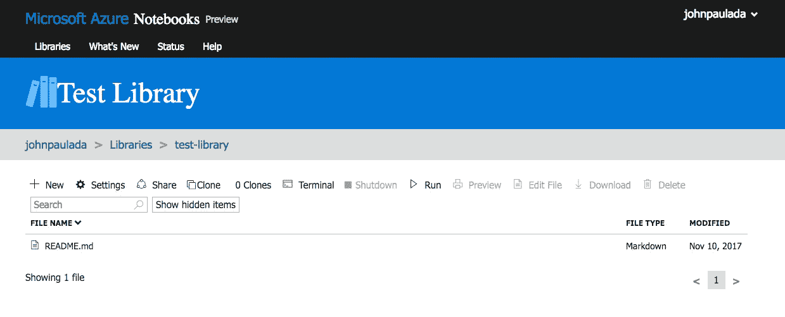
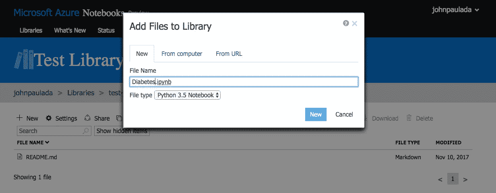
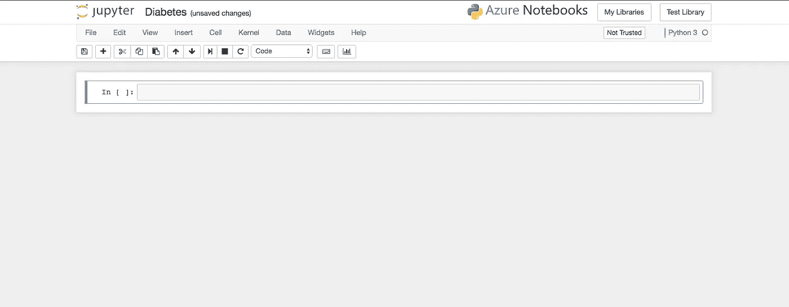

# 使用 Azure 笔记本进行轻松的机器学习实验

> 原文：<https://towardsdatascience.com/no-hassle-machine-learning-experiments-with-azure-notebooks-e1a22e8782c3?source=collection_archive---------3----------------------->

## 使用 Microsoft Azure 笔记本电脑和 Microsoft 帐户，轻松快速地开始构建自己的机器学习实验。

Jupyter 笔记本是上帝给那些数据工作者的礼物。他们允许我们**用 Julia、Python、R 和更多的**(因此 JuPytR)做快速实验。它还**混合了实时代码和文档**，格式都很漂亮，带有 Markdown 和语法高亮——就像在一篇文章中运行代码一样。它们还允许我们在笔记本内部进行数据可视化。笔记本电脑也是**可导出的**，因此实验代码和结果**可以与感兴趣的各方**共享。最后但同样重要的是，它们非常容易使用。

问题是，即使它很容易使用，设置可能是一个痛苦。您还需要在笔记本中安装需要使用的库。这可能是一个持续几分钟到几小时的过程。

幸运的是，微软支持我们。进入[微软 Azure 笔记本](https://notebooks.azure.com/)。它们基本上是托管在云上的 Jupyter 笔记本。您不需要再进行设置，并且处理数据所需的大多数库都在那里。目前**支持创建 Python、R 和 F#笔记本**。你唯一需要的是一个微软账户。

让我们开始吧。

# 打开 Azure 笔记本网站

Microsoft Azure Notebooks landing page

若要开始，请前往[https://notebooks.azure.com/](https://notebooks.azure.com/)。您将会看到上面的登录页面。点击**登录**按钮登录。为此，您需要有一个 Microsoft 帐户。

# 创建一个库

I have a cloned TensorFlow library and an my own Experiments library.

登录后，您将被重定向到此处。该页面是您的仪表板，将包含您的**库**，其中包含您的笔记本和相关文件。我已经创建了两个库。要创建一个新的库，点击**查看所有**按钮之一，转到**库页面**。

All my libraries in list form in the Libraries page.

如果您选择其中一个，大多数禁用的按钮都会亮起，您现在可以运行、删除、克隆某个库。

现在，让我们通过点击**新建库**按钮来创建一个库。

Create New Library modal with some values.

点击**新建库**按钮后会出现一个模态。我们将创建一个名为“测试库”的库。您可以选择将其公开并创建一个 README.md。完成后单击**创建**按钮。

The Test Library page showing the files we currently have.

点击**创建**按钮后，我们被重定向到该页面。这列出了我们在测试库中的所有文件，以及我们可以对库进行的所有当前操作。我们勾选了**创建 README.md** 按钮，这样我们就有了 README.md 文件。

# 创建笔记本

让我们试着做一个实验，但首先我们需要一个笔记本来做。点击**新建**按钮创建一个新笔记本。当您这样做时，此模式将会出现:

Creating a Python 3.5 notebook called Diabetes.ipynb

创建一个名为`Diabetes.ipynb`的 Python 3.5 笔记本，点击**新建**按钮。这将创建一个新的 Python 笔记本，其中加载了大多数流行的 Python 数据科学库。您也可以使用相同的过程创建 R 或 F#笔记本。

创建笔记本后，单击其名称将其打开。

Our new Diabetes Python notebook

我们被重定向到空的糖尿病笔记本。在这里，我们将尝试使用来自 scikit-learn 的糖尿病数据集。让我们用 scikit-learn 提供的代码来试用一下数据集:[http://scikit-learn . org/stable/auto _ examples/linear _ model/plot _ ols . html # sphx-glr-auto-examples-linear-model-plot-ols-py](http://scikit-learn.org/stable/auto_examples/linear_model/plot_ols.html#sphx-glr-auto-examples-linear-model-plot-ols-py)。我们不需要安装 scikit-learn，因为它已经安装在 Azure Python 笔记本中了。

# 生成的笔记本

访问此链接查看最终笔记本:[https://notebooks . azure . com/n/z 8 xkjt 5 wdha/notebooks/diabetes . ipynb](https://notebooks.azure.com/n/z8XKJt5WdHA/notebooks/Diabetes.ipynb)

Our experiment notebook.

# 结论

如果你想做快速的数据和机器学习实验，而没有安装太多库的麻烦，微软 Azure 笔记本值得一试。看看吧！😃