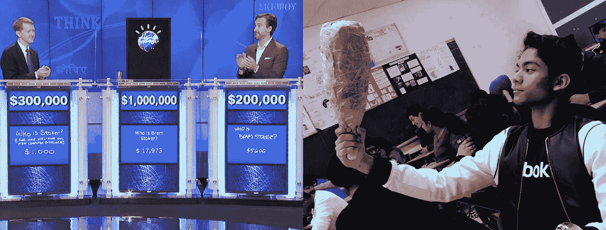
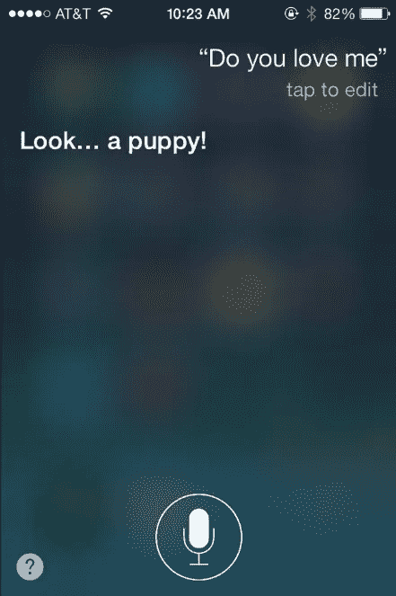
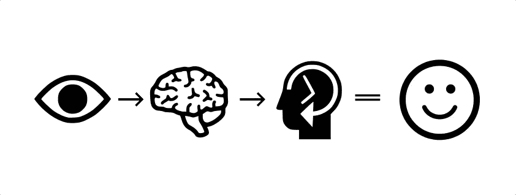
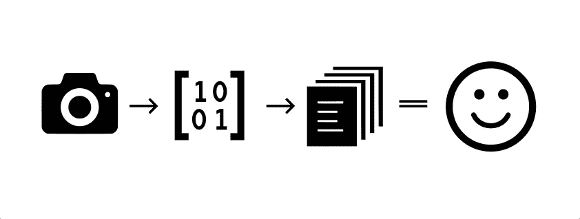
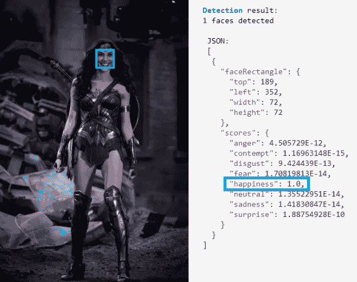
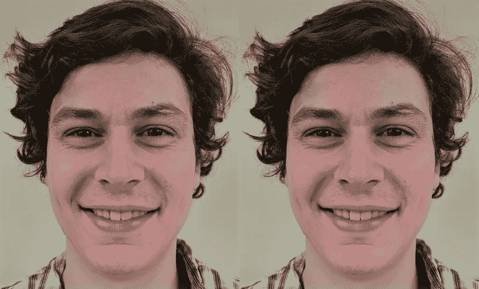

# 没人理解我…但很快，人工智能可能会

> 原文：<https://towardsdatascience.com/nobody-understands-me-but-soon-artificial-intelligence-just-might-440f771c2024?source=collection_archive---------22----------------------->

# H.A.L 9000，天网，还有来自瓦力的邪恶方向盘。

《2001:太空漫游》中的邪恶 ai、*终结者*以及深受喜爱的儿童电影*瓦力*无疑是我们这个时代对人工智能最可怕的描述。

事实上，人工智能正在推动世界发生一些巨大的积极变化；根据对话诊断疾病，预测疾病爆发，甚至写书。

然而，一个全能的有感知能力的人工智能消灭所有人类的想法实际上是世界上许多聪明人的担忧——像埃隆·马斯克这样的亿万富翁创新者已经投入了金钱和资源，以确保我们在未来通过 OpenAI 这样的项目拥有友好的人工智能。

当然，这一切都说明了一个潜在的问题:作为人类，我们害怕我们不了解的东西。结果，我们不信任它。人们不信任 AI，所以在情感上无法与之产生联系。更重要的是，如果 AI 不能识别我们的情绪，就会阻碍我们的交流和进步。这可能会有问题*:*

*   *如果一个**病人**不舒服地告诉机器他们感觉到的症状，它就不能诊断她。*
*   *如果一个**消费者**对人工智能客户服务越来越失望，而系统没有相应地调整，企业可能会遭受损失。*
*   *如果一个**客户端**正在与一个人工智能讨论一个敏感问题，它拉着一个 Alexa 并开始随机大笑，这可能会造成一个问题。*

*底线是，人工智能将需要能够理解我们的意思，即使我们并不完全清楚，*特别是在零售和医疗领域。**

*人类和人工智能共存的未来是不可避免的，因此改善与越来越智能的机器的通信是必要的，那么我们如何使这种转变更容易呢？*

***简单。我们教人工智能移情。***

# *如果我们能学会换位思考，人工智能也能。*

*首先，理解几个定义很重要:*

***人工智能**描述了能够适应新信息并执行人类能做的各种任务的计算机系统，建立在它已经知道的事情上。*

**网飞*和 *Spotify* 利用这样的算法，根据你的观看或收听习惯，筛选出你最喜欢的内容类型。来自麻省理工学院的科学家开发了人工智能，可以根据 MRI 扫描诊断肿瘤。*

*IBM 的沃森是一个著名的会下棋、分析网络攻击风险、甚至会驾驶汽车的人——沃森甚至在 2011 年的《危险边缘》中赢得了 100 万美元，这让 14 岁的沃森比我更令人印象深刻。*

**

*Watson at age 8 vs. Me at age 14\. That’s a paper-mâché leg of lamb by the way.*

*然而，你并不会在对话中真正与这种 AI 互动:它只执行非常具体的任务，也被称为**狭义 AI** 。*

***通用人工智能**就像是人工智能的最终目标，它构成了一个可以执行人类可以执行的相同任务的人工智能——我们还没有达到那一步，但像 [DeepMind](https://deepmind.com/) 和[人脑项目](https://www.humanbrainproject.eu/en/)这样的项目正在努力让我们更近一步。*

**

*像谷歌助手和 Siri 这样的人工助手非常有用，有一些非常酷的功能，但它们仍然不能真正告诉我们的感觉。为了真正与我们口袋里和我们周围的人工智能联系起来，我们必须从人工助理转移到人工伴侣。那么，我们该怎么教他们呢？*

*答案是*机器学习。**

***机器学习** **(ML)** 是人工智能的一个分支，涉及训练系统通过寻找和识别模式从大量数据中学习。人们相信，制造更智能机器的人工智能技术可能会带来真正的人工智能。为了更深入地了解机器学习，请查看这些文章[这里](https://medium.com/datadriveninvestor/how-it-is-done-machine-learning-ff0f1deb26d4)和[这里](https://blog.goodaudience.com/how-machines-learn-ce550a0d484e)！*

*移情:好吧，这就是事情变得有点复杂的地方。移情可以分为两种不同的类型:*

*   *情感共鸣包括感受到与他人相同的情感、个人痛苦或对他人的同情。*
*   *认知同理心处理的是识别和理解他人情绪的能力，而不一定感觉到它。*

*如果我们想教会人工智能移情，我们还需要了解人类如何移情。有两种理论可以解释这一点:*

*   ***模拟理论**提出，我们试图*重现*我们在他人身上看到的情绪，以便理解他们，这一想法得到了“镜像神经元”的发现的支持，当我们观察*和*体验情绪时，镜像神经元会激活。(也许这就是为什么当*其他*人撞到*我们*时加拿大人会说对不起？)*
*   ***心理理论**认为我们的移情是基于我们通过经验*了解到的东西*来解释其他人可能的感受。*

*这是一场分裂科学界的辩论。然而，对于我们的目的来说，哪个是对的并不重要。人工神经网络受到大脑的启发；同样，通过使用**机器学习**来应用这些理论背后的主要思想*来教会我们的人工智能移情，我们可能会弥合人类和人工智能之间的差距。**

# *我们的脸和声音可以被分析出情绪。*

*正如我提到的，*仿生学*，或者说在我们创造的事物中模仿自然设计，对于在人工智能中重现这种人类倾向是至关重要的。我们的最终目标是**人工共情**，它(至少目前)描述了机器识别和响应人类情感的能力。*

*与此相一致，让我们关注**认知移情**，那种涉及识别和理解情感的移情。大多数试图这样做的人工智能使用:*

*   ***情感识别***
*   ***色彩映射***
*   ***声音模式分析***

## *情感识别*

*遇见*盖尔·加朵*。(她其实是神奇女侠，但是不要告诉任何人)。像大多数人一样，我们可以根据她的面部表情来猜测她的感受:*

**

*😢 and 😃 and 😠*

*你用你的眼睛去看她的脸，然后你的大脑试着去理解她现在的情绪。但是如果更经验性地分析，你的眼睛只是接收视觉信息，在你的视觉皮层进行处理，并将其与你海马体中的记忆联系起来。*

**

*这是一个可以使用机器学习技术复制的过程，以创建*计算机视觉*，具体来说就是**情感识别(**或面部编码)。*

***计算机视觉**描述的是使用摄像头输入的视觉数据，并通过机器学习技术，学习以算法识别视觉模式的机器。(把摄像头想象成“眼睛”，把算法想象成“大脑”)。*

**

*这可以通过在照片的小“块”中找到像素 RGB 值和对比度的不同模式和排列来实现，这些小“块”由过滤它们的被称为 ***内核*** 的神经网络中的小函数或“神经元”来识别；该算法然后将这些组块编译成更大的模式。*

**

*Microsoft’s Face API determining with 100% certainty that Gal Gadot is happy.*

*在**情绪识别的情况下，**这些模式可以是微笑、皱眉、皱起的眉头，甚至是你的鼻子，它们被编译成与情绪相关的面部表情。 [Affectiva](https://www.affectiva.com/) 是一家已经在使用深度学习算法通过计算机视觉绘制和识别情绪的公司。微软 Azure 的 [Face API](https://azure.microsoft.com/en-us/services/cognitive-services/emotion/) 可以识别和分类图像和视频中的情绪，为开发者打开了一个新的可能性世界。*

## *颜色变换*

*这还没有结束:俄亥俄州立大学的研究人员今年进行了一项研究，表明人类可以根据血液流向不同部位引起的面部微妙颜色来确定他人的情绪。*

**

*他们通过根据人眼的视觉方式将图像分成两个不同的颜色通道，发现每种情绪都有自己独特的颜色模式，从而找到了这一点。*

*然后，他们开发了人工智能算法，可以根据这些颜色模式检测情绪，准确率高达 90%。他们已经将其技术推向市场，为企业提供有意义的解决方案。*

## *声音模式分析*

*实现人工移情的最有希望的途径之一是通过声音模式分析。以类似于计算机视觉和理解现代艺术的方式(原则上)，它涉及到把复杂的东西分解成简单的模式，然后找到趋势。说到声音模式，它们可以由以下部分组成:*

*   ***音高，**可以量化为以赫兹(Hz)为单位的频率，或每秒的声音周期。我们经常把它与音符联系在一起，但它也出现在言语中。*
*   ***音量**描述了我们如何感知*声压*从安静到大声。*声压级*以分贝(dB)为单位测量某种声音的压力(与大气标准的偏差)。*
*   ***音色**处理声音的质量，允许我们区分小号和萨克斯管的声音，即使它们以相同的音高和响度演奏。*
*   ***语气**描述了我们如何在语言中使用*音高*来赋予某些词语*强调、* **情感、**等语义*

*节奏、速度和速率也是标识符，仅举几例。通过使用机器学习和语音记录数据，人工智能可以测量并找到这些品质的模式——例如每个单词之间的时间间隔、语调或讲话的音量——并将它们与特定的情绪联系起来。最棒的是，这些算法甚至不需要处理正在说的实际单词，只需要分析这个人的声音模式。*

*应用程序是无止境的；精神病学家正在使用声音模式分析软件来帮助他们诊断创伤后应激障碍、双相情感障碍和抑郁症。(与许多心理障碍相关的声音生物标记有时可能人耳听不到，但很容易被机器拾取，例如短声音裂缝或震动。)*

# *人工移情会让生活变得更好。*

*人工智能正以前所未有的速度发展，它正进入我们生活的方方面面，从我们的通信到我们的医疗保健。但如果我们希望实现真正的人工智能，我们需要能够与它无缝互动；这需要人工智能能够识别我们的感受。实现人工共情为改善我们的生活打开了更好、更有用的工具之门:*

*   ***人工智能辅助的精神疾病诊断和治疗:**正如我前面提到的，麻省理工学院的研究人员开发了一种模型，利用声音模式分析来识别患者的抑郁症；它的准确率高达 77%。*
*   *未来可能包括**手机应用程序，它可以从你的声音中检测出精神疾病的迹象；** *每天记录语音日志可以让你知道自己是否处于危险之中。**
*   ***2015 年，纽约大学的研究人员**开发了一种 ML 模型，可以识别人们的 PTSD，准确率也达到 77%。他们目前正在收集更多的数据，以进一步提高识别与 PTSD 和创伤性脑损伤相关的声音模式的准确性。*
*   ***梅奥诊所在** [**超越口头**](http://www.beyondverbal.com/) **应用的帮助下，**使用 ML 来识别与高风险或冠状动脉疾病相关的声音生物标记，其中一些只能通过软件提取。*
*   *Cogito 是一家公司，其软件可以检测呼叫中心代理人声音中的疲劳以及客户的情绪反应。它可以识别停顿……(尴尬的沉默)……和其他声音特征，帮助代理成为更具同理心的联系点。*
*   *假设有人被枪指着从自动取款机里取钱。如果自动取款机的摄像头和软件也能识别出那个人脸上的恐惧并通知当局会怎么样？情绪识别有可能极大地提高我们的安全性。*
*   ***使用 CV 情感识别可以提高营销效率。**通过分析客户对不同营销活动的情绪反应，公司可以专注于有效的策略，并相应地分配预算。*

*同理心是我们最常见也是最重要的互动和关系的基础。你的家庭医生，你的伴侣，甚至是令人愤怒的不可抗拒的 YouTube 广告——他们都在试图理解你的感受和你想要的，而同理心让这些联系更有价值。*

*未来将会看到人工智能无处不在，几乎在你的每一次日常互动中。通过教会它识别情绪并做出反应，我们为人类和人工智能能够无缝沟通的未来铺平了道路。这不仅会增加我们和机器之间的共鸣，也会增加彼此之间的共鸣。*

# *关键要点*

*   *人工共情描述了人工智能系统识别和响应人类情感的能力。*
*   *这将是创造一个不可避免的未来的关键，在这个未来，人和人工智能必须无缝和直观地互动。*
*   *使用**机器学习，** AI 可以学习**识别面部表情、面部微妙的颜色变化以及声音中的生物标记，**这些都与不同的表情相关联。*
*   *这些过程分别称为 ***、情感识别、色彩映射、*** 和 ***、语音模式分析、*** 。*
*   *利用计算机视觉和声音模式分析的这种结合，研究人员正在为我们所有人的更有同情心的未来铺平道路。*

*感谢你坚持到最后，我希望你喜欢我的第一篇文章！*

*在做一些研究的时候，我发现了这个对 Danielle Krettek 的采访，她是谷歌移情实验室的创始人和负责人，在采访中，她说为了教会我们的人工智能移情:*

> *“这些机器需要全面了解这个世界，这意味着让它们接触故事讲述者、哲学家、艺术家、诗人、设计师和电影制作人。”*

*我的问题是:*

> *如果你只能选择一部电影或一本书展示给一个人工智能系统，而它所知道的关于人类和我们世界的一切都基于这一部媒体作品，你会选择哪一部？*

*我很想听听你的想法！请随时在 LinkedIn 上联系我，或者在 Medium 上关注我，我很乐意谈论人工智能的未来，创新和技术的世界，甚至可能是我们最喜欢的漫威电影。*