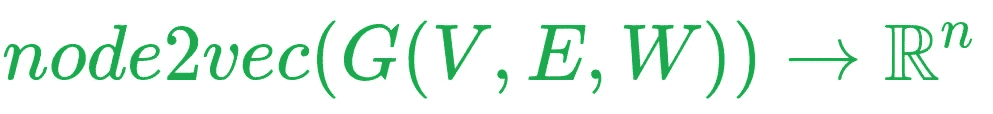
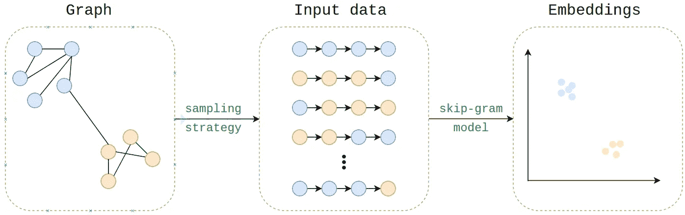
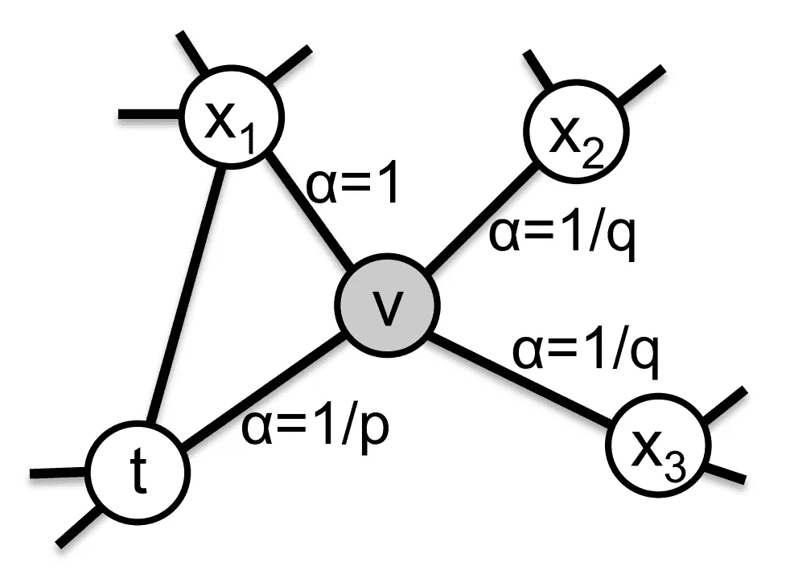
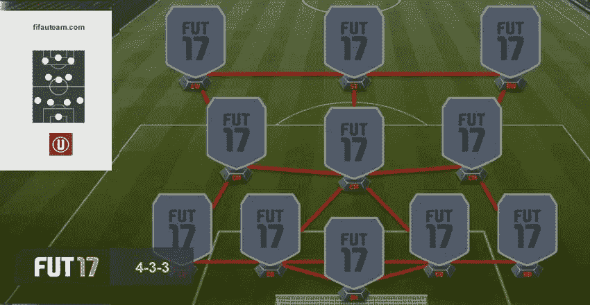
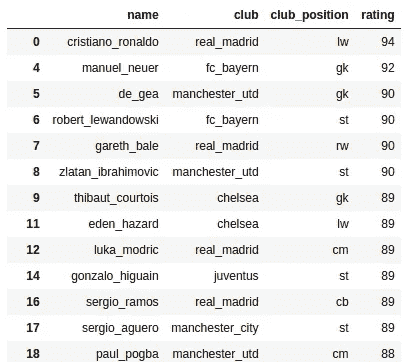
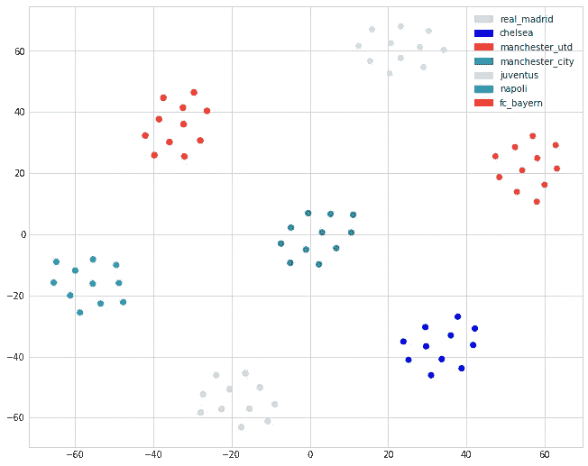

# node2vec:图形数据的嵌入

> 原文：<https://towardsdatascience.com/node2vec-embeddings-for-graph-data-32a866340fef?source=collection_archive---------1----------------------->

***Hotlinks*** :
原文: [node2vec:面向网络的可扩展特征学习，Aditya Grover 和 Jure Leskovec](https://arxiv.org/pdf/1607.00653.pdf)
算法实现—由我: [Github repo](https://github.com/eliorc/node2vec) — Python3
算法实现—由 algo 作者: [Github repo(由 Aditya Grover)](https://github.com/aditya-grover/node2vec)—python 2
Showcase 代码: [https://github.com/eliorc](https://github.com/eliorc/Medium/blob/master/Nod2Vec-FIFA17-Example.ipynb)

# 动机

嵌入…这个词每个数据科学家都听过，但大多是在 NLP 的上下文中。那么，我们为什么还要费心去嵌入东西呢？
在我看来，创建质量嵌入并将其输入模型，与那句名言“垃圾进，垃圾出”正好相反。
当你把低质量的数据输入到你的模型中时，你就把学习的全部负荷放在了你的模型上，因为它必须学习所有能从数据中得出的必要结论。
相反，当您使用质量嵌入时，您已经在数据中加入了一些知识，从而使模型学习问题的任务变得更加容易。
还有一点要思考的是**信息** vs **领域知识**。例如，让我们考虑单词嵌入(word2vec)和单词包表示。
虽然两者都可以拥有关于哪些单词在句子中的全部**信息**，但是单词嵌入还包括**领域知识**比如单词之间的关系等等。
在这篇文章中，我将谈论一种叫做 **node2vec** 的技术，它旨在为图中的节点创建嵌入(在 G(V，E，W)这个词的意义上)。



我将解释**它是如何工作的**，最后提供我自己的**Python 3 的实现**，还有一些额外的东西。

# 嵌入过程

那么是怎么做的呢？
嵌入本身的学习方式与 word2vec 的嵌入学习方式相同——使用 skip-gram 模型。
如果你熟悉 word2vec skip-gram 模型，很好，如果不熟悉，我推荐[这篇很棒的文章](http://mccormickml.com/2016/04/19/word2vec-tutorial-the-skip-gram-model/)，它详细解释了这个模型，从现在开始，我假设你对它很熟悉。

我能想到的解释 node2vec 的最自然的方式是解释 node2vec 如何生成“语料库”——如果我们理解 word2vec，我们就已经知道如何嵌入语料库。

那么我们如何从图中生成这个语料库呢？这正是 node2vec 的创新之处，它以一种智能的方式做到了这一点，这是使用**采样策略**完成的。

为了从输入图中生成我们的语料库，让我们把一个语料库看作一组有向无环图，最大出度为 1。如果我们考虑一下，这是一个文本句子的完美表现，句子中的每个单词都是一个节点，它指向句子中的下一个单词。


Sentence in a graph representation

通过这种方式，我们可以看到 word2vec 已经可以嵌入图形了，但是是非常特定类型的图形。
然而，大多数图形并没有那么简单，它们可以是(不)定向的，(不)加权的，(循环的)并且在结构上基本上比文本复杂得多。

为了解决这个问题，node2vec 使用一个可调整的(通过超参数)采样策略来采样这些有向无环子图。这是通过从图的每个节点生成随机行走来完成的。很简单，对吧？

在我们深入研究采样策略如何使用超参数来生成这些子图之前，让我们来看一下这个过程:



Node2vec embedding process

# 抽样策略

现在我们已经有了大致的了解，是时候深入了解了。
Node2vec 的采样策略，接受 4 个参数:
— **步数**:从图中的每个节点生成的随机步数
— **步长**:每次随机步中有多少个节点
— **P** :返回超参数
— **Q** : Inout 超参数
以及标准的 skip-gram 参数(上下文窗口大小、迭代次数等)。)

前两个超参数非常简单明了。
随机漫步生成算法将遍历图中的每个节点，并将生成< **漫步数量** >随机漫步，长度< **漫步长度** >。
**Q** 和 **P** ，用可视化更好解释。
假设你正在随机行走，刚刚从节点< ***t*** >过渡到下图中的节点<***v***>**(摘自文章)。**

****

**从< ***v*** >过渡到他的任何一个邻居的概率是
< **边权重**>*<**α**>**(归一化)，其中< **α** >取决于超参数。
**P** 控制访问< **v** >后回到< **t** >的概率。
**Q** 控制着探索图表中未被发现部分的概率。
直观地说，这有点像 tSNE 中的困惑参数，它允许你强调图形的局部/全局结构。
不要忘记重量也被考虑在内，所以最终的出行概率是:
1 的函数。行走中的上一个节点
2。p 和 Q
3。边缘重量****

****理解这一部分很重要，因为它是 node2vec 的本质。如果你没有完全理解抽样策略背后的思想，我强烈建议你再读一遍这部分。****

****使用采样策略，node2vec 将生成“句子”(有向子图)，这些句子将用于嵌入，就像 word2vec 中使用的文本句子一样。如果工作正常，为什么要改变呢？****

# ****代码(展示)****

****现在是将 node2vec 付诸行动的时候了。你可以在这里找到 node2vec 测试的完整代码。
我使用 node2vec 算法的实现作为例子，它增加了对分配节点特定参数(q，p，num_walks 和 walk length)的支持。****

****我们要做的是，利用欧洲足球队的形成，嵌入 7 个不同俱乐部的球队，球员和位置。
我将要使用的数据来自 Kaggle 上的 [FIFA 17 数据集。
在 FIFA(eas sports)中，每支球队都可以用一个图形来表示，见下图。](https://www.kaggle.com/artimous/complete-fifa-2017-player-dataset-global)****

********

****Formation example from FIFA17, easily interpreted as a graph****

****正如我们所看到的，每个位置都与其他位置相连，并且在玩游戏时，每个位置都被分配了一个玩家。
这里有几十种不同的地层，它们之间的连通性各不相同。还有一些类型的位置在一些地层中存在，但在其他地层中不存在，例如“LM”位置在这个地层中不存在，但在其他地层中存在。****

****这就是我们将要做的事情。节点将是球员，球队名称和位置
2。对于每个团队，创建一个单独的图，其中每个球员节点连接到他的团队名称节点，连接到他的队友节点，并连接到他的队友位置节点。
3。将 node2vec 应用到结果图中****

******注意:为了给团队内部和团队之间的每个位置创建单独的节点，我给相似的节点添加了后缀，并且在 walk 生成之后我已经删除了它们。这是一个技术问题，检查回购中的代码以便更好地理解*****

****输入数据的第一行如下所示(经过一些排列):****

********

****Sample rows from the input data****

****然后，我们使用 FIFA17 格式构建图表。
使用我的 node2vec 包，图必须是`networkx.Graph`的一个实例。
检查图边之后，我们将得到以下结果****

```
**for edge in graph.edges:
    print(edge)>>> ('james_rodriguez', 'real_madrid')
>>> ('james_rodriguez', 'cm_1_real_madrid')
>>> ('james_rodriguez', 'toni_kroos')
>>> ('james_rodriguez', 'cm_2_real_madrid')
>>> ('james_rodriguez', 'luka_modric')
>>> ('lw_real_madrid', 'cm_1_real_madrid')
>>> ('lw_real_madrid', 'lb_real_madrid')
>>> ('lw_real_madrid', 'toni_kroos')
>>> ('lw_real_madrid', 'marcelo')
...**
```

****正如我们所看到的，每个球员都根据阵型与他的球队、位置和队友联系在一起。
所有附加在位置上的后缀将在走步计算后返回到它们原来的字符串(`lw_real_madrid` → `lw`)。****

****现在我们有了图，我们执行 node2vec****

```
**# pip install node2vecfrom node2vec import Node2Vec# Generate walks
node2vec = Node2Vec(graph, dimensions=20, walk_length=16, num_walks=100)# Reformat position nodes
fix_formatted_positions = lambda x: x.split('_')[0] if x in formatted_positions else xreformatted_walks = [list(map(fix_formatted_positions, walk)) for walk in node2vec.walks]node2vec.walks = reformatted_walks# Learn embeddings 
model = node2vec.fit(window=10, min_count=1)**
```

****我们给`node2vec.Node2Vec`一个`networkx.Graph`实例，在使用`.fit()`(它接受任何我们得到的参数`gensim.models.Word2Vec`)后，我们得到一个`gensim.models.Word2Vec`实例。****

****首先，我们将检查不同节点之间的相似性。
我们期望与一个团队最相似的节点，会是它的队友:****

```
**for node, _ in model.most_similar('real_madrid'):
    print(node)>>> james_rodriguez
>>> luka_modric
>>> marcelo
>>> karim_benzema
>>> cristiano_ronaldo
>>> pepe
>>> gareth_bale
>>> sergio_ramos
>>> carvajal
>>> toni_kroos**
```

****对于不熟悉欧洲足球的人来说，这些确实都是皇马的球员！****

****接下来，我们检查与特定位置的相似性。我们希望球员们踢那个位置，或者更糟糕的是接近那个位置****

```
**# Right Wingers
for node, _ in model.most_similar('rw'):
    # Show only players
    if len(node) > 3:
        print(node)>>> pedro
>>> jose_callejon
>>> raheem_sterling
>>> henrikh_mkhitaryan
>>> gareth_bale
>>> dries_mertens# Goal keepers
for node, _ in model.most_similar('gk'):
    # Show only players
    if len(node) > 3:
        print(node)>>> thibaut_courtois
>>> gianluigi_buffon
>>> keylor_navas
>>> azpilicueta
>>> manuel_neuer**
```

****在第一次尝试中(右边锋)，我们确实从不同的俱乐部得到了不同的右边锋，再次完美的匹配。
然而在第二次尝试中，我们得到了除 Azpilicueta 之外的所有守门员，Azpilicueta 实际上是一名后卫——这可能是因为守门员与球队没有太多联系，通常只与中后卫有联系。****

****效果很好，对吧？在我们结束之前，让我们使用 tSNE 来降低维度并可视化玩家节点。****

********

****Visualization of player nodes (tSNE reduced dimensionality)****

****看看吧，我们根据不同的俱乐部得到了漂亮的聚类。****

# ****最后的话****

****图形数据几乎无处不在，如果没有，通常可以放在图形上，但 node2vec 算法还不太流行。
该算法还通过其超参数赋予了极大的灵活性，因此您可以决定您希望嵌入哪种信息，并且如果您可以选择自己构建图表(并且不是给定的),您的选择是无限的。
希望你会在这篇文章中找到用处，并为你的机器学习武器库增加一个新工具。****

*****如果有人想为我的 node2vec 实现做贡献，请联系我。*****