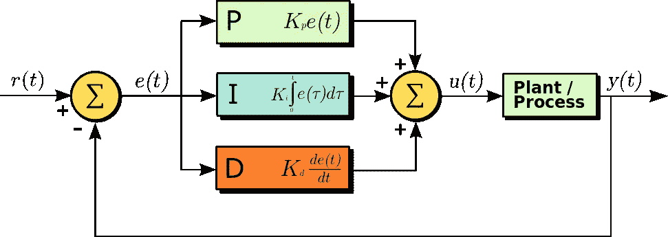
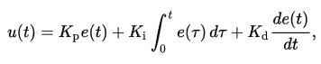

# 无人驾驶汽车转向的非人工智能方法

> 原文：<https://towardsdatascience.com/non-ai-approach-for-steering-self-driving-car-e841658ee695?source=collection_archive---------3----------------------->

Udacity 无人驾驶汽车纳米学位项目第二学期的最后一个项目是使用控制理论的概念在模拟器中控制汽车。

目前有三种控制自动驾驶汽车转向的方法:

1.  **人工智能方法**(看看我[在](https://medium.com/towards-data-science/using-deep-learning-to-clone-driving-behavior-51f4c9593a57)之前写的基于行为克隆和深度神经网络的解决方案)
2.  **非人工智能方法**(使用控制理论和数学计算转向角度)
3.  以上两者的组合

在本帖中，我们将讨论第二个问题。在控制理论中，可以应用在自动驾驶汽车上进行转向的方法之一叫做 **PID 控制器** ( **P** 比例 **I** 积分 **D** 微分控制器)。[维基百科](https://en.wikipedia.org/wiki/PID_controller)将 PID 控制器定义为:

> 工业控制系统中常用的一种控制回路反馈机制。PID 控制器连续计算误差值 **e(t)** 作为所需设定值和测量过程变量之间的差值，并进行校正。

在现实世界中，PID 控制器被用于从自主船舶驾驶到无人机自动驾驶。事实证明，在他们的 openpilot 项目中， [comma.ai](https://medium.com/@comma_ai/how-does-openpilot-work-c7076d4407b3) 实际上也使用了这种方法的变体。

# 但是 PID 到底是什么呢？

PID 控制器的工作原理其实很简单。在下面的框图中，我们可以将 **r(t)** 视为车道中的期望位置，该位置来自我们的定位和路径规划系统。使用传感器测量车道中的位置(地面实况)，并用 **y(t)** 表示。误差值 **e(t)** 将是 **r(t)** 和 **y(t)** 之间的差值。

PID 控制器试图通过应用调整或控制变量 **u(t)** (在我们的例子中，这是转向角)来最小化误差率 **e(t)** 。

**u(t)** 的校正值由比例、积分和微分系数定义。

Source: [Wikipedia](https://en.wikipedia.org/wiki/PID_controller)

**u(t)** 的修正值可以正式表示为:

Source: [Wikipedia](https://en.wikipedia.org/wiki/PID_controller)

# PID 反馈机制

让我们更详细地看看 PID 控制器的不同反馈元件。

1.  **比例**反馈——我们需要做的调整的速率与错误率 **e(t)** 成比例。天真的想法会让你问我们是否还需要什么，对吗？我们需要做的就是将转向角设置成与计算误差成比例，我们就完成了！不幸的是，这并不容易。这个部件没有考虑质量和惯性。仅在我们的控制器中使用该组件将导致所谓的*过冲*。这里需要记住的重要一点是，该分量代表当前(当前)误码率对系统的增益(影响)。它不考虑误差值的过去和未来的变化。
2.  **积分**反馈——随着时间的推移而增加，涵盖了误差值太小且比例反馈难以检测到的情况。它看过去，日积月累。如果它被用作 PID 控制器中的单个元件，它对减小误差值的作用也非常缓慢。
3.  **导数**控制器——能够预测误差值，从而预测系统的未来状态。

有相当多的视频解释 PID 控制器，但我个人喜欢这个:

当谈到我的项目中的 PID 反馈系数时，我是手动选择的。有一种称为[旋转](https://www.youtube.com/watch?v=2uQ2BSzDvXs)的特殊方法，可以自动为 PID 控制器寻找正确的参数。

# 最后结局

该项目的源代码可以在我的 Github repo 中找到:

 [## bdjukic/CarND-PID-控制-项目

### 在 GitHub 上创建一个帐户，为 CarND-PID-Control 项目的开发做出贡献。

github.com](https://github.com/bdjukic/CarND-PID-Control-Project)