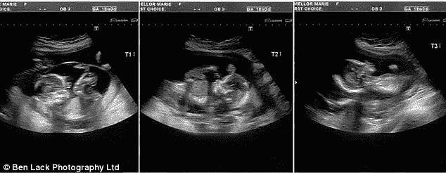
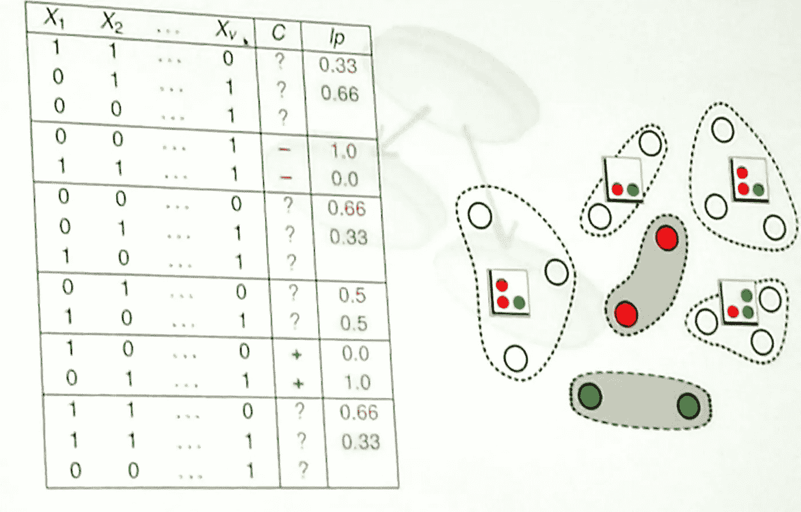
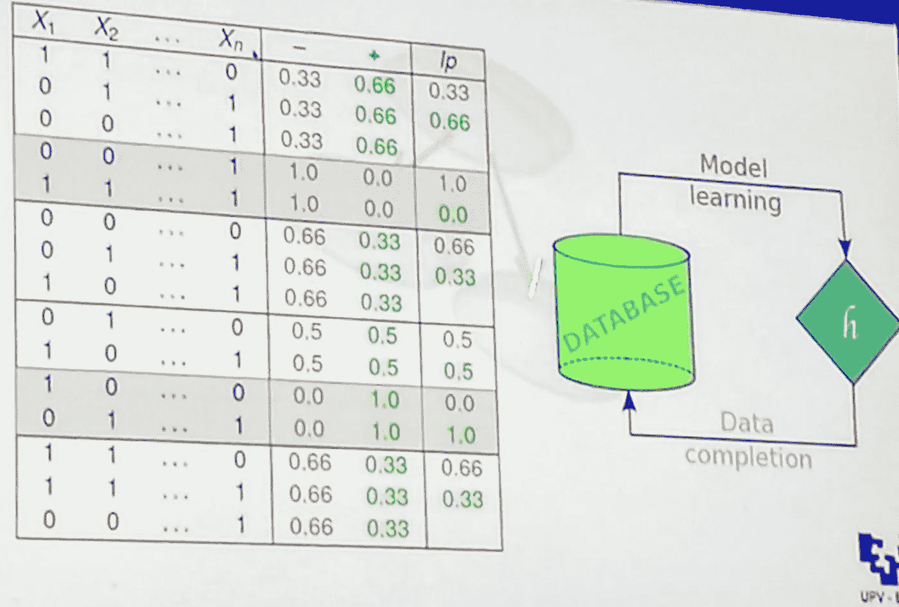
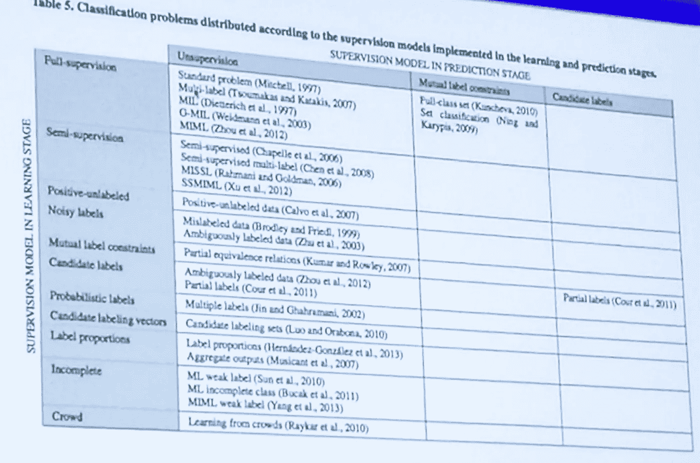

# 非标准、弱监督分类问题

> 原文：<https://towardsdatascience.com/non-standard-weakly-supervised-classification-problems-51b23211d4bc?source=collection_archive---------6----------------------->

传统的监督学习(又名。分类)，假设分类问题的完全标记的训练集。

然而，在许多设置中，由于成本、专家的有限知识、传感器或数据收集器的有限灵敏度等等，我们可能没有完全监督的分类问题定义。在这些情况下，弱监督解决方案可能适用。

这意味着我们需要推广分类问题的定义。要考虑的第一个扩展是关于实例-标签关系:最简单的分类问题假设一对一的实例-标签分类。这意味着(训练集中的)每个实例都映射到一个标签。然而，一般的设置是 N 对 N 的情况:**每个实例可以有许多标签，或者实例包可以共享同一个标签**(多实例学习，参见 Dietterich 等人的工作)。

那么，一般来说，**分类问题可能是多实例、多标签的**。这为定义机器学习中的**弱监督**铺平了道路。弱点可以应用于两个级别:学习级别和预测级别。

# 学习监督不力

我们可以定义不同的弱监管模型，在例子中提供不同水平的信息。

*   半监督分类:这是最简单也是最常见的情况，数据集的一部分被标记，而另一部分没有被标记。
*   **候选标签**:我给每个实例分配更多的标签，标签是在一组标签中选择的。所以问题是要找到其中哪个才是正确的标签。
*   **概率标签**:每个标签以给定的概率分配给每个实例。
*   **不完整的类别分配**:每个候选人仅被分配了所有标签的部分列表。
*   **人群注释**:我有一套非专业人士给我贴的标签，我不能相信他们，因为他们太吵了。
*   **标签约束**:我知道一包实例属于同一个标签，但不知道那是哪一个。
*   **标签比例**:我知道一组实例中标签的比例，但是我们不知道每个标签具体给了哪些实例。这方面的一个例子是，您已经标记了关于部分已知医疗设置的数据。例如，在**人工授精**中，你知道有多少胚胎被植入女性子宫，以及它们成功的比例，但不知道具体是哪些。

# 预测监管不力

监管不力也适用于预测。这其实挺不常见的。通常你没有关于预测的监督数据，而在某些特殊情况下，它可能会发生。预测方面的情况包括:

*   **无监督**:这是最常见的情况，在预测中没有提供监督
*   **多标签约束**
*   **标签比例**:我知道要预测的数据比例，比如在垃圾邮件过滤问题上。

尽管没有从完全监管到弱监管的连续范围，但我们可以定义一个分类法:

*   对于个体分类:*半监督*包含在*候选标签*中，候选标签又包含在*概率标签中。*
*   对于分组分类:*标签比例*和*相互标签*包含在*候选标签中。*

# 从标签比例中学习

我们现在深入研究弱监管的一种情况，即从标签比例中学习。

训练集被分成多个存储桶。我们不知道具体实例的标签，除了一些我们知道详细标签的特殊实例。对于其他桶，我们只知道标签比例。

在下图中，我们有两个可能的标签，即红色和绿色。有些桶只有概率而没有标签，而其中两个桶(表中的第二个和第五个)有实际的单独标签样本。

这与**聚合匿名化**的设置基本相同。不幸的是，这是一个有问题的设置，因为很难分解。

一个可能的解决方案在于**将问题转化为概率分类问题**:我将桶的概率映射到每个实例的每个标签的概率。

然后，我们可以尝试完成数据，只考虑一致的完成。

然而，这仅适用于小包，因为复杂性是指数级的。当实例包的大小增加时，比方说每个包超过 20 个元素，您就不能使用完整的算法。在这种情况下，您可以使用基于马尔可夫链蒙特卡罗的近似法。它们可以导致与精确解的质量相当的结果质量，并且具有线性复杂度。

# 包扎

有趣的是，到目前为止，大多数弱监督学习配置还没有被任何研究成果触及。这里有一个表格，显示了所有现有的贡献和仍然需要填写的空白单元格。

那时仍有大量的研究机会。

警告:您可能还希望确保表格中所有缺失的单元格都映射到现实世界中的合理问题。

这个故事的灵感来自 Jose A. Lozano 在法国波城举行的 ACM SAC 2018 大会上的主题演讲。