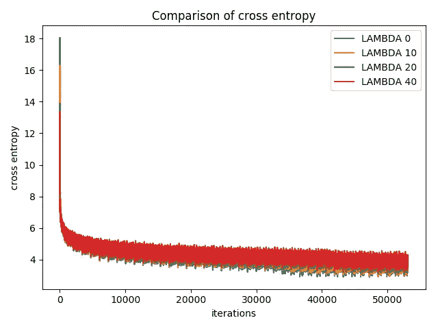
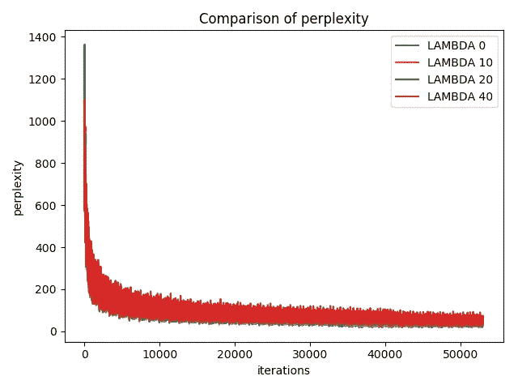
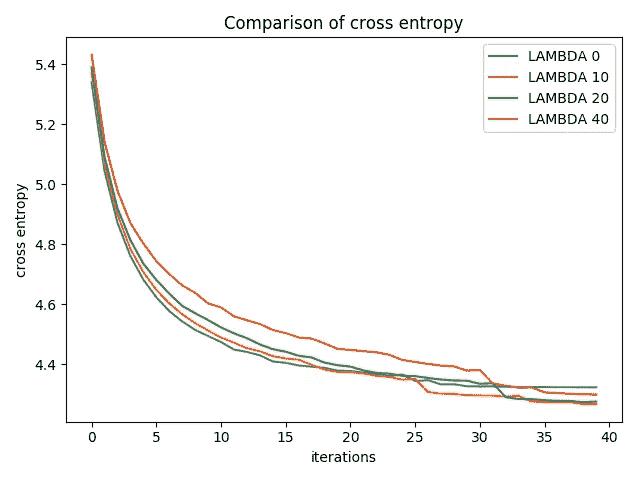
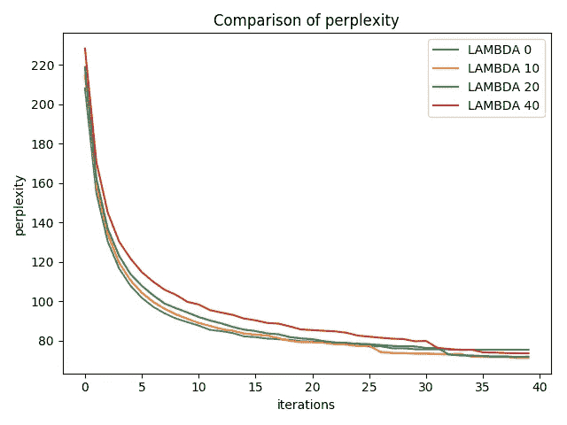
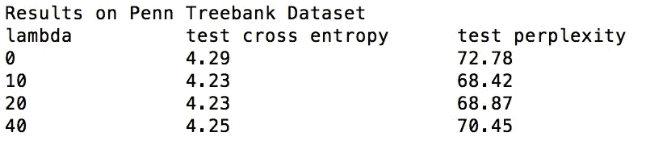
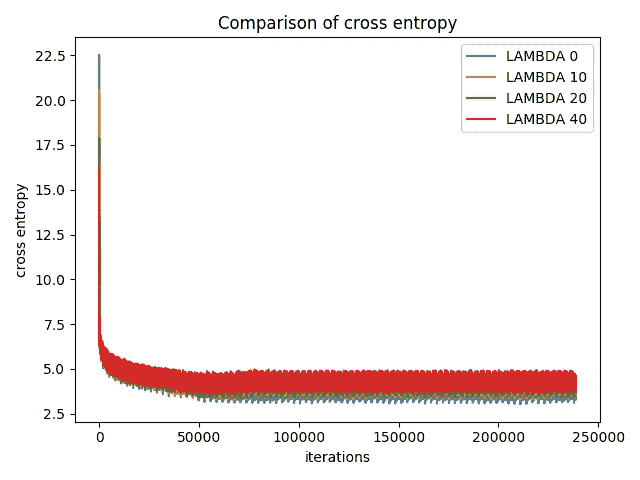
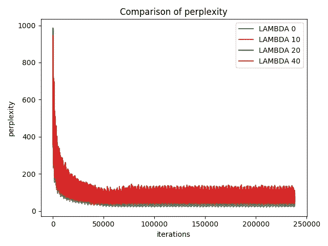

# 语言建模的归一化中心损失

> 原文：<https://towardsdatascience.com/normalized-center-loss-for-language-modeling-5cd7b40d67e1?source=collection_archive---------2----------------------->

警告:一些递归神经网络的知识是假定的。

## 语言建模及其工作原理简介？

> 什么是语言建模？

在语言建模中，我们试图预测给定单词序列的下一个单词。机器学习模型计算下一个单词的可能值的概率。并且从生成的概率分布中对单词进行采样。

> 问:它是如何工作的？

你建立一个递归神经网络架构。该模型一次处理一个单词，并计算下一个单词的可能值的概率。网络的存储状态由零向量初始化，并在读取每个字后更新。
RNN 的输出依赖于任意远的输入，这使得反向传播很困难。为了使学习过程易于处理，我们将反向传播缩短到固定的步骤数(我们称之为`num_steps`)。然后，根据 RNN 的有限近似值训练模型。这可以通过一次输入长度为`num_steps`的输入，并在每个这样的输入块后执行反向传递来实现。

用于评估语言模型的度量是困惑度，其等于 exp(交叉熵)。

作为我之前博文的延续，我想看看增加一个中心损失是否会改善模型的困惑。

## 归一化中心损耗

我建议读者在阅读这篇文章之前，先阅读前一篇博文的第一部分。

当使用博客文章中定义的相同中心损失时，中心损失将呈指数增加(每 200 次迭代增加一倍)，并最终爆炸。为了克服这个问题，我稍微修改了一下中心损耗，我把修改后的版本叫做*归一化中心损耗*。

在归一化中心损失中，我在更新它们之后归一化中心，使得每个嵌入的中心向量的范数是 1。这样做是为了防止损耗值爆炸。

为了计算损失，通过相应嵌入的大小来缩放单词向量的中心。这确保了嵌入得到将它们推向中心向量的梯度。

# 结果

我在 wikitext-2 和 penn treebank 数据集上尝试了这种新的损失方法。结果如下:

## penn treebank 数据集上的结果

cross entropy loss and perplexity on training set

cross entropy loss and perplexity on validation set

从图中可以看出，在验证集上尝试的所有 lambda 值的复杂度都有所提高。

Values of cross entropy and perplexity values on the test set

在测试集上提高了 4，这实际上是非常显著的。

## wikitext-2 数据集上的结果

cross entropy loss and perplexity on training set

cross entropy loss and perplexity on validation set

从图中可以再次看出，在验证集上尝试的所有λ值上，复杂度都有所提高。

Values of cross entropy and perplexity values on the test set

在测试集上提高了 2，这也是显著的。这里的结果不像宾州树木银行那样令人印象深刻。我认为这是因为归一化损失函数作为正则化函数。由于 wikitext-2 比 Penn Treebank 数据集大得多，添加正则化子的影响被最小化。

# 结论

由于在两个数据集上的实验中可以观察到复杂度的改善，因此可以预期的是，任何鼓励来自相同类别的特征彼此靠近地聚类的损失函数将导致精确度的改善和过拟合的减少。

本博客中使用的所有实验都可以使用本报告中给出的代码进行复制。

> ***如果你喜欢这篇文章，请点击下面的小拍手图标帮助他人找到它。非常感谢！***