# 标准化的保向 Adam，从 Adam 到 SGD 的切换，以及带有交互代码的内斯特罗夫动量 Adam

> 原文：<https://towardsdatascience.com/normalized-direction-preserving-adam-switching-from-adam-to-sgd-and-nesterov-momentum-adam-with-460be5ddf686?source=collection_archive---------6----------------------->

GIF from this [website](https://giphy.com/gifs/christimmons-pizza-spin-pi-l41lUR5urK4IAk3V6)

最近，我对调整神经网络的不同方法感兴趣，正如所料，许多不同的研究人员已经研究了许多不同的方法。具体来说，今天，我想看看 [Adam](https://machinelearningmastery.com/adam-optimization-algorithm-for-deep-learning/) 优化器的差异。下面是所有不同方法的列表，我们将看看这篇文章。

*案例 a:* [*随机梯度下降*](https://en.wikipedia.org/wiki/Stochastic_gradient_descent) *案例 b:* [*随机梯度下降动量*](/stochastic-gradient-descent-with-momentum-a84097641a5d) *案例 c:* [*随机梯度下降动量*](/stochastic-gradient-descent-with-momentum-a84097641a5d) *案例 d:* [*亚当优化器*](https://machinelearningmastery.com/adam-optimization-algorithm-for-deep-learning/) *案例 e:*

> 请注意，这篇文章是让我未来的自己回顾和回顾这些纸上的材料，而不是从头再看一遍。也请注意，一些实施工作仍在进行中。

Paper form this [website](https://arxiv.org/pdf/1709.04546.pdf)

Paper from this [website](https://arxiv.org/pdf/1712.07628.pdf)

Paper from this [website](http://cs229.stanford.edu/proj2015/054_report.pdf)

**基础网络||数据集||不同方法背后的简单理论**

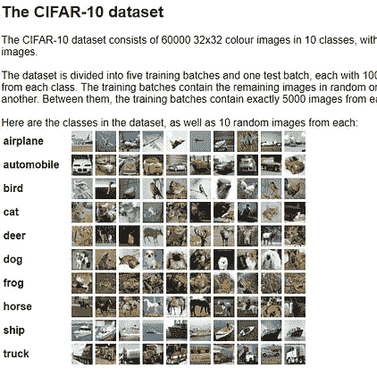

Image from this website [left](/google-continuously-differentiable-exponential-linear-units-with-interactive-code-manual-back-fcbe7f84e79) [right](https://www.cs.toronto.edu/~kriz/cifar.html)

**红色矩形** →输入图像(32*32*3)
**黑色矩形** →与 ELU 卷积()有/无平均池
**橙色矩形** → Softmax 进行分类

为了简单起见，我将使用我以前的帖子中的基本网络，“全卷积网络”。我们还将在 [CIFAR 10 数据集](https://www.cs.toronto.edu/~kriz/cifar.html)上评估每种优化方法。

最后，我希望为每一种新方法背后的理论写一个简单的版本。(内斯特罗夫动量亚当、SWAT 和归一化方向保持亚当。)

**通过从 Adam 切换到 SGD 来提高泛化性能** →在训练过程中简单地从 Adam 切换到 SGD。因此，我们可以在训练开始时利用 Adam 的快速收敛，但稍后我们可以通过 SGD 使模型更好地泛化。

**归一化的方向保持 Adam** →为什么 Adam 可能不擅长泛化的一个问题(或者说后退)是由于没有保持梯度方向。(与 SGD 不同)这篇论文的作者提出了一种方法来解决这个缺点。

**将内斯特罗夫动量引入亚当** →关于这篇论文的一个简单解释就是将用于将动量扩展到内斯特罗夫动量的原理引入并应用于亚当。

**结果:案例 a:随机梯度下降**

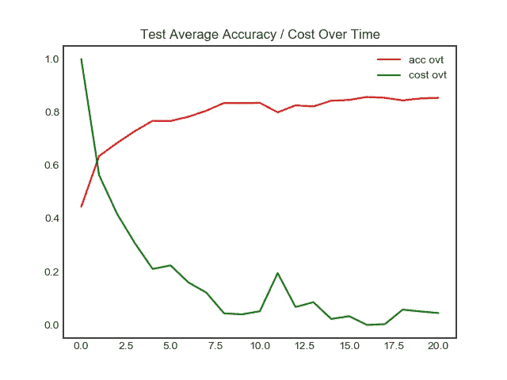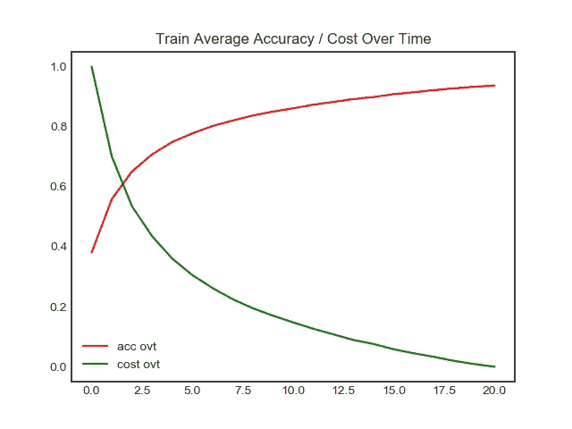

**左图** →测试集精度/时间成本
**右图** →训练集精度/时间成本

正如所料，随机梯度下降表现非常好。在 CIFAR 10 数据集上的最终准确率为 85.3%，仅用了 20 个历元，对于普通梯度下降来说不算太差。

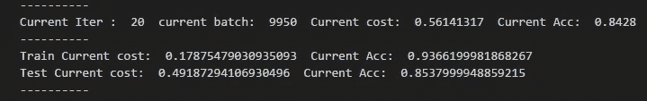

**结果:情况 b:随机梯度下降动量**

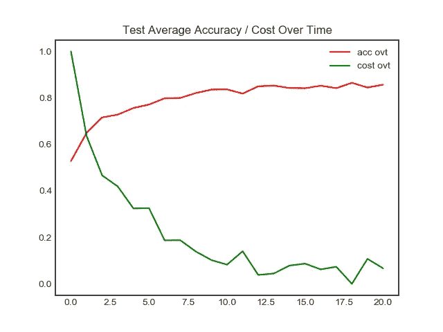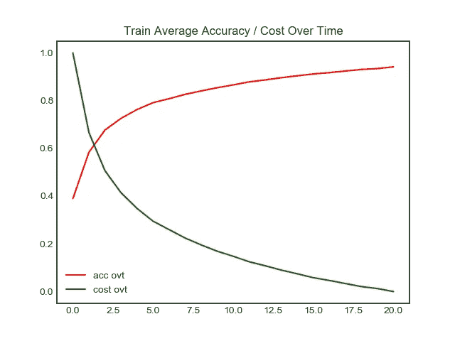

**左图** →测试集精度/时间成本
**右图** →训练集精度/时间成本

尽管 SGD 的表现很好，但具有动量的 SGD 能够以 85.7%的准确率略胜一筹。

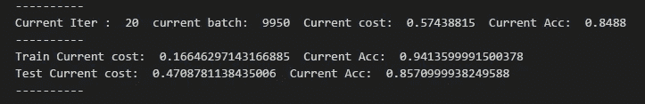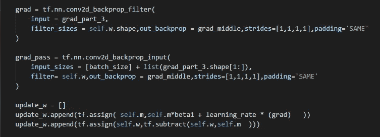

**结果:案例 c:具有内斯特洛夫动量的随机梯度下降**

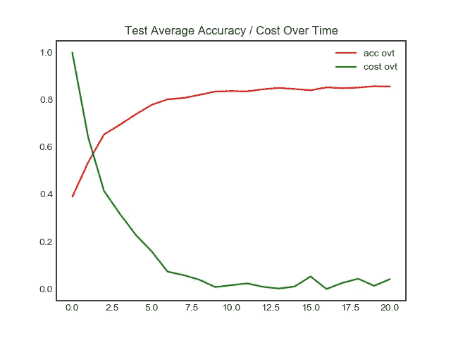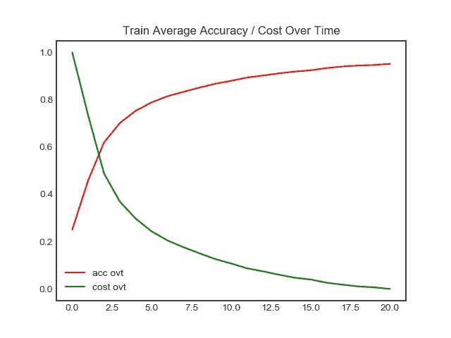

**左图** →测试集精度/时间成本
**右图** →训练集精度/时间成本

根据在线 stand-ford 课程的实施，具有 nesterov 动量的随机梯度下降给出了相当好的结果。然而，令人失望的是，这种方法优于常规动量法。

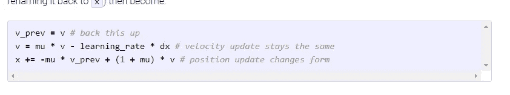

Image from this [website](http://cs231n.github.io/neural-networks-3/)

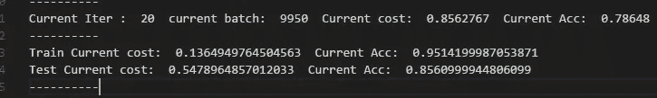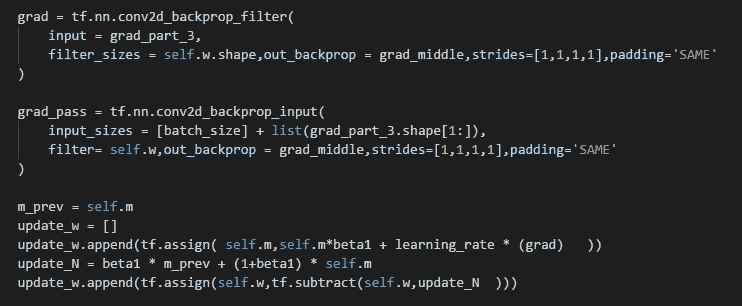

**结果:案例 d: Adam 优化器**

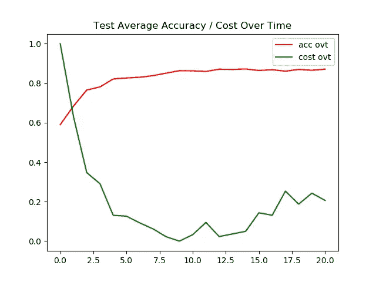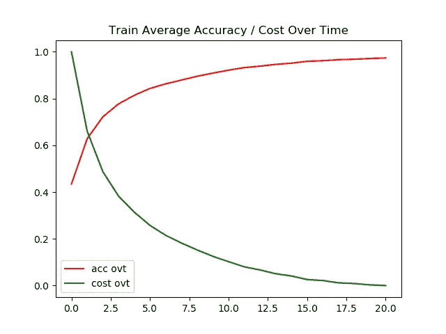

**左图** →测试集精度/时间成本
**右图** →训练集精度/时间成本

我已经预料到 Adam 会胜过大多数优化算法，然而，这也带来了模型泛化能力差的代价。训练准确率为 97 %,而测试准确率停留在 87%。(其在测试图像上具有最高的准确度，但是只有 3%的改进空间。)

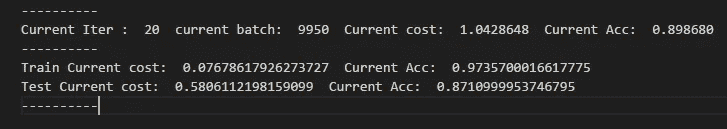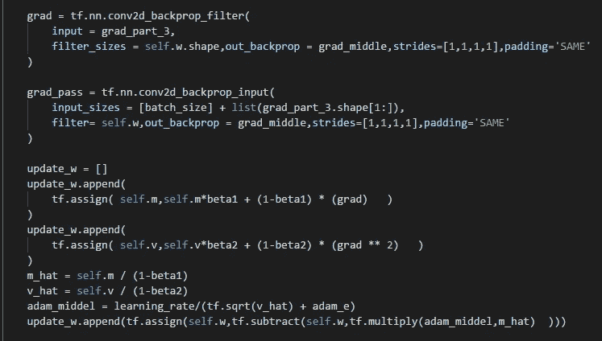

**结果:案例 e:内斯特罗夫动量亚当**

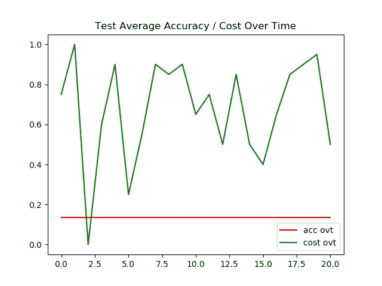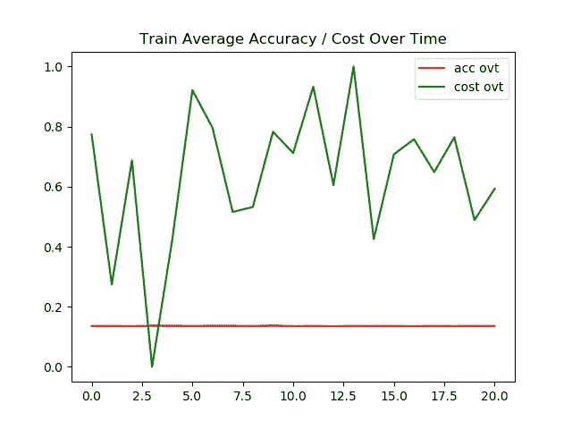

**左图** →测试集精度/成本随时间变化
右图 →训练集精度/成本随时间变化

对于那达慕，我 100 %相信我的实现还没有完全完成。因为我没有加入 u 的产品。因此这可能解释了为什么这个模型的性能如此之差。(甚至根本不训练。)

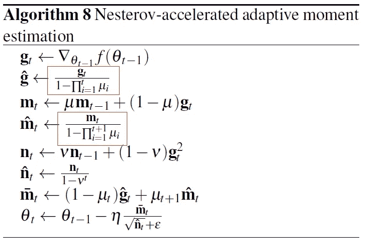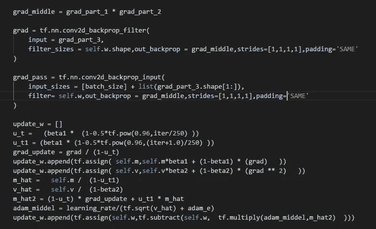

**红框** →图片来自原始论文，我仍在研究的术语

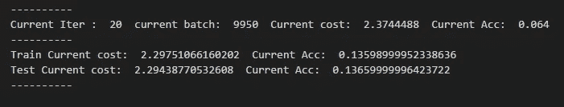

**结果:情况 f:从 Adam 切换到 SGD**

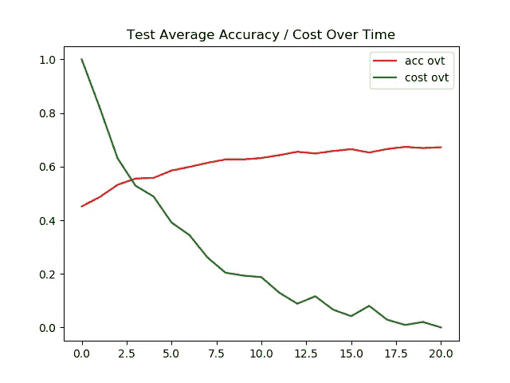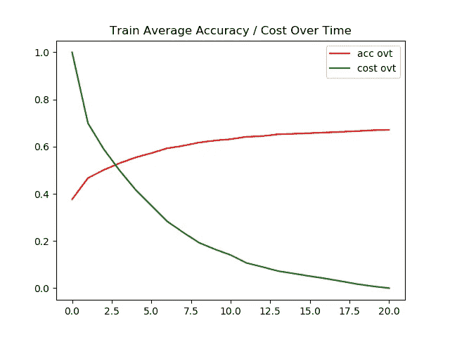

**左图** →测试集精度/时间成本
**右图** →训练集精度/时间成本

我相信有了最佳的超参数，这种方法可以胜过其他任何方法。然而，没有最佳的超参数调整，我只能达到 67%的准确性。

这是我迄今为止遇到的最有趣的优化方法之一。我的实现是混乱的，因此不是最好的，但尝试训练这个模型真的很有趣，也很有挑战性。它如此有趣的原因之一是由于反向传播期间的所有 if 条件。

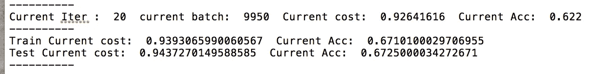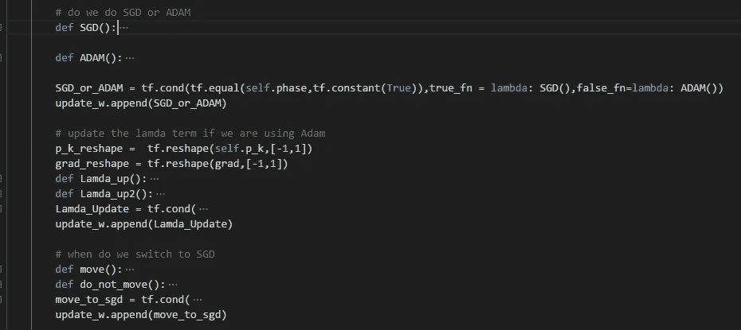

**结果:案例 g:归一化方向保持 Adam**

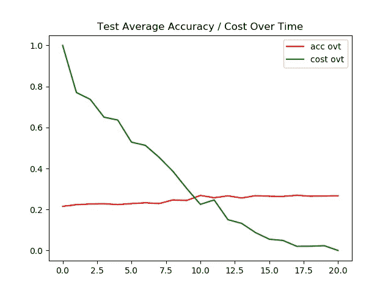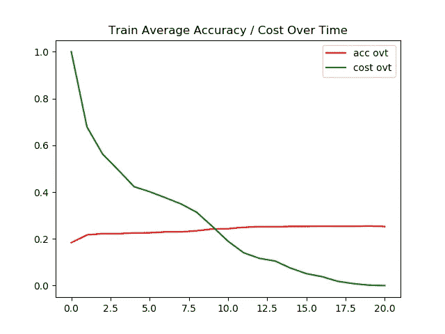

尽管我努力三次检查我的实现，并与作者的原始代码进行比较(在此处找到[),但在使用 ND-Adam 时，我无法成功地训练这个模型。(我非常确信我在某些地方犯了错误，因为作者能够在 80000 年内达到 90%以上的准确率。)](https://github.com/zj10/ND-Adam/blob/master/ndadam.py)

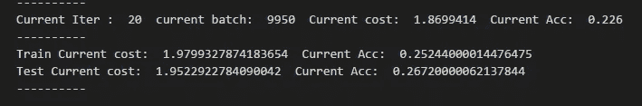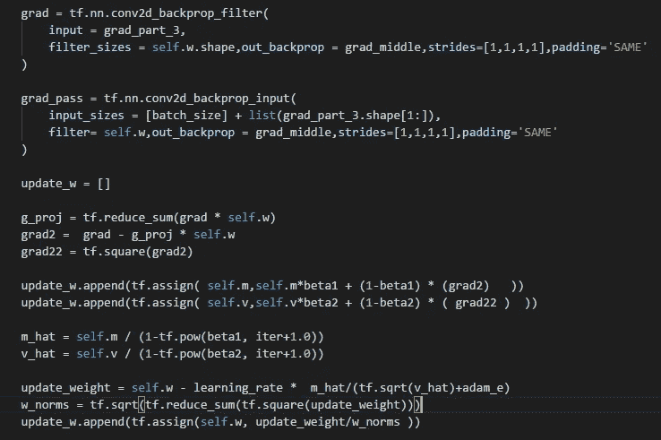

**互动码**

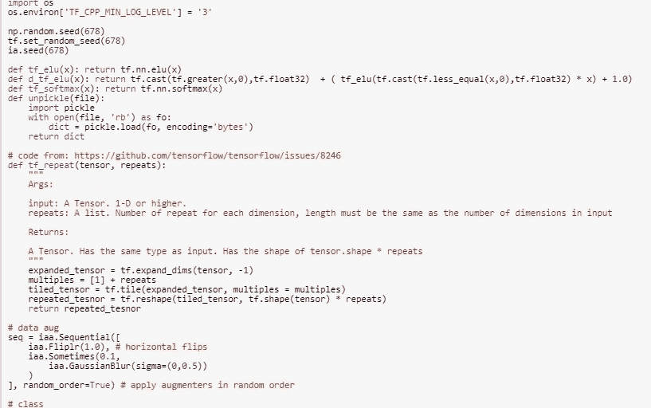

对于 Google Colab，你需要一个 Google 帐户来查看代码，而且你不能在 Google Colab 中运行只读脚本，所以在你的操场上复制一份。最后，我永远不会请求允许访问你在 Google Drive 上的文件，仅供参考。编码快乐！同样为了透明，我在 github 上上传了所有的训练日志。

要访问案例[的代码，请点击此处](https://colab.research.google.com/drive/1keVGivM5kK-gV3JFw1CLzbvgs_rg6C3D)，要查看[日志，请点击此处。](https://github.com/JaeDukSeo/Daily-Neural-Network-Practice-2/blob/master/NeuralNetwork/Generalize_1/a/SGD.txt)
访问案例 [b 的代码点击此处](https://colab.research.google.com/drive/1AxLYBybSfugBMbxAyou1nxd9sROoD5_M)，查看[日志点击此处。](https://github.com/JaeDukSeo/Daily-Neural-Network-Practice-2/blob/master/NeuralNetwork/Generalize_1/b/momentum.txt)
要访问案例 [c 的代码，单击此处](https://colab.research.google.com/drive/1TOW0LCH1LAoQMM7tYzB0W6jSJ4kekrcD)，要查看[日志，单击此处。](https://github.com/JaeDukSeo/Daily-Neural-Network-Practice-2/blob/master/NeuralNetwork/Generalize_1/c/NMom.txt)
要访问案例 [d 的代码，单击此处](https://colab.research.google.com/drive/1lqZviUUAQ0qJoctM5Hd-uo7m_cUOStl6)，要查看[日志，单击此处。](https://github.com/JaeDukSeo/Daily-Neural-Network-Practice-2/blob/master/NeuralNetwork/Generalize_1/d/adam.txt)
要访问案例 [e 的代码，请点击此处](https://colab.research.google.com/drive/1kHVzE4FQyb5eLq_ncX4spuEde3TccwM2)，要查看[日志，请点击此处。](https://github.com/JaeDukSeo/Daily-Neural-Network-Practice-2/blob/master/NeuralNetwork/Generalize_1/e/NAdam.txt)
要访问案例 [f 的代码，请点击此处](https://colab.research.google.com/drive/1Okr4jfqBMoQ8q4ctZdJMp8jqeA4XDQbK)，要查看[日志，请点击此处。](https://github.com/JaeDukSeo/Daily-Neural-Network-Practice-2/blob/master/NeuralNetwork/Generalize_1/f/f.txt)
点击此处访问案例 g [的代码，点击此处访问](https://colab.research.google.com/drive/1Ynkbd12pvsnu3m1IytCoPbLTt3PybXOf)[日志的](https://github.com/JaeDukSeo/Daily-Neural-Network-Practice-2/blob/master/NeuralNetwork/Generalize_1/g/g.txt)。

**最后的话**

我很兴奋开始这些关于泛化的系列。然而，我很难过，尽管我尽了最大的努力，我还是不能成功地训练具有内斯特罗夫动量亚当和归一化方向保持亚当的模型。

如果发现任何错误，请发电子邮件到 jae.duk.seo@gmail.com 给我，如果你想看我所有写作的列表，请点击这里查看我的网站。

同时，在我的推特[这里](https://twitter.com/JaeDukSeo)关注我，访问[我的网站](https://jaedukseo.me/)，或者我的 [Youtube 频道](https://www.youtube.com/c/JaeDukSeo)了解更多内容。我还实现了[广残网，请点击这里查看博文 pos](https://medium.com/@SeoJaeDuk/wide-residual-networks-with-interactive-code-5e190f8f25ec) t。

**参考**

1.  真，t. (2018)。tensorflow:检查标量布尔张量是否为真。堆栈溢出。检索于 2018 年 6 月 10 日，来自[https://stack overflow . com/questions/43263933/tensor flow-check-if-a-scalar-boolean-tensor-is-true](https://stackoverflow.com/questions/43263933/tensorflow-check-if-a-scalar-boolean-tensor-is-true)
2.  tf。打印？，H. (2018)。如何使用 tf 打印张量的一部分？打印？。堆栈溢出。检索于 2018 年 6 月 10 日，来自[https://stack overflow . com/questions/47000828/how-to-print-part-of-a-tensor-using-TF-print](https://stackoverflow.com/questions/47000828/how-to-print-part-of-a-tensor-using-tf-print)
3.  使用 tf。TensorFlow 中的 print()—走向数据科学。(2018).走向数据科学。检索于 2018 年 6 月 10 日，来自[https://towards data science . com/using-TF-print-in-tensor flow-aa 26 E1 cf F11 e](/using-tf-print-in-tensorflow-aa26e1cff11e)
4.  tf。打印| TensorFlow。(2018).张量流。检索于 2018 年 6 月 10 日，来自[https://www.tensorflow.org/api_docs/python/tf/Print](https://www.tensorflow.org/api_docs/python/tf/Print)
5.  Tensorflow？，H. (2018)。如何在 Tensorflow 中给 tf.cond 内部的函数传递参数？。堆栈溢出。检索于 2018 年 6 月 10 日，来自[https://stack overflow . com/questions/38697045/how-to-pass-parameters-to-functions-inside-TF-cond-in-tensor flow/39573566](https://stackoverflow.com/questions/38697045/how-to-pass-parmeters-to-functions-inside-tf-cond-in-tensorflow/39573566)
6.  tf.cond(pred，fn1，fn2，name=None) | TensorFlow。(2018).张量流。检索于 2018 年 6 月 10 日，来自[https://www . tensor flow . org/versions/r 1.0/API _ docs/python/TF/cond](https://www.tensorflow.org/versions/r1.0/api_docs/python/tf/cond)
7.  培训，h. (2018)。如何在培训期间更改 tensorflow optimizer？堆栈溢出。检索于 2018 年 6 月 10 日，来自[https://stack overflow . com/questions/48259650/how-can-I-change-tensor flow-optimizer-in-training](https://stackoverflow.com/questions/48259650/how-can-i-change-tensorflow-optimizer-during-training)
8.  主成分分析池在 Tensorflow 与互动代码[PCAP]。(2018).中等。检索于 2018 年 6 月 10 日，来自[https://medium . com/@ SeoJaeDuk/principal-component-analysis-pooling-in-tensor flow-with-interactive-code-pcap-43 aa2 CEE 9 bb](https://medium.com/@SeoJaeDuk/principal-component-analysis-pooling-in-tensorflow-with-interactive-code-pcap-43aa2cee9bb)
9.  tf.logical_and | TensorFlow。(2018).张量流。检索于 2018 年 6 月 10 日，来自[https://www.tensorflow.org/api_docs/python/tf/logical_and](https://www.tensorflow.org/api_docs/python/tf/logical_and)
10.  数学符号列表(+，-，x，/，=，，…)。(2018).Rapidtables.com。检索于 2018 年 6 月 10 日，来自[https://www . rapid tables . com/Math/symbols/Basic _ Math _ symbols . html](https://www.rapidtables.com/math/symbols/Basic_Math_Symbols.html)
11.  通过从 Adam 切换到 SGD 提高泛化性能第 76 期 kweonwooj/papers。(2018).GitHub。检索于 2018 年 6 月 10 日，来自[https://github.com/kweonwooj/papers/issues/76](https://github.com/kweonwooj/papers/issues/76)
12.  zj10/ND-Adam。(2018).GitHub。检索于 2018 年 6 月 10 日，来自[https://github.com/zj10/ND-Adam/blob/master/ndadam.py](https://github.com/zj10/ND-Adam/blob/master/ndadam.py)
13.  规范？，W. (2018)。超脚本 2 下标 2 在规范的语境下是什么意思？。交叉验证。检索于 2018 年 6 月 10 日，来自[https://stats . stack exchange . com/questions/181620/what-is-the-meaning-of-super-script-2-subscript-2-in-the-context-of-norms](https://stats.stackexchange.com/questions/181620/what-is-the-meaning-of-super-script-2-subscript-2-within-the-context-of-norms)
14.  线性代数 27，向量的范数，例题。(2018).YouTube。检索于 2018 年 6 月 10 日，来自[https://www.youtube.com/watch?v=mKfn23Ia7QA](https://www.youtube.com/watch?v=mKfn23Ia7QA)
15.  tf.float32？，H. (2018)。如何将 tf.int64 转换成 tf.float32？。堆栈溢出。检索于 2018 年 6 月 10 日，来自[https://stack overflow . com/questions/35596629/how-to-convert-TF-int 64-to-TF-float 32](https://stackoverflow.com/questions/35596629/how-to-convert-tf-int64-to-tf-float32)
16.  tf.reduce_sum | TensorFlow。(2018).张量流。检索于 2018 年 6 月 10 日，来自 https://www.tensorflow.org/api_docs/python/tf/reduce_sum
17.  j . brown lee(2017 年)。深度学习的 Adam 优化算法简介。机器学习精通。检索于 2018 年 6 月 10 日，来自[https://machine learning mastery . com/Adam-optimization-algorithm-for-deep-learning/](https://machinelearningmastery.com/adam-optimization-algorithm-for-deep-learning/)
18.  随机梯度下降。(2018).En.wikipedia.org。检索于 2018 年 6 月 10 日，来自[https://en.wikipedia.org/wiki/Stochastic_gradient_descent](https://en.wikipedia.org/wiki/Stochastic_gradient_descent)
19.  带动量的随机梯度下降——走向数据科学。(2017).走向数据科学。检索于 2018 年 6 月 10 日，来自[https://towards data science . com/random-gradient-descent-with-momentum-a 84097641 a5d](/stochastic-gradient-descent-with-momentum-a84097641a5d)
20.  [ ICLR 2015 ]追求简单:具有交互码的全卷积网。(2018).走向数据科学。检索于 2018 年 6 月 11 日，来自[https://towards data science . com/iclr-2015-forwards-for-simplicity-the-all-convolutional-net-with-interactive-code-manual-b 4976 e 206760](/iclr-2015-striving-for-simplicity-the-all-convolutional-net-with-interactive-code-manual-b4976e206760)
21.  CIFAR-10 和 CIFAR-100 数据集。(2018).Cs.toronto.edu。检索于 2018 年 6 月 11 日，来自[https://www.cs.toronto.edu/~kriz/cifar.html](https://www.cs.toronto.edu/~kriz/cifar.html)
22.  用于视觉识别的 CS231n 卷积神经网络。(2018).cs 231n . github . io . 2018 年 6 月 11 日检索，来自[http://cs231n.github.io/neural-networks-3/](http://cs231n.github.io/neural-networks-3/)