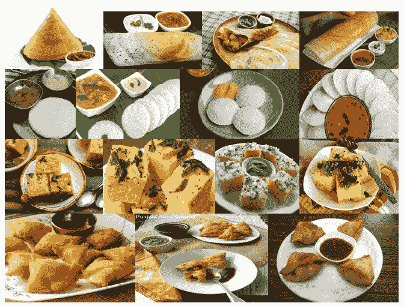
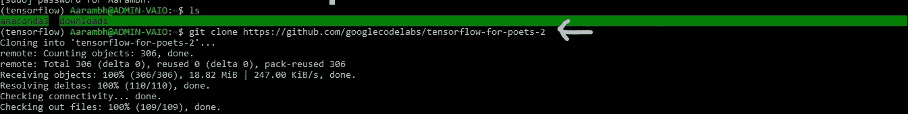
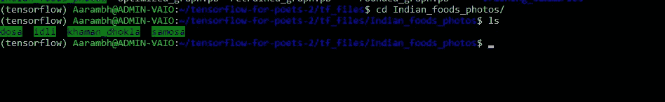
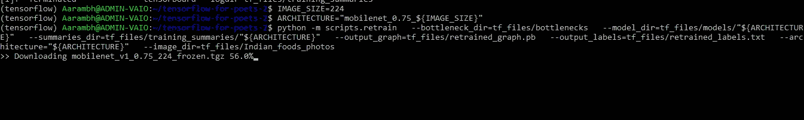
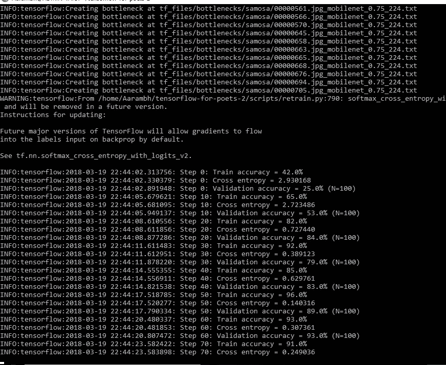
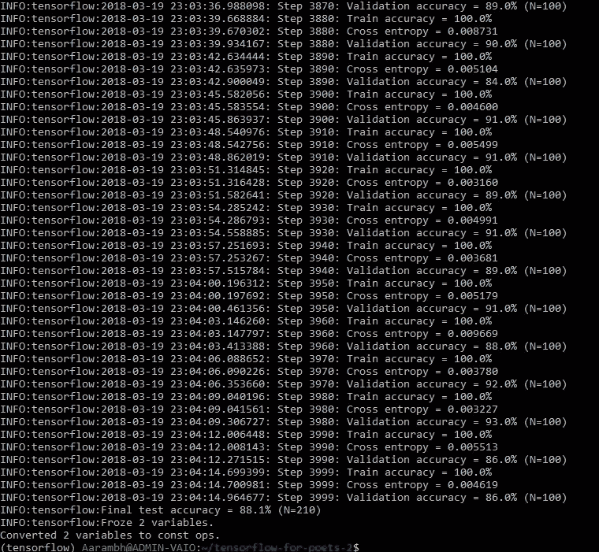
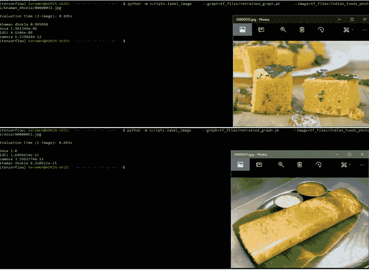
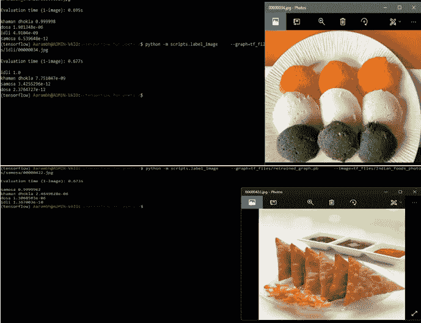

# 北印度菜还是南印度菜，深度学习都懂！！:第一部分

> 原文：<https://towardsdatascience.com/north-indian-food-or-south-indian-food-deep-learning-knows-it-all-part-1-13e1d20c359c?source=collection_archive---------2----------------------->

当你在印度旅行时，从克什米尔到 Kanyakumari，你会体验到不同的文化，不同的宗教，但对我来说最重要的是我的国家不同地区的各种食物，从北印度的 Samosa 或 T2 到南印度的 T4，这是你在印度可以品尝到的众多食物中的一部分。


South Indian and North Indian food

你一定想知道深度学习和印度食物有什么关系，那么让我回到过去给你解释现在。自从我开始学习深度学习以来，我学会的第一件事就是如何使用 [TensorFlow](https://www.tensorflow.org/) 、 [Keras](https://keras.io/) 以及最后但并非最不重要的 [Scikit-learn](http://scikit-learn.org/) 制作图像分类器。我建立的图像分类器被用来分类狗和猫的图像，戴眼镜和不戴眼镜的人的图像，我甚至使用 [fast.ai](https://github.com/fastai/fastai) 库对 12 个可能的类别中的幼苗进行了分类，但我没有制作任何对食物进行分类的东西。

所以，我想这次为什么不为印度食物做一个快速简单的图像分类器。因此，在这篇文章中，我将带大家了解我如何使用 TensorFlow Codelab 制作一个食物分类器，对印度北部和南部食物的不同图像进行分类。

但是在进入执行部分之前，我需要分享一些我使用的软件信息，这些信息对于图像分类器来说非常重要。

软件(仔细查看版本)

1.  蟒蛇与 Python [版本 3.6.3](https://anaconda.org/anaconda/python/files?version=3.6.3) 。
2.  tensor flow[1 . 6 . 0 版本。](https://www.tensorflow.org/install/)[确保您至少拥有 1.2 版]
3.  [Bash on Ubuntu on Windows](https://docs.microsoft.com/en-us/windows/wsl/install-win10) 【如果你的系统没有安装 Linux】。

步骤 1:创建数据集

在深度学习中，最重要的部分是数据集的创建。因此，为了创建 Samosa、Khaman Dhokla 等北印度食物和 Idli、Dosa 等南印度食物的数据集，我跟随了 OpenCV 大师 Adrian Rosebrock 的这篇精彩帖子"[如何使用 Google Images](https://www.pyimagesearch.com/2017/12/04/how-to-create-a-deep-learning-dataset-using-google-images/) 创建深度学习数据集",在这篇帖子中，他展示了如何通过几行代码从 Google 下载大量图像。

首先，我创建了一个名为“印度食物照片”的文件夹。在这个文件夹下，我开始创建不同类别的子文件夹，我试图为它们建立一个图像分类器，然后在上面提到的帖子之后，我开始下载 Idli，Samosa，Khaman Dhokla 和 Dosa 的图像。我从不限制自己在某个特定文件夹中与某个特定类别相关的图片数量，我尽可能多地收集每个食物类别的图片。



Feeling hungry,not more than me

你们一定都在想，为什么我没有把我为其构建分类器的每一类食物放入一个文件夹中，为什么我为每一类食物创建子文件夹，原因很简单，分类脚本使用文件夹名称作为标签名称，每个文件夹中的图像应该是对应于该标签的图片。

我的天啊。，这是一个很长的解释，但从这一点向前的解释和步骤将是清晰和简短的。

步骤 2:克隆 Git 存储库:

`git clone [https://github.com/googlecodelabs/tensorflow-for-poets-2](https://github.com/googlecodelabs/tensorflow-for-poets-2)`

`cd tensorflow-for-poets-2`



第三步:移动文件夹“印度食物照片”到“tf 文件”下

这一步对于像我一样在 Windows 上使用 Bash on Ubuntu 的人来说是有帮助的，这是一个 windows 10 操作系统的 Linux 子系统，而那些在他们的系统中安装了 Linux 的人我认为不是，他们需要任何关于将文件从一个目录移动到另一个目录的指导。

`cp -r /mnt/c/Users/ADMIN/Documents/Indian_foods_photos tensorflow-for-poets-2/tf_files/`

为了查看文件夹是否被正确复制，我给出了以下命令

`cd tf_files/Indian_foods_photos/`

`ls`



步骤 4:传递变量

这一步是所有步骤之母，在这一步中，我尝试用 [MobileNet](https://research.googleblog.com/2017/06/mobilenets-open-source-models-for.html) 架构来训练网络。MobileNet 被优化为小而高效，代价是一些准确性和需要更少的处理时间。

但在训练我的网络之前，我还设置了两件事，首先是“输入图像分辨率”为 224 像素。不出所料，输入更高分辨率的图像需要更多的处理时间，但会导致更好的分类精度。然后，我将模型的相对大小设为 0.75。这两个配置选项都可以在下面的命令中看到。

`IMAGE_SIZE=224`

`ARCHITECTURE="mobilenet_0.75_${IMAGE_SIZE}"`

**知识第一节**【未迈出一步】

因此，在 tensorflow-for-poets-2 目录下传递上述变量后。这是一个完美的时刻，我想和大家分享一个重要的信息。在构建这个分类器时，我使用了一个在 [ImageNet](http://image-net.org/) 大型视觉识别挑战[数据集](http://www.image-net.org/challenges/LSVRC/2012/)上训练的模型，并使用了迁移学习，因为从头开始进行深度学习可能需要几天时间，但通过使用迁移学习，一切都可以在短时间内完成。

**知识第二节**【未迈出一步】

正如我在上面的知识部分 I 中提到的，我使用了 Imagenet 模型，该模型由具有数百万个参数的网络组成，这些参数可以区分大量的类别，除此之外，我只训练了该网络的最后一层，这就是为什么训练在合理的时间内结束。

ImageNet 不包括我在这里培训的任何印度食物。然而，使 ImageNet 能够在 1，000 个类别中进行区分的信息种类对于区分其他对象也是有用的。通过使用这个预先训练好的网络，我将这些信息作为最终分类层的输入，以区分我的印度食物类别。

步骤 5:运行培训网络

现在，我在声明 IMAGE_SIZE 和 ARCHITECTURE 变量之后传递了这些命令

```
python -m scripts.retrain \
  --bottleneck_dir=tf_files/bottlenecks \
  --model_dir=tf_files/models/"${ARCHITECTURE}" \
  --summaries_dir=tf_files/training_summaries/"${ARCHITECTURE}" \
  --output_graph=tf_files/retrained_graph.pb \
  --output_labels=tf_files/retrained_labels.txt \
  --architecture="${ARCHITECTURE}" \
  --image_dir=tf_files/Indian_foods_photos
```

在我向您展示当我传递上述命令时发生了什么之前，让我告诉您在运行这几行代码之后我经历了什么

默认情况下，该脚本运行 4，000 个训练步骤。每一步从训练集中随机选择 10 幅图像，从缓存中找到它们的瓶颈【瓶颈是一个非正式术语，我们经常使用它来表示最终输出层之前的层，最终输出层实际上进行分类】，并将它们输入到最终层以获得预测。然后将这些预测与实际标签进行比较，通过反向传播过程更新最终图层的权重。

随着过程的继续，我看到报告的准确性有所提高。完成所有训练步骤后，脚本对一组与训练和验证图片分开保存的图片运行最终的测试准确性评估。这个测试评估为我提供了训练好的模型在分类任务中表现如何的最佳估计。

让我们只观察通过上面的文字描述的所有图像



Downloading the mobilenet Architecture



creating bottleneck layers and then determining various parameters



The Final Accuracy

我的模型最终的准确率是 **88.1%** 。

步骤 6:对图像进行分类

这是最后一步，通过给出下面提到的命令，我确定了我的食物分类器在不同的印度食物图像上的表现

```
python -m scripts.label_image \
    --graph=tf_files/retrained_graph.pb  \
    --image=tf_files/Indian_foods_photos/samosa/00000422.jpg
```



因此，通过这些结果，我结束了我的文章。但是我的旅程还没有结束，这只是我旅程的第一部分，当我向你解释如何在我的自定义数据集上使用这些结果时，我的旅程就结束了。我继续使用 Android Studio 的自定义 TensorFlow 应用程序创建了一个**食品分类器 Android 应用程序**，因此为本文的第二部分做好准备，它将很快发布。

参考资料:

1.  没有这个[tensor flow for Poets code lab](https://codelabs.developers.google.com/codelabs/tensorflow-for-poets/#0)就不可能有上面的文章，请参考它以获得进一步的澄清。
2.  为了了解更多关于深度学习的知识，你可以查看这里的。
3.  为了了解更多关于迁移学习的信息，你可以查看[这里](https://machinelearningmastery.com/transfer-learning-for-deep-learning/)。

最后一件事…
如果你喜欢这篇文章，请点击👏下面，并与他人分享，这样他们也可以享受它。

还有，**想的话就跟我上** [**中**](https://medium.com/@naveenmanwani) ！我很乐意。