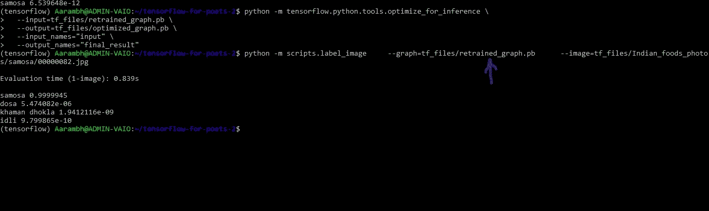
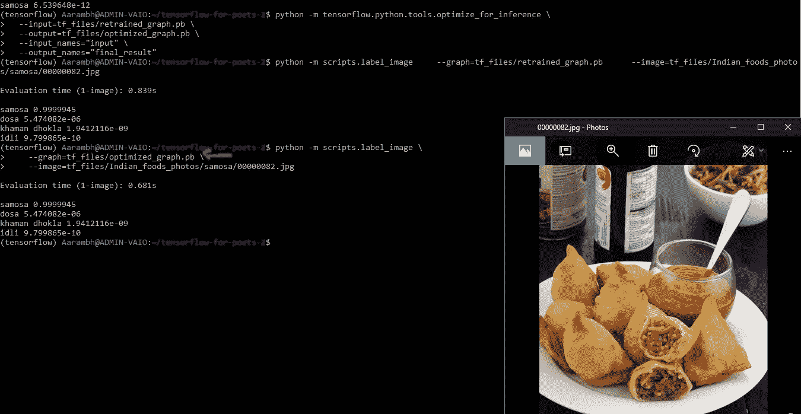
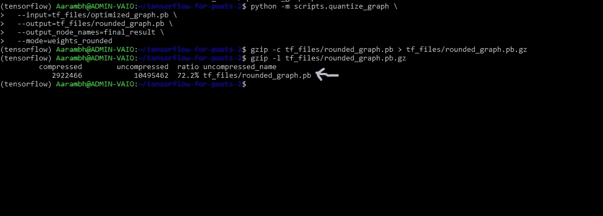
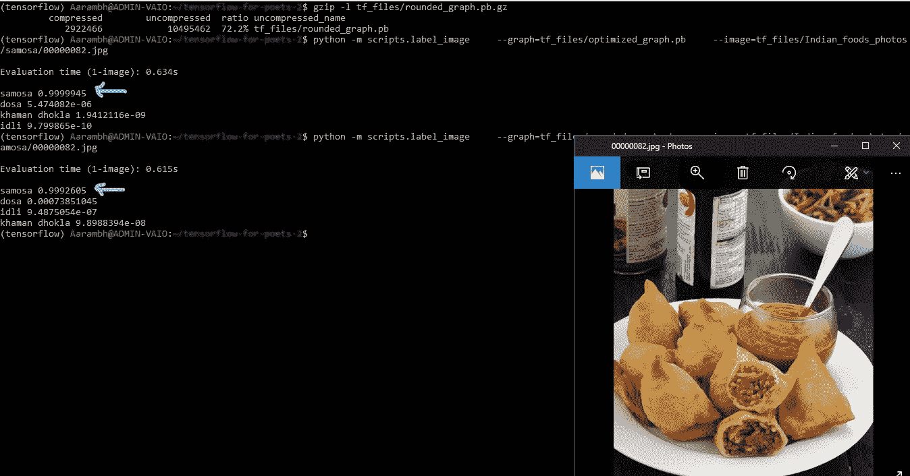
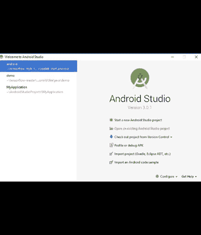
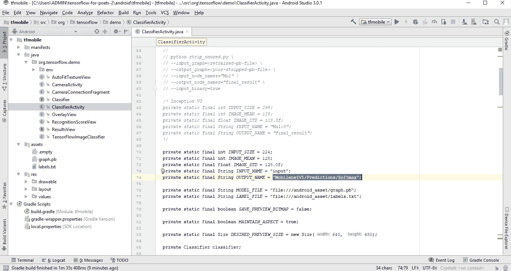
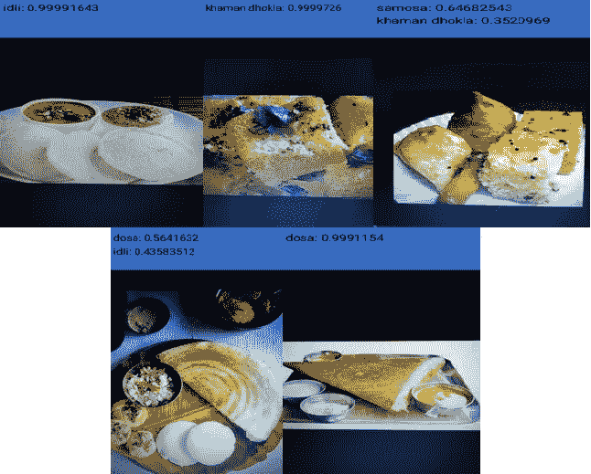
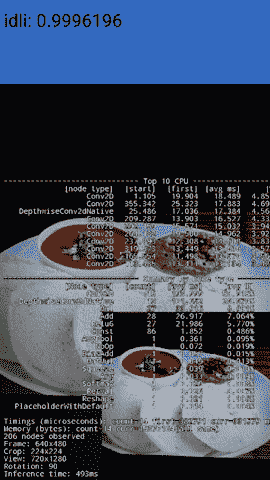

# 北印度菜还是南印度菜，深度学习都懂！！:第二部分

> 原文：<https://towardsdatascience.com/north-indian-food-or-south-indian-food-deep-learning-knows-it-all-part-2-14a59d0ffc15?source=collection_archive---------7----------------------->

如果我们想让机器思考，我们需要教它们看。[*——费*](http://vision.stanford.edu/feifeili/)*[*斯坦福 AI 实验室主任*](http://ai.stanford.edu/)*[*斯坦福视觉实验室*](http://vision.stanford.edu/)**

***在[第 1 部分](/north-indian-food-or-south-indian-food-deep-learning-knows-it-all-part-1-13e1d20c359c)中，我展示了我如何使用 TensorFlow Codelab 制作了一个食物分类器来对印度北部和南部食物的不同图像进行分类(如果你还没有读过[第 1 部分](/north-indian-food-or-south-indian-food-deep-learning-knows-it-all-part-1-13e1d20c359c)，现在就去读吧！).***

***我在第 1 部分的最后提出了一个想法，我将向您解释如何使用我的自定义数据集生成的结果，我继续使用 Android Studio 的自定义 TensorFlow 应用程序创建了一个 F **ood 分类器 Android 应用程序**。***

***所以，是时候实现我的承诺了，但在展开我的食物分类器 Android 应用程序**、**的步骤之前，让我向你展示它在现实世界中的表现**。*****

***我知道如果你和我一样是美食家，你现在一定感觉饿了，但是控制你自己你仍然必须阅读我如何能够使用 TensorFlow 完成这个食物分类器应用程序的任务。***

***在继续之前，我先说说做这个项目背后的灵感。这一切都是从来自 [fast.ai](http://www.fast.ai/) 课程的[杰瑞米·霍华德](https://medium.com/u/34ab754f8c5e?source=post_page-----14a59d0ffc15--------------------------------)告诉我们学生们在通过 fast.ai 课程发展深度学习技能后做了多么美妙和革命性的事情开始的，其中之一是著名的[非热狗](https://www.engadget.com/2017/05/15/not-hotdog-app-hbo-silicon-valley/)应用程序，用于 [HBO 的硅谷](https://t.co/Qfnh0fBKen)，由**蒂姆·安格雷德**使用 Tensorflow 开发。所以，从我梦想构建这样东西的那一刻起，今天通过这篇文章，我与大家分享我构建食物分类器应用程序的经验。***

***现在，情绪激动的时刻到此为止，让我们谈生意吧。构建食物分类器应用程序的步骤非常简短，我还在参考资料部分添加了链接，这将为您提供额外的支持，以防您继续重复我所做的事情。***

***让我先列出这个项目使用的软件和硬件。***

*****软件**(仔细看版本)***

1.  ***蟒蛇与 Python [版本 3.6.3](https://anaconda.org/anaconda/python/files?version=3.6.3) 。***
2.  ***TensorFlow [版本 1.6.0。](https://www.tensorflow.org/install/)[确保您至少拥有 1.2 版]***
3.  ***[Bash on Ubuntu on Windows](https://docs.microsoft.com/en-us/windows/wsl/install-win10) 【如果你的系统没有安装 Linux】。***
4.  ***安卓工作室 [3.0.1](https://developer.android.com/studio/preview/index.html)***

*****硬件*****

1.  ***一个带摄像头的安卓手机(当然)[因为我没用安卓模拟器]。***
2.  ***A [树莓 pi 3 Model B](https://www.raspberrypi.org/products/raspberry-pi-3-model-b/) 带 [5 寸 HDMI 液晶](https://www.waveshare.com/wiki/5inch_HDMI_LCD)(因为我附近酒店 Dosa 用光了:)。***

*****目标**:一个简单的相机应用程序，运行 TensorFlow 图像识别程序来识别不同的印度食物。***

*****预防步骤**:我确保 tensorflow-for-poets-2 与我在[第 1 部分](/north-indian-food-or-south-indian-food-deep-learning-knows-it-all-part-1-13e1d20c359c)中使用的相同的 git 目录是我当前的工作目录，它由另外三个子目录[ android/tfmobile/、scripts/、tf_files/]组成。这对于应用的实现起到了至关重要的作用。***

***步骤 1:优化模型***

***由于移动设备有很大的局限性，所以这是我使用名为“ **optimize_for_inference** 的 TensorFlow 工具减少应用程序占用空间的预处理步骤，该工具删除了给定输入和输出集不需要的所有节点。***

***下面是我运行脚本的方式，它生成了一个新文件 TF _ files/**optimized _ graph . Pb**:***

```
***python -m tensorflow.python.tools.optimize_for_inference \
  --input=tf_files/retrained_graph.pb \
  --output=tf_files/optimized_graph.pb \
  --input_names="input" \
  --output_names="final_result"***
```

***步骤 2:验证优化的模型***

***为了检查`optimize_for_inference`没有改变我的网络的输出，我比较了`retrained_graph.pb(graph generated in part 1)`和`optimized_graph.pb`的`label_image` 输出，幸运的是，输出概率没有变化，这意味着 optimized_graph.pb 将产生与 retrained _ graph.pb 相同的结果，每当我在我的自定义数据集上运行它时，请参见图 1 和图 2 了解更多细节。***

```
***python -m scripts.label_image \
  --graph=tf_files/retrained_graph.pb\
  --image=tf_files/Indian_foods_photos/Samosa/00000082.jpg python -m scripts.label_image \
  --graph=tf_files/optimized_graph.pb\
  --image=tf_files/Indian_foods_photos/Samosa/00000082.jpg***
```

******

***Image 1:***

******

***Image 2***

***步骤 3:量化网络权重***

***因为我的再培训模型是 84MB 大小，我知道两件事，每个移动应用程序分发系统在分发之前压缩包。第二，图(这里是 optimized_graph.pb)占用的大部分空间是权重，它们是大块浮点数。因此，我试图通过使用 tensorflow-for-poets-2 git 存储库中给出的`quantize_graph`脚本来量化网络权重。***

***相同的代码和视觉效果如下所示:***

```
***python -m scripts.quantize_graph \
  --input=tf_files/optimized_graph.pb \
  --output=tf_files/rounded_graph.pb \
  --output_node_names=final_result \
  --mode=weights_rounded***
```

***现在尝试压缩这个量化模型:***

```
***gzip -c tf_files/rounded_graph.pb > tf_files/rounded_graph.pb.gz

gzip -l tf_files/rounded_graph.pb.gzcompressed        uncompressed  ratio uncompressed_name
 2922466            10495462    72.2% tf_files/rounded_graph.pb***
```

******

***I got 72.1% compression***

***现在，是时候检查量化权重步骤是否对模型性能产生了负面影响，但幸运的是，这只是一个微小的变化，看看下面的图片。***

******

***samosa accuracy changed from **0.9999945** to **0.9992605*****

***步骤 4:设置 Android Studio***

1.  ***加载 Android Studio 后，我打开了它。我从弹出菜单中选择了“**打开一个现有的 Android Studio 项目**”。***
2.  ***然后在文件选择器中，我从我的工作目录中选择`tensorflow-for-poets-2/android/tfmobile`。***
3.  ***然后我得到了一个“Gradle Sync”弹出窗口，我第一次打开这个项目，询问关于使用 gradle wrapper。我只是点击了“确定”。***

***注意，这一步会花很多时间，所以与此同时，去和你的女朋友或妈妈聊聊天，或者喝杯黑咖啡，做任何你想做的事情，但是要有耐心。***

******

***Setting up Android Studio***

***步骤 5:设置 Android 手机或 Android 模拟器***

***这款应用可以在安卓手机或安卓模拟器上运行***

*   ***有关如何设置 Android 设备的说明，请单击此处的。***
*   ***有关如何设置 Android 模拟器的说明，请单击此处的。***

***步骤 6:将模型添加到定制应用程序***

***因为默认的应用程序设置使用标准的 MobileNet 将图像分类到 1000 个 ImageNet 类中的一个。因此，我修改了应用程序，以便应用程序将使用我的自定义图像类别的重新培训模型。***

***TensorFlow 应用程序的演示项目被配置为在`android/tfmobile/assets`目录中搜索一个`graph.pb`和一个`labels.txt`文件。所以，我用我的版本替换了那两个文件。以下命令帮助我完成了这项任务:***

```
***cp tf_files/rounded_graph.pb android/tfmobile/assets/graph.pb
cp tf_files/retrained_labels.txt android/tfmobile/assets/labels.txt***
```

***由于 app 使用的 TensorFlow 接口要求你通过名字来询问你的结果。该应用程序当前设置为读取基线 MobileNet 的输出，名为`"MobilenetV1/Predictions/Softmax"`。我的模型的输出节点有一个不同的名字:`"final_result"`。所以，我打开`ClassifierActivity.java`，更新`OUTPUT_NAME`变量如下:***

```
***private static final String INPUT_NAME = "input";
private static final String OUTPUT_NAME = "final_result";***
```

******

***第七步:运行应用程序(荣耀时刻)***

***在对上面提到的文件做了所有的更改并设置了我的 Android 移动设备后，我测试了我的应用程序，结果或最令人满意的图片如下所示。***

******

***Result 1: Screenshot of Mobile app classifying Indian foods***

******

***Another view of the network***

***所以，我所有的读者朋友们，通过这种方式，我成功地实现了用 TensorFlow 做一个食物分类器的梦想。我会用那些一直激励着我的诗句来结束我的文章。***

*****“相信你的梦，它们是有原因的”*****

***参考资料:***

1.  ***没有这个[tensor flow for Poets 2 code lab](https://codelabs.developers.google.com/codelabs/tensorflow-for-poets-2/#0)就不可能有上面的文章，请参考它以获得进一步的澄清。***
2.  ***如果您在 Tensorflow 自定义 app 的执行过程中遇到任何问题，您可以在这里查看我提供的[解决方案。](https://github.com/tensorflow/tensorflow/issues/15698)***
3.  ***如果你想了解更多关于 TensorFlow 的信息，你可以查看[这里](https://www.tensorflow.org/get_started/)。***
4.  ***最后但同样重要的是，你可以在这里查看 YouTube 视频。***

******

*****感谢您的关注*****

***你用*你的*时间来阅读*我的*作品对我来说意味着整个世界。我完全是这个意思。***

**如果你喜欢这个故事，疯狂鼓掌吧👏 **)** 按钮！这将有助于其他人找到我的工作。**

**还有，**跟我上** [**中**](https://medium.com/@naveenmanwani)**[**Linkedin**](https://www.linkedin.com/in/naveen-manwani-65491678/)**如果你想！我很乐意。******