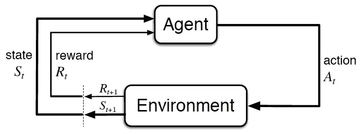
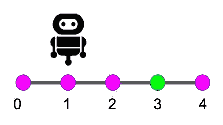

# 虚拟人的非深度强化学习——第一部分

> 原文：<https://towardsdatascience.com/not-so-deep-reinforcement-learning-for-dummies-part-1-c22416a55535?source=collection_archive---------6----------------------->

## 强化学习初学者指南


[Source](https://unsplash.com/photos/1qkyck-UL3g)

我是 Udacity 深度强化学习纳米学位第一批的学生。这一系列的博客文章对我来说更像是给自己的笔记。我希望，通过写这些帖子，我能理清我的概念，也许还能帮助别人理解它们。在这篇文章中，我们将讨论什么是强化学习，并概述一个基本的强化学习环境。

> 当我们思考学习的本质时——强化学习:导论——我们最先想到的可能是通过与环境互动来学习

上面这条线，就是强化学习的全部，从互动中学习；从经验来看。作为刚出生到这个世界的人类和动物，我们不知道我们周围的世界是如何运作的。只有在与世界互动多年后，我们才开始理解它如何回应我们的行为，只有那时我们才能采取具体行动来实现我们的目标。



Basic diagram of a Reinforcement Learning scenario

类似地，在强化学习中，我们有一个与环境交互的代理。在每个时间步，代理接收环境的当前**状态**，并且代理必须选择一个适当的**动作**作为响应。代理执行动作后，代理会收到一个**奖励**和一个新的**状态**。



Robot moving in a strainght line (Source: [Udacity](https://s3.amazonaws.com/video.udacity-data.com/topher/2018/March/5aa05f61_screen-shot-2018-03-07-at-3.53.08-pm/screen-shot-2018-03-07-at-3.53.08-pm.png))

就拿上面的例子来说吧。在上述具有从 0 到 4 的**状态**的环境中，我们有一个**代理**(机器人)可以左右采取两个**动作**。机器人的**目标**是到达状态 3。如果代理在位置 0 时选择向左移动，或者在位置 4 时选择向右移动，代理就保持在原地。同样，每当代理采取行动时，环境给代理奖励-1，并在达到状态 3 时给+10。为了理解第一张图，让我们考虑一个时间步长。

代理的**当前状态**为 1，随机采取**动作**离开。因此，环境给它的奖励是-1，它的新状态也是 0。让我们考虑几个小插曲来理清事情。顺便说一下，一集是代理应用随机动作的一次迭代，直到它达到目标，然后终止。

在第一集里，代理从**状态** 1、 *S(1)* 开始，有一个**奖励**为 0、 *R(0)* 。然后它向左执行一个**动作**并接收一个-1 的**奖励**， *R(-1)* 并在**下一个状态** 2， *S(2)* 中结束…最终在几个动作之后，它到达 S(3)并终止。在这一集的最后，代理人得到的奖励是 0–1–1–1+10 = 7

```
Episode 1
R(0)|S(1) → Left → R(-1)|S(0) → Right → R(-1)|S(1) → Right → R(-1)|S(2) →Right → R(+10)|S(3) → Episode Ends
--------------------------------------------------------------------Episode 2
R(0)|S(1) → Right → R(-1)|S(2) →Right → R(+10)|S(3) → Episode Ends
```

类似地，代理完成了第二集。但是注意，这一次，代理人获得的奖励是 0–1+10 = 9，高于第一次行动。

因此，强化学习就是学习做什么；将特定行动与情况/状态对应起来，以最大化数字奖励。代理人必须探索环境，并通过尝试了解哪些行为会产生最大的回报。代理人采取的行动可能会影响即时奖励以及下一个状态，进而影响所有后续奖励。你可以把这想象成蝴蝶效应，一个小小的举动可能会在未来导致巨大的回报或者非常糟糕的回报。

我们研究的上面的例子是我们所说的**片断任务**，它有一个明确定义的终点。还有一种类型的任务叫做**持续任务，**永远持续下去。课程中提到的一个令人敬畏的连续任务的例子是股票交易机器人，它连续分析市场并做出相应的决策，而不是每次都停下来。稍后我们将学习用于连续任务的算法。

# 为什么不那么深？

深度学习是当你使用一个深度神经网络来预测一个代理的行为。在这个系列中，我们将讨论几十年前开发的传统算法，它构成了强化学习的基础。

在接下来的几个部分中，我们将讨论可用于强化学习的各种算法。一些例子是 SARSA、SARSA-Max、蒙特卡罗方法等。所以，敬请关注。

第二部分已经出来了。点击查看[。](https://medium.com/@thisisppn/not-so-deep-reinforcement-learning-for-dummies-part-2-854216d1fe0d)