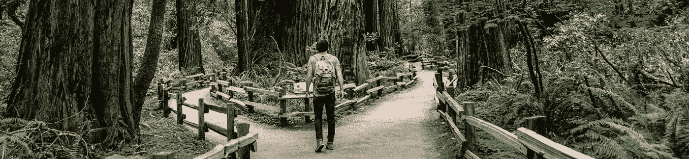
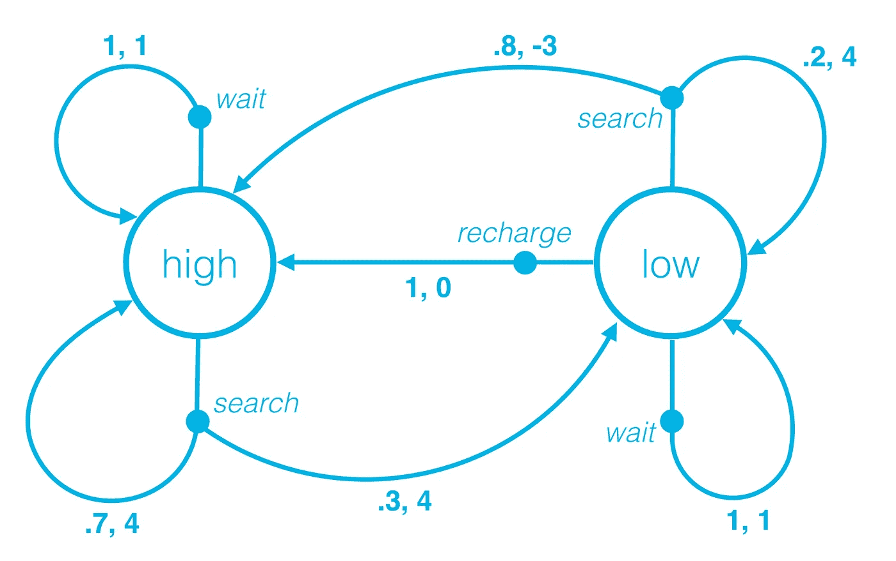

# 虚拟人的非深度强化学习——第二部分

> 原文：<https://towardsdatascience.com/not-so-deep-reinforcement-learning-for-dummies-part-2-854216d1fe0d?source=collection_archive---------8----------------------->

## 马尔可夫决策过程——强化学习初学者指南

This image is meant to signify an agent trying to decide between two actions. Photo by [Caleb Jones](https://unsplash.com/photos/J3JMyXWQHXU?utm_source=unsplash&utm_medium=referral&utm_content=creditCopyText) on [Unsplash](https://unsplash.com/search/photos/path?utm_source=unsplash&utm_medium=referral&utm_content=creditCopyText)

在我之前的帖子中，我们讨论了什么是强化学习，关于代理、奖励、状态和环境。在这篇文章中，我们将讨论如何将现实世界的问题表述为**马尔可夫决策过程** ( MDP)，以便我们可以使用强化学习来解决它。在我们开始之前，让我引用《T2 强化学习:导论》一书中的一些例子和可能的应用。

> 出生几分钟后，一只小瞪羚挣扎着站起来。半小时后，它以每小时 20 英里的速度运行。
> 
> 象棋大师走了一步棋。这种选择是由计划(预测可能的回复和反回复)和对特定位置和移动的愿望的即时、直觉判断两者提供的。
> 
> 一个移动机器人决定它是否应该进入一个新的房间寻找更多的垃圾来收集，或者开始试图找到回到它的电池充电站的路。它根据电池的当前充电水平以及过去找到充电器的速度和难易程度来做出决定。

在这篇文章中，让我们试着把移动机器人的第三个例子公式化为 MDP。让我们看看机器人拥有和能够采取的状态和动作。

**状态**—*{高，低}* 。机器人可以处于高电量状态，不担心充电，专注于**搜寻**垃圾；或者，它可以有一个低电量，并优先**充电**超过搜索。

**行动** —在每个状态中，代理可以决定去**搜索**垃圾，**等待**有人将垃圾带到那里，或者返回充电站**充电**。当电池电量很高时，充电就没有意义了。因此，我们有以下动作集: *A(高)——{搜索、等待}* 和 *A(低)——{搜索、等待、充电}*

A figure showing the states of the robot, and the transitional probabilities and respective rewards. (Source: [Udacity](https://in.udacity.com/course/deep-reinforcement-learning-nanodegree--nd893))

**转移概率&奖励**——转移概率或者他们正式的称呼；**单步动态**，是给定一个动作，从一个状态转换到另一个状态的概率。假设奖励大部分时间是 0，代理每捡一个垃圾获得+1。参考上图，我们来看一些观察结果。

当机器人的状态为**高**时，它可以决定搜索或等待。

1.  如果它决定**搜索**(消耗电池)，有 30%的可能性(0.3 的概率)代理可能从高转换到低，有 70%的可能性(0.7 的概率)该状态将保持高。假设在这两种情况下，机器人设法找到了 4 个垃圾，因此环境给了它 4.0 的奖励。
2.  当处于状态**高**的机器人决定**等待**时。我们 100%确定(1.0 概率)机器人会保持同样的状态。在等待的时候，假设有人过来给了机器人 1 个垃圾，机器人因此获得了 1 英镑的奖励。

类似地，对于状态低，机器人具有它可以采取的动作； *A(低)——{搜索、等待、充电}。*

1.  如果电池**低**，并且代理决定**搜索**，则电池很有可能(0.8)会耗尽，我们必须进行干预，将代理带到充电站，稍后结束于**高**状态。在这种状态下成功完成搜索操作的概率非常低(0.2)，此后代理仍将保持在**低**状态。在决定搜索时，假设电池耗尽，需要人工干预才能到达充电站。在这里，我们需要惩罚机器人即使在电池电量低的时候也决定搜索，并给它-3 的奖励，无论它是否能够找到任何垃圾。类似地，在决定搜索时，假设它设法找到了 4 个垃圾桶而没有耗尽电池，因此它获得了 4 的奖励。
2.  如果在这种状态下，代理决定采取动作**再充电**，则有 100%的可能性(1.0 概率)代理在采取该动作后将处于**高**状态。在决定充值时，代理人只是去了充值站，没有发现任何垃圾，因此最终奖励为 0。
3.  同样，如果它决定**等待**，代理将肯定(1.0 概率)处于相同的状态**低电平**。与上面类似，假设在等待的时候，有人过来给了机器人 1 个垃圾，机器人因此获得了 1 的奖励。

# 那么，什么是马尔可夫决策过程呢？

为了使用强化学习解决现实世界中的问题，我们需要指定环境的 MDP，这将清楚地定义我们希望代理解决的问题。我们上面讨论的例子是一个有限 MDP 的例子。形式上，有限 MDP 被定义为—

1.  状态的有限集合。
2.  一组有限的动作。
3.  奖励的有限集合，r。
4.  环境的单态动力学。
5.  贴现率(我们稍后会讨论这个问题)

# 结论

总之，这是我们需要用来准备问题的框架，以便我们可以使用强化学习算法来解决它。这适用于间断任务和连续任务。

到目前为止，我们已经学习了什么是强化学习(第一部分)，以及如何通过指定环境的 MDP 来正式准备环境。在下一章，我们将讨论如何解决它。敬请关注。