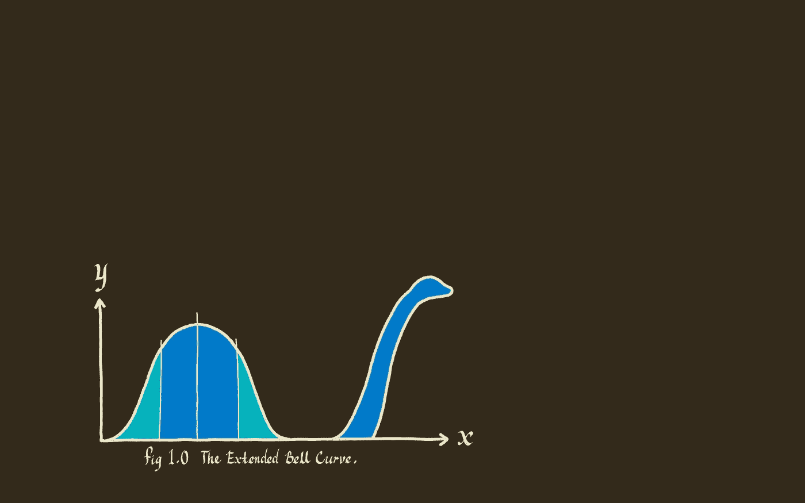

# 作为一名数据科学家的采访笔记和技术问题:2021 年更新

> 原文：<https://towardsdatascience.com/notes-and-technical-questions-from-interviewing-as-a-data-scientist-in-2018-20e7e3ee4ab3?source=collection_archive---------2----------------------->

在我目前的职位上工作了近三年后，我决定离开去追求一个不同的机会。这给了我采访和发现新公司的机会，同时锻炼了我的技术能力，了解了不同企业的内部运作及其对数据科学的利用。

总的来说，在面试过程中，我发现了一些趋势，我认为这些趋势对任何寻找数据科学家职位的人都有帮助。此外，我还收到了许多技术性的面试问题，这些问题概括了我多次遇到的问题。

> 需要公司或特定技能的面试指南吗？查看 [***SQL*** *，*](https://www.interviewquery.com/blog-sql-interview-questions/)*[***机器学习***](https://www.interviewquery.com/blog-machine-learning-interview-questions/) ***，***[***python***](https://www.interviewquery.com/blog-python-data-science-interview-questions/)***，以及*** [***产品数据科学面试题***](https://www.interviewquery.com/blog-product-data-science-interview/)*

# *确保“数据科学家”的角色是合适的*

*[在官方数据科学家职位](https://hbr.org/2012/10/data-scientist-the-sexiest-job-of-the-21st-century)设立十年后，你认为行业应该已经正式确定了工作要求和职责。这不是真的。有些大公司想要荣耀的数据分析师。有些创业公司想要涉足 tensorflow 的软件工程师。还有一些公司想要一名数据科学家，因为他们的首席执行官喜欢保留一个奖杯。*

*你的实际技能包括什么，你对下一个职位的要求是什么，你应该在面试招聘人员的时候就已经明确了，因为他们会对这两个方面都有要求。你对下一个角色有什么期待？你现在的背景是什么？一般来说，有了这两个问题，你就可以判断出你是否适合一名基于工程的数据科学家(**机器学习工程师**)，或者可能是一名产品数据科学家(**业务驱动的**)，或者是天底下所有与数据相关的人。*

*在面试了前几次后，我想出了如何安抚招聘人员。**重复工作要求**通常会奏效。但是事后来看，如果我在学习了定义的角色后，实际上不想专注于数据科学领域，那么继续面试又有什么意义呢？它在两端都浪费时间。面试需要大量的时间以及精神和情感上的能量。这使我想到…*

# *永远不要做带回家的作业*

*这个有争议。我会在一周的任何一天就编码任务进行技术视频或电话面试。我在这个问题上坚持自己的观点，原因有几个，人们可能同意也可能不同意我的观点。*

**但是如果一定要做带回家的挑战，**[***看看这个就知道怎么过了。***](/passing-the-dreaded-data-science-take-home-assignment-8ae5d55f256b)**

## ****1。你让自己受制于完全模糊的要求。****

**在进行技术视频/电话采访时，你在解决问题的过程中获得了总体的增量反馈。每个面试官都知道自己想要什么，如果他们看到你走上了一条不同的/错误的/无用的道路，那么他们会(或者他们应该)用尽可能多的反馈来纠正它，告诉你实际的答案，或者只是一个不正确的答案。在编码任务中，你什么都得不到。你每次都在参加**非标准化考试**,评分者很可能有偏见。你可以把全部精力花在分析数据上，去寻找评分者根本不在乎的东西。我接到一个任务，当我问招聘人员时，任务中的要求就像“分析一个数据集，并把它变成一个演示文稿”一样模棱两可，没有任何进一步的澄清。不用说，我不明白为什么我没有通过，也不明白我最终应该做什么。**

## ****2。没有一个真正的时间表。****

**他们给出的估计是“这项任务通常需要 3 到 6 个小时”以及“大约 2 到 7 天就可以完成”。对我来说，这意味着其他候选人现在要花 6 到 12 个多小时完成带回家的作业。为什么不呢？带回家的作业旨在筛选出候选人，因为你通常会与之前布置作业的其他候选人进行比较。致力于在挑战中做好工作意味着找出问题的每个边缘情况，加上围绕评分者自身偏见的边缘情况。那么，为了超越所有竞争对手，你为什么不花 12 个多小时来完善它，然后告诉招聘人员你“真的只用了大概 3 个小时就完成了？”**

## ****3。你通常得不到任何反馈。****

**有什么比花了 12 个多小时完成一项任务却没有得到工作更糟糕的呢？无法找出自己做错了什么，并利用它迭代到下一个同样需要赋值的位置。**

## ****4。你在告诉他们，你的时间比公司的时间值钱。****

**想象一下，面试五份不同的工作，他们都想要编码任务。想象一下，你实际上只做了他们告诉你要花在这上面的分配数量。在你的全职工作之外，还有 15 到 25 个小时的带回家的枯燥工作，这构成了**免费的无薪工作。再见了，周末。再见了，你的决心。也许就和想要编码任务的公司说再见吧。****

****注意事项。它们有助于计算出你在工作中将要做的工作。很多时候，初创公司会从他们的数据中抽取一个样本，然后考虑周到地给出模拟实际作业的作业和问题。****

**这也是未经证实的候选人变得有竞争力的一个好方法。有抱负的数据科学家或研究生应该利用编码作业，并尽全力使其完美。有了无尽的资源和时间，它通常可以让候选人展示出努力工作和付出的精神。因此，虽然对一些人不利，但对另一些人可能是有利的。**

****

# ****我认为真实的面试问题概括了 DS 面试的许多方面****

**数据科学家技术访谈部分现在包含大约六个主题。**

1.  **[Python 脚本](https://www.interviewquery.com/blog-python-data-science-interview-questions/)**
2.  **[产品](https://www.interviewquery.com/blog-product-data-science-interview/)**
3.  **SQL(或 Python，但基本上是分析)**
4.  **AB 测试**
5.  **[机器学习](https://www.interviewquery.com/blog-machine-learning-interview-questions/)**
6.  **可能性**

**这些都是我被问到的非常真实的问题。**

> **编辑:想要更多问题和解决方案？在这篇和其他博客帖子流行起来之后，我创建了 [**面试查询**](https://www.interviewquery.com/) ，一个练习数据科学面试问题的网站。**

## **Python 脚本**

1.  **嘶嘶作响**
2.  **[给定一个按顺序排列的时间戳列表，返回一个按周聚合分组的列表列表。](https://www.interviewquery.com/questions/weekly-aggregation)**
3.  **给定一个字符列表、每个字符的先验概率列表和每个字符组合的概率矩阵，返回概率最高的最佳序列。**
4.  **给定一个日志文件，其中包含以日期、数字和名称字符串为特征的行，解析该日志文件并返回按月份聚合的唯一名称的计数。**

***阅读更多关于*[****Python 数据科学面试题*** *这里**](https://www.interviewquery.com/blog-python-data-science-interview-questions/) **。****

## *****产品*****

1.  ***假设 Google Docs 没有被跟踪的指标，一个产品经理找到你，问你会实施的前五个指标是什么？***
2.  ***此外，假设谷歌文档的参与度有所下降。你会调查什么？***
3.  ***假设我们想要实现一个通知系统，用于提醒护士让医院的病人出院。你将如何实现它？***
4.  ***假设在 LinkedIn，我们希望在新的消息平台上为“活跃用户”实现一个绿点。您将如何分析推广 it 的有效性？***

> ***以下是关于如何解决 [**产品数据科学面试问题**](https://www.interviewquery.com/blog-product-data-science-interview/) 以及你将会遇到的五种不同类型的产品问题的深入指导！***

## *****SQL*****

1.  ***给定一个付款交易表和一个客户表，返回客户的姓名和客户进行的第一笔交易。***
2.  ***给定一个付款交易表，返回每个客户付款次数的频率分布。(即 1 笔交易— 100 个客户，2 笔交易— 50 个客户，等等)***
3.  ***给定相同的付款表，返回累积分布。(至少一个交易，至少两个交易，等等……)***
4.  ***给定一个表—朋友 1 |朋友 2。返回两个好友之间共同好友的数量。***

****阅读更多关于 sql 中哪些* [*概念要了解要通过面试*](https://www.interviewquery.com/blog-three-sql-questions-you-must-know-to-pass/)***

## *****AB 测试*****

1.  ***给定 AB 测试漏斗统计数据，如样本大小、注册率、功能 1 使用率、功能 2 使用率，分析哪个变体胜出以及原因。***
2.  ***你将如何设计一个实验来改变注册页面上的一个按钮？***
3.  ***如何知道自己是否有足够的样本量？***
4.  ***如何对多个变量进行显著性测试？***
5.  ***如何减少 AB 测试中的方差和偏差？***
6.  ***向产品经理或非技术人员解释 P 值和置信区间。***

## ***机器学习***

1.  ***你会使用什么特征来预测餐馆从收到订单开始准备食物所花费的时间？***
2.  ***你能想出一个你宁愿低估而不是高估的场景吗？***
3.  ***分析一个模型的结果，你如何解释偏差和方差之间的权衡？***
4.  ***解释随机森林模型实际上是如何工作的。***
5.  ***你如何知道你的模型是否有足够的数据？***
6.  ***你如何评价一个模特？(F1 分数、ROC 曲线、交叉验证等…)***

> ***这里有一个关于如何解决 [**机器学习面试问题**](https://www.interviewquery.com/blog-machine-learning-interview-questions/) 以及你会遇到的六种不同类型的机器学习问题的深度指南！***

## ***可能性***

1.  ***给定均匀分布 X 和 Y，两者的均值为 0，标准差为 1，2X > Y 的概率是多少？***
2.  ***一部电梯四个人，一栋楼四层。每个人在不同楼层下车的概率是多少？***
3.  ***两个人在同一楼层下车的概率有多大？***
4.  ***给定一副从 1 到 100 的卡片，选择 1 < Pick2 < Pick3?***

## *****商业案例问题**的概率是多少***

1.  ***我们知道，该产品每月成本为 100 美元，每月平均流失率为 10%，平均客户停留时间约为 3.5 个月。计算每个客户的**平均寿命值。*****
2.  ***您如何确定网飞订阅的价格是否真的是消费者的决定因素？***
3.  ***假设你为 Lyft 工作。Lyft 正在测试三种不同的取消费用:1 美元、3 美元和 5 美元。你将如何决定哪种取消费用？***

****阅读我关于如何接近和利用* [***数据科学案例研究问题***](https://www.interviewquery.com/blog-data-science-case-study-interview/) ***框架的文章。******

***是的。数据科学面试很难。***

***提示:试着找出面试官或网上给你的每个问题的答案。因为如果你失败了，你很可能会在另一次面试中遇到这个问题的变体。还有，这种情况发生的概率有多大？；)***

****查看一些* [*模拟面试*](https://www.youtube.com/channel/UCcQx1UnmorvmSEZef4X7-6g) *这些问题应该如何回答。****

# ***最后，雇主正在疯狂雇佣数据科学家***

***数据科学家的市场仍然非常紧张，因为对于需要增长或赚钱的公司来说，一般角色变得越来越必要。即使我最终要求拒绝编码挑战，我仍然得到了许多公司愿意放弃，将面试过程转换为技术面试。2020 年的数据科学在市场上异常火爆，在这个市场上**数据科学家有潜力为业务的许多不同部分做出贡献**。***

***随着新冠肺炎导致许多公司裁员，疫情仍有生意兴隆，如[**door dash**](https://www.interviewquery.com/blog-doordash-data-science-interview-questions/)**[**沃尔玛**](https://www.interviewquery.com/blog-walmart-data-scientist-interview/)**[**亚马逊**](https://www.interviewquery.com/blog-amazon-machine-learning-interview-questions-solutions/)**[**网飞**](https://www.interviewquery.com/blog-netflix-data-science-interview-questions-2/) 。然而，最终，由于有这么多的申请人，这无疑增加了竞争相同职位的候选人的供应。*********

*******我注意到的是，与几年前未经证实的经历相比，这次当我开始搜索时，简历上的一点经验有多重要。我鼓励那些希望在没有经验的情况下进入这一领域的人，先做几个项目，以展示在这一领域的整体激情。从根本上说，这份工作在我看来仍然是最酷的工作之一，因为数据科学家可以凭借他们的技能以及他们对不同业务目标的贡献而变得多才多艺。*******

*******什么时候一个人能成为任何新工作的第一人？十年真的不是那么长的时间。*******

# *******感谢阅读*******

*   *******如果你对更多来自我的数据科学面试问题、技巧和诀窍以及指南感兴趣，请查看 [**面试查询**](https://www.interviewquery.com/) 。*******
*   *******查看我的 [**Youtube 频道**](https://www.youtube.com/channel/UCcQx1UnmorvmSEZef4X7-6g) 了解更多数据科学面试技巧、技巧和模拟面试示例！*******
*   *******查看更多关于[产品分析师](https://www.interviewquery.com/blog-the-product-analyst-interview/)、[数据分析师](https://www.interviewquery.com/blog-facebook-data-analyst-interview-questions/)和[机器学习工程](https://www.interviewquery.com/blog-amazon-machine-learning-interview-questions-solutions/)角色的指南。*******