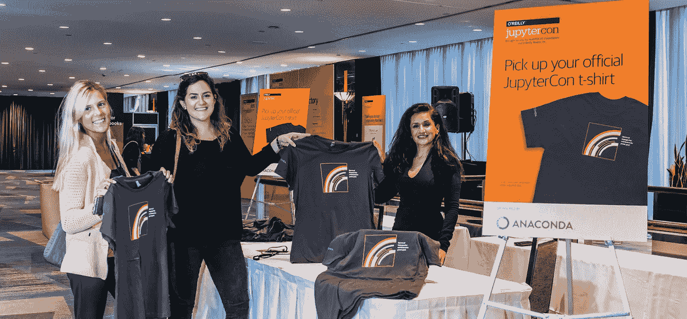

# JupyterCon 笔记 Jupyter 项目如何实现大规模数据科学

> 原文：<https://towardsdatascience.com/notes-from-jupytercon-how-project-jupyter-is-enabling-large-scale-datascience-a3627a05ea68?source=collection_archive---------12----------------------->

提高企业采用率，新工具/扩展，提高数据科学的新方法。

Credit: [O’Reilly Flickr](https://www.flickr.com/photos/oreillyconf/42422711280/in/album-72157698903074851/)

在刚刚结束的 JupyterCon 2018 大会上，它真的是关于利用[项目 Jupyter](https://medium.com/u/9cdd90635810?source=post_page-----a3627a05ea68--------------------------------) 的力量进行**协作**、**可扩展**、**可扩展**和**可复制**数据科学。我参加了为期 3 天的教程、讲座、主题演讲和海报会议(在会上，我介绍了我在自动化可视化方面的最新进展)。下面是 TLDR 对我感兴趣的一些亮点的总结:

*   [Jupyter](http://jupyter.org/) 已经**成为一种在学术和行业环境中轻松共享代码、分析和结果的方式**。学校使用它来提供课程，而分析师、记者、研究人员、大型组织等使用它作为一种可扩展的方式来管理他们的数据分析工作流。
*   **企业使用 Jupyter 笔记本正在改变**。与临时使用(即员工个人使用笔记本电脑)相反，企业开始探索企业范围内的企业管理 Jupyter 部署。
*   **企业正在扩展 Jupyter** 来解决新的问题/用例，并且已经开始**将他们的更新**作为产品和开源软件(OSS)反馈回来。例子:IBM ( [Watson Studio](https://medium.com/ibm-watson/introducing-ibm-watson-studio-e93638f0bb47) 、[Jupyter Enterprise Gateway](https://jupyter-enterprise-gateway.readthedocs.io/en/latest/))、网飞([interact](https://github.com/nteract)、papermill、commuter、titus)、谷歌(Colaboratory、Dataflow、Kaggle)、亚马逊(SageMaker)等。
*   **访问和安全性**正在成为一个重要的焦点领域(谁可以访问笔记本、笔记本的哪些部分、笔记本中的数据/结果)。随着企业(具有良好定义的资源访问策略)将 Jupyter 集成到他们的 datascience 工作流中，定义符合现有策略的模板和数据访问规则变得越来越重要。
*   需要一种更加谨慎的开源方法。维护一个像 Jupyter 这样的大型开源项目是很困难的，尤其是当负担落在少数人身上的时候。我们需要探索更多的方法来支持社区和维护过程(付费维护者，企业资助等)。

# 主题演讲—

以下是一些主题演讲和见解的摘要:

**来自石溪大学物理和天文学系的威尔·法尔**提到了他和超过 1000 名天体物理科学家组成的团队(在 [LIGO](https://www.ligo.caltech.edu/page/what-is-ligo) )如何使用 Jupyter 笔记本分享引力波天文学的成果。

会议联合主席 Paco Nathan 强调了 Jupyter 社区的趋势和主题。他提到了 Jupyter 在大型企业中的采用如何实现快速进步(学生已经知道 Jupyter，不必花时间学习专有工具)，Jupyter 如何在行业(硬件、软件、流程)快速变化的情况下帮助您的基础设施适应未来，以及它如何帮助解决隐私问题。

Jupyter 项目的领导者 Carol Willing 强调了 Jupyter 是如何让用户更容易编写代码并鼓励实验的。然而，她也警告说，挑战可能会限制 Jupyter 项目的成功——自私的用户，他们索取的比给予的多(以牺牲集体为代价最大化个人利益)，维护者的倦怠，维护者的不认可，自满的旁观者等。她还讨论了整合商业模式和赠款作为解决这些问题的方法的想法。

哥伦比亚新闻学院的马克·汉森讲述了一个有趣的故事，讲述了 Jupyter 笔记本如何成为帮助记者将数据、代码和算法整合到数字新闻中的“工具”。他给出了一个学生项目的具体案例，在这个项目中，他们进行了实验，以确定虚假 twitter 账户对信息传播的影响。更有趣的是，实验结果导致了数百万 twitter 账户的大规模清理，以及《纽约时报》发表的数字/印刷文章。

来自 [Carpentries](https://carpentries.org/) 的 Tracy Teal 讨论了他们通过在世界各地举办数百个研讨会来帮助用户培养数据技能的工作。她认为，人是将数据转化为洞察力的关键，并推动了对扩大拥有数据技能的人数的关注。她分享了一段有趣的话

> 如果你想走得快，就一个人走；如果你想走得远，就一起走。

**哥伦比亚大学地球与环境科学助理教授 Ryan Abernathey 解释了为什么我们应该将数据存储在云中。他提到，复杂的问题通常需要大型数据集(TB、PBs ),这些数据集有时会被锁定在缓慢的 FTP 门户或其他本地存储系统之后。然后，研究人员必须创建暗库(数据的本地副本)，这可能是原始数据的子集，会限制他们探索不同研究问题的能力。他提倡使用云(和相关工具)包括- zero3jupyterhub+kubernetes、并行计算(DASK、Spark)、领域软件(xarray、astropy)、云优化数据。他提到，美国宇航局已经开始在这个方向取得进展，承诺在未来 5 年内通过云端点提供数十亿字节的数据。**

网飞数据工程和基础设施主管 Michelle Ufford 强调了网飞在 Jupyter 笔记本电脑上下大赌注的原因。她提到笔记本是未来的发展方向，它们不仅仅是提供交互功能，更重要的是

> 笔记本弥合了技术和非技术团队成员之间的鸿沟。

她讨论了网飞如何在笔记本电脑上投下了巨大的赌注，将超过 10k 的工作流迁移到笔记本电脑。在网飞，他们围绕笔记本创造了多种用例(和工具),包括数据访问、不同任务的笔记本模板，甚至笔记本日程安排！更多信息请点击[网飞科技博客](https://medium.com/netflix-techblog/notebook-innovation-591ee3221233)。

# 会谈-

**会议联合主席 Brian Granger** 发表了关于“利用开源的商业案例和最佳实践”的演讲。他讨论了使用方面的变化(例如来自亚洲的高流量和兴趣)、开放源码软件的回报(免费 3-5 年研发，允许公司专注于核心业务，支持灵活定制)和开放源码软件的风险(破坏性影响、周转缓慢、缺乏企业支持)。他还为有兴趣参与 OSS 项目的企业提出了最佳做法——花时间了解 OSS 的真正需求，从帮助审查 PRs 开始(实际的代码编写构成 OSS 过程的一小部分)。要避免的事情——不要雇佣 OSS 项目维护人员，把他们的时间分配给其他项目；这损害了社区。

来自 NYU 城市科学与进步中心的教授 Julia Lane 讨论了 Jupyter 笔记本如何用于涉及公共政策所需敏感数据的项目。她描述了她在劳动经济学方面的工作如何需要来自多个机构的数据(例如，来自美国国税局等机构的企业数据，以及来自审查局的雇员数据)。这些包含机密的微数据(例如，ein、SSN 等),需要高安全标准。此外，很难实现一个“数据交换所”的等价物，在那里多个机构可以“共享数据”——他们可能没有共享这些数据的动机。她建议采用一种方法，取代信息交换所，围绕特定问题组织数据收集工作，建立完整的团队(数据分析、网络分析、机器学习、文本分析、用户行为等)。)，并培训适当的机构工作人员。

**专家组|当前环境——合规、道德、ML 模型解释，GDPR**

小组成员探讨了几个问题，包括对 GDPR 的回应。Julia Lane 分享了一些关于 GDPR 如何基于两个有问题的概念的想法——知情同意(她提到这毫无意义)和数据匿名化(她提到数据可以去识别但不能匿名化)。她建议我们更多地走向“数据的道德使用”(也许是数据科学家的希波克拉底誓言)。来自网飞的米歇尔·乌福德也提到所有的数据都是有偏见的，我们不应该问“我的数据有偏见吗”，而是应该问“我的数据有什么偏见”。其他人也鼓励设计自动化偏差测试的工具，并引入模型测试者/破坏者的角色——质疑、测试和破坏模型的个人(相当于传统软件工程开发中的 QA 工程师)。

# 学习资源

*   **来自彭博的 Chakri Cherukuri** 做了一个关于机器学习算法可视化的有趣演讲。笔记本在此—[https://github.com/ChakriCherukuri/jupytercon_2018](https://github.com/ChakriCherukuri/jupytercon_2018)
*   来自 NYU 的布鲁诺·冈萨尔维斯发表了一篇关于 Matplotlib 数据可视化的教程。[https://github.com/bmtgoncalves/DataVisualization](https://github.com/bmtgoncalves/DataVisualization)

有趣(也有点出乎意料)的是看到像两个适马、第一资本等金融公司在 OSS 中担当领导角色并贡献代码/项目。

# **结论**

pronoun and expertise tags at JupyterCon 2018

会议的组织工作非常出色(我有没有提到午餐时供应的美味热餐？)用体贴的手势让与会者感到受欢迎和融入。从 pacman 规则(当你们聚在一起交谈时，多留一个人的空间)到有助于促进与会者之间交流和互动的标签(围绕兴趣/专长的标签——“雇用我”“我正在雇用”“ML/AI”，首选代词“他/她/他们”等)。).我离开这次会议时，感受到了所做的出色工作、Jupyter 项目社区成员的慷慨精神及其在不同领域的影响。展望未来，我计划用笔记本做更多的事情(分享演示、示例代码等)。

非常感谢会议共同主席帕科·内森、费尔南多·佩雷斯和布赖恩·格兰杰；出色的工作！感谢会议的主办方 Jupyter 项目、奥赖利媒体公司和 NumFOCUS 基金会。感谢第一资本慷慨的奖学金，让我参加这个非常有趣的会议！绝对期待 Jupytercon 2019！