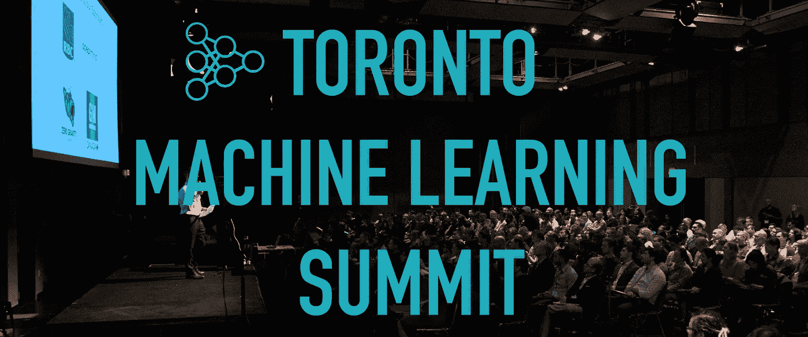

# 多伦多机器学习峰会(2018)笔记

> 原文：<https://towardsdatascience.com/notes-from-toronto-machine-learning-summit-2018-69ada327cc3e?source=collection_archive---------20----------------------->

本周早些时候，我参加了多伦多机器学习峰会。与我到目前为止参加的会议和其他技术活动相比，这是一次非常不同和令人耳目一新的经历。这篇文章包含了我在会议上的一些笔记，主要是我参加并喜欢的演讲。

会议有四种演讲:主题演讲、研究、应用、商业。让我一个一个来。

**主题演讲:共有 6 场主题演讲(每天 3 场)。**会议以孙铁麟·普塔宁(layer6.ai)、刘可莉(Rubikloud)和 Margaret Wu(格鲁吉亚合伙人)的三个主题演讲开始。由于各种原因，我错过了所有三场会谈的部分内容，但这些会谈的整体情绪似乎反映在刘可莉在《环球邮报》上的一篇文章中，题为:“[人工智能不需要更多的研究人员，它需要更多的产品](https://www.theglobeandmail.com/business/commentary/article-ai-doesnt-need-more-researchers-it-needs-more-products/)”。这里的 AI 是加拿大 AI 空间。总的来说，虽然研究需要资助、重视和继续，但加拿大也应该成为人工智能的行业领导者。

第二天的主题演讲来自:Philippe Beaudoin(元素。AI)、简·班尼斯特(Real Ventures)、山姆·莱特斯通(IBM)。Philippe Beaudoin 的演讲更像是一个关于人工智能、我们的生活/未来等的一般的哲学视角(就像他的:“[一个你希望成为的人的网络](https://medium.com/startup-grind/a-web-for-the-person-you-wish-you-were-7a340ae3d73a)”)。

相比之下，珍妮特·班尼斯特(Janet Bannister)的书完全是关于投资者在人工智能初创公司中寻找什么。她详细谈论了不同类型的人工智能初创公司，多伦多/加拿大的当前趋势，她过去与传统公司的经历以及他们对人工智能的反应，最后对未来的趋势进行了一些预测。这些趋势包括:

*   技术民主化
*   一切都超个性化
*   所有公司都将结盟成为科技公司
*   劳动力的自动化和商品化

Sam Lighthouse 的演讲是关于大脑启发的微芯片、神经语义计算、IBM(和其他公司)如何超越构成当今计算机基础的传统冯诺依曼架构，并探索了在芯片上构建神经网络等想法。看到这项技术在 50 年左右的时间里向何处发展，对比 20 世纪 60 年代的神经网络布线图和 IBM 现在能做的事情，是一件令人着迷的事情。

在我参加的讲座中，我喜欢两个讲座:

*   Sunnybrook 研究所的 Anne Martel 的“医学成像的机器学习”
*   多伦多大学的彼得·魏特克的“当代量子计算能为机器学习提供什么吗？

我并不自称是这两个话题的专家。我去参加这些会议只是为了丰富我在会议上的经验，最终我得出了一些关于主题的想法，即使不是完美的理解。

**应聘**:这是我参加会谈最多的一届。我喜欢的几个演讲是:

*   **“沃尔玛的零售之旅:从商业智能到人工智能”**作者 prak har mehr otra——这是一个简短但有趣的演讲，讲述了他们如何在沃尔玛使用人工智能结合人类专业知识，以及为什么。虽然不是很详细，但它让我们得以一窥沃尔玛的经营规模，以及人工智能在他们的设置中可以解决的典型问题。
*   **“如何应用自然语言处理来识别有害的在线对话？”IMRSV 数据实验室的 Isar Nejadgholi 这个演讲是关于建立一个分类器来识别网络媒体中不同种类的有害评论。对我来说，这感觉更像是一个研究报告，因为在这一点上似乎没有应用程序与之相关，但了解这种方法非常有趣。当我听说一种方法有效时，我想知道是什么方法失败了。**
*   **“人工智能的可解释性:为什么它很重要，为什么它很难”**Xavier Snelgrove——无疑是本节中参与人数最多的演讲。虽然这个演讲更像是对人工智能可解释性所涉及的不同问题的概述，但幻灯片包含了足够的信息，可供进一步阅读。

**业务:**我在这部分参加的唯一一个讲座是:**“数据科学团队的敏捷”**作者 Jennifer Prendki(图八)。这应该是我在大会上最喜欢的演讲。自从我从学术界转到工业界后，我经常想知道、思考和阅读这个问题。虽然这次演讲没有彻底改变我的想法，也没有突然让我获得新的知识，但看到一群人在思考这个问题，感觉很好，这是会议中满座的会议之一。不过，我真的希望这篇文章能更长一些，更具体一些。

也有几个平行的小组讨论，但在我参加的那个小组讨论中，我有点走神，因为一个发言者不停地说，语气让我感到惊讶，我在一点后失去了上下文的线索。我没有参加晚上的活动和招聘会。

**我喜欢 TMLS 的一些地方:**

*   我职业生涯的大部分时间是一名学者，我的大多数会议都是自然语言处理领域的研究(例如 ACL、COLING、IJCNLP 等)，还有一次是一般人工智能(IJCAI-2007)。所以，我通常习惯在一个会议上看到很多研究报告。今年早些时候，我确实去参加了一个行业风格的技术会议(也是在多伦多)，但每次演讲都像是推销，我在两个小时内就离开了会场。这次会议是一次全新的体验。它自始至终有三场平行会议，一场侧重于研究(演讲者主要是大学教授)，一场侧重于应用工作(演讲者通常是行业专业人士)，一场侧重于业务和管理方面(大多数演讲者是 C 级高管)。我想主题演讲是这三者的混合，还有一些人工智能风投的演讲，这些演讲给出了他们在投资人工智能初创公司时寻求什么的见解。**对我来说，在一个地方进行所有这些不同方面的交易还是第一次。**在这次会议之前，我就像下面这条推文中的这位研究员一样，厌倦了看着所有的 NLP 会议慢慢变成“我的数字比你的好”和“做深度学习或灭亡”的场所:

现在，在 TMLS 之后，我觉得有一个世界在关注 AI/ML 领域的其他东西，而不仅仅是数字游戏。

*   我觉得很酷，一个七年级学生 [Artash Nath](https://hotpoprobot.com/) 是海报展示者之一——对我来说也是第一次。
*   我的另一个第一次经历是看到如此多的女性演讲者，其中许多人甚至是首席执行官。作为一名在科技行业工作的女性研究人员，你可以想象这对我有多重要(然而，我们在大多数会议上并没有看到这种多样性！)

**一些我不喜欢的东西:**

*   我认为基调太短了。与其有这么多的主题演讲，不如有更少的主题演讲，这样会更长一些。演讲者在分配给他们的短时间内做了很好的工作来浓缩他们的知识！
*   好像没有被记录下来。对于我们中想同时参加两个平行会议的一些人来说，这会有所帮助。我还参加过其他会议，会上的演讲视频后来都可以看到。

总的来说，这是一个很棒的会议！人们很友好，比我迄今为止参加过的任何会议都更容易接近！总的来说，他们似乎想帮助/指导该领域的年轻人，并对在加拿大建立良好的关系网感兴趣。a 一定要去，如果你在多伦多并且以前没有去过那里的话！