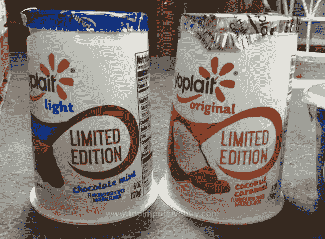
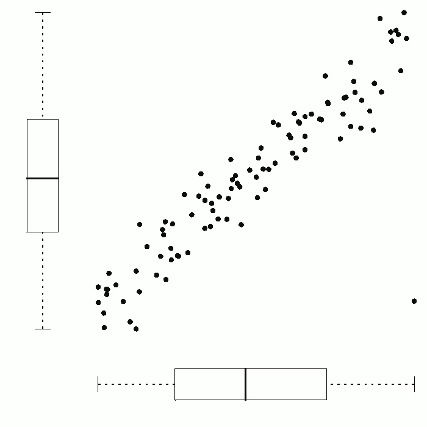
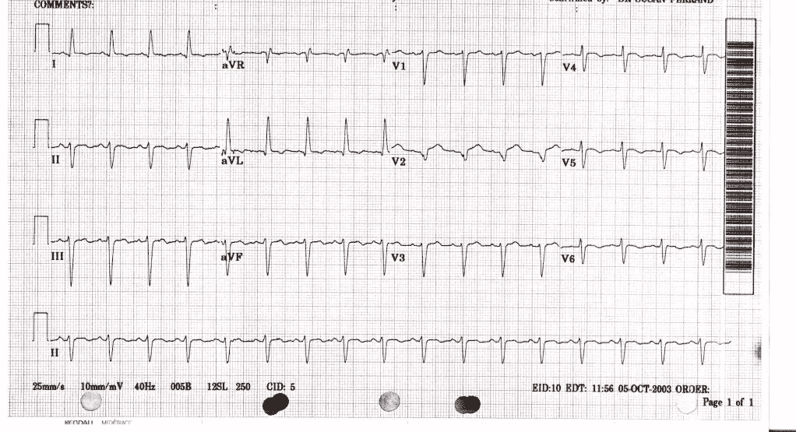
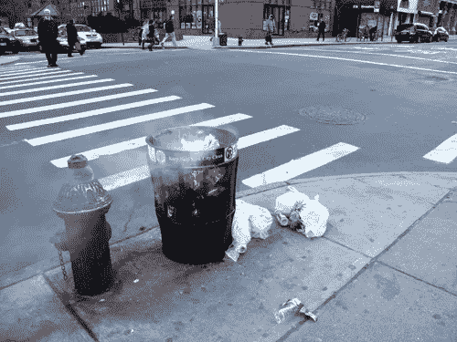

# 异常检测注意事项#2:全脂或低热量欺诈？

> 原文：<https://towardsdatascience.com/notes-on-anomaly-detection-2-full-fat-or-low-calorie-fraud-9d3c8c084bf8?source=collection_archive---------0----------------------->

上次我概述了为什么剽窃是愚蠢的。

猜猜还有什么是愚蠢的？

# 数据捏造是愚蠢的。

让我们来看看具体情况。

首先，我有理由相信科学数据“造假”是相当罕见的。

我说的“欺诈”指的是老派的那种:坐在你的地下室，舔舔你的铅笔，然后记下虚构的数字，然后这些数字被表示为科学测量值。然后，好吧，你知道吗——所有那些讨厌的数字，从来没有完全表现自己，突然在正确的地方。稍微修改一下计算，直到一切都如你所愿，把它强加给某个不幸的合著者，出版。迪德里克·斯塔佩尔的方式。

在某些方面，这听起来很容易。有什么比坐在那里敲一些数据更直接(更快，更便宜)的呢？想想效率！

如果没人看见你会怎么被抓？

事实上，这很重要:

1.  以上是一条*做诈骗的烂路*，
2.  …所以只有白痴才会这么做
3.  …这也是欺诈检测技术主要提醒我们*几乎完全是*白痴存在的另一个原因。**脚注 1**

一个更好的欺诈方式是从*实际做实验*开始，然后从那里改变你需要的东西。

这是欺诈精简版。是低热量诈骗。“2%的欺诈，为了你的数字”。我就不信这不是不诚实。

我怀疑(但无法证明)聪明、不诚实的人知道这种情况下全脂和脱脂的区别。他们可能或明或暗地知道，或多或少，也可能被承认(“我们就是这样得到结果的”)或不被承认(“你说‘我的方法有问题’是什么意思，每个人都是这样做的”)。

但是他们知道。

出现这种情况的原因从直截了当、显而易见到反直觉都有。

# 伪造的 10 个理由

**1。*发明真实的假数据介于挑战和不可能之间——取决于具体情况*。**
发明现实的汇总统计很难，发明现实的数据更难。数据点具有子结构、复杂的相互关系和数学含义，远远超出了作者在展示它们时可能考虑的范围。考虑 Larry Sanna 的论文——发现数据极不可能在组间的变化中没有足够的差异(即 SDs 的 SD 不可能低)。总的来说，那些肤浅到可以发明自己的结果的人没有聪明到预见到这样的事情。

**2。真实的(但被篡改的)数据有一个现实的谱系，因为所有其他实验活动都正常进行。** 招募受试者，测试细胞，服用药物，保存实验室笔记本，录制视频，进行测试，购买试剂，等等。实验活动的记录存在，这是很容易确定的。

**“嘿，X 研究员！这是你编的吗？”天哪，不。这花了我们三年多一百万美元**

斯塔佩尔面临的一个主要问题是，他无法解释他的调查数据来自哪里。他的书以一个疯狂的场景开始，在这个场景中，他在全国各地开车，试图为他之前发明的数据编造背景故事:

> “所以，在一个火车站和两个大学校园之间，我的故事取得了相当大的进展。但是为什么我让自己这么为难呢？我为什么要告诉人们这项研究是在几百英里外的兹沃勒和格罗宁根进行的，而不是在离家近的地方？这是我在玩的某种游戏吗？我是不是在给自己制造困难，这样我就必须加倍努力去赢得比赛，这样我才能为我所做的感到骄傲…
> 
> 这行得通吗？这仍然是一个相当奇怪的故事。一位忙碌的教授，他设计了一项研究，然后坐上自己的车，开到美国的另一端，独自在公共场所分发问卷，没有学生或研究助理。谁会相信这种事？"
> 
> ***作伪科学，第一章***

**3。欺诈性地篡改现实价值的过程与研究人员面临的合法问题非常相似。
研究人员可能经常怀疑他们完全出于善意所做的测量的真实性。放大器故障，电线交叉，环境温度变化，污染发生，病人撒谎和辍学，本科生说*奇怪的事情*。存在一大堆貌似合理的推脱“坏价值观”的借口。即使这种按摩是广泛和不诚实的，*它也是一个必要和监管任务*的近亲——确定怪异(或不方便)的数据是否代表测量误差。**

**4。*摆弄乐器甚至不需要有意识的参与。愚弄别人和愚弄我们自己是一个令人不安的连续体*。**
欺诈需要故意的虚假陈述——只有在最不寻常的情况下，研究人员才可能偶然捏造数据。但是如果你对结果有一个清晰的预期，有未隐藏的数据和强大的压力去产生想要的或预期的结果…好吧，你可以用各种方法从样本中排除数据点以服务于确认偏倚。“看到了吗？我早就知道这是答案！”

I see you, little man! You gon’ die!

**5。离群值识别的实践是非标准化的，所以谁能说你“用错误的方式清理了数据”？一般来说，你可以选择你想要的任何一个。**

这也表明了对方法论的更广泛的态度，尤其是在社会科学领域，量化是…我会友好地说*特别*。仔细看一下[这个](http://crtt.flexiblemeasures.com/)。仔细看了一下[这个](https://www.researchgate.net/publication/315003018_Mind-wandering_how_do_I_measure_thee_with_probes_Let_me_count_the_ways)。

**6。*上述报告(异常值识别)也不常见和/或不正式要求作为发布条件*。**
大部分的科学工作都是在没有太多关于如何应用异常值剔除/“下降值”/“清理”程序的信息下发表的。我知道我总是唯一一个在我的评论中要求这些信息的学究。在我的工作中，这通常意味着有人获取心电图，然后对其进行分析，因此我的问题很简单:“这是如何清理的？移除了多少次心跳？每人使用了多少价值？你看到什么异位了吗？”

Bleep bloop. My life in a panel.

答案往往是:“以上都不是。我们没有看到任何错误。”

回答错误！你的意思是(a)“我的软件在我不注意的情况下进行了清理，我不知道它是如何工作的”或者偶尔(b)“我只是留下了错误的值，因为我不知道错误的值是什么样的，因此我的数据很糟糕”。

我们经常听说*文件抽屉*用于存放没有发现显著结果的已完成研究，但已发表研究中的不良值通常在那个抽屉中有自己单独的小隔间。有时甚至没有人知道那个隔间在那里。

7 .**。*细节可以侵略性的掩埋。***
如果你编造了不可能或有问题的汇总统计数据，你将有一段美妙的时间来解释你是如何毫不含糊地报告它们的。这么说吧:如果你说“1 加 1 等于 9”，那么没人需要看到你的数据就知道你错了。但是，如果你有真实的数据，你可以混淆和抑制。当然，当你发送数据时，你可能会发送一大堆格式不良、难以理解或难以分析的可怕数字。你可以发送一半有效的号码。

A priming researcher prepares a dataset for sharing.

(当然，你可以声称你想从其获取数据的人在‘恶意’操作，然后完全拒绝分享这些数据。)

***8。欺诈是该隐的标志。拨弄只是淘气的男孩和女孩。***
在科学领域，没有一个人有事后诸葛亮的职业生涯。

然而,“较轻的罪过”显然更易变。她的研究是可耻的业余的，但她最终学会了更好的，嗯，她可能是好的。她当然可以被救赎。但是“有一天，她决定不再伪造她的研究，道歉，现在是诚实的”……对不起，女士。糟糕的科学家会被打得鼻青脸肿，但欺诈是被禁止的。还有很长的路要走，你更有可能被推下去。

***9。你和更好的人在一起。*** 不管结果如何，也不管出于什么原因，“捏造一点”比仅仅编造你的测量值要常见得多:Martinson (2012)报告称，“伪造或‘捏造’研究数据”*比“基于直觉认为它们不准确而从分析中删除观察结果或数据点”这类恶作剧要少 30 倍左右*。更令人大开眼界的是 John 等人(2012)的断言，即 62%的心理学家报告“在考虑了这样做对结果的影响后，决定是否排除数据”。

“由于操纵真实数据而导致的欺诈”和“由于移除不良观察而导致的有问题的研究实践”从哪里开始，谁也说不准。

**10*。编造描述性或汇总性的统计数据是危险的。编造数据令人担忧。篡改现有数据的范围从“看起来有点不确定”到几乎无法检测。*** 如果你编均值、标准差/SEMs、F 值、p 值、t 值、卡方值等等，那么我们有几个选项。

首先，我们知道它们是如何组合在一起的——我们知道任何一个值是否意味着任何其他值的错误。这就是 StatCheck 所做的，它反算(从 df、p 值和测试统计数据)并匹配所述信息。简单有效。

我们首先知道(受一些限制)你的手段是否能存在。格里姆就是这么做的。同样，如果你的 SDs 和 SEM 可以存在。

如果你的均值和 SDs 可以存在，我们可以用 SPRITE 或类似的更复杂的方法重建它们的真实版本。如果你编造了一个不可能的均值/标准差对，我们很有可能发现这一点。

以上所有的问题是*你不能在事后编造数据*。你已经选择了不可能的参数，所以数字会直接拒绝符合它们。

# 结论

让我们现在完全不要担心简单的陈旧的草率和错误，而只是追求上面的逻辑结论。

**欺诈不常见，而且相当愚蠢。**

然而，“低热量欺诈”发生得更多，影响也更大。

这比直接捏造数据更常见，更难检测，可能是无意识的，显然对一些人来说，这感觉完全符合维护他们的自尊。我怀疑这比我们经常发现的完全胡说八道要普遍得多。

然而，我们仍然需要发现欺诈和异常检测技术，因为发现科学中的不良行为者可以做很多事情，其中之一就是*产生大量公众对不良科学行为问题的关注。这不是一个好的宣传，但是像我这样的人会认为这是完全必要的，完全合理的。由于确定的数据操纵引起的高调撤回比任何安静的更正都会产生更多的烟雾。他们对证明科学出版/实践的主体已经病入膏肓，需要相当大的运作这一命题有着巨大的影响。*

相信我:假设“13%的论文包含数学上不太可能的数值”，没有人会注意到这一点。如果你说“资深教授 XYZ 因为一桩令人讨厌的欺诈案而不光彩地辞职”，那么全世界都会来敲你的门。

但是，我再一次重复这一点，不要忘记欺诈检测只是找到那些真正犯了错误的人，他们并不多。

它并没有解决问题的大部分——正常的实践逐渐变成了糟糕的实践，不可复制或不可信任的工作不断被灌输到科学意识中。

**欺诈检测技术将*而非*解决这些问题。**他们需要文化、激励和数据管理的改变——简而言之，基础实践的改变。

1.  “欺诈检测技术主要提醒我们*几乎完全是*白痴的存在”…到目前为止。这并不意味着我们不在研究新技术等等。我们是。或者，至少，我是。