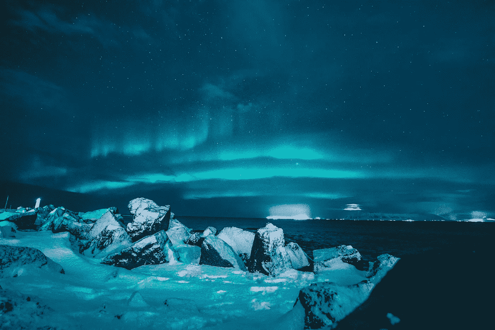

# 11 月版:艺术与数据科学

> 原文：<https://towardsdatascience.com/november-edition-art-data-science-4789c30da4ea?source=collection_archive---------21----------------------->

## 8 篇必读文章

我们当中可能很少有人没有看过一件艺术品并肃然起敬。我最近在芝加哥艺术学院时有机会体验了这一点。当我站在我一直以来最喜欢的画作之一，爱德华·霍普的《夜鹰》前时，我能感觉到这幅画散发出的原始能量包围着我，让我能与这位艺术家交流。在那次经历之后，我开始思考艺术的整体及其多种形式。

当被问及*“什么是艺术？”我总是倾向于直接把绘画、素描和摄影作为答案。但是我意识到我的定义太狭隘了。把艺术想象成任何视觉、听觉或表演的人工制品，它表达了艺术家的想象力和情感，同时在观察者身上产生了对人工制品的美和情感力量的欣赏，这就更全面了。唷！这个定义太拗口了！*

> "艺术使我们能够发现自我，同时又失去自我。"—托马斯·默顿

好消息是这个新的定义为数据科学打开了艺术的世界。我们可能没有想到这一点，但是我们写的每一行代码都可能是一件艺术品！即使事实并非如此，数据科学中的不同技术已经在艺术领域得到应用。本月的版本重点探索不同艺术领域的各种技术。我们从我的旧定义开始，看看绘画、素描和照片。图像处理的用途首先是介绍如何使用深度学习来检测赝品，这使我们能够在市场上开放艺术品供应以及推荐系统。从那里，我们访问神经类型转移，长期短期记忆模型，并将其应用于二维和三维图像。为了结束图像处理部分，我们来看看如何制作生成性对抗网络来创建新颖的图像。

最后三篇文章涵盖了不同的艺术领域:音乐、电影和设计。在我们对音乐的观察中，我们探索了基于艺术家音乐特征的聚类以及对这些特征的深入比较。使用自然语言处理技术来分析电影的字幕，以帮助作者学习一种新的语言。最后一篇文章使用卷积自动编码器创建了一个室内设计搜索引擎和一个草图到图像引擎，然后应用于时装和纺织品设计。我希望你和我一样喜欢这个选择！快乐学习！

[TDS 编辑助理 Andrew DeCotiis-Mauro](https://medium.com/u/242776f71170?source=post_page-----4789c30da4ea--------------------------------) 。

## [机器学习时代的艺术鉴赏](/art-connoisseurship-in-the-age-of-machine-learning-d72e8a3716df)

由[凯瑟琳黄](https://medium.com/u/4cb7815da390?source=post_page-----4789c30da4ea--------------------------------) — 5 分钟阅读

作为一名数据科学新手，我对真正的数据科学家如何解决现实世界的问题很感兴趣。阅读了 [Kaggles](https://www.kaggle.com/datasets?utm_medium=paid&utm_source=google.com&utm_campaign=datasets+houseads&gclid=CjwKCAjw14rbBRB3EiwAKeoG_xw3LTSbvufEcN4dPvWdhi3g_rtLGW8AiQGrGgaZC5QOHHmxu7dg5xoCehMQAvD_BwE&dclid=CNmNwp_HztwCFcQNNwode5IIdA) 上发布的许多挑战，我在寻找这些专家如何应对有趣比赛的见解。一个让我吃惊的挑战是[“数字画家”](https://www.kaggle.com/c/painter-by-numbers)挑战。它要求参赛者开发一个程序，可以识别同一位艺术家的画作。

## [用于艺术的数据科学、机器学习和人工智能](/data-science-machine-learning-and-artificial-intelligence-for-art-1ac48c4fad41)

由 [Vishal Kumar](https://medium.com/u/2390882c92aa?source=post_page-----4789c30da4ea--------------------------------) — 6 分钟阅读

数据科学、机器学习和人工智能是计算机科学中已经渗透到世界各地许多行业和公司的领域。它们的采用几乎肯定与过去十年“大数据”的兴起有关。

## [艺术家的人工智能](/ai-for-artists-part-1-8d74502725d0)

由[关明生·拉詹](https://medium.com/u/780fbbbc8f64?source=post_page-----4789c30da4ea--------------------------------) — 12 分钟读完

艺术和技术的历史总是交织在一起的。历史上发生的艺术革命是由制作作品的工具促成的。燧石刀的精确性使得人类能够用猛犸象象牙雕刻出第一批形象艺术作品。在当代，艺术家使用从 3D 打印到虚拟现实的工具，拓展了自我表达的可能性。

## [神经网络和 3D 程序内容生成的未来](/neural-networks-and-the-future-of-3d-procedural-content-generation-a2132487d44a)

由山姆·施奈德手持 — 8 分钟读取

作为全球制作机构 MediaMonks 的一名创意技术专家，人们总是问我关于人工智能、人工智能、神经网络等方面的问题。它们是什么？他们能做什么？我们如何使用它们？

## [甘戈:与甘戈一起创造艺术](/gangogh-creating-art-with-gans-8d087d8f74a1)

由[肯尼·琼斯](https://medium.com/u/1410705d2c04?source=post_page-----4789c30da4ea--------------------------------) — 13 分钟阅读

我们本学期学习 GAN 的主要动机是试图将 GAN 衍生的模型应用于小说艺术的生成。深度学习中与艺术生成相关的许多工作都专注于风格，特别是特定艺术作品的风格。

## [Spotify 的“这是”播放列表:50 位主流艺术家的终极歌曲分析](/spotifys-this-is-playlists-the-ultimate-song-analysis-for-50-mainstream-artists-c569e41f8118)

由詹姆斯·勒 — 15 分钟阅读

每个艺术家都有自己独特的音乐风格。从献身于木吉他的艾德·希兰，到精通说唱艺术的德雷克。从能在流行歌曲中唱一些疯狂高音的阿黛尔，到在 DJ 台上创造 EDM 魔术的 Kygo。音乐是关于创造力、独创性、灵感和感情的，它是跨越差异连接人们的完美门户。

## [Leuk Taal:通过数据科学(和艺术)学习一门新语言](/leuk-taal-learning-a-new-language-through-data-science-and-art-ecd579fd2ef0)

拉斐尔·皮埃尔 — 8 分钟阅读

当我开始学习荷兰语时，我惊讶地发现这种语言反映了荷兰人是多么的直接和客观。你很少会看到一个荷兰人为了掩饰而制造借口或修饰，或者假装喜欢某样东西或某个人。

## [des . ai . gn——用人工智能增强人类创造力](/des-ai-gn-augmenting-human-creativity-with-artificial-intelligence-bb6ff611fa2c)

由诺曼·迪·帕洛 — 6 分钟读完

人工智能和计算机科学讨论最多的一个方面是机器****是否有创造力**。这个讨论和第一台计算机一样古老，但是最近来自生成性对抗网络和类似架构的惊人结果确实使这个讨论变得更大。**

**我们也感谢最近加入我们的所有伟大的新作家，[杰瑞米·s·科恩](https://medium.com/u/3d2982bbbe81?source=post_page-----4789c30da4ea--------------------------------)，[罗伯特·桑德尔](https://medium.com/u/3b43a321fadd?source=post_page-----4789c30da4ea--------------------------------)，[德米特里·斯托罗申科](https://medium.com/u/5449510b172f?source=post_page-----4789c30da4ea--------------------------------)，[克里斯·鲍](https://medium.com/u/3e5d439e810b?source=post_page-----4789c30da4ea--------------------------------)，[拉塔马](https://medium.com/u/539b629a7a92?source=post_page-----4789c30da4ea--------------------------------)，[马克斯·盖尼斯](https://medium.com/u/11ca8872d783?source=post_page-----4789c30da4ea--------------------------------)，[法比奥·内维斯](https://medium.com/u/216b84c5c70f?source=post_page-----4789c30da4ea--------------------------------)，[斯泰西·罗纳根](https://medium.com/u/60a50d133053?source=post_page-----4789c30da4ea--------------------------------)，[比利·惠伦](https://medium.com/u/2170fd047ed6?source=post_page-----4789c30da4ea--------------------------------)，[萨提亚·努格拉我们邀请你看看他们的简介，看看他们的工作。](https://medium.com/u/14660cf28c17?source=post_page-----4789c30da4ea--------------------------------)**