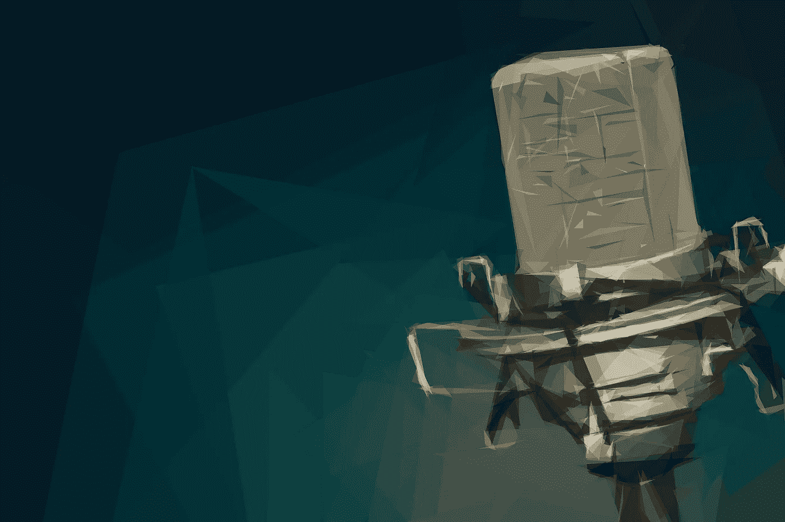

# 11 月版:语音识别

> 原文：<https://towardsdatascience.com/november-edition-speech-recognition-27159b2c44f5?source=collection_archive---------4----------------------->

## 6 篇必读文章

## [**通过 Tensorflow 识别声音来检测蝙蝠**](https://medium.com/towards-data-science/detecting-bats-by-recognising-their-sound-with-tensorflow-cdd5e1c22b14)

由[罗兰梅尔滕斯](https://medium.com/u/c366a0e1fdd4?source=post_page-----27159b2c44f5--------------------------------) — 10 分钟阅读。

上周我发现我的公寓后面有蝙蝠。我立即抓起我的“蝙蝠探测器”:一种将蝙蝠用来回声定位的超声波信号从听不见的频率范围转换成听得见的频率范围的装置。

## 你现在能听到我吗？远场语音

由 [Jerry Lu](https://medium.com/u/242a8d3b145?source=post_page-----27159b2c44f5--------------------------------) — 9 分钟读完。

在这篇文章中，我将研究价值链的第一步，语音信号的最初拾取，并找出创业公司可以成功的机会。

## [**教程:Python 中的异步语音识别**](https://medium.com/towards-data-science/tutorial-asynchronous-speech-recognition-in-python-b1215d501c64)

通过 [Pres Nichols](https://medium.com/u/e2d59faaf722?source=post_page-----27159b2c44f5--------------------------------) — 5 分钟读取。

一个(相当)简单的技术，用于使用 Google 有点儿有点儿令人困惑的语音识别 API

## [**tensor flow 中的音频处理**](https://medium.com/towards-data-science/audio-processing-in-tensorflow-208f1a4103aa)

由达里奥·卡扎尼 — 6 分钟读完。

在这篇文章中，我们将解释我们如何实现它，并提供代码，以便短时傅立叶变换可以在计算图中的任何地方使用。

## [**语音识别:懒狗入门**](https://medium.com/towards-data-science/speech-recognition-a-lazy-dog-primer-6504ab4dccaf)

由卢西恩·利塔 — 8 分钟读完。

我和一个好朋友最近在吃饭时聊起了语音识别应用。没错，我们就是*那些*人。隔着一张桌子，刻板的极客们对技术、创业和变革变得兴致勃勃。

## [**用 cleanNLP**](https://medium.com/towards-data-science/analyse-public-discourse-on-refugees-with-cleannlp-9719a29ed898) 分析关于难民的公共话语

由[汉娜韩嫣](https://medium.com/u/5b4607fd1f47?source=post_page-----27159b2c44f5--------------------------------) — 3 分钟阅读。

继上一篇文章[之后，我将分析](https://medium.com/@yanhann10/what-do-un-talks-about-when-it-talks-about-refugee-63140145ee54)[联合国难民署](http://www.unhcr.org/)演讲中以行动为导向的话语，并使用 r。

我们也感谢最近加入我们的所有伟大的新作家，[基里尔·叶列缅科](https://medium.com/u/6b467d74ac43?source=post_page-----27159b2c44f5--------------------------------)，[桑吉夫·阿格拉瓦尔](https://medium.com/u/20460ebc9636?source=post_page-----27159b2c44f5--------------------------------)，[拉塞尔·朱尔尼](https://medium.com/u/6b00541c45c8?source=post_page-----27159b2c44f5--------------------------------)，[费利克斯·莫尔](https://medium.com/u/330be7bbc79d?source=post_page-----27159b2c44f5--------------------------------)，[塔库马·塞诺](https://medium.com/u/20dc799c814e?source=post_page-----27159b2c44f5--------------------------------)，[马克西姆·扎克斯](https://medium.com/u/3c5928934a5e?source=post_page-----27159b2c44f5--------------------------------)，[海蒂·沃特豪斯](https://medium.com/u/8eccd4546a0d?source=post_page-----27159b2c44f5--------------------------------)，[乌戈·库普契奇](https://medium.com/u/5afa9fafe959?source=post_page-----27159b2c44f5--------------------------------)，[卡德·基拉里](https://medium.com/u/b9e689f6ec62?source=post_page-----27159b2c44f5--------------------------------)，[塞巴斯蒂安·金特罗我们邀请你看看他们的简介，看看他们的工作。](https://medium.com/u/984e841c8ae2?source=post_page-----27159b2c44f5--------------------------------)