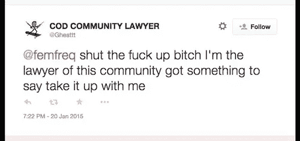
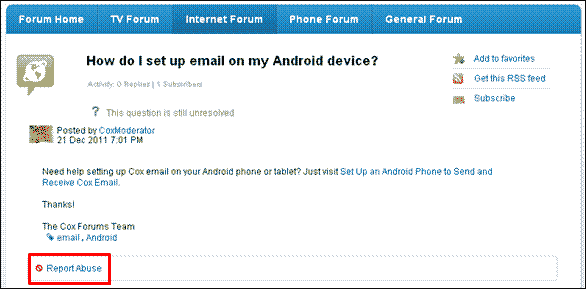
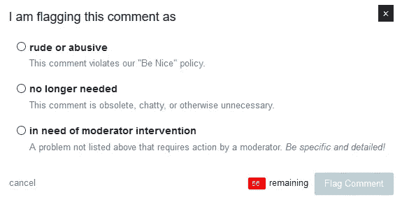

# 裸体检测和滥用内容分类器—研究和使用案例

> 原文：<https://towardsdatascience.com/nudity-detection-and-abusive-content-classifiers-research-and-use-cases-d8886bf624e8?source=collection_archive---------6----------------------->

Web 2.0 革命导致互联网上每天产生的内容爆炸式增长。社交分享平台，如脸书、推特、Instagram 等。他们的每日活跃用户数量增长惊人，但在监控用户生成的内容方面却一直处于分裂状态。用户在评论帖子时上传不适当的内容，如裸体或使用辱骂性语言。这种行为会导致欺凌和报复色情等社会问题，也会妨碍平台的真实性。然而，如今在线生成内容的速度如此之快，以至于几乎不可能手动监控所有内容。在脸书上，每 60 秒钟就有 13.6 万张照片被上传，51 万条评论被发布，29.3 万条状态被更新。在 ParallelDots，我们通过机器学习解决了这个问题，建立了一个算法，可以以非常高的精度对裸照(裸体检测)或辱骂内容进行分类。

在我们之前的一篇博客中，我们讨论了我们的文本分析 API 如何识别 twitter 上的垃圾邮件和机器人账户，并防止他们在 Twitter 分析中添加任何偏见。添加了另一个重要的内容审核工具，我们发布了两个新的 API——裸体检测 API 和滥用内容分类器 API。

# 裸体检测分类器

**数据集:**从不同的网站抓取裸照和非裸照建立数据集。我们从不同的裸体图片论坛和网站抓取了大约 200，000 张裸体图片，而非裸体人体图片则来自维基百科。因此，我们能够建立一个巨大的数据集来训练裸体检测分类器。

**架构:**我们选择了 2016 年[何等人](https://arxiv.org/abs/1512.03385)提出的 ResNet50 架构的分类器。从互联网上抓取的数据集被随机分为训练集[80%]、验证集[10%]和测试集[10%]。在训练集上训练的分类器和在验证集上调整的超参数的准确率略高于 95%。

# 滥用内容分类器

**数据集:**与裸体检测分类器类似，滥用分类器的数据集是通过从互联网(特别是 Twitter)收集滥用内容来构建的。我们确定了某些与辱骂性和攻击性语言相关的标签，以及其他与非辱骂性语言相关的标签。这些推文被进一步人工检查，以确保它们被正确分类。

**架构:**我们使用长短期记忆(LSTM)网络来训练滥用分类器。LSTMs 将句子建模为基于上下文的遗忘-记忆决策链。通过在 Twitter 数据上训练它，我们给了它一种能力，让它能够**理解含糊不清、写得很差、充满微笑和拼写错误的推文**，仍然能够理解内容的语义，并将其归类为辱骂。

# 让分类器发挥作用:内容审核的用例

辱骂内容和裸体检测分类器是从社交媒体源、论坛、消息应用等中过滤出此类内容的强大工具。在这里，我们将讨论这些分类器可以发挥作用的一些用例。

# 用户生成内容的提要

如果你拥有一个手机应用程序或网站，用户可以在上面积极地发布照片或评论，你将很难保持订阅源没有辱骂内容或裸照。**当前让用户标记这些内容的最佳实践是一项不可靠且耗时的任务**，需要一个人工版主团队来检查每个标记的内容并采取相应的行动。在此类应用上部署滥用和裸体检测分类器可以提高您处理此类内容的响应时间。一个完美的场景是，系统会将内容标记为不适当，并在内容进入公共提要之前提醒其中一个版主。如果版主发现内容被错误地归类为裸体检测或辱骂(误报)，她可以授权内容上线。这种机器增强的人类审核系统可以确保您的订阅源没有任何不适当的内容，并且您的品牌声誉保持完整。

# 论坛审核

最大的互联网发明之一是以观点、评论、问答等形式动态生成内容的能力。在论坛上。然而，这样做的一个缺点是，这些论坛经常充斥着垃圾邮件和辱骂性的内容，导致诸如欺凌等问题。在许多这样的论坛中，隐藏在匿名墙后面的这些内容会对青少年和学生造成灾难性的影响，常常导致自杀倾向。使用滥用分类器可以帮助你的论坛所有者缓和的内容，并可能禁止重复犯罪者的用户。

# 评论审核

类似于论坛审核，人们可以使用滥用分类器来保持博客的评论部分没有任何滥用内容。所有新闻媒体网站目前都在努力保持其内容的安全和不被滥用，因为它们涵盖了不同的争议话题，如移民、恐怖主义、失业等。保持评论区没有任何滥用或攻击性的内容是当今每个新闻出版商的首要任务之一，滥用分类器可以在打击这种威胁方面发挥重要作用。

# 众包数字营销活动

依靠众包内容的数字营销活动已被证明是一种非常有效的策略，可以推动品牌和消费者之间的对话，如 Dorito 的“粉碎超级碗”比赛。然而，消费者在这种竞赛中上传的内容必须被仔细监控，以保护品牌声誉。手动验证每个提交的内容可能是一项繁琐的任务，ParallelDots 的裸体检测分类器可用于自动标记裸体和辱骂内容。

# 过滤数字广告中的裸露内容

随着数字内容创作的爆炸式增长，广告交换越来越受欢迎，并且仍然是大多数博客、论坛、移动应用等的唯一盈利来源。然而，另一方面，有时主要品牌的广告会出现在含有裸露内容的网站上，损害了它们的品牌声誉。在一个例子中，农民保险的广告在一个叫 DrunkenStepfather.com 的网站上提供，这主要归功于基于交换的广告购买的增长。该网站的标语是“我们喜欢和漂亮的女孩一起玩”，并不适合投放农民保险广告。

广告交易所和服务器可以集成 ParallelDots 的裸体检测分类器 API，以识别裸体图片出版商或广告商，并在广告滚雪球般变成公关危机之前限制广告投放。

# 如何使用裸体检测分类器？

ParallelDots 的裸体检测分类器可以作为 API 与现有应用程序集成。该 API 接受一段文本或一幅图像，并实时地将其分别标记为滥用内容或裸露内容。上传一张图片[这里](https://www.paralleldots.com/nudity-detection)直接在浏览器里试试裸体检测 API。此外，检查滥用内容分类器演示，这是可用的[这里](https://www.paralleldots.com/abusive-content)。深入研究 [API 文档](https://www.paralleldots.com/docs/)中的裸体检测和滥用内容分类器，或者查看 GitHub repo，以您选择的语言开始使用 [API 包装器](https://www.paralleldots.com/api-wrappers)。

两个分类器都会为传递给它的内容计算一个 0 到 1 的分数。1 分意味着该内容最有可能是辱骂性的或裸体的，而接近 0 分意味着该内容可以安全发布。

[parallel dots AI API](https://www.paralleldots.com/)，是由 [ParallelDots Inc](https://paralleldots.xyz/) 提供的深度学习支持的 web 服务，可以理解大量的非结构化文本和视觉内容，为您的产品提供支持。您可以查看我们的一些文本分析[API](https://www.paralleldots.com/text-analysis-apis)和视觉智能[API](https://www.paralleldots.com/visual-analytics)，并通过填写此处[的表格](https://www.paralleldots.com/contact-us)或在 apis@paralleldots.com 给我们写信来联系我们。