# 用 Supervisely 和 Tensorflow 进行车牌检测(上)

> 原文：<https://towardsdatascience.com/number-plate-detection-with-supervisely-and-tensorflow-part-1-e84c74d4382c?source=collection_archive---------0----------------------->

深度学习现在被广泛使用。神经网络在计算机视觉任务中有许多有趣的应用。本教程将向您介绍如何用[supervisory](https://supervise.ly/)和 [Tensorflow](https://www.tensorflow.org/) 轻松构建车牌检测系统。

如果你没有听说过超级监管，你可以在我们的[介绍](https://medium.com/p/57b00f863040)帖子中了解更多。

本分步指南由两部分组成:

*   第 1 部分:在人工生成的数据上训练神经网络。
*   第 2 部分:在真实数据上微调神经网络。

所有资源都可以在 [github](https://github.com/DeepSystems/supervisely-tutorials) 获得。

# 什么是超级监管？

每个数据科学家都知道什么是 [Tensorflow](https://www.tensorflow.org/) 。几天前，我们在 [Deep Systems](https://deepsystems.ai/en/) 的团队发布了[supervised](https://supervise.ly/)，让开发者和研究人员更容易处理训练数据集。

现有技术的神经网络架构有许多开源实现。但是深度学习模型非常“数据饥渴”。

> “深度学习算法有许多参数需要调整，因此需要大量数据，以便提出某种程度上通用的模型。因此，从这个意义上说，拥有大量数据是为这些方法提供良好训练集的关键。”
> 
> Quora 工程副总裁 Xavier Amatriain。

众所周知，在大多数情况下，数据科学家将大部分时间花在训练数据准备上:

*   创建私有数据集
*   将它们与不同格式的几个公共数据集合并
*   添加各种数据扩充

而他在做这些的同时，很大概率会犯很多错误，或者在数据准备过程中做错一些事情。

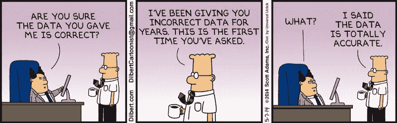

Source: [http://dilbert.com/strip/2014-05-07](http://dilbert.com/strip/2014-05-07)

和

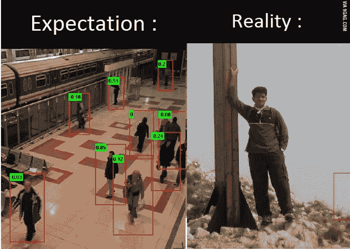

Source: [https://9gag.com/gag/aDoBnGK](https://9gag.com/gag/aDoBnGK)

超级解决这些问题。它提供了最佳的简单性和性能—它是一个基于 web 的框架，允许导入所有最著名的公共数据集，使用集成的注释工具创建自己的数据集，使用各种数量的扩展将数据集合并和导出为不同的格式等等。

在本教程中，我们将向您展示如何使用 Supervisely 来解决现实世界中的车牌检测任务。

# **预览训练数据**

用真实数据创建大型特定任务数据集几乎总是既困难又昂贵。通常的做法是在可能的情况下生成人工数据集。

幸运的是，我们可以为我们的任务做到这一点。出于教学目的，我们生成了 10k 图像数据集，在带有噪声、小旋转和不同比例的随机背景上带有号码牌。为了简单起见，我们将使用灰度图像。这个数据集可以在 Supervisely 的数据集库中免费获得。

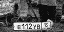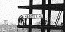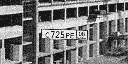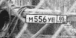

Here are the few examples of artificially generated images with number plates.

要开始使用该数据集[，请创建](https://app.supervise.ly/signup)或[登录](https://app.supervise.ly/login)进入 [Supervise.ly](https://supervise.ly) 账户。

注册后，您将在您的帐户中看到以下内容:

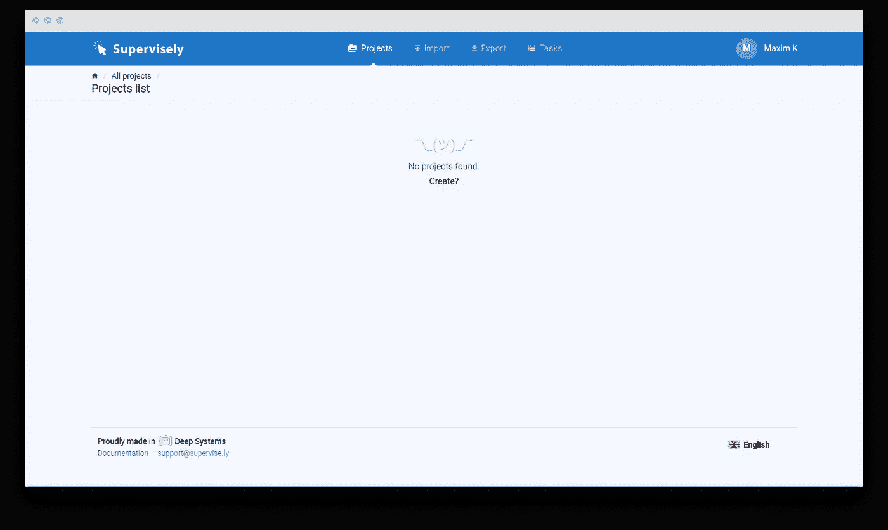

要开始使用“牌照”数据集，请单击“导入”选项卡，然后单击“数据集库”子选项卡。在此页面上，您可以看到可用现成数据集的列表(该列表将被积极丰富)。

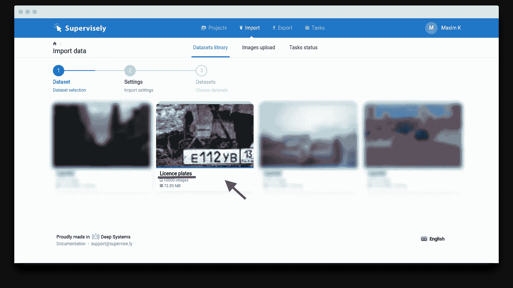

让我们点击“车牌”数据集。下一步是为创建的项目键入名称。姑且称之为“Anpr 教程”:

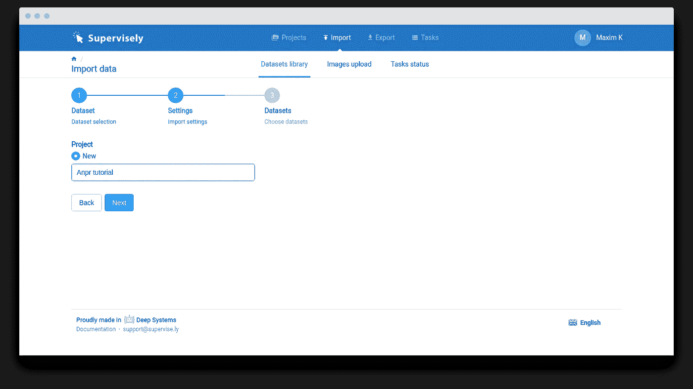

然后点击“下一步”按钮。选择所有复选框，然后单击“上传”。

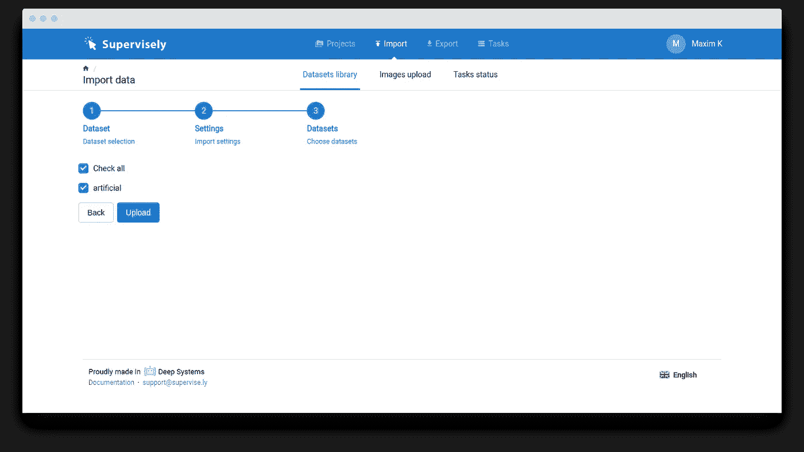

您将被重定向到任务列表。从数据集库中导入数据集的任务将在几秒钟内完成。

现在你可以点击主菜单中的“项目”标签。你会看到项目“Anpr 教程”(左图)里面有单个数据集“人造的”(右图):

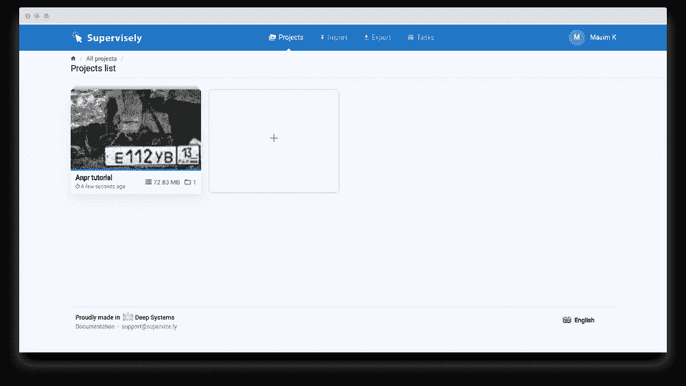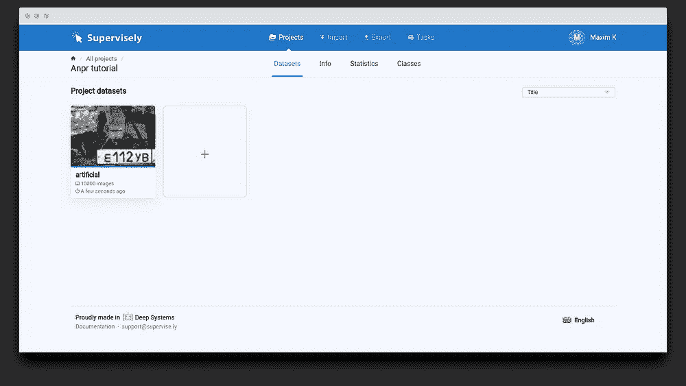

单击数据集打开注记工具。下面的 gif 展示了注释器工具的一些功能。在本教程中，我们将只使用它来预览图像。

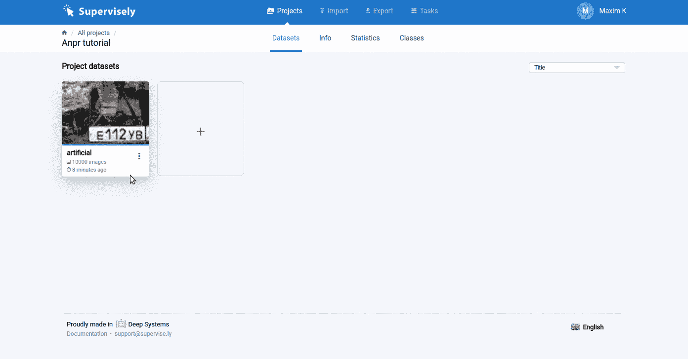

所以。现在我们有一个数据集的帐户和项目。在我们进行模特训练之前，只剩下一步了。我们应该导出这个数据集。

# **导出培训数据**

在我们开始之前，让我说几句关于数据集导出功能的话。当我们设计神经网络时，我们从计算图的角度来考虑它。这是流行的深度学习框架背后的核心抽象。计算图由数学运算和变量组成。

我们开发了强大的数据集导出工具，该工具提供了用计算图形配置导出的可能性。我们可以定义将应用于所选数据集中每个图像的操作顺序。

只需单击主菜单中的“导出”选项卡，然后将 json 配置(如下所示)粘贴到文本框中。

```
[
  {
    "dst": "$sample01",
    "src": [
      "Anpr tutorial/artificial"
    ],
    "action": "data",
    "settings": {
      "classes_mapping": {
        "Licence plate": "plate"
      }
    }
  },
  {
    "dst": "$sample_bb",
    "src": [
      "$sample01"
    ],
    "action": "bbox",
    "settings": {
      "classes_mapping": {
        "plate": "plate_bbox"
      }
    }
  },
  {
    "dst": [
      "$sample_train",
      "$sample_test"
    ],
    "src": [
      "$sample_bb"
    ],
    "action": "if",
    "settings": {
      "condition": {
        "probability": 0.98
      }
    }
  },
  {
    "dst": "$train_tagged",
    "src": [
      "$sample_train"
    ],
    "action": "tag",
    "settings": {
      "tag": "train",
      "action": "add"
    }
  },
  {
    "dst": "$test_tagged",
    "src": [
      "$sample_test"
    ],
    "action": "tag",
    "settings": {
      "tag": "test",
      "action": "add"
    }
  },
  {
    "dst": "artificial_samples",
    "src": [
      "$train_tagged",
      "$test_tagged"
    ],
    "action": "save",
    "settings": {
      "images": true,
      "annotations": true
    }
  }
]
```

系统会自动在右侧生成这样的图:

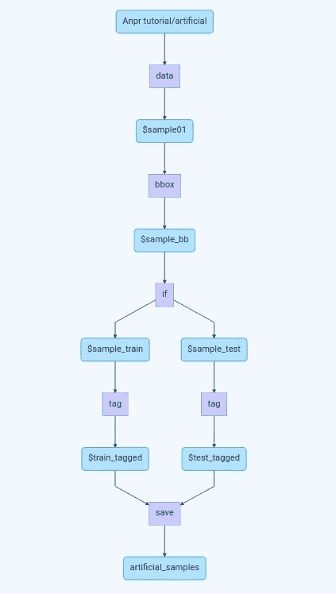

让我们看一下我们的例子。蓝框是数据变量，紫框是操作。关于所有可用导出层的详细说明，您可以在这里找到。

在本例中，我们从项目“Anpr 教程”的数据集“人造”中获取图像。此数据集的所有标注都是多边形，因此我想将它们转换为边界框。在这种情况下，它并不重要，但在其他教程中，例如，当我们从 Cityscapes 数据集导出汽车和行人周围的边界框时，它将非常有用(所有注释都显示为多边形)。

然后我们分割数据集进行训练和测试。每个图像以 98%的概率落入训练集中。此后，所有训练图像将保存为标签“测试”，所有测试图像-标签为“测试”。

好吧，让我们点击“开始导出”按钮。您将被重定向到包含导出任务的页面。等待几秒钟，直到“人工样本”任务完成。


现在，您可以单击“三点”按钮或“下载”图标，下载包含培训/测试图像和注释的结果档案。

该档案的结构如下:

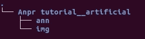

让我们看看它是什么。整体存档是项目，“Anpr 教程 _ _ 人工”是数据集。“img”目录包含图像，“ann”目录包含 json 格式的每个图像的注释。

# **训练模型**

*需求*:安装了 GPU 和 docker 的电脑。

首先，我们应该通过键入以下命令来克隆教程存储库:

```
git clone [https://github.com/DeepSystems/supervisely-tutorials.git](https://github.com/DeepSystems/supervisely-tutorials.git) && cd supervisely-tutorials/anpr
```

之后，将下载的数据集提取到“数据”目录。您应该得到以下“数据”目录结构:

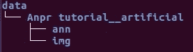

现在让我们转到“docker”目录。它包含 Dockerfile 和两个用于构建映像和运行容器的脚本。在“anpr/docker”目录中运行以下命令:

```
./build.sh
./run.sh
# now you are inside the container.
jupyter notebook
```

“jupyter notebook”命令的输出如下:

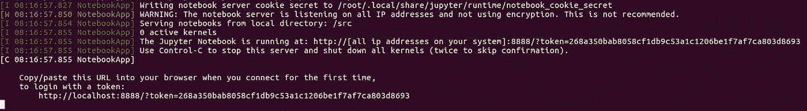

只需复制最后一个链接并粘贴到浏览器。您链接中的令牌将与我的不同。在您的浏览器中，您将看到:

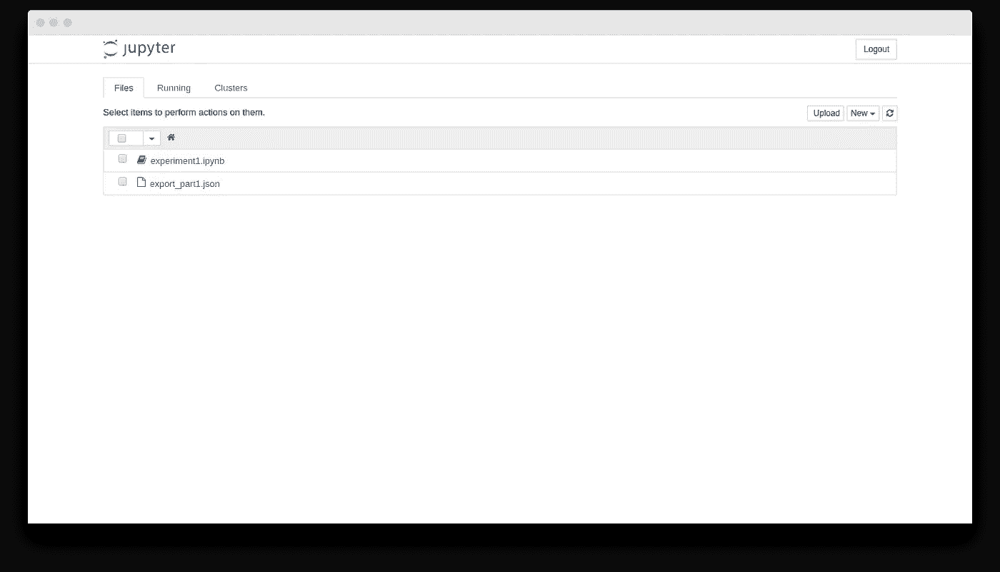

我们打开“experiment1.ipynb”吧。点击“单元格->全部运行”。该示例将:

*   加载所有训练和测试数据
*   可视化一些带有注释的随机图像
*   训练神经网络并保存到“数据/模型 _artif”
*   加载模型并在随机测试图像上进行测试
*   随机训练图像上负载模型和测试

单元格[12]的输出如下。它只是可视化一些随机图像及其来自训练集的注释。

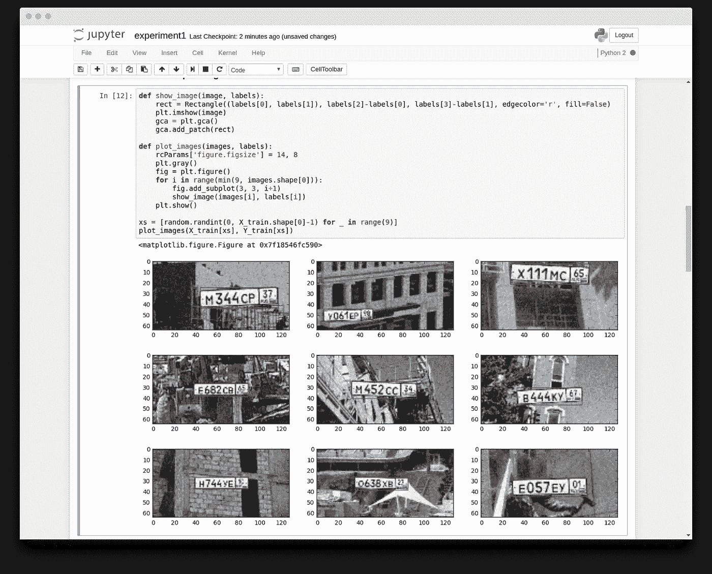

然后模型训练 20 个纪元。输出应该是这样的:

```
Epoch: 0, Score: 632.081665, Epoch per minute: 0.000000
Epoch: 1, Score: 0.031625, Epoch per minute: 7.076456
Epoch: 2, Score: 0.020695, Epoch per minute: 7.555644
Epoch: 3, Score: 0.015778, Epoch per minute: 7.724735
Epoch: 4, Score: 0.011812, Epoch per minute: 7.804142
Epoch: 5, Score: 0.007921, Epoch per minute: 7.864671
Epoch: 6, Score: 0.005887, Epoch per minute: 7.877275
Epoch: 7, Score: 0.003385, Epoch per minute: 7.888540
Epoch: 8, Score: 0.002968, Epoch per minute: 7.895694
Epoch: 9, Score: 0.002555, Epoch per minute: 7.902217
Epoch: 10, Score: 0.002133, Epoch per minute: 7.925616
Epoch: 11, Score: 0.001715, Epoch per minute: 7.935624
Epoch: 12, Score: 0.001581, Epoch per minute: 7.936112
Epoch: 13, Score: 0.001396, Epoch per minute: 7.969603
Epoch: 14, Score: 0.001210, Epoch per minute: 7.999257
Epoch: 15, Score: 0.001140, Epoch per minute: 8.019996
Epoch: 16, Score: 0.001603, Epoch per minute: 8.059043
Epoch: 17, Score: 0.001414, Epoch per minute: 8.080978
Epoch: 18, Score: 0.001150, Epoch per minute: 8.102449
Epoch: 19, Score: 0.001129, Epoch per minute: 8.097572
Epoch: 20, Score: 0.001273, Epoch per minute: 8.128981
Epoch: 21, Score: 0.001324, Epoch per minute: 8.141784
Epoch: 22, Score: 0.000929, Epoch per minute: 8.133494
Epoch: 23, Score: 0.001333, Epoch per minute: 8.143423
Epoch: 24, Score: 0.000930, Epoch per minute: 8.146000
Epoch: 25, Score: 0.000900, Epoch per minute: 8.138766
Epoch: 26, Score: 0.000948, Epoch per minute: 8.148882
Epoch: 27, Score: 0.000853, Epoch per minute: 8.138941
Epoch: 28, Score: 0.001174, Epoch per minute: 8.148271
Epoch: 29, Score: 0.000871, Epoch per minute: 8.154097
Epoch: 30, Score: 0.000740, Epoch per minute: 8.143948
Finished in 221.023122 seconds.
```

之后，加载保存的模型并预测随机测试图像的边界框。这里我们可以看到模型做得很好。

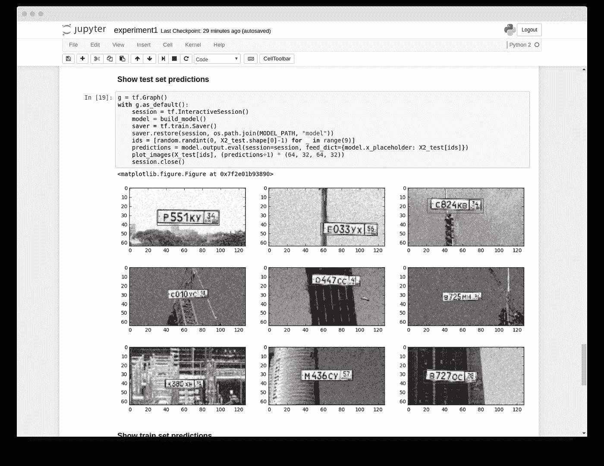

让我们看看随机列车图像上的模型预测。该模型完美地预测了火车图像的包围盒。

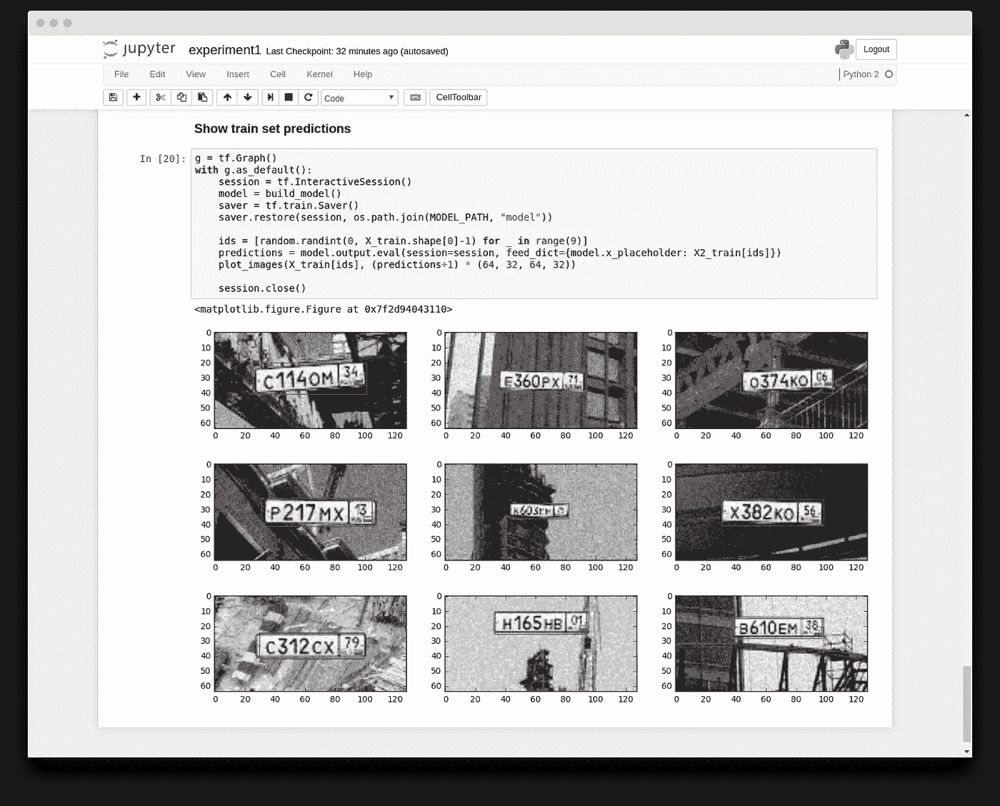

我希望你一切顺利。如果没有，欢迎在评论中提问。

现在，我们来详细看看一些脚本部分。我想简要讨论两个关键时刻:

*   我如何处理来自主管的培训数据
*   神经网络体系结构

在接下来的教程中，了解注释格式将非常有用。对于每个图像，我们都有 json 文件。这里有一个例子:

```
{
    "name": "00009975_H314CO08",
    "tags": [ ],
    "objects": [
        {
            "classTitle": "plate",
            "description": "",
            "tags": [
                "H314CO08"
            ],
            "bitmap": *null*,
            "points": {
                "interior": [ ],
                "exterior": [
                    [
                        32,
                        24
                    ],
                    [
                        32,
                        40
                    ],
                    [
                        95,
                        40
                    ],
                    [
                        95,
                        24
                    ]
                ]
            }
        }
    ],
    "size": {
        "width": 128,
        "height": 64
    }
}
```

这个 json 文件只包含一个 json 对象。现在，我将向您解释一些字段:

*   【名称】:对应的图像名称
*   “标签”:图像标签(字符串数组)。
*   “size”:以像素为单位的具有图像“宽度”和“高度”的对象。
*   “objects”:给定图像的注释数组。

注释对象的字段:

*   “classTitle”:对象类名。它本教程我们只有一个类，它是“板”。但是在我们的[其他教程](https://github.com/DeepSystems/supervisely-tutorials)中，你将使用多个职业。
*   “tags”:给定对象的字符串标记数组。在这里我们可以看到，我存储地面真相号码牌文本有机会在未来做光学字符识别。
*   “点”:具有两个字段的对象。管理存储特定格式的对象。“外部”场是对象的外部轮廓。“内部”场是孔轮廓的阵列。

现在是讨论神经网络架构的好时机。这个网很小，但它可以很容易地检测出我们任务中的车牌，而且质量很好。此外，该模型速度非常快，可以在嵌入式设备上使用。

下面是网络计算图的示意图:

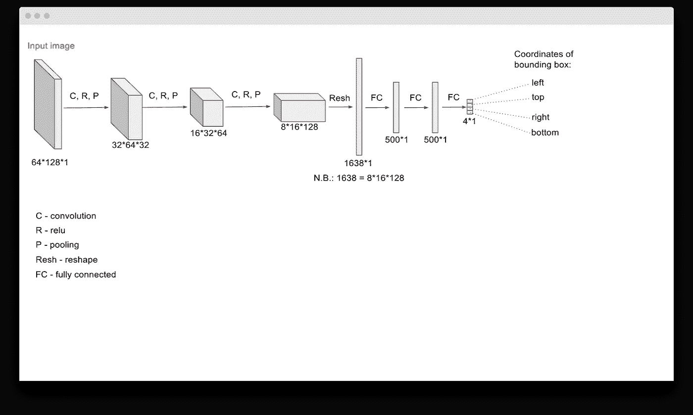

模型非常简单:它是基本卷积、relu 和池操作的序列，最后是几个完全连接的层。模型预测车牌包围盒的坐标。

# **结论**

在这部分教程中，我们已经向您展示了如何使用 Supervisely 和 Tensorflow 轻松构建车牌检测系统。我们使用人工生成的数据来训练简单但有效的神经网络。

在本教程的下一部分，我们将在真实数据上微调我们的模型。这种两阶段训练是深度学习研究人员的常见做法。

详细讲解如何使用 Supervisely 进行训练数据准备，有助于我们在以后的教程和日常工作中进行数据处理。

欢迎在评论中提出任何问题，并订阅我们的博客。我们将定期添加新的教程和最新神经网络架构的解释。

谢谢大家！