# 数值积分:龙贝格积分

> 原文：<https://towardsdatascience.com/numerical-integration-romberg-integration-3f54002ab538?source=collection_archive---------3----------------------->

## 使用数值方法积分

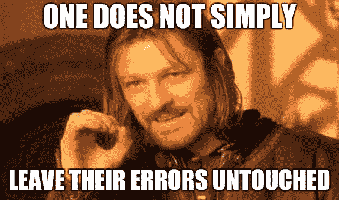

我欣赏这种整合的概念，主要是因为在我们在课堂上讨论的方法中，这是唯一一种考虑消除其错误的方法。虽然不是全部，但淘汰真的很有帮助。

首先，让我们也用自顶向下的方法来处理这个问题。我们一般先讨论数值积分，然后再讨论龙贝格积分。

# 数值积分

## 历史背景

要得到名字背后的原因，这个是需要的部分。

数值积分也被称为“数值积分”或“定积分的数值逼近”。它的名字来自古代计算曲线图形面积的方法，其中最著名的是“圆的平方”问题，这意味着找到一个与给定圆面积相同的正方形。

## 主要动机

顾名思义，数值积分就是对一个函数进行积分。然而，我们不是已经会积分了吗(还记得数学 50 系列)？对，但也要记住，我们用公式来积分，并不是所有必须积分的函数都可以用这些公式来积分。他们只是普通的特例。

通过公式不可积分的积分的例子有:

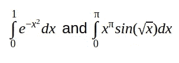

它们可能看起来很简单，不像拥挤积分那样疯狂，但是它们仍然超出了我们以前学过的特殊公式的范围。

## 假设和答案的性质

我们设定假设，所以我们不会一次又一次地讨论它们。还有，答案的本质，明确我们应该期待什么样的答案。

**假设:**

1.  一般认为积分的区间是有限的
2.  在很大程度上假设被积函数‘f’是连续光滑的

**答案性质:**“我们寻求单一数字的答案”

这意味着我们不是在寻找一个函数或者一个符号公式。这将数值求积与微分方程的解、不定积分的计算以及许多符号计算的软件包区分开来。

最后一件事之前，移动过渡到龙贝格。众所周知，积分是一个无穷和。我们在这里做的是用一个有限和来逼近一个无限和。

现在我们过渡到龙贝格。

假设在跳到这里之前，已经掌握了复合梯形法则的知识。尽管我们在下面讨论另一个先决条件。

# 先决条件:理查森推断

## 主要思想

Richardson 外推法主要是一种提高某些数值方法精度的简单方法。这个可以消除错误。虽然它只能消除以下形式的错误:

## 理查森外推一般形式的推导

这一部分将说明如何通过理查森外推法消除误差。

**假设:**

1.  我们有一个近似的方法来计算某个量 G
2.  结果取决于参数“h ”,因此 g(h)的近似值由下式给出:G = g(h) + E(h)

**正确推导:**

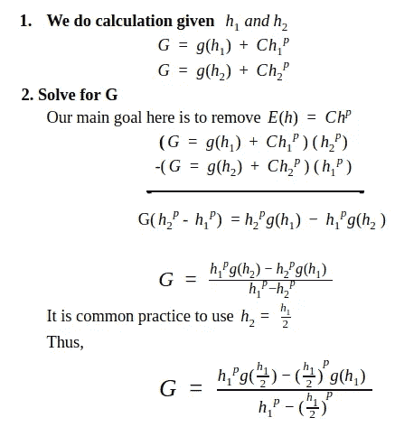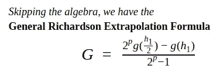

# 方法:龙贝格积分

既然我们已经建立了先决条件，让我们进入主要的事情。

**龙贝格整合**

龙贝格积分法结合了复合梯形法则和理查森外推法。

下面是集成过程的概述:

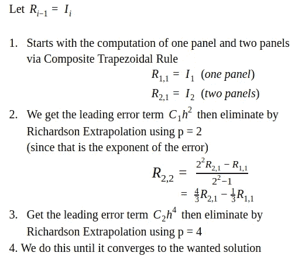

这正是我们正在做的

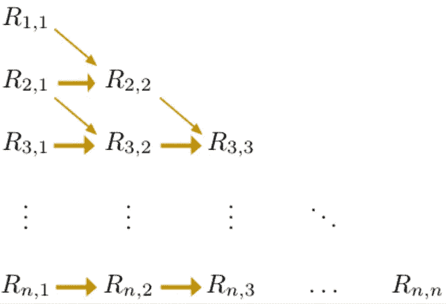

这告诉我们，我们需要计算两个箭头从哪里来，来计算两个箭头指向哪里。积分的最精确估计总是数组的最后一个对角线项。这个过程一直持续到两个连续对角线项之间的差变得足够小。

以上概述可以总结为公式:

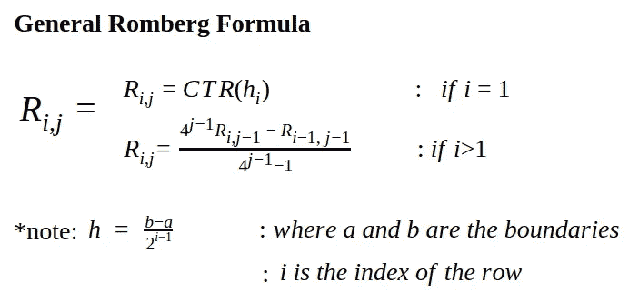

*   CTR 的意思是复合梯形法则

## 用 Romberg 积分求积分

放下所有需要的工具后，我们展示如何使用它们。我们先给出一个例子，然后我们给出*建议的*一般过程

**举例:**

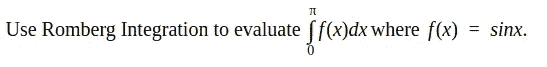

首先，我们得到所有的工具(公式):

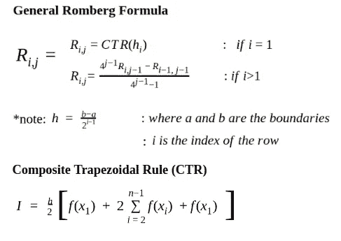

然后我们得到了上面的矩阵 R，因为这是我们将要填写的

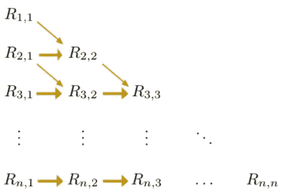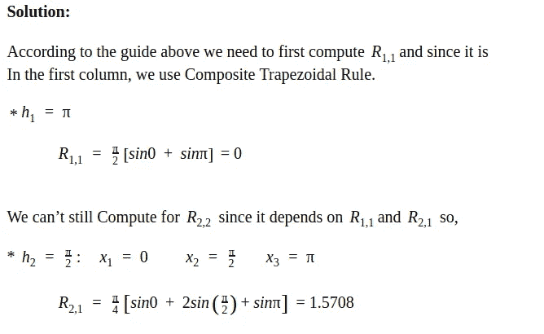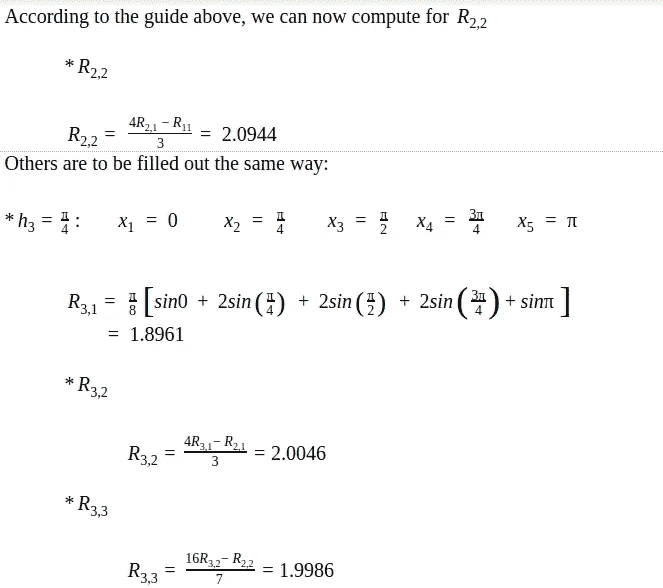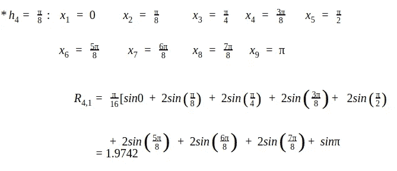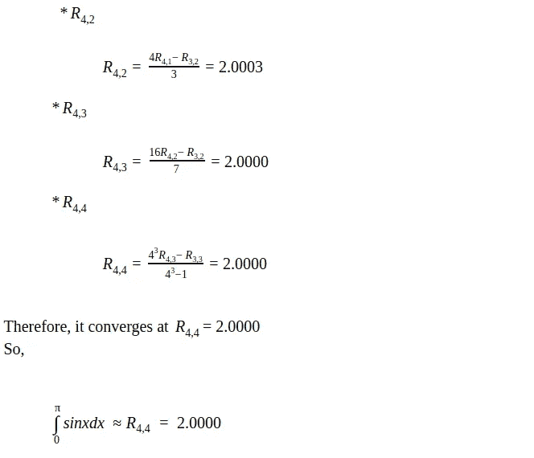

## **一般流程**

因此，我们实际上可以看到*建议的*解决方案模式。我们总结如下:

**挑战:**使用龙贝格积分计算积分

**需要公式:**复合梯形法则和龙贝格

**流程:**

提示:拿着另一张包含矩阵 R 的纸

1.  计算 h
2.  使用 CTR 计算前两行的第一列
3.  对于 i>1，使用 Romberg 公式计算该行中的下一列
4.  对每一行重复步骤 1-3，直到它收敛到所需的解决方案。

# 总的来说，

数值积分只是积分的近似，对于不能用特殊公式计算的积分是有用的。其中一种方法是龙贝格积分。从课堂上教授的方法中可以看出，这是通过使用 Richardson 外推法消除误差的唯一方法(尽管不是所有误差都被消除),如推导中所示。

尽管复合辛普森的 1/3 规则胜过复合梯形规则和 Rombeg，但 Romberg 仍然保持着高效的王牌，并且还采用了复合梯形规则的稳健性。