# 数值插值:自然三次样条曲线

> 原文：<https://towardsdatascience.com/numerical-interpolation-natural-cubic-spline-52c1157b98ac?source=collection_archive---------2----------------------->

## 探索分段插值的强大功能

Photo by [Mitchell Luo](https://unsplash.com/@mitchel3uo?utm_source=medium&utm_medium=referral) on [Unsplash](https://unsplash.com?utm_source=medium&utm_medium=referral)

当我第一次听说这个方法时，我被它迷住了，尤其是它的推导过程。这篇文章将向你展示我是如何破解它并使它变得更简单的。我们将使用**自上而下的方法**,确保你在阅读的时候能够更好地理解它。

# 数值插值

> 简而言之，它要求:
> 
> 我们如何使用一个函数来拟合所有这些数据点呢？

我们所指的函数也叫做*插值函数*或*插值函数*。

## 插值、近似和曲线拟合之间的区别

插值通常与逼近和曲线拟合相混淆。它们之间差异的关键在于它们与数据的吻合程度以及使用的适当性。

**插值与逼近**

在插值中，你精确地拟合**所有的**数据点，而近似，顾名思义，就是**近似**。

就适当性而言，内插法适用于平滑此类噪声数据，而不适用于数据点易受实验误差或其他重大误差源影响的情况。拥有大量数据点也会增加插值的负担。另一方面，近似主要适用于计算特殊函数的库例程的设计。这是由这些函数的性质决定的——精确的值被认为是不重要的，并且在某种程度上，当近似值起作用时是低效的。

**插值与曲线拟合**

在曲线拟合中，我们**不会拟合所有的**数据点。这就是为什么我们有残差的概念。在插值中，它强制函数**拟合所有**数据点。

现在我们知道我们在谈论哪一类，让我们缩小到用于插值的函数族。

# 用于插值的函数族

(2)这里考虑的两个函数族:

1.  多项式内插法
2.  分段插值

**扰流板**:自然三次样条正在进行分段插值。但是让我们稍后解释这两种方法来欣赏它们。

## **1。多项式插值**

多项式插值是最简单也是最常见的插值类型。它的一个特点是总是有一个最多 n-1 次的唯一多项式通过 *n* 个数据点。

有许多方法来计算或表示一个多项式，但它们归结为同一个数学函数。一些方法是单项基，拉格朗日基和牛顿基。正如你所注意到的，它们是以它们的基础命名的。

**弊端:**

1.  高次多项式→适当选择基函数和插值点可以减轻与高次多项式相关的一些困难
2.  过度拟合→将单个多项式拟合到大量数据点，这可能会在插值函数中产生不令人满意的振荡行为

随着不同方法的诞生，分段插值解决了这些复杂问题。

## 2.分段插值

分段插值通过用低次多项式拟合大量数据点来解决这些问题。由于我们只使用低次多项式，我们消除了过度的振荡和不收敛。

**一般概念:**给定一组数据点，在每个区间使用不同的多项式，这样我们在连续的点上插入几个插值。这就是为什么会有诸如结、断点或控制点之类的术语——这些是插值函数从一个多项式变为另一个多项式的横坐标。

**主要关注:**似乎牺牲了插值函数插值的光滑性，使得图形可能有“拐角”，这意味着导数在这些点处是不连续的。

**目标:**考虑到所有这些概念和主要关注点，我们的目标是找到一个平滑的插值函数，并且在节点之间没有太大的变化。

*既然我们已经讨论了自然三次样条的归属，因此该方法也应该继承所有这些一般特征。我们现在讨论下面的方法。别担心，我们会理解我们将要讨论的每一部分。*

# **方法:自然三次样条**

**一、为什么叫自然三次样条？**

**‘Spline’—**这个只是指 k 次的分段多项式 *k 次*连续可微 k-1 次

从那以后，

**‘自然三次样条’—**是一个**分段三次多项式**，它是两次连续可微的。它比多项式“硬”得多，因为它在数据点之间不太容易振荡。

仍然没有任何意义吗？让我们将它形象化，并解释我们稍后将通过机械模型使用的零件的数学术语。

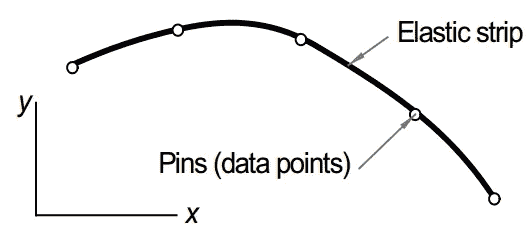

figure from: Numerical Methods in Engineering with Matlab, 2ed by Jan Kiusalaas

让我们想象一下，有一个弹性条钉在软木板上。现在介绍要点:

1.  **段:**样条曲线的每一段都是三次多项式。
2.  **在销钉处:**斜率(一阶导数)和弯矩(二阶导数)是连续的
3.  **在端点:**没有弯矩。在数学语言中，这意味着样条在端点的二阶导数为零。由于这些端点条件在梁模型中自然出现，因此生成的曲线称为自然三次样条曲线。
4.  **图钉:**代表数据点或后面公式中使用的术语**【结】**

现在我们已经清楚了一般的概念，让我们把这些概念具体化。我们用推导来说明它是如何产生的。

**二。推导**

*这个比较长，但是对于懂导数和积分的人来说是可以理解的。*

**答:大图**

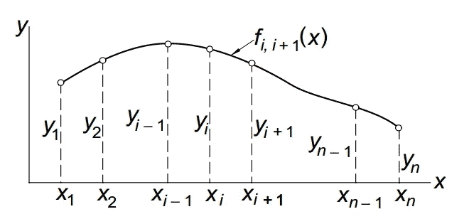

figure from: Numerical Methods in Engineering with Matlab, 2ed by Jan Kiusalaas

其中有 *n 个节点(k 个)*是数据点(x，y)，f 是两个节点之间的插值。

由于我将数学视为建模，我们从插图开始。这将作为具体告诉我们要解释什么，也是我们的地图，而我们做推导。

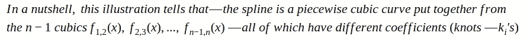

**B .要求**

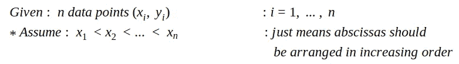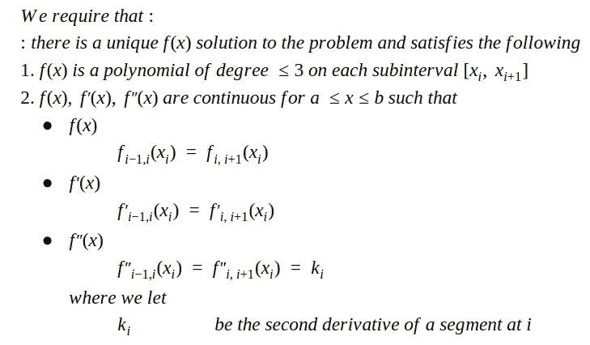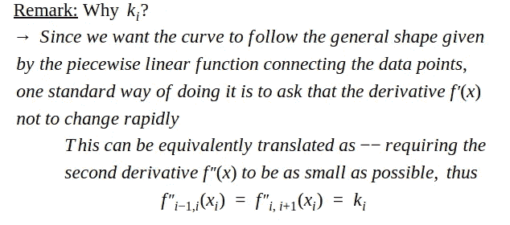

**C .引出适当的**

正确的推导由两部分组成——每一部分得出一个方程——我们将使用它并在计算中发挥重要作用。

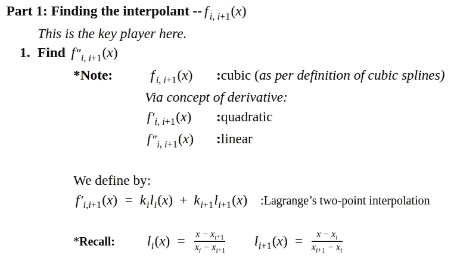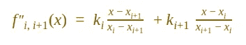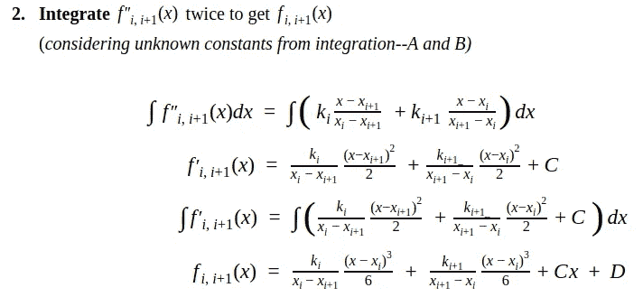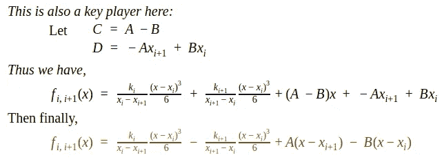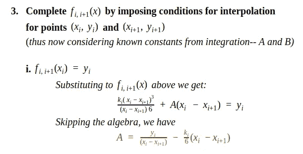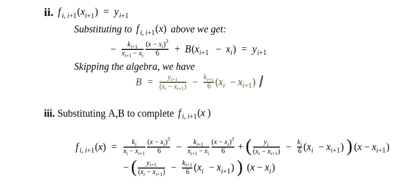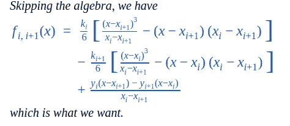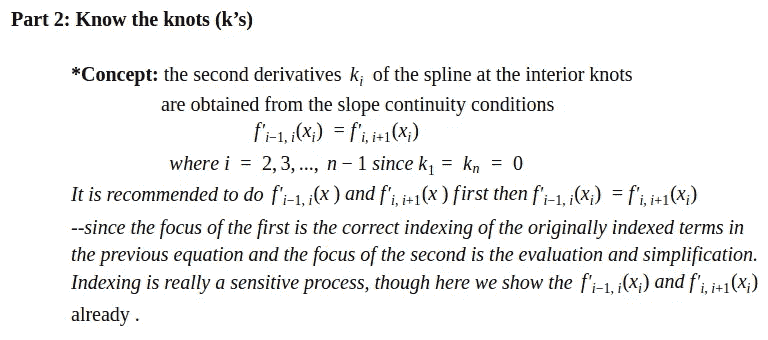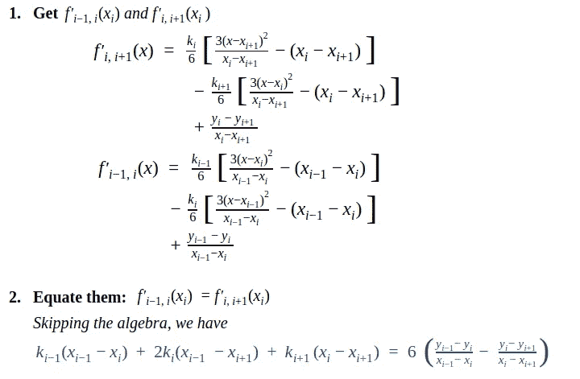

有了所需的公式后，我们展示如何使用它们。

**三。怎么用它做插值？**

我们通过一个例子来说明它的用法，然后概括这个过程。

**例#1:** 用自然三次样条确定 x = 1.5 处的 y。数据点如下:(2，1)，(1，0)，(5，0)，(3，0)，(4，1)

**解决方案:**

我们首先明白它想要什么。它的主要要求是—使用自然三次样条函数为包含 x = 1.5 的线段找到一个插值函数，该插值函数将对给定的所有数据点进行插值，并知道其对应的 y 坐标。

或者以更简单的方式:(1)插值函数(2) y 在 x=1.5 时

我们首先得到我们的公式:

*用于插值器*

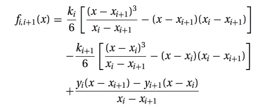

*为绳结*

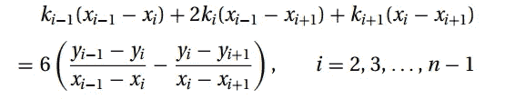

我们必须重新排列这些值来简化这个过程

:(1, 0), (2, 1), (3, 0), (4,1), (5,0)

然后我们知道具体的结

注意:k1=k5=0，所以我们只考虑 i=2，3，4

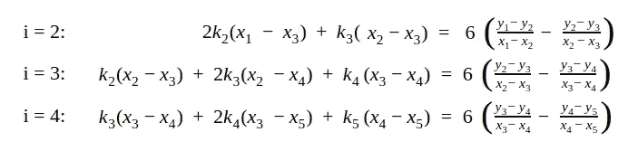

然后我们替换相应的值，这样:

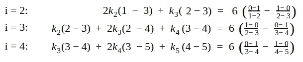

这又产生了一个线性方程组:

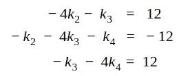

结可以通过求根技术消除、替换、高斯消除、LU 分解等来解决。

我们在这里使用高斯消去法:

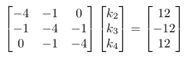

*跳过我们的详细计算:*

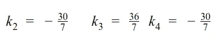

然后我们知道焦点在 x = 1.5 时得到 y

我们发现 x 在哪个纽结中:1.5 在 x1 = 1 和 x2 = 2 之间

因此，我们使用第一个和第二个结，使得:

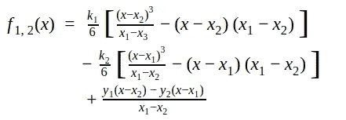

替代我们的价值观:

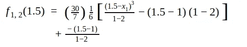

因此，

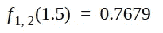

现在我们已经看到了它是如何工作的，我们推广这个过程，给出一个使用自然三次样条找到某个 x 处的 y 的问题的解决方案。

**一般流程:**

*必须被视为一个建议而已。有很多方法可以做到这一点。*

**给定:**数据点

**求:**插值函数 fi，i+1(x)在某 x 处考虑 y。

**流程:**

* **第一个主要步骤:配方和准备**

我们将需要这些公式，所以最好在开始计算之前解决所有的公式:

1.  为了绳结

2.对于分段的插值函数

3.确保横坐标(x 坐标)按升序排列，因为我们考虑的是每段的功能。

***第二个主要步骤:使用上述公式 1** 求解结(k)

1.  I 的替代
2.  替换整个值
3.  形成线性方程组后，从 i=2，3，…，n-1 得到纽结

***第三个主要步骤:求解 fi，i+1(x_c)**

1.  首先找出 x_c 属于哪个结
2.  得到 fi，i+1(x)
3.  得到 fi，i+1(x_c)

# 总的来说，

可以说自然三次样条是一种非常有趣的插值方法。我们知道插值是用一个函数来拟合所有给定的数据点，我们知道多项式插值在某些时候可以只使用一个多项式来完成这项工作。当我们只考虑低次多项式时特别有用，但对于高次多项式，过度拟合潜伏在深处，产生不需要的振荡，不能提供任何对数据的洞察。一个可取之处是分段插值，它使用不同的低次多项式，这对于大型数据集特别有用。可以看出，在分段实现中有更多的工作要做，但是考虑到大数据集的方法的复杂性超过了相当长的实现。

参考资料:

JM·索里亚诺爵士的 CS131 课堂讲稿

米（meter 的缩写））希斯。科学计算:介绍性调查。

K.阿特金森和韩。初等数值分析。

J.基乌斯拉斯。用 Matlab 实现工程中的数值方法。