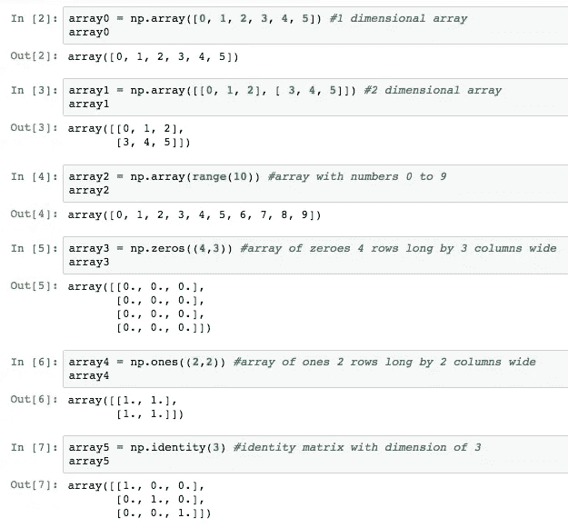
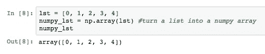
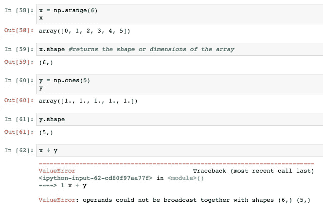
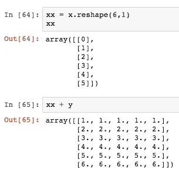
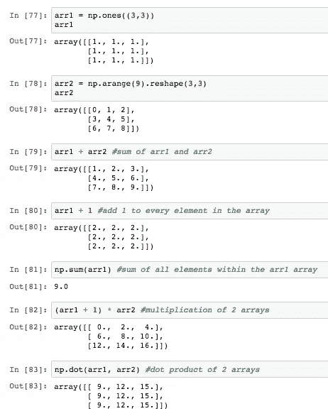
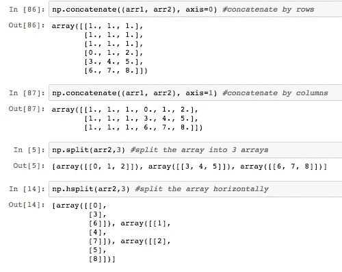
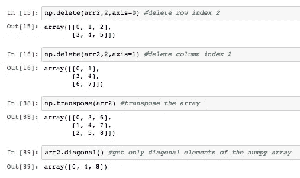
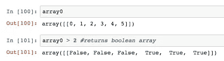
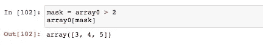
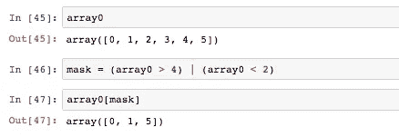

# 为赶时间的人准备的数字指南

> 原文：<https://towardsdatascience.com/numpy-guide-for-people-in-a-hurry-22232699259f?source=collection_archive---------14----------------------->


Photo by [Chris Ried](https://unsplash.com/@cdr6934?utm_source=medium&utm_medium=referral) on [Unsplash](https://unsplash.com?utm_source=medium&utm_medium=referral)

NumPy 库对于数据科学家来说是一个重要的 Python 库，您应该熟悉它。Numpy 数组类似于 Python 列表，但要好得多！操纵 Numpy 数组比操纵 Python 列表容易得多。您可以使用一个 Numpy 数组来代替多个 Python 列表。Numpy 数组的计算速度也比列表快，在执行数学和逻辑运算时效率极高。这是一个强大的工具知道！

本文是一个快速的备忘单，提供了 Numpy 基础知识的概述以及有用的方法。我将介绍如何以多种方式初始化 Numpy 数组，访问数组中的值，执行数学和矩阵运算，以及使用数组进行屏蔽和比较。**我发现 Numpy 数组在解决 Python 编码难题时非常有用。**

让我们开始玩吧。

# Numpy

首先，您必须用下面的代码导入 Numpy。

```
import numpy as np
```

# 创建 Numpy 数组的多种方法

与列表不同，您不能创建空的 Numpy 数组。下面是根据您的需要初始化 Numpy 数组的多种方法。



如果您有一个想要转换成 Numpy 数组的列表，我们可以很容易地转换它。



# 访问数组中的元素

我们可以访问单个项目或一部分数据。与列表类似，第一个元素的索引是 0。例如，array1[0，0]表示我们正在访问第一行和第一列。元组[0，0]中的第一个数字表示行的索引，第二个数字表示列的索引。


# 广播

"术语广播描述了 numpy 在算术运算中如何处理不同形状的数组."—[SciPy.org](https://docs.scipy.org/doc/numpy-1.15.0/user/basics.broadcasting.html)

广播是一种获得两个数组的外积的方法。

根据[文档，](https://docs.scipy.org/doc/numpy-1.15.0/user/basics.broadcasting.html)“在两个数组上操作时，NumPy 按元素比较它们的形状。在以下情况下，二维是兼容的

1.  他们是平等的，或者
2.  其中一个是 1

如果不满足这些条件，就会抛出一个`ValueError: frames are not aligned`异常，表明数组具有不兼容的形状。"



为了成功地得到外积，我们使用`reshape.`这个方法改变数组的形状，这样我们就可以使它兼容 Numpy 操作。



# 数学和矩阵计算

我喜欢 Numpy 数组的原因之一是它非常容易操作。仅用一行代码就可以进行连接、加法、乘法、转置！

下面是一些 Numpy 数组的各种算术和乘法运算的例子。以下未涉及的操作可在此处的文档[中找到。](http://www.numpy.org/)



其他很酷的特性包括串联、拆分、转置(将项目从行切换到列，反之亦然)，以及获取对角线元素。



上面，axis = 0 告诉计算机我们想要通过行来连接。如果我们想通过列来连接，我们使用 axis = 1。



# 比较和遮罩

我们可以用 Numpy 数组做的一件有用的事情是比较一个数组和另一个数组。在比较中返回一个布尔矩阵。



我们可以利用这个布尔矩阵。也就是说，我们可以进行布尔掩蔽。用这个布尔矩阵作为掩码，我们可以用它来选择我们感兴趣的数据的特定子集。



此外，我们还有各种其他比较运算符来比较两个数组，比如`==`(相等)、`!=`(不相等)、`<=`(小于或等于)。我们甚至可以组合两个布尔语句`&`(用于“与”条件)或`|`(用于“或”条件)。



感谢阅读！希望你喜欢。如果你使用 Numpy 还有其他有用的技巧，请在下面评论。你可以在这里找到上面代码[的 Jupyter 笔记本。](https://github.com/julia-git/Numpy/tree/master)