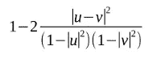
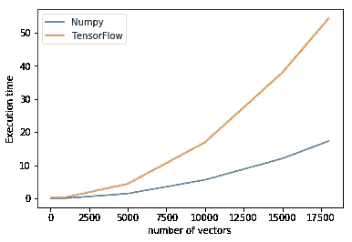
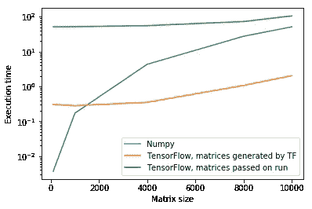
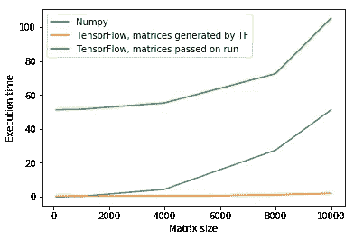
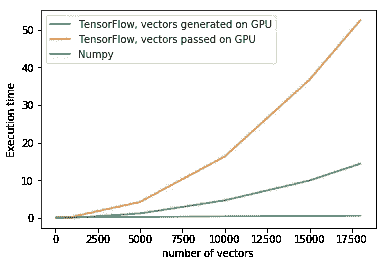

# Numpy 与 Tensorflow:矩阵计算的速度

> 原文：<https://towardsdatascience.com/numpy-vs-tensorflow-speed-on-matrix-calculations-9cbff6b3ce04?source=collection_archive---------0----------------------->

你好社区！

在这篇文章中，我想分享我在矩阵计算方面的经验。在这篇文章的最后，我们将会更清楚地看到两个库中的哪一个必须用于不需要运行数小时的计算。

我面临的任务是编写这个公式:

其中 **u** 和 **v** 是大小为 2 的向量，取自一组数千个向量。这实际上是计算庞加莱球空间模型中两个向量之间距离的公式的一部分(更多内容请见后面的帖子！).

因为问题的本质，我需要计算每一对向量的公式。为了加快计算速度，我选择只使用矩阵运算，而不使用循环。在这篇文章的最后，有一个附录，详细介绍了我为“矩阵化”循环所做的操作。

现在的问题是:Numpy 和 Tensorflow 哪个库完成它更快？我们去看看！

## 代码和设置

这篇文章中使用的所有代码都可以在我的 GitHub 知识库中找到，这里是。

我运行代码的系统是在 [Crestle 上的 Jupyter 笔记本，](https://www.crestle.com/)在那里使用了 NVidia Tesla K80，TensorFlow 版本 1.2.0，Numpy 版本 1.13.0。

为了构建下面的图 1，我传递了维数从(100，2)到(18000，2)不等的矩阵。作为度量标准，我测量了挂钟时间，每个标绘点是三次运行的平均值。由于曲线行为的明显单调性，我避免计算每一点的方差。这是执行时间的图表:

Plot 1: Execution time for the considered formula.

什么！？CPU 上的 Numpy 比特斯拉 K80 GPU 上的 TensorFlow 还快？甚至，矩阵越大，Numpy 越快？这怎么可能？

## 深入挖掘

好吧，也许我做错了什么。最好四处看看。

我登陆[这个](https://relinklabs.com/tensorflow-vs-numpy)网络帖子，实际上作者 [Dimitrios Bizopoulos，](https://relinklabs.com/profile/dimitrios-bizopoulos)展示了完全相反的情况。这里谁错了？

让我们检查他的支票。他尝试的一个操作是矩阵的乘法，Numpy 用 np.dot()，TensorFlow 用 tf.matmul()。我们开始吧！

Plot 2: Execution time for matrix multiplication, logarithmic scale on the left, linear scale on the right.

好的，右边的两条最快的曲线对应于在提到的帖子的第一张图中绘制的曲线。然而，要注意的是，切换到对数标度(左图)，我们看到对于大小为

但是两条截然不同的张量流曲线呢？

为获得结果而运行的两个张量流代码之间的差异取决于生成矩阵的方式。在最快的一个中，我让 TensorFlow 生成曲线，所以这发生在 GPU 中；在最慢的一个中，我传递给 TensorFlow 已经存在的矩阵。

所以我们在这里浪费了大量的时间:从系统内存到 GPU 内存的矩阵拷贝。

此外，如果我们注意到 Numpy 曲线和最慢的张量流曲线具有非常相似的增长方式，我们也可以假设 Numpy 是通过矩阵在内存中传递的方式而减慢的。但是为了验证这一点，需要进行更深入的分析。

那么，如果我们不是将 vector 传递给初始代码(庞加莱球中的距离)，而是告诉 TensorFlow 生成它，会发生什么呢？

## 最终检查

所以这是最后的检查:我们试图将我们的公式也用于 GPU 上生成的向量，从而避免将它们从系统内存传递到 GPU 内存。这对于任何范围来说都是无用的，因为我们需要对真实数据进行操作，而不是对随机数进行操作，但这将有助于理解正在发生的事情。

Plot 3: Execution time for the considered formula. In the fastest curve the vectors are generated in the GPU.

与前面的情况一样，TensorFlow 的瓶颈显然是从系统内存到 GPU 内存的复制，但当向量已经在 GPU 中时，计算将以我们预期的速度进行。

## 结论

TensorFlow 是一个深度学习库，它被设计成在 GPU 上的性能最好。GPU 安装在 PCIe 总线上，与该总线的通信比 CPU 和系统内存之间的通信慢得多。

因此，只有当数据上有大量计算要做，以至于系统-GPU 传输时间相对于实际计算时间变得可以忽略不计时，我们才具有使用 GPU 的优势。这不是我的案子。

# 附录:构建矩阵运算

我就是这么做的，为了简单起见，把解释限制在三个向量:[a1，a2]，[b2，b2]，[c1，c2]。

在分子上，我们必须计算两个向量之间欧几里得差的平方范数。摆姿势(a-b) = (a1-b1) +(a2-b2):

0，(a-b)，(a-c)

(b-a)，0，(b-c)

(c-a)，(c-b)，0

对于分母，我们需要单个向量的欧几里德范数。摆姿势 A= a1 + a2:

(1-A)(1-A)、(1-A)(1-B)、(1-A)(1-C)

(1-B)(1-A)、(1-B)(1-B)、(1-C)(1-C)

(1-C)(1-A)、(1-C)(1-B)、(1-C)(1-C)

最后，结果就是我们想要的矩阵。姿势 f(a，B)= 1+2 *(A-B)/(1-A)(1-B)):

0，f(a，b)，f(a，c)

f(b，a)，0，f(b，c)

f(c，a)，f(c，b)，0

遵循用张量流语言编写示例