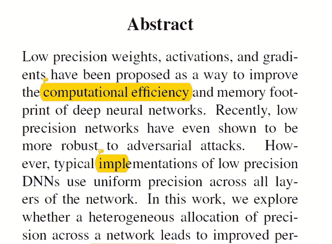
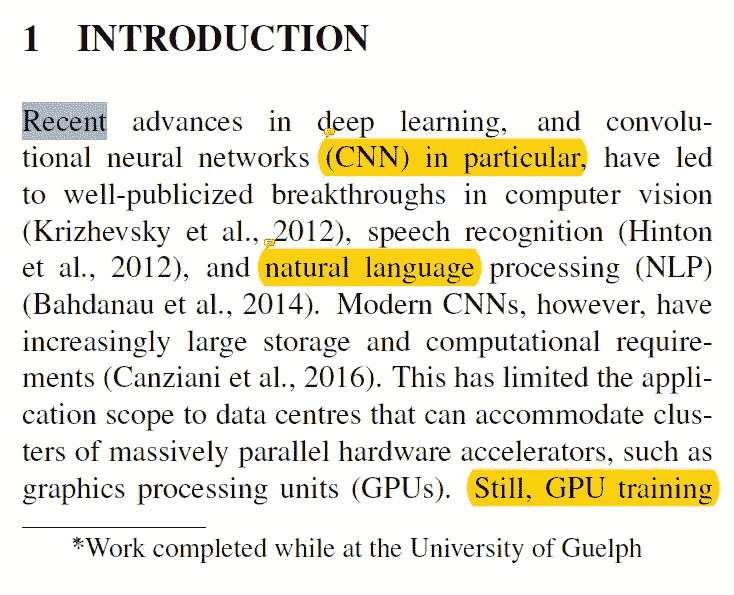
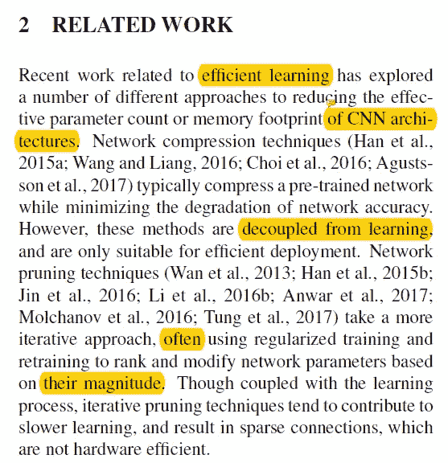
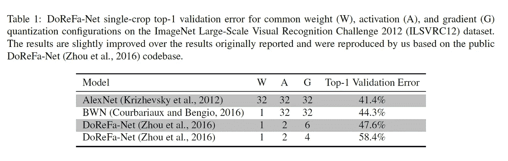
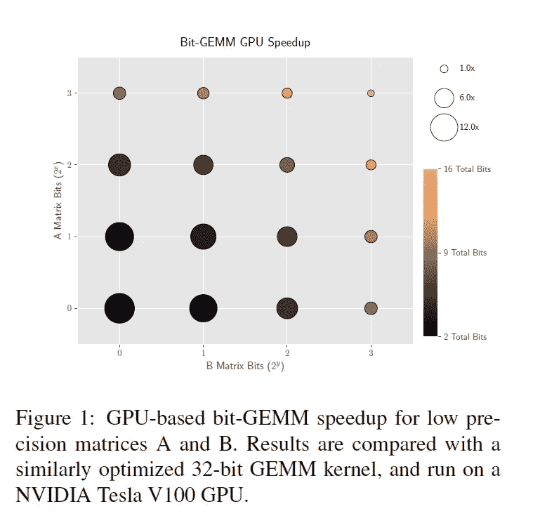
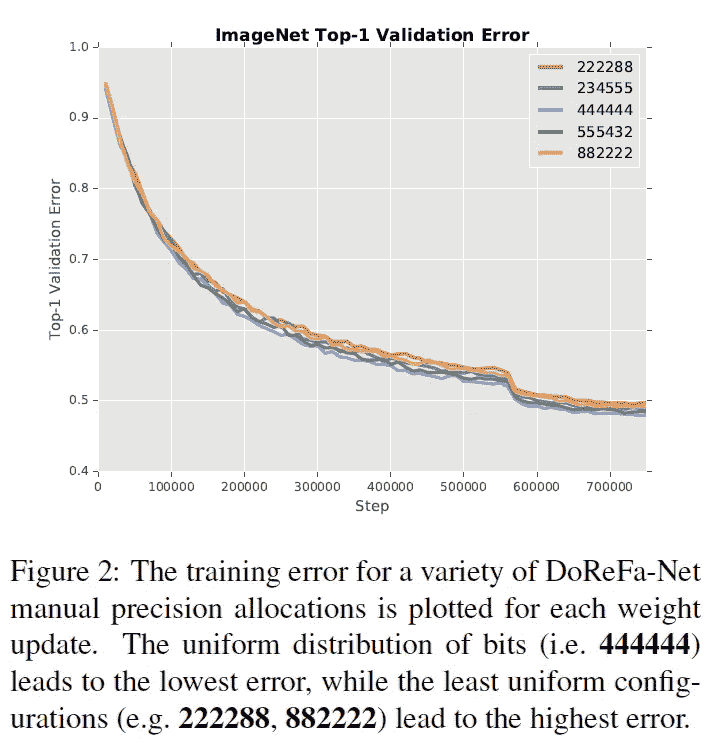
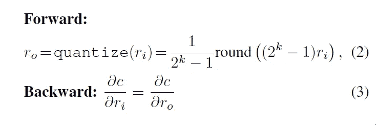
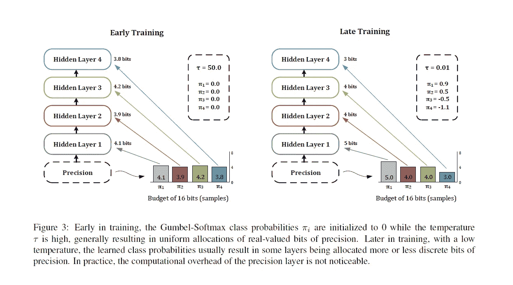
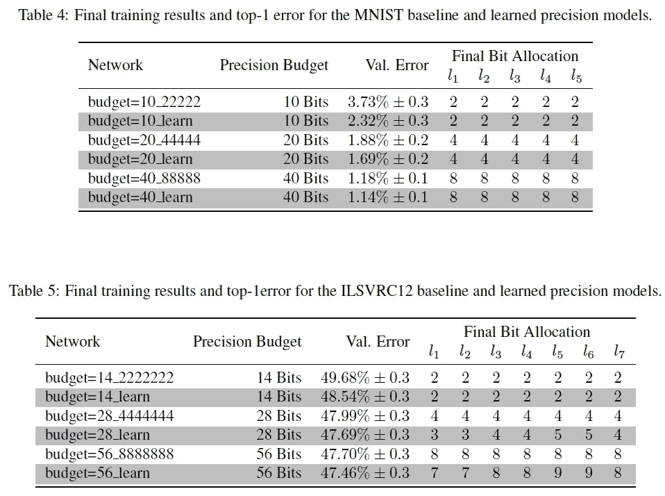
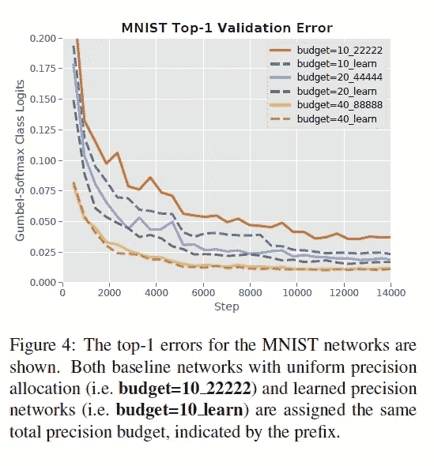

# [ NVIDIA /论文摘要]深度神经网络中的随机分层精度

> 原文：<https://towardsdatascience.com/nvidia-paper-summary-stochastic-layer-wise-precision-in-deep-neural-networks-882c43de4526?source=collection_archive---------7----------------------->

GIF from this [website](https://media.giphy.com/media/IYgMHLSLoWtvW/giphy.gif)

我的一个朋友向我推荐了这篇论文，我觉得它很有趣。

> **请注意，这篇帖子是为了我未来的自己复习这篇论文上的材料，而不是从头再看一遍。**

**摘要**

低精度权重已经被提出作为使深度神经网络更有记忆效率以及对敌对攻击更鲁棒的方法。并且许多网络是通过跨网络的所有层的统一精度来实现的，本文的作者引入了一种学习方案，其中 DNN 通过学习随机地探索多个精度配置，因此网络能够学习最优精度配置。

**简介**

由于最近在深度学习方面的进步，许多与计算机视觉和自然语言处理(以及更多)相关的领域都有了很大的突破。然而，训练这些网络通常是昂贵的，因此对 GPU 的需求很高。(比如像网上的 CNN)。许多旨在减小网络规模的研究集中在使权重为二进制或三进制权重和激活。(这占用更少的存储器，并且可以通过位操作实现计算效率。).在本文中，作者引入了训练网络时的一个额外的超参数，即每例精度的配置。(网络将通过 back prop 找到最佳点。)

**相关工作**

有两种方法来减小网络的规模，1)网络压缩，其中预训练的网络被最小化，同时不妨碍准确性，2)网络修剪技术。(这两种方法各有优劣。)作者的工作主要集中在降低网络中权/激活的精度，本文的三个贡献是..
***1)确认低精度运算的总位数和加速比之间的线性关系。
2)引入基于梯度的学习精度方法
3)实证证明作者端到端训练策略的优势***

**高效低精度网络**

低精度学习是一个过程，其中存储在浮点 32 中的权重减少到 1/2 位整数值。(而且大部分研究都集中在量化权重和激活上。)一般来说，量化会导致较低的精度，然而，情况并非总是如此，量化可以作为正则化，并且实际上实现更好的性能。

如上所述，由于使用了较少的比特数，我们能够获得更高的速度。看到这个数字，人们自然会问，网络的最佳精度是多少？本文作者对此问题进行了研究。

**学习精度**

(e.g. 444444 indicates 6 quantized layers, all assigned 4 bits).

如上所述，当每一层都统一调整其精度时，我们可以看到该模型能够实现最低的误差。然而，当涉及到学习最佳精度的两个问题是…

1)如果对最大精度没有限制，网络将只会增长，因为它导致更低的损耗
。2)量化涉及离散运算，其是不可微分的，因此不适合简单的反向传播。

第一个问题通过固定总净精度来解决，第二个问题通过采用能够通过离散随机操作反向传播梯度的技术来解决。

由于量化过程包括离散化连续值，为了成功地训练网络，需要一些数学技巧。(注意:在使用 Gumbel-Softmax(也称为具体分布)的这一节中，实际上涉及了相当多的数学计算，但是，我不打算详细讨论)。

**精确分配层**

Example training Process

为了实现精确分配网络，作者引入了一种新的层，其中存在一个可学习的超参数 pi，它定义了 Gumbel-Softmax 分布。(并且每个分布与每个不同的层相关联。).作者指出，在训练的开始阶段允许温度降得太低会导致高方差梯度，同时还会鼓励很大程度上不均匀的比特分配，从而损害网络的泛化能力。为了解决这个问题，作者们对精度位进行了硬赋值。

**实验**

本文作者在 MNIST 和 ILSVRC12 两个数据集上尝试了两种不同的 CNN 网络。本文作者比较了均匀分配网络权值的情况和通过反向传播学习精度的情况。如上所述，当网络本身能够学习精度时，它会提供更好的性能。训练错误如下所示。(对于 MNIST 数据集)

作者发现一个有趣的事实是，网络分配更多的比特给更后面的层。(并且对于早期层，仅分配几个比特。)

**结论与未来工作**

本文作者介绍了 DNN 的精度分配层，并表明它比均匀分配的低精度模型具有更好的性能。(这是通过网络的能力来实现的，网络能够通过 back prop 找到最佳精度。).作者写道，他们将把这个想法扩展到对抗性攻击以及所提出的模型的变体。

**遗言**

我从来没有想过控制网络的精度会作为一个正则化方案。

**参考**

1.  莱西、泰勒和阿雷比(2018 年)。深度神经网络中的随机分层精度。Arxiv.org。检索于 2018 年 7 月 8 日，来自 https://arxiv.org/abs/1807.00942