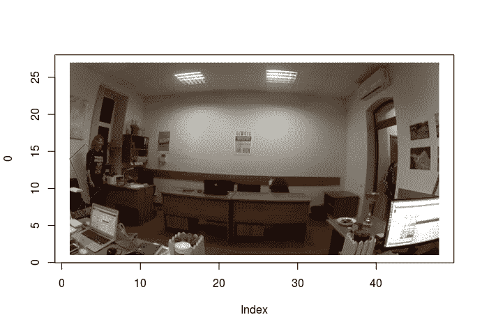
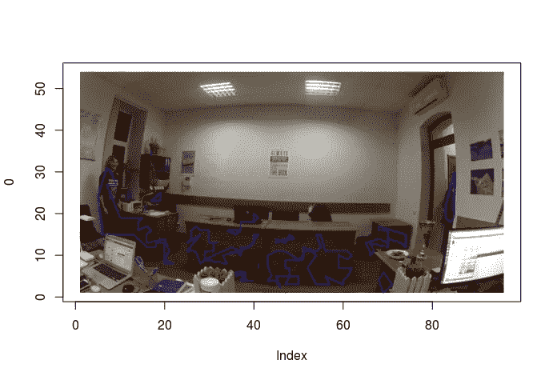
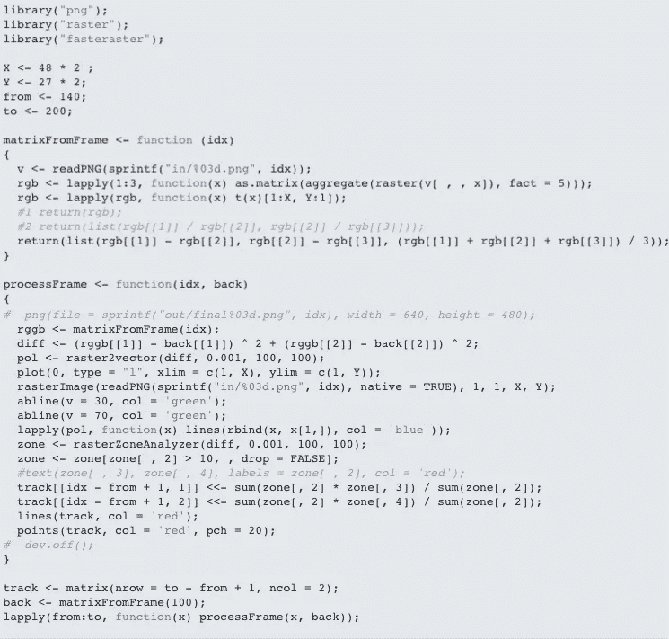

# 目标检测和计数

> 原文：<https://towardsdatascience.com/object-detection-10f3601e4175?source=collection_archive---------3----------------------->

## 使用不同技术的对象检测、识别

对象检测，尤其是识别可以使用不同的技术来完成，如 [**OpenCV**](http://opencv.org/) 函数的组合。对我来说，用 R 语言构建一个快速模型，然后花几周时间编写冗长的 C++或。它的 NET 代码。我从一个人计数器开始，作为对象检测的实际应用，并拍摄了经过办公室的人的镜头。

首先需要使用 [**FFmpeg**](https://ffmpeg.org/) 从视频中准备图像。然后选择一个背景图像，创建一个有物体的图像和背景图像之间的差异矩阵。正如可以在 [**我的博客**](http://bosyi.com/craft/vectorization-raster-polygon-r-cpp/) 上找到的，我已经创建了一个用于光栅图像处理和矢量化的 R 库—[**faster raster**](https://cran.r-project.org/package=fasteraster)，这可以用于对象检测，因此想法是通过一些梯度检测区域来矢量化差异矩阵。

在这张图片上，有一个变体#1，其中图片矩阵由简单的 RGB 值表示。他们的比较让我对这个人的影子有了很强的物体探测能力(参见课程代码):



因此，下一个想法(代码中的变量#2)是计算颜色(红/绿，绿/蓝)之间的差异，然后与背景进行比较。这清理了阴影检测，但引入了另一个问题，即大量黑暗区域的检测，这可能是由较差的 CMOS 相机颜色检测能力引起的:



然后我决定减去颜色(红-绿，绿-蓝),效果很好。我还增加了检测区域重量的过滤，并在视频中显示出来。正如你所看到的，当一个黑色物体穿过黑色背景时，还有另一个问题——它被分成两个或三个部分:

在本例中，我只是添加了代码来连接这些区域，并计算连接对象的新中心。添加了跟踪线和两个绿色边距，以检测沿同一方向通过的对象:

可以看到，模型本身花了一页代码，大部分是为了可视化。然而，模型中不包括以下项目:

*   背景图像——它必须适应天气、白天和其他条件(就像有人在观察区域的中央留下了一个包)。
*   清点物体——只需检查穿过绿色空白处的向量
*   多目标检测——基于路径近似的需求识别算法。
*   连接对象识别-需要对形状中线进行聚类，通过平均权重和路径近似将连接区域分割成更小的区域。

***物体检测 R 源代码***

```
library("png");
library("raster");
library("fasteraster");

X <- 48 * 2 ;
Y <- 27 * 2;
from <- 140;
to <- 200;

matrixFromFrame <- function (idx)
{
  v <- readPNG(sprintf("in/%03d.png", idx));
  rgb <- lapply(1:3, function(x) as.matrix(aggregate(raster(v[ , , x]), fact = 5)));
  rgb <- lapply(rgb, function(x) t(x)[1:X, Y:1]);
  #1 return(rgb);
  #2 return(list(rgb[[1]] / rgb[[2]], rgb[[2]] / rgb[[3]]));
  return(list(rgb[[1]] - rgb[[2]], rgb[[2]] - rgb[[3]], (rgb[[1]] + rgb[[2]] + rgb[[3]]) / 3));
}

processFrame <- function(idx, back)
{
*#  png(file = sprintf("out/final%03d.png", idx), width = 640, height = 480);*
  rggb <- matrixFromFrame(idx);
  diff <- (rggb[[1]] - back[[1]]) ^ 2 + (rggb[[2]] - back[[2]]) ^ 2;
  pol <- raster2vector(diff, 0.001, 100, 100);
  plot(0, type = "l", xlim = c(1, X), ylim = c(1, Y));
  rasterImage(readPNG(sprintf("in/%03d.png", idx), native = TRUE), 1, 1, X, Y);
  abline(v = 30, col = 'green');
  abline(v = 70, col = 'green');
  lapply(pol, function(x) lines(rbind(x, x[1,]), col = 'blue'));
  zone <- rasterZoneAnalyzer(diff, 0.001, 100, 100);
  zone <- zone[zone[ , 2] > 10, , drop = FALSE];
  *#text(zone[ , 3], zone[ , 4], labels = zone[ , 2], col = 'red');*
  track[[idx - from + 1, 1]] <<- sum(zone[, 2] * zone[, 3]) / sum(zone[, 2]);
  track[[idx - from + 1, 2]] <<- sum(zone[, 2] * zone[, 4]) / sum(zone[, 2]);
  lines(track, col = 'red');
  points(track, col = 'red', pch = 20);
*#  dev.off();*
}

track <- matrix(nrow = to - from + 1, ncol = 2);
back <- matrixFromFrame(100);
lapply(from:to, function(x) processFrame(x, back));
```



代码你可以在这里找到: [**R 源代码**](https://www.linkedin.com/pulse/object-detection-counting-andy-bosyi/)

## 附言（同 postscript）；警官（police sergeant）

对于个人问题，请在 Linkedin 或脸书上联系我，有时我会在那里发布关于人工智能的简短新闻和想法。
如果有 AI 方面的需求，或者需要组建数据科学咨询团队，联系我