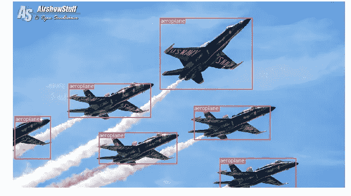
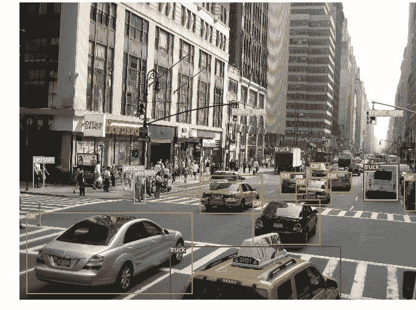
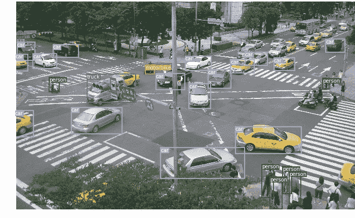
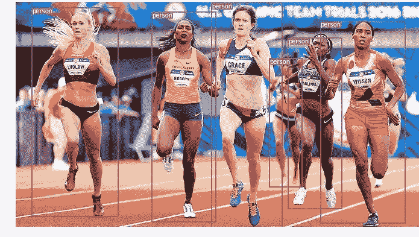

# PyTorch 中的目标检测和跟踪

> 原文：<https://towardsdatascience.com/object-detection-and-tracking-in-pytorch-b3cf1a696a98?source=collection_archive---------2----------------------->

## 检测图像中的多个对象并在视频中跟踪它们

在我之前的故事中，我讲述了如何用你自己的图像在 PyTorch 中训练一个[图像分类器，然后用它进行图像识别。现在，我将向您展示如何使用预训练的分类器来检测图像中的多个对象，然后在视频中跟踪它们。](/how-to-train-an-image-classifier-in-pytorch-and-use-it-to-perform-basic-inference-on-single-images-99465a1e9bf5)

图像分类(识别)和物体检测有什么区别？在分类中，你识别图像中的主要物体，整个图像被一个类分类。在检测中，多个对象在图像中被识别、分类，并且位置也被确定(作为边界框)。

# 图像中的目标检测

有几种用于对象检测的算法，其中最流行的是 YOLO 和 SSD。对于这个故事，我将使用 **YOLOv3** 。我不会进入 YOLO(你只看一次)如何工作的技术细节——你可以在这里[阅读](https://pjreddie.com/yolo/)——但重点是如何在你自己的应用程序中使用它。

所以让我们直接进入代码吧！这里的 Yolo 检测代码是基于[埃里克·林德诺伦](https://github.com/eriklindernoren/PyTorch-YOLOv3)对[约瑟夫·雷德蒙和阿里·法尔哈迪论文](https://pjreddie.com/media/files/papers/YOLOv3.pdf)的实现。下面的代码片段来自一个 Jupyter 笔记本，你可以在我的 [Github repo](https://github.com/cfotache/pytorch_objectdetecttrack) 中找到。在运行之前，您需要运行`config`文件夹中的`download_weights.sh`脚本来下载 Yolo weights 文件。我们从导入所需的模块开始:

```
from models import *
from utils import *import os, sys, time, datetime, random
import torch
from torch.utils.data import DataLoader
from torchvision import datasets, transforms
from torch.autograd import Variableimport matplotlib.pyplot as plt
import matplotlib.patches as patches
from PIL import Image
```

然后，我们加载预训练的配置和权重，以及在其上训练了 [**Darknet**](https://github.com/pjreddie/darknet) 模型的 COCO 数据集的类名。在 PyTorch 中，不要忘记在加载后将模型设置为`eval`模式。

```
config_path='config/yolov3.cfg'
weights_path='config/yolov3.weights'
class_path='config/coco.names'
img_size=416
conf_thres=0.8
nms_thres=0.4# Load model and weights
model = Darknet(config_path, img_size=img_size)
model.load_weights(weights_path)
model.cuda()
model.eval()
classes = utils.load_classes(class_path)
Tensor = torch.cuda.FloatTensor
```

上面也有一些预定义的值:图像大小(416px 正方形)、置信度阈值和非最大抑制阈值。

下面是返回指定图像检测结果的基本函数。注意，它需要一个枕头图像作为输入。大部分代码处理的是将图像的大小调整为 416 像素的正方形，同时保持其纵横比并填充溢出。实际检测在最后 4 行。

```
def detect_image(img):
    # scale and pad image
    ratio = min(img_size/img.size[0], img_size/img.size[1])
    imw = round(img.size[0] * ratio)
    imh = round(img.size[1] * ratio)
    img_transforms=transforms.Compose([transforms.Resize((imh,imw)),
         transforms.Pad((max(int((imh-imw)/2),0), 
              max(int((imw-imh)/2),0), max(int((imh-imw)/2),0),
              max(int((imw-imh)/2),0)), (128,128,128)),
         transforms.ToTensor(),
         ])
    # convert image to Tensor
    image_tensor = img_transforms(img).float()
    image_tensor = image_tensor.unsqueeze_(0)
    input_img = Variable(image_tensor.type(Tensor))
    # run inference on the model and get detections
    with torch.no_grad():
        detections = model(input_img)
        detections = utils.non_max_suppression(detections, 80, 
                        conf_thres, nms_thres)
    return detections[0]
```

最后，让我们通过加载一个图像，获得检测，然后用检测到的对象周围的边界框来显示它，将它放在一起。同样，这里的大部分代码处理图像的缩放和填充，以及为每个检测到的类获取不同的颜色。

```
# load image and get detections
img_path = "images/blueangels.jpg"
prev_time = time.time()
img = Image.open(img_path)
detections = detect_image(img)
inference_time = datetime.timedelta(seconds=time.time() - prev_time)
print ('Inference Time: %s' % (inference_time))# Get bounding-box colors
cmap = plt.get_cmap('tab20b')
colors = [cmap(i) for i in np.linspace(0, 1, 20)]img = np.array(img)
plt.figure()
fig, ax = plt.subplots(1, figsize=(12,9))
ax.imshow(img)pad_x = max(img.shape[0] - img.shape[1], 0) * (img_size / max(img.shape))
pad_y = max(img.shape[1] - img.shape[0], 0) * (img_size / max(img.shape))
unpad_h = img_size - pad_y
unpad_w = img_size - pad_xif detections is not None:
    unique_labels = detections[:, -1].cpu().unique()
    n_cls_preds = len(unique_labels)
    bbox_colors = random.sample(colors, n_cls_preds)
    # browse detections and draw bounding boxes
    for x1, y1, x2, y2, conf, cls_conf, cls_pred in detections:
        box_h = ((y2 - y1) / unpad_h) * img.shape[0]
        box_w = ((x2 - x1) / unpad_w) * img.shape[1]
        y1 = ((y1 - pad_y // 2) / unpad_h) * img.shape[0]
        x1 = ((x1 - pad_x // 2) / unpad_w) * img.shape[1]
        color = bbox_colors[int(np.where(
             unique_labels == int(cls_pred))[0])]
        bbox = patches.Rectangle((x1, y1), box_w, box_h,
             linewidth=2, edgecolor=color, facecolor='none')
        ax.add_patch(bbox)
        plt.text(x1, y1, s=classes[int(cls_pred)], 
                color='white', verticalalignment='top',
                bbox={'color': color, 'pad': 0})
plt.axis('off')
# save image
plt.savefig(img_path.replace(".jpg", "-det.jpg"),        
                  bbox_inches='tight', pad_inches=0.0)
plt.show()
```

你可以把这些代码片段放在一起运行代码，或者[从我的 Github 下载笔记本](https://github.com/cfotache/pytorch_objectdetecttrack)。以下是图像中物体检测的几个例子:



# 视频中的目标跟踪

现在你知道如何检测图像中的不同物体了。当你在视频中一帧一帧地做的时候，你会看到那些跟踪框在移动，这种可视化可能会很酷。但是，如果那些视频帧中有多个对象，您如何知道一帧中的对象是否与前一帧中的对象相同？这被称为对象跟踪，并使用多次检测来识别特定对象。

有几个算法可以做到这一点，我决定使用**排序**，这是非常容易使用和相当快。 [SORT(简单的在线和实时跟踪)](https://arxiv.org/pdf/1602.00763.pdf)是亚历克斯·比雷、葛宗元、莱昂内尔·奥特、法比奥·拉莫斯、本·乌普克罗夫特在 2017 年发表的一篇论文，该论文提出使用**卡尔曼滤波器**来预测先前识别的物体的轨迹，并将它们与新的检测结果进行匹配。作者亚历克斯·比雷也写了一个多功能的 [Python 实现](https://github.com/abewley/sort)，我将在本文中使用它。请确保您从我的 Github repo 中下载了 Sort 版本，因为我必须做一些小的更改才能将其集成到我的项目中。

现在来看代码，前 3 个代码段将与单个图像检测中的相同，因为它们处理在单个帧上获得 YOLO 检测。不同之处在于最后一部分，对于每个检测，我们调用 Sort 对象的 Update 函数来获取对图像中对象的引用。因此，与前一个示例中的常规检测(包括边界框的坐标和类别预测)不同，我们将获得被跟踪的对象，除了上述参数之外，还包括对象 ID。然后，我们以几乎相同的方式显示，但添加了 ID 并使用不同的颜色，以便您可以轻松地看到视频帧中的对象。

我还使用了 **OpenCV** 来读取视频并显示视频帧。请注意，Jupyter 笔记本在处理视频时非常慢。您可以使用它进行测试和简单的可视化，但是我还提供了一个独立的 Python 脚本，它将读取源视频，并输出一个包含被跟踪对象的副本。在笔记本上播放 OpenCV 视频并不容易，所以可以保留这段代码用于其他实验。

```
videopath = 'video/intersection.mp4'%pylab inline 
import cv2
from IPython.display import clear_outputcmap = plt.get_cmap('tab20b')
colors = [cmap(i)[:3] for i in np.linspace(0, 1, 20)]# initialize Sort object and video capture
from sort import *
vid = cv2.VideoCapture(videopath)
mot_tracker = Sort()#while(True):
for ii in range(40):
    ret, frame = vid.read()
    frame = cv2.cvtColor(frame, cv2.COLOR_BGR2RGB)
    pilimg = Image.fromarray(frame)
    detections = detect_image(pilimg) img = np.array(pilimg)
    pad_x = max(img.shape[0] - img.shape[1], 0) * 
            (img_size / max(img.shape))
    pad_y = max(img.shape[1] - img.shape[0], 0) * 
            (img_size / max(img.shape))
    unpad_h = img_size - pad_y
    unpad_w = img_size - pad_x
    if detections is not None:
        tracked_objects = mot_tracker.update(detections.cpu()) unique_labels = detections[:, -1].cpu().unique()
        n_cls_preds = len(unique_labels)
        for x1, y1, x2, y2, obj_id, cls_pred in tracked_objects:
            box_h = int(((y2 - y1) / unpad_h) * img.shape[0])
            box_w = int(((x2 - x1) / unpad_w) * img.shape[1])
            y1 = int(((y1 - pad_y // 2) / unpad_h) * img.shape[0])
            x1 = int(((x1 - pad_x // 2) / unpad_w) * img.shape[1]) color = colors[int(obj_id) % len(colors)]
            color = [i * 255 for i in color]
            cls = classes[int(cls_pred)]
            cv2.rectangle(frame, (x1, y1), (x1+box_w, y1+box_h),
                         color, 4)
            cv2.rectangle(frame, (x1, y1-35), (x1+len(cls)*19+60,
                         y1), color, -1)
            cv2.putText(frame, cls + "-" + str(int(obj_id)), 
                        (x1, y1 - 10), cv2.FONT_HERSHEY_SIMPLEX, 
                        1, (255,255,255), 3) fig=figure(figsize=(12, 8))
    title("Video Stream")
    imshow(frame)
    show()
    clear_output(wait=True)
```

在您使用笔记本之后，您可以使用常规 Python 脚本进行实时处理(您可以从摄像机获取输入)和保存视频。这是我用这个程序制作的视频样本。

就这样，你现在可以自己尝试检测图像中的多个对象，并在视频帧中跟踪这些对象。

如果你想在自定义图像数据集上检测和跟踪你自己的物体，你可以阅读我的下一个故事，关于 [**在自定义数据集**](/training-yolo-for-object-detection-in-pytorch-with-your-custom-dataset-the-simple-way-1aa6f56cf7d9) 上训练 Yolo 进行物体检测。

Chris Fotache 是一名人工智能研究员，在新泽西州工作。他涵盖了与我们生活中的人工智能、Python 编程、机器学习、计算机视觉、自然语言处理等相关的主题。