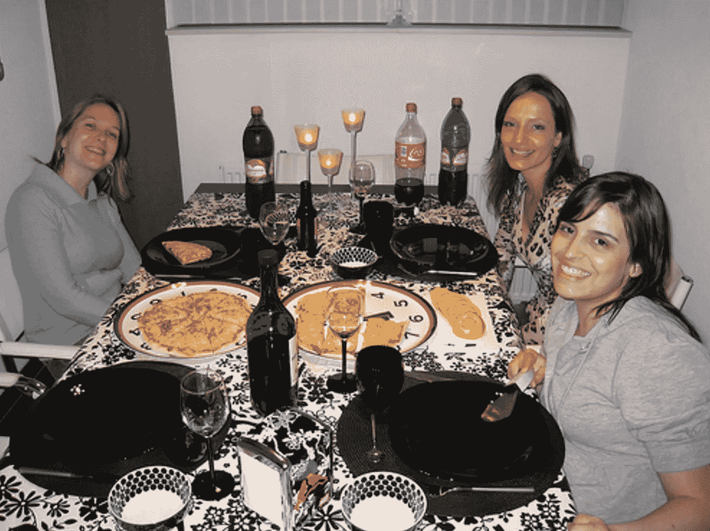
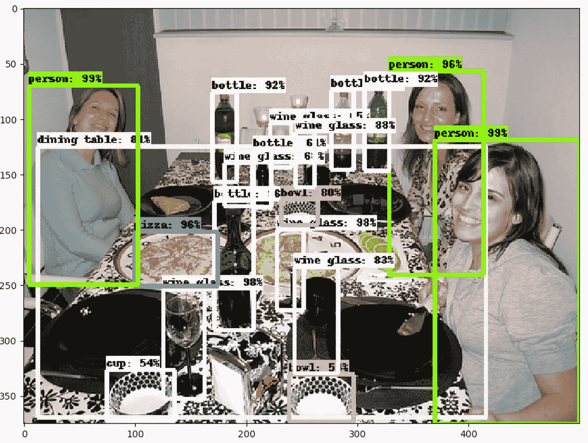
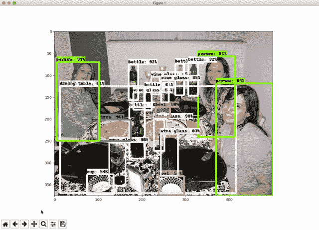

# 物体检测，和朋友吃饭…

> 原文：<https://towardsdatascience.com/object-detection-dinner-with-friends-ea1caab3b666?source=collection_archive---------6----------------------->

每天，在人工智能的所有领域都可以看到许多进步，当然，在计算机视觉学习领域也不例外。

几天前，谷歌研究团队发表了一篇关于提议的用于物体检测的**# tensor flow API**的[文章](https://research.googleblog.com/2017/06/supercharge-your-computer-vision-models.html)。为此，我想提出一个小小的挑战。我们能自动检测出与朋友共进晚餐的元素吗？

为此，我们最好使用预先训练的模型，我们有一些现成的选项可供使用:

*   SSD _ mobilenet _ v1 _ coco _ 11 _ 06 _ 2017
*   SSD _ inception _ v2 _ coco _ 11 _ 06 _ 2017
*   rfcn_resnet101_coco_11_06_2017
*   更快 _ rcnn _ resnet 101 _ coco _ 11 _ 06 _ 2017
*   更快 _ rcnn _ inception _ resnet _ v2 _ atrous _ coco _ 11 _ 06 _ 2017

所有型号都使用 COCO，(上下文中的常见对象)您可以在这里看到详细信息[。](http://mscoco.org/home/)

让我们来看看我们的原始图像，它是由晚宴的一名参与者假想拍摄的:

而我们来看一个使用 **#TensorFlow** 的快速实现，对于我的分析，最佳答案是使用**faster _ rcnn _ inception _ resnet _ v2 _ atrous _ coco _ 11 _ 06 _ 2017**显示的。【 [faster_rcnn](https://arxiv.org/abs/1506.01497) 和 [inception_resnet](https://arxiv.org/abs/1602.07261) 】。[基于官方演示的](https://gist.github.com/nbortolotti/6e2c27e475a27b7cd135e0f2c765e637)代码。

这样，我们就检测到了类、出现次数、标签……当然，我们可以在照片上涂色，使实现更加友好。

目前，这个模型是有限的，因为它使用了 COCO，但我们希望像这样的模型有更多的贡献。

*   顺便说一下，回到我们的例子，我们可以非常快速地计算照片中的瓶子数量…