# 使用谷歌人工智能开放图像的对象检测

> 原文：<https://towardsdatascience.com/object-detection-using-google-ai-open-images-4c908cad4a54?source=collection_archive---------4----------------------->

## 学会打造自己的自动驾驶汽车！！！….开玩笑

*由* [阿丁德拉班迪](https://medium.com/u/8eac85bcc326?source=post_page-----4c908cad4a54--------------------------------)*[艾利森布朗](https://medium.com/u/15110fd89b3a?source=post_page-----4c908cad4a54--------------------------------)*[萨加尔查达](https://medium.com/u/140754e8ee4d?source=post_page-----4c908cad4a54--------------------------------)[阿米当](https://medium.com/u/4dc229ed7053?source=post_page-----4c908cad4a54--------------------------------)[杰森苏](https://www.linkedin.com/in/zhaoshun-jason-su/)**

**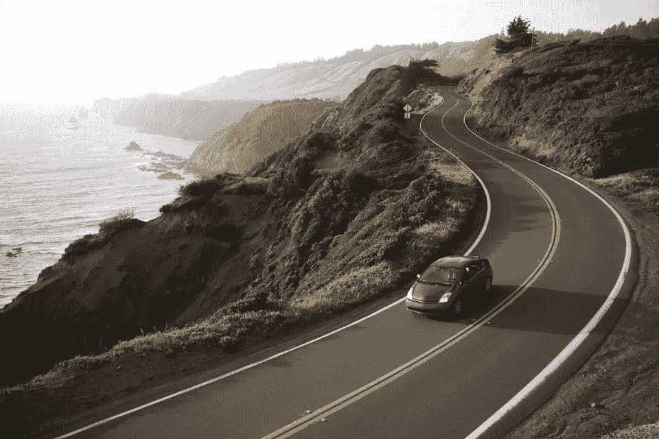**

**[Source](https://www.tripsavvy.com/driving-californias-scenic-highway-one-1473971)**

**你上一次只用脸登录手机是什么时候？或者点击了一张与一些朋友的自拍，并使用了 Snapchat 滤镜，在你的脸上放置了一些花哨的狗耳朵？你知道吗，这些很酷的功能是由一个奇特的神经网络实现的，它不仅可以识别照片中有一张脸，还可以检测耳朵应该去哪里。从某种意义上说，你的手机可以“看到”你，它甚至知道你长什么样！**

**帮助计算机‘看’的技术叫做“**计算机视觉”**。近年来，由于计算能力的爆炸使得深度学习模型更快更可行，计算机视觉应用变得越来越普遍。许多公司，如亚马逊、谷歌、特斯拉、脸书和微软，都在大力投资这项技术及其应用。**

# **计算机视觉任务**

**我们关注两个主要的计算机视觉任务——图像分类和目标检测。**

1.  ****图像分类**专注于将图像分组到预定义的类别中。为了实现这一点，我们需要有我们感兴趣的类的多个图像，并训练计算机将像素数字转换为符号。这只是说电脑看到猫的照片，说里面有猫。**
2.  ****物体检测**利用图像分类器来计算出图像中存在什么以及在哪里。通过使用卷积神经网络(CNN ),这些任务变得更加容易，这使得在图像的一次通过中检测多个类别成为可能。**

**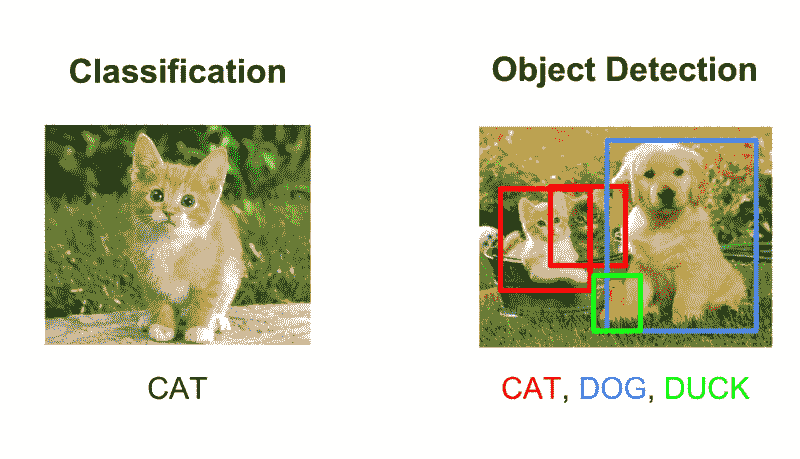**

**For more details on the difference in such tasks, please reference the following [article](/evolution-of-object-detection-and-localization-algorithms-e241021d8bad).**

# **计算机视觉很酷！**

**认识到未来许多有趣的数据科学应用将涉及图像工作，我和我的初露头角的数据科学家团队决定在 Kaggle 上举办的[谷歌人工智能开放图像挑战赛](https://www.kaggle.com/c/google-ai-open-images-object-detection-track)上一试身手。我们认为这是接触神经网络和卷积的绝佳机会，有可能给我们的教授和同学留下深刻印象。这个挑战为我们提供了 170 万张图片，带有 500 个对象类的**1200 万个包围盒标注(它们相对于图片的 X 和 Y 坐标)。你可以在这里找到数据[。](https://www.figure-eight.com/dataset/open-images-annotated-with-bounding-boxes/)****

****我们强烈推荐任何想了解 CNN 的人去读吴恩达的关于卷积神经网络的课程。****

# ****弄脏我们的手！****

******探索性数据分析** —与所有数据分析一样，我们开始探索我们拥有哪些图像以及我们需要检测的对象类型。****

****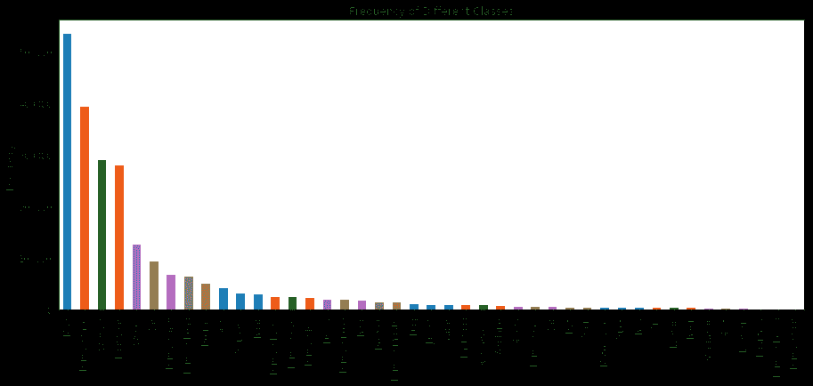****

****Frequency of Classes in the Training Dataset****

****快速浏览训练图像可以发现，就出现的次数而言，某些物体比其他物体更具存在感。上图显示了前 43 名班级的分布情况。很明显，这是一个巨大的差距，需要以某种方式解决。为了节省时间和金钱(GPU 成本很高:( )我们选择了前面提到的 43 个对象类和包含这些对象的大约 300K 图像的子集。对于训练数据中的每个对象类，我们有大约 400 张图像。****

## ****选择对象检测算法****

****我们考虑了各种算法，如 VGG、盗梦空间，但最终**选择了 YOLO 算法**，因为它的速度、计算能力和大量在线文章可以指导我们完成这个过程。面对计算和时间的限制，我们做了两个关键的决定-****

1.  ****使用被训练来识别某些物体的 YOLO v2 模型。****
2.  ****利用迁移学习来训练最后一个卷积层，以识别以前未见过的对象，如吉他、房子、男人/女人、鸟等。****

## ****对 YOLO 的投入****

****YOLO 算法需要一些特定的输入-****

1.  ******输入图像尺寸** — YOLO 网络设计用于特定的输入图像尺寸。我们发送了尺寸为 608 * 608 的图像。****
2.  ****班级数量 — 43。这是定义 YOLO 输出尺寸所必需的。****
3.  ******锚箱—** 要使用的锚箱的数量和尺寸。****
4.  ******置信度和 IoU 阈值** —定义选择哪些锚框以及如何在锚框之间挑选的阈值。****
5.  ******带有边框信息的图像名称**——对于每张图像，我们需要以如下所示的特定格式向 YOLO 提供其中的内容****

****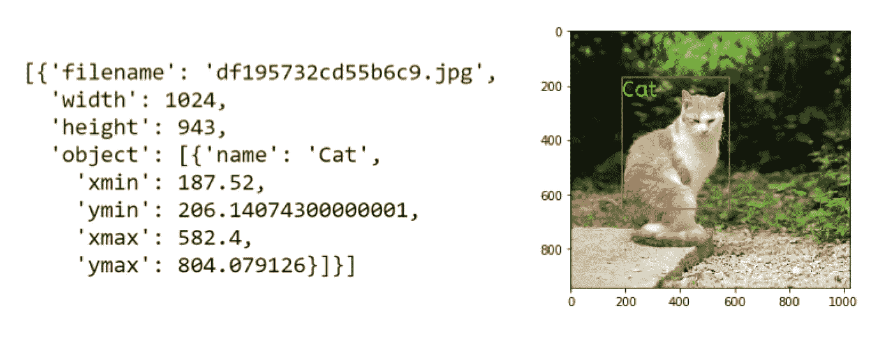****

****Sample input for YOLO****

*****下面是 YOLO 输入的代码片段*****

****Inputs into YOLO****

## ****YOLO v2 架构****

****该架构如下所示——它有 23 个卷积层，每个卷积层都有自己的批量归一化、漏 RELU 激活和最大池。****

****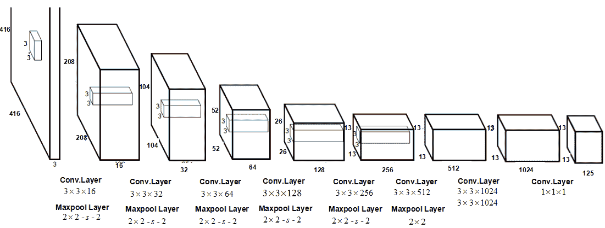****

****Representation of the actual YOLO v2 architecture.****

****这些层试图从图像中提取多个重要特征，以便可以检测到各种类别。为了对象检测的目的，YOLO 算法将输入图像分成 19*19 的网格，每个网格具有 5 个不同的锚框。然后，它尝试检测每个网格单元中的类，并将一个对象分配给每个网格单元的 5 个锚定框之一。锚定框的形状不同，旨在为每个网格单元捕捉不同形状的对象。****

****YOLO 算法为每个定义的锚定框输出一个矩阵(如下所示)****

****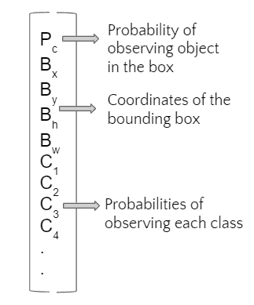****

****假设我们必须为 43 个类训练算法，我们得到的输出维数为:****

****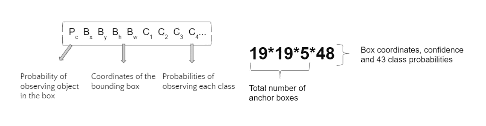****

****这些矩阵给我们观察每个锚盒中的对象的概率，以及该对象是什么类的概率。为了过滤掉不具有任何类或者具有与一些其他框相同的对象的锚框，我们使用两个阈值— **IoU 阈值**来过滤掉捕获相同对象的锚框，以及**置信度阈值**来过滤掉不包含任何具有高置信度的类的框。****

*****下面是 YOLO v2 架构最后几层的示意图:*****

****Last few layers of YOLO v2 architecture (Only for illustration purposes)****

## ****迁移学习****

****转移学习是指获得一个已经训练好的神经网络来分类图像，并将其用于我们的特定目的。这节省了我们的计算时间，因为我们不需要训练大量的权重——例如，我们使用的 YOLO v2 模型有大约 5000 万个权重——在我们使用的谷歌云实例上，训练可能需要 4-5 天。****

****为了成功实施迁移学习，我们必须对我们的模型进行一些更新:****

*   ******输入图像尺寸—** 我们下载的型号使用的输入图像尺寸为 416*416。由于我们训练的一些对象非常小——鸟、鞋——我们不想把输入图像挤压得太厉害。为此，我们使用大小为 608*608 的输入图像。****
*   ******网格大小—** 我们更改了网格大小的尺寸，以便它将图像划分为 19*19 个网格单元，而不是我们下载的模型的默认 13*13。****
*   ******输出层—** 由于我们在不同数量的类别 43 和 80 上进行训练，而原始模型是在这些类别上进行训练的，因此输出层被更改为输出矩阵维度，如上所述。****

****我们重新初始化了 YOLO 的最后一个卷积层的权重，以在我们的数据集上对其进行训练，最终帮助我们识别唯一的类。下面是相同的代码片段-****

****Re-initializing the last convolution layer of YOLO****

# ****价值函数****

****在任何目标检测问题中，我们都希望在一幅图像中用一个**高置信度**来识别位于右侧**位置**的**右侧目标**。[成本函数](https://arxiv.org/pdf/1506.02640.pdf)有 3 个主要组成部分:****

1.  ******分类损失:**如果检测到物体，是类别条件概率的平方误差。因此，损失函数仅在对象存在于网格单元中时惩罚分类错误。****
2.  ******定位损失:**它是预测的边界框位置和尺寸与地面真实框的平方误差，如果这些框负责检测物体的话。为了补偿边界框坐标预测的损失，我们使用一个正则化参数(ƛcoord).此外，为了确保较大框中的小偏差没有较小框中的小偏差重要，该算法使用边界框宽度和高度的平方根。****
3.  ******置信度损失:**是包围盒置信度得分的平方误差。大多数盒子不负责检测物体，因此该等式被分成两部分，一部分用于检测物体的盒子，另一部分用于其余的盒子。正则项λnoobj(默认值:0.5)应用于后一部分，以降低未检测到对象的框的权重。****

****关于成本函数的详细信息，请随意参考 YOlO [的原文](https://arxiv.org/pdf/1506.02640.pdf)。****

****YOLO 的妙处在于，它使用的误差易于使用优化函数进行优化，如随机梯度下降(SGD)、带动量的 SGD 或 Adam 等。下面的代码片段显示了我们用于优化成本函数的参数。****

****Training algorithm for YOLO (Adam optimizer)****

# ****输出精度-平均精度(地图得分):****

****在对象检测中有许多指标来评估模型，对于我们的项目，我们决定使用 mAP 得分，这是所有 IoU 阈值上不同召回值的最大精度的平均值。为了理解 mAP，我们将快速回顾一下 precision、recall 和 union 上的交集)。****

## ****精确度和召回率****

****精度衡量正确的正面预测的百分比。回忆是所有可能结果中真正肯定的比例。这两个值是反向相关的，并且还依赖于您为模型设置的模型得分阈值(在我们的例子中，它是置信度得分)。它们的数学定义如下:****

****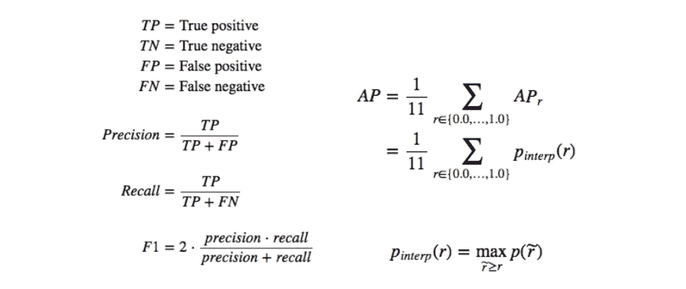****

****[Source](https://medium.com/@jonathan_hui/map-mean-average-precision-for-object-detection-45c121a31173)****

## ****并集上的交集****

****IoU 衡量两个区域之间有多少重叠，等于重叠面积与并集面积之比。这测量你的预测(从你的物体探测器)与地面事实(真实物体边界)相比有多好。总而言之，mAP 得分是所有 IoU 阈值的平均 AP。****

# ****结果****

****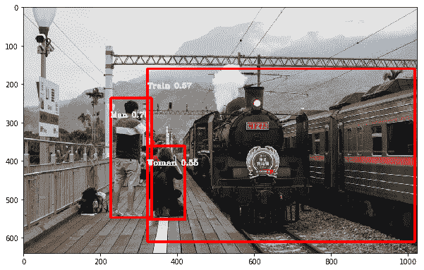********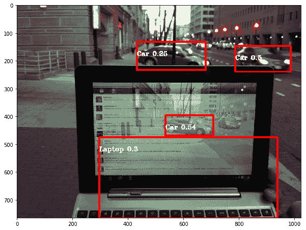********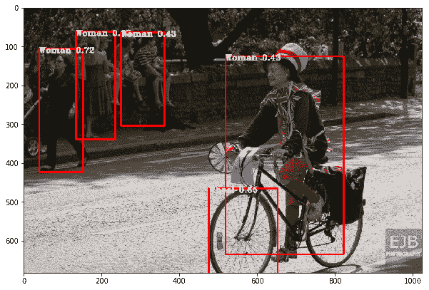********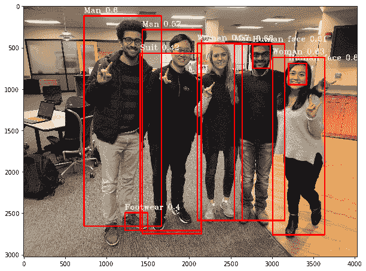****

# ****结论****

****物体检测不同于其他计算机视觉任务。您可以使用预先训练的模型，并根据需要进行编辑以满足您的需求。你可能需要 GCP 或另一个允许更高计算能力的平台。数学很难，看别人文章，不及格快。****

# ****经验教训****

****一开始，我们发现该模型无法预测许多类别，因为许多类别只有少量训练图像，这导致了不平衡的训练数据集。因此，我们决定只使用最流行的 43 个类，这不是一个完美的方法，但每个类至少有 500 张图片。然而，我们预测的可信度仍然很低。为了解决这个问题，我们选择了包含目标类的图像。****

****物体检测是一个非常具有挑战性的话题，但是不要害怕，尽量从各种在线开放资源中学习，比如 Coursera、YouTube 教学视频、GitHub 和 Medium。所有这些免费的智慧可以帮助你在这个令人惊叹的领域取得成功！****

# ****未来工作——继续或改进****

1.  ****在更多类别上训练模型，以检测更多种类的对象。为了达到这个目标，我们需要首先解决不平衡数据的问题。一个潜在的解决方案是，我们可以用这些更稀有的类收集更多的图像。****

******a .数据扩充** —稍微改变现有图像以创建新图像****

******b .图像复制** —我们可以多次使用相同的图像来训练特定稀有类上的算法****

******c . Ensemble**——在流行类上训练一个模型，在稀有类上训练另一个模型，并使用两者的预测。****

****2.此外，我们可以尝试不同型号的合奏，如 MobileNet、VGG 等。这是也用于对象检测的卷积神经网络算法。****

****如果你想详细了解我们团队的代码，这里有 GitHub 的链接。请随时提供任何反馈或意见！****

**** [## bandiatindra/物体探测项目

### 通过在 GitHub 上创建一个帐户，为 bandiatindra/Object-Detection 项目开发做出贡献。

github.com](https://github.com/bandiatindra/Object-Detection-Project)****