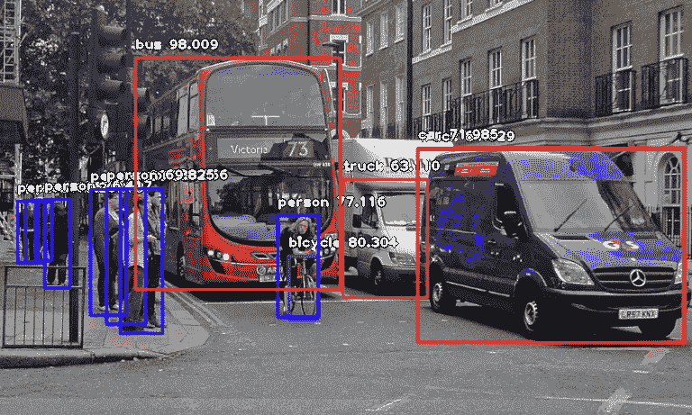
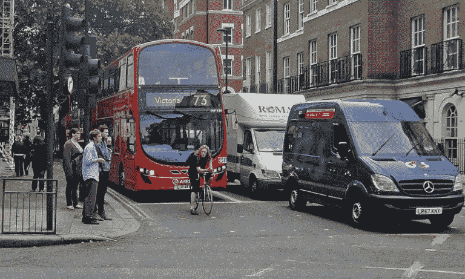
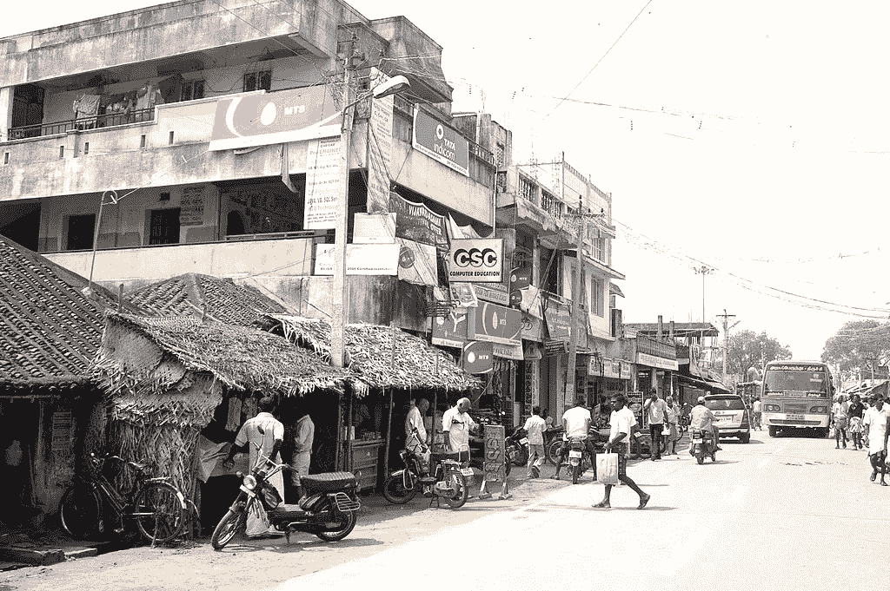
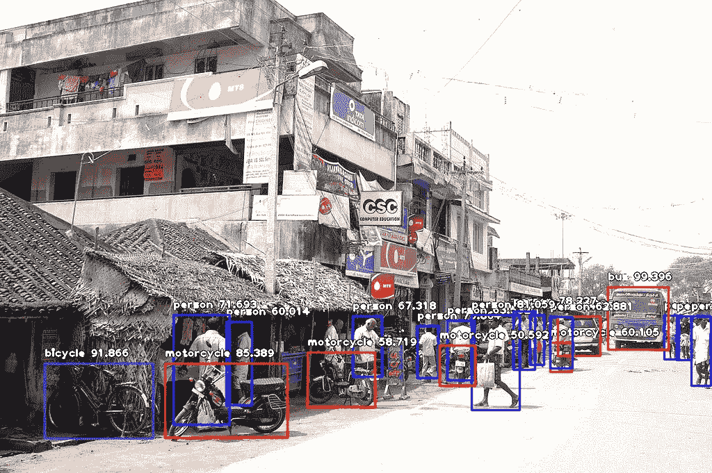
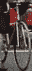
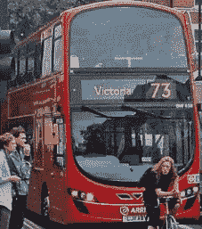
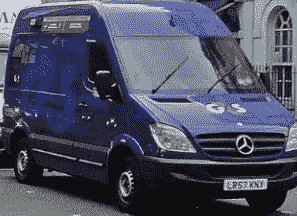
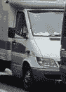
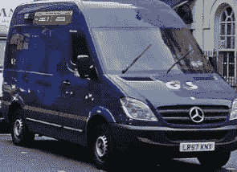

# 用 10 行代码进行对象检测

> 原文：<https://towardsdatascience.com/object-detection-with-10-lines-of-code-d6cb4d86f606?source=collection_archive---------0----------------------->

*本教程的第二部分用于检测您的自定义对象，可通过此* [*链接*](https://medium.com/deepquestai/train-object-detection-ai-with-6-lines-of-code-6d087063f6ff) *获得。*



人工智能的重要领域之一是计算机视觉。计算机视觉是计算机和软件系统的科学，可以识别和理解图像和场景。计算机视觉也是由图像识别、物体检测、图像生成、图像超分辨率等多方面组成。由于大量的实际使用案例，对象检测可能是计算机视觉最深刻的方面。在本教程中，我将简要介绍现代对象检测的概念、软件开发人员面临的挑战、我的团队提供的解决方案以及执行高性能对象检测的代码教程。

对象检测是指计算机和软件系统在图像/场景中定位对象并识别每个对象的能力。目标检测已经广泛应用于人脸检测、车辆检测、行人计数、网页图像、安全系统和无人驾驶汽车。在实践的许多领域中，也可以使用对象检测的许多方式。像所有其他计算机技术一样，物体检测的广泛创造性和惊人用途肯定来自计算机程序员和软件开发人员的努力。

在应用程序和系统中使用现代对象检测方法，以及基于这些方法构建新的应用程序并不是一项简单的任务。对象检测的早期实现涉及到经典算法的使用，比如流行的计算机视觉库 OpenCV 所支持的算法。然而，这些经典算法无法在不同条件下达到足够的性能。

深度学习在 2012 年的突破和快速采用带来了现代和高精度的对象检测算法和方法，如 R-CNN、Fast-RCNN、Faster-RCNN、RetinaNet 以及快速但高精度的算法和方法，如 SSD 和 YOLO。使用这些方法和算法，基于深度学习，也是基于机器学习，需要大量的数学和深度学习框架的理解。有数以百万计的专业计算机程序员和软件开发人员想要集成和创建使用对象检测的新产品。但是，由于理解和实际使用这项技术的额外和复杂的途径，他们无法接触到这项技术。

我的团队在几个月前就意识到了这个问题，这也是为什么我和约翰·奥拉芬瓦(T0)构建了(T2、T3、T4、T5)这个 python 库，让程序员和软件开发人员只需几行代码就能轻松地将最先进的计算机视觉技术集成到他们现有的和新的应用程序中。

[](https://github.com/OlafenwaMoses/ImageAI) [## OlafenwaMoses/ImageAI

### ImageAI——一个 python 库，旨在使开发人员能够使用独立的计算机构建应用程序和系统…

github.com](https://github.com/OlafenwaMoses/ImageAI) 

要使用 **ImageAI、**执行对象检测，您只需

1.  在您的计算机系统上安装 Python
2.  安装 **ImageAI** 及其依赖项

3.下载对象检测模型文件

4.运行示例代码(只有 10 行)

**现在我们开始吧。**

1. ***安装 Python 3.7.6 和 pip***

(如果您已经安装了 Python 3.7.6，请跳过本节)

[](https://www.python.org/downloads/release/python-376/) [## Python 版本 Python 3.7.6

### 发布日期:2019 年 12 月 18 日现在 Python 3.7 有了更新的 bugfix 版本，取代了 3.7.6，Python 3.8 是…

www.python.org](https://www.python.org/downloads/release/python-376/) 

2. ***安装 ImageAI 和依赖关系***

(如果您已经安装了库，请跳过本节中的任何安装说明)

**-张量流**

```
pip install tensorflow==2.4.0
```

**-其他**

```
pip install keras==2.4.3 numpy==1.19.3 pillow==7.0.0 scipy==1.4.1 h5py==2.10.0 matplotlib==3.3.2 opencv-python keras-resnet==0.2.0
```

***安装 ImageAI 库***

```
pip install imageai --upgrade
```

**3)** 通过[链接](https://github.com/OlafenwaMoses/ImageAI/releases/download/essentials-v5/resnet50_coco_best_v2.1.0.h5/)下载用于物体检测的 RetinaNet 模型文件。

太好了。现在，您已经安装了依赖项，可以开始编写第一个对象检测代码了。创建一个 Python 文件并给它命名(例如 **FirstDetection.py** )，然后将下面的代码写入其中。将 RetinaNet 模型文件和要检测的图像复制到包含 python 文件的文件夹中。

**FirstDetection.py**

然后运行代码，等待结果在控制台中打印出来。一旦结果被打印到控制台，转到你的 **FirstDetection.py** 所在的文件夹，你会发现保存了一个新的图像。看看下面的 a 2 图像样本和检测后保存的新图像。

**检测前:**



Image Credit: alzheimers.co.uk



Image Credit: Wikicommons

**检测后:**


***上图控制台结果:***

人:55 岁。59560.85858588666

人:53500 . 65858586666

人:69 . 58668686667

人:76 岁。59660.88868888666

自行车:80。58880 . 68888888881

人:83。58860 . 88888888881

人:89 . 48868889889

卡车:63 . 48666866667

人:60 岁。59660.66666666661

人:77 岁。59670.88878888671

公共汽车:98。59860 . 88988989881

卡车:84 人。38880 . 48888888881

汽车:71 . 48868686861



***上图控制台结果:***

人:71 岁。59860.88868888861

人:59650 . 68585858666

人:59860 . 68586868661

人:75 岁。59860.88888888686

摩托车:60 辆。56660 . 68686868661

公共汽车:99。39960 . 68989898991

小汽车:74 . 486868687687

人:67 . 58666866667

人:63 . 58668686667

人:78 岁。59860.88888888886

人:62 . 58666866667

人:72 . 59868686786

人:60 岁。59660.66668666661

人:81 岁。58680.88888888881

摩托车:50 辆。55660 . 68686868661

摩托车:58 辆。58860 . 68888888861

人:71 . 58686868671

自行车:91。59860 . 68888889861

摩托车:85。48860 . 88888888881

现在让我们解释一下这 10 行代码是如何工作的。

在上面的 3 行中，我们在第一行导入了 **ImageAI** 对象检测类，在第二行导入了 python **os** 类，并在第三行定义了一个变量来保存 python 文件、RetinaNet 模型文件和图像所在的文件夹的路径。

在上面的 5 行代码中，我们在第一行定义了我们的对象检测类，在第二行将模型类型设置为 RetinaNet，在第三行将模型路径设置为我们的 RetinaNet 模型的路径，在第四行将模型加载到对象检测类，然后在第五行调用检测函数并解析输入图像路径和输出图像路径。

在上面的 2 行代码中，我们迭代了第一行中由**检测器. detectobjectsfroimage**函数返回的所有结果，然后在第二行中打印出图像中检测到的每个对象的模型名称和百分比概率。

**ImageAI** 支持对象检测过程的许多强大定制。其中之一是提取图像中检测到的每个对象的图像的能力。如下所示，通过简单地将额外的参数**extract _ detected _ objects = True**解析到**detectobjectsfroimage**函数中，对象检测类将为图像对象创建一个文件夹，提取每个图像，将每个图像保存到创建的新文件夹中，并返回一个额外的数组，该数组包含每个图像的路径。

让我们将它应用到第一个图像，并从下面的结果中看到一些图像:



所有行人的照片都已经提取好了。我没有把它们都包括进去，因为它们会占用不必要的空间。

> 要检测你自己类型的物体，请访问下面链接的教程。

[](https://medium.com/deepquestai/train-object-detection-ai-with-6-lines-of-code-6d087063f6ff) [## 用 6 行代码训练物体检测人工智能

### 关于在您自己的数据集上训练对象检测模型的分步教程

medium.com](https://medium.com/deepquestai/train-object-detection-ai-with-6-lines-of-code-6d087063f6ff) 

> 如果您想了解更多有用和实用资源的链接，请访问下面链接的**物体检测指南**。

[](https://www.fritz.ai/object-detection/) [## 物体探测指南

### 现在我们知道了一点什么是对象检测，不同类型的对象检测之间的区别…

www.fritz.ai](https://www.fritz.ai/object-detection/) [](https://neptune.ai/blog/object-detection-algorithms-and-libraries) [## 对象检测算法和库- neptune.ai

### 对象检测在图像中找到并识别事物，这是深度学习的最大成就之一…

海王星. ai](https://neptune.ai/blog/object-detection-algorithms-and-libraries) 

**ImageAI** 提供了更多有用的功能，可用于定制和生产部署对象检测任务。支持的一些功能包括:

- **调整最小概率:**默认情况下，检测到的概率百分比小于 50 的物体不会被显示或报告。对于高确定性情况，您可以增加该值；对于需要检测所有可能对象的情况，您可以减少该值。

- **自定义对象检测:**使用提供的 CustomObject 类，您可以告诉检测类报告对一个或几个唯一对象的检测。

- **检测速度:**您可以通过将检测速度设置为“快”、“更快”和“最快”来减少检测图像所需的时间。

- **输入类型:**您可以指定并解析一幅图像的文件路径、Numpy 数组或一幅图像的文件流作为输入图像

- **输出类型:**您可以指定**detectobjectsfroimage**函数应该以文件或 Numpy 数组的形式返回图像

你可以在官方的 GitHub 知识库上找到关于如何利用上述功能的所有细节和文档，以及包含在 **ImageAI** 中的其他计算机视觉功能。ImageAI 是由 **DeepQuest AI 开发的开源项目。**

[](https://deepquestai.com) [## DeepQuest AI

### 在设备和云上提供 AI APIs。

deepquestai.com](https://deepquestai.com) 

[https://github.com/OlafenwaMoses/ImageAI](https://github.com/OlafenwaMoses/ImageAI)

如果你觉得这篇文章很有帮助并且喜欢，请给它一个**掌声**。此外，请随意与朋友和同事分享。

你有什么问题、建议或者想要联系我吗？给我发一封电子邮件到 guymodscientist@gmail.com。我也可以通过账号@OlafenwaMoses 在 twitter 上联系，通过 https://www.facebook.com/moses.olafenwa 在脸书联系。