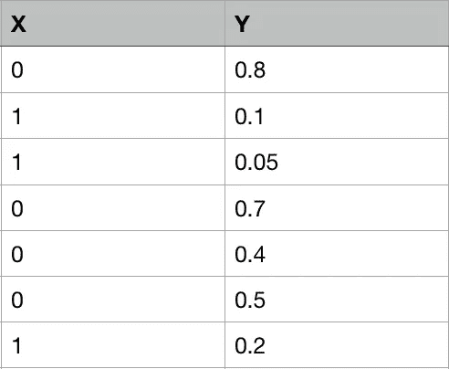
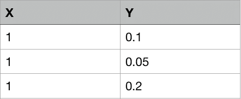
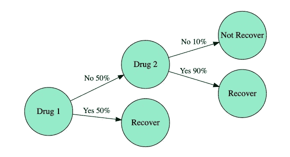
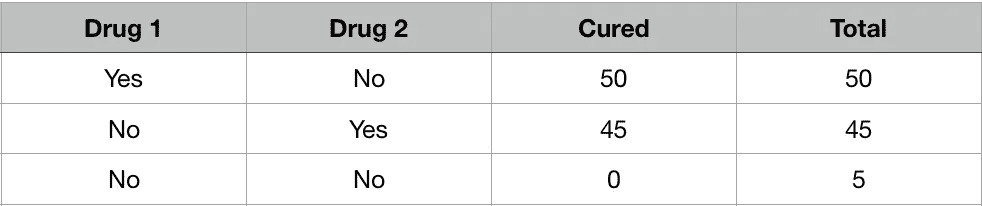
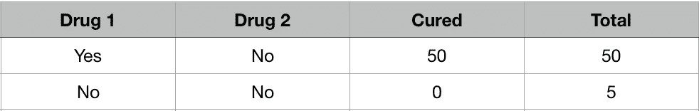
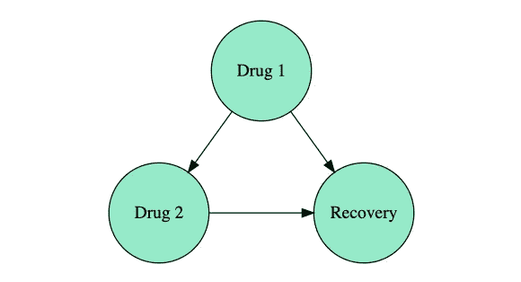
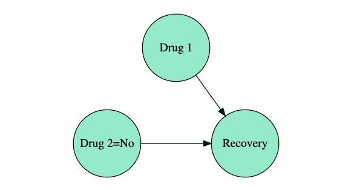

# 观察不是干预

> 原文：<https://towardsdatascience.com/observing-is-not-intervening-9fbd22679f44?source=collection_archive---------13----------------------->

## [偶然的因果推断](https://towardsdatascience.com/tagged/casual-causal-inference)

## 以及为什么条件概率是不够的

这是因果推理和数据科学系列文章的第三篇。前一个是[“用因果图！”](/use-causal-graphs-4e3af630cf64)下一个是“[解决辛普森悖论](/solving-simpsons-paradox-e85433c68d03)”。

在因果推断中，我们感兴趣的是测量变量 A(比如某种特定疾病的治疗方法)对另一个变量 B(比如康复的概率)的影响，这种影响通常来自观察数据。这意味着我们感兴趣的是测量 A =治疗与 A =未治疗病例之间恢复概率的差异。

在数据科学和机器学习中，我们习惯于使用**条件概率**，这似乎对这个目的很有用。但是，我们会用一个简单的例子看到，光有条件是不够的。

# 什么是条件反射

以值 *X=x* 为条件意味着，在 *X* 取的所有可能值中，我们选择值 *x.* 的特定样本，例如，如果我们有数据

选择 X=1 将导致

# 药店示例

想象一下下面的情况。我们去药店，因为我们感冒了。他们有两种不同的药物:药物 1 和药物 2。药物 1 更受欢迎，所以我们首先要求它:他们有 50%的时间，所以我们服用它，我们恢复。在另外 50%的病例中，90%的情况下他们有一种更贵的药物 2，我们买了它，也康复了。但是在剩下的 10%里，他们两种都用完了，所以我们保持冷静。

Drugstore selling diagram

*如果实验室停止生产药物 2 怎么办？我们康复的可能性有多大？答案似乎很清楚:50%的病例我们无法恢复。*

让我们看看，如果我们尝试用直接条件概率来回答这个问题，会发生什么。如果我们收集前面的信息，我们得到*药店销售表*。

Drugstore selling table

现在，在没有药物 2 的情况下，治愈的概率是多少？为此，我们需要选择对应于药物 2 =否的样本

No Drug 2 table

并计算恢复的概率

p(恢复中|药物 2 =否)= 50 /( 50 + 5) ~ 91%

这是一个完全不同的结果！

# 发生了什么事？！

我们可以使用因果图来模拟数据生成过程。

Data generation graph

这张图表反映了我们的观察数据。买药 2 看之前有没有买过药 1，恢复看买过哪些药。该过程产生的数据在上面的*药店销售表*中获得。

但是，我们关于缺少药物 2 的问题涉及不同的数据生成过程。其中药物 2 不再依赖于药物 1，因为药物 2 总是缺失。

Interventional graph

这个图被称为**干预图**，它模拟了如果没有药物 2 会发生什么。如果我们可以从这个图中采样数据，我们将获得*介入数据表*

Interventional data table

我们可以在新的概率分布 P _ intervened 下直接计算

p _ 干预(恢复|药物 2 =否)= 50 /( 50 + 50)= 50%

这是预期的结果。为什么直接条件概率不奏效？因为它们回答了关于由数据生成图生成的数据的问题。在某些情况下是可以的，但在这种情况下，这是不够的。

这个玩具练习是一个简单的例子，用来理解在一般情况下这种类型的分析所附带的问题。这里我们知道数据是如何产生的(因为我们做到了)。然而，获得介入数据表不会如此简单。简单的解决方法是，回到现实，停用药物 2 一段时间，然后测量有多少人康复。当然，在许多情况下，这将会产生很大的不良后果。

*因果推理的一个主要问题是，我们是否可以仅从收集的观察数据中从介入图中导出数据，而不必去现实中做实验*。意思是，在只有历史数据的介入图中，我们能得到恢复的概率吗？在下面的帖子中，我们将解释如何用经典的辛普森悖论得到这样的结果。