# 明显的动态规划

> 原文：<https://towardsdatascience.com/obvious-dynamic-programming-part-i-553ae1740c67?source=collection_archive---------8----------------------->

## 结合动态规划和机器学习

Photo by [Tatiana Rodriguez](https://unsplash.com/@tata186?utm_source=medium&utm_medium=referral) on [Unsplash](https://unsplash.com?utm_source=medium&utm_medium=referral)

这个世界上很多问题都是高效算法解决不了的。我的意思是没有比暴力更快的算法了。即使我们使用蛮力，对于很多问题我们也没有足够的时间来解决。因此，我们使用试探法来解决这类问题。试探法是寻找近似的解决方案。这些并不总是最好的解决方案，但仍然比随机的要好。

在开始我自己的探索之前，让我们看一个我提到的这种复杂问题的具体例子。

# 旅行推销员问题

旅行推销员问题(TSP)是一个很好的例子，因为每个人都能理解基本的问题集。想象一下，一名销售人员接受任务，向几个城市的潜在客户介绍一种特定产品。由于时间和资源的稀缺，销售人员必须以最优的顺序从一个城市到另一个城市，以便使用最短的路线。

为了找到最短的路径，销售人员必须计算所有可能解决方案的总距离。让我们假设有两个城市要去。这很简单，因为只有两种组合可以比较:

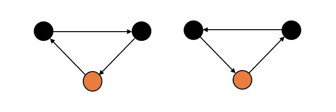

2 possibilities to travel to the customers from the orange head quarter

如果我们现在添加一个城市，我们会发现可能性会增加不止一个:

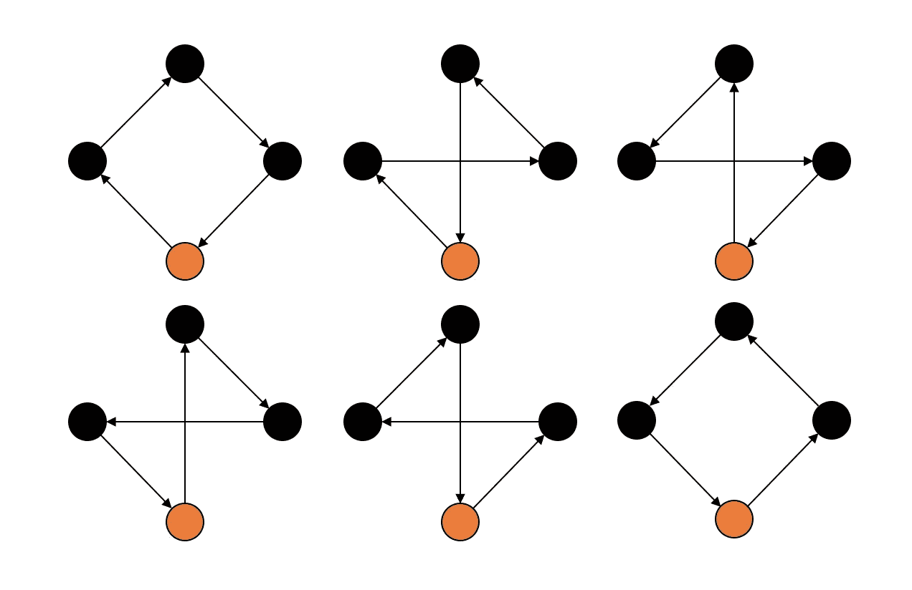

2 possibilities to travel to the customers from the orange head quarter

此外，第四个城市会将可能性空间增加 4 倍。每种可能性都会有 4 种额外的组合。你可以把这个想象成你想把新城放在四个箭头中的一个上。所以你有 6 乘 4 的可能性。这种增长是阶乘的。如果有 n 个城市，我们有 n 个 T2！可能性。因此，如果有 10 个城市:10 个，销售人员会计算很多来找到最佳解决方案！= 3.628.800 种可能性！

这种比较所有可能性的强力“算法”时间效率不高，但它是目前为止找到最优解的最好算法。但是，对于路由程序或其他具有阶乘复杂性的应用程序来说，这不是一个选项。

# 动态规划求解 TSP

使用强力算法时，组合的某些部分会被计算多次。动态编程解决了这个问题,“记住”已经计算过的行程，以找到比暴力更快的解决方法。缺点是动态规划是一种只能找到近似解的启发式方法。考虑到使用这种方法节省的时间，一个近似值就足够了。

在 TSP 的情况下，想象一个代表计划旅行的所有选项的决策树是有用的:

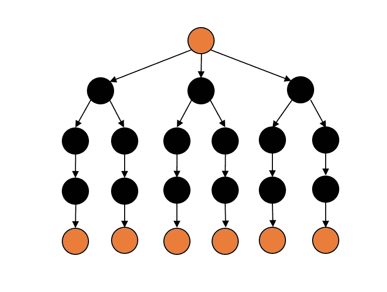

One track from orange to orange is one of the 6 possibilities when visiting 3 cities.

动态规划(DP)的概念是从橙色的叶子开始，然后回到单个橙色的根。而向上 DP 增加节点之间的距离并记住它们。一旦到达一个有多条出路的节点(如橙色根或第二行中的节点)，DP 就比较输出分支的距离，只记住较小的一条。

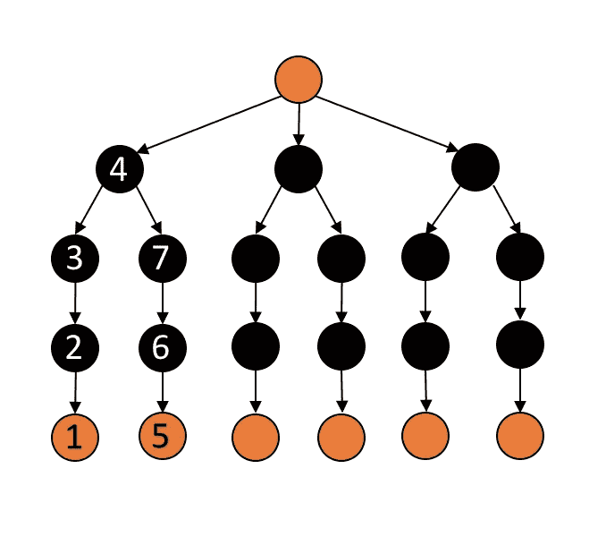

E. g., we start with the distance of 1<>2\. Add the distance of 2<>3 and the distance of 3<>4\. Then we start with the distance of 5<>6, add the distance of 6<>7 and the distance of 7<>4\. At 4 we have to compare the distances 1<>2<>3<>4 and 5<>6<>7<>4 to know which is smaller. The smaller one will then be used to continue going up.

这个概念也可以表述为递归函数:

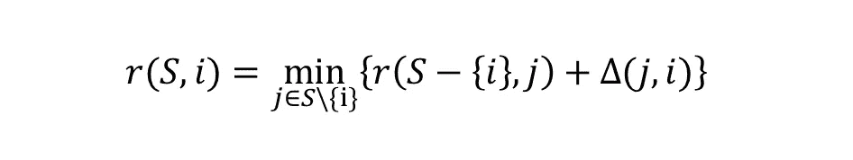

*r* 是取一组未去过的城市 *S* 的递归函数。 *r* 返回 *S* 中每个城市 *j* 的一个元素的集合的最小值，即 *i* 和 *j* 之间的距离加上城市 *j* 经过未访问城市(不含当前城市 *i* )到目的地的最佳距离。

# 明显的改进

动态编程是愚蠢的。它的唯一规则是比较每一个可能的组合，每一个…甚至一个被认为是:

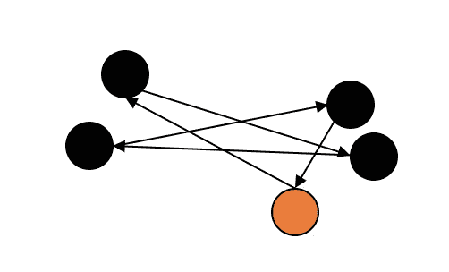

Very long route far from being optimal is also considered using DP

很明显，这种结合是无效的。但是算法不能考虑这样的事情。人类的直觉和视觉聚类使我们能够在寻找明显无效的组合时执行节拍 DP 算法。为了向更直观、更明显的方向改进 DP，我采用了数据挖掘的方法。

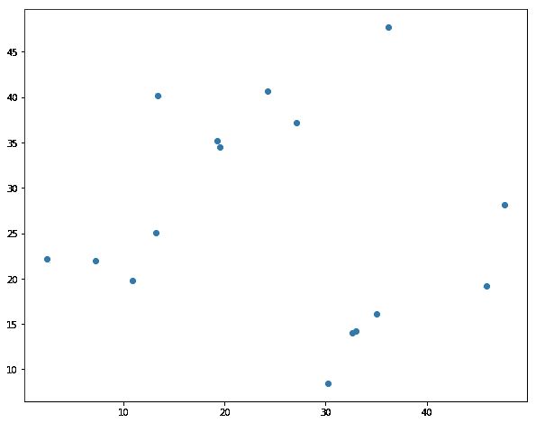

16 randomly distributed points

首先，我们取 16 个随机分布的点。乍一看，人眼可以立即将这些点连接起来，从而可以创建接近最优的解决方案。让我们以两对直接相邻的点为例。它们可能会相互连接。不幸的是，一个简单的 DP 算法将非常绝望，并试图将它们分开。

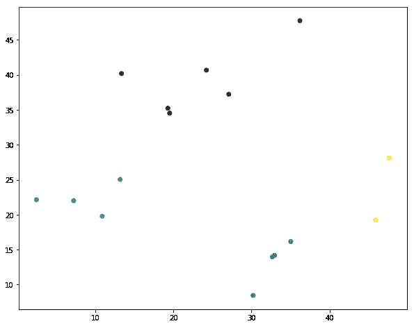

Clustered by KMeans

现在，让我们通过用 KMeans 算法对这些点进行聚类来给算法一点直观的感觉。在图中，我们看到 4 个集群。我们总共拿了 16 分。在选择一个聚类数之前，我将总数除以 4，以创建平均 4 个元素的小聚类。4 个元素有可能 4 个！= 24 种组合。这么小的一套，足够快 DP 就能解决。图中的这 4 个聚类类似于真人进行的直观聚类。

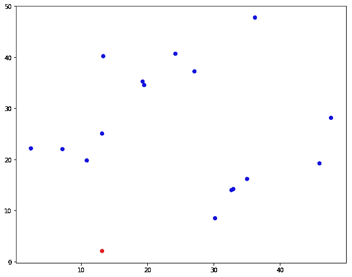

The salesperson’s start and end position illustrated as the red point

现在让我们也给销售人员一个随机的位置。红点是现在销售人员的位置。这个位置是整体的起点和终点。

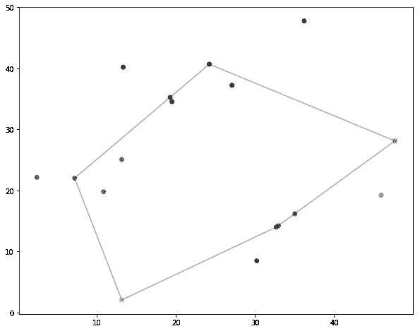

Solving TSP with Dynamic Programming on the clusters only

因为我们现在有了起点和集群，所以我们能够执行一轮 DP。这一轮将从销售人员的位置开始，并通过所有聚类找到近似最短的路线。每个群集的位置由群集到其质心的最近点定义。这一轮 DP 给了我们顶级订单。

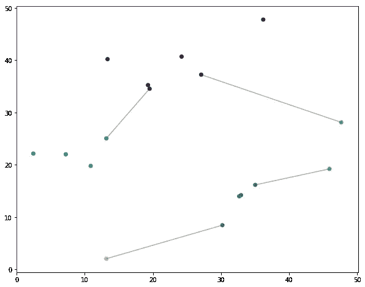

Closest connections between the successive clusters

下一步是找到连续聚类之间最近的点。因为我们已经发现了集群的顺序，所以我们知道哪个集群继承了另一个集群。因此，我们可以找到每个聚类对中彼此距离最近的两个点。这使得算法能够定义将在每个单个集群内发生的 DP 过程的起点和终点。

显而易见的动态规划的最后一部分是在每个单个簇中寻找最近的轨道。起点和终点已在之前的步骤中定义。一旦这样做了，我们就有了一个很好的近似最优解。

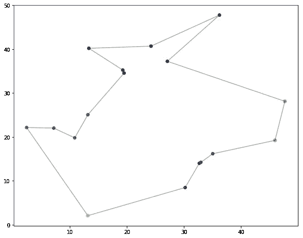

Final approximation to an optimal solution

当然，有些连接本可以做得更好。但是，如果您将执行该算法所花费的时间与经典的动态编程方法进行比较，您会发现我的方法所花费的时间只有几毫秒，而我在执行简单的动态编程方法 5 分钟后就停止了我的计算机。

在顶层，我们将所有点分成 4 个块。如果你总共有 16 个，顶级也只是一个 4 号的 DP。对于更大的尺寸，我们可以在不同的级别上执行该算法。

# 结论

提出的方法表明，动态规划不仅比较接近的可能解决方案，而且比较无意义的组合。最后，结果只是基于另一种启发，并不能保证是最好的解决方案。但是，它可以显著加快运行时间。