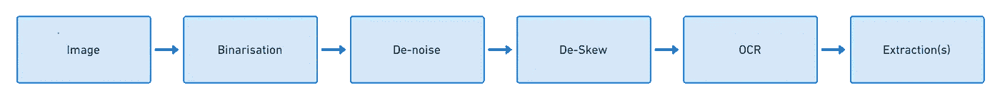

# 带有 Akka、Tesseract 和 JavaCV 的 OCR

> 原文：<https://towardsdatascience.com/ocr-with-akka-tesseract-and-javacv-part-1-702781fc73ca?source=collection_archive---------2----------------------->


我最近有一个用例，需要从 PDF 文档中提取姓名和日期。我认为，利用 google 的 tesseract 来执行基本的 OCR，构建一个快速的程序是非常容易的。只需几行代码，您就可以让 node-tesseract 在图像上运行 OCR。但是，如果图像是倾斜的、有噪声的或者其中有一堆图像，那么来自 tesseract 的文本结果将变得不可用。

Tesseract [文档](https://github.com/tesseract-ocr/tesseract/wiki/ImproveQuality#dictionaries-word-lists-and-patterns)列出了一系列预处理图像以提高 OCR 质量的方法:

*   重新缩放
*   二值化
*   噪声消除
*   旋转(去歪斜)
*   边界移除

从图像中提取文本需要很多步骤。我仍然需要执行日期提取和命名实体提取。问题是我不熟悉这些预处理和提取技术。所以我认为构建一个能够拥有可插拔架构的*系统*是一个好主意——我可以在学习如何实现它们时添加步骤。如果图像可以通过这些不同的转换阶段*流动*不是很好吗？😉



Akka Stream

## 旅程

让我们构建一个 REST 服务器，它接受图片作为上传，其中各个端点将返回各种结果。Tess4j 库有许多方便的方法，其中一些我们将用于图像去倾斜和二值化。我们将使用 JavaCV，一个 [OpenCV](https://opencv.org/) 包装器，用于图像去噪和一般增强。

> *我们最终将用*[*OpenNLP*](http://opennlp.apache.org/)*和*[*Natty*](https://github.com/joestelmach/natty)*以及使用拼写检查器* [*增强 OCR 输出——第 2 部分*](/enriching-ocr-with-akka-streams-7e48990be929) *。*

我拍了一本书的一页。这将作为系统的输入。注意图片的微小角度。


input.jpg

## 必需的软件库

*   [Tess4j](http://tess4j.sourceforge.net/)
*   [JavaCV](https://github.com/bytedeco/javacv)
*   [Akka HTTP/Streams](https://akka.io/)

让我们创建一个特征来保存宇宙魔方；我们稍后将能够混合这个。

现在，我们将使用 Akka Http 创建我们的基础应用程序，它将绑定到端口 8080。我们创建了一个 rest 端点，它将图像读入内存，并且不做任何处理。该端点最终将返回预处理的图像。

正如我们所看到的，我们的图像是类型`BufferedImage`的，我们可以使用 Tess4j 的助手方法来创建一个二进制图像。我们将创建一个 BufferedImage 流，它将帮助器函数映射到传入的 BufferedImages。二值化会将图像转换为黑白。这对于文本上有阴影的图像来说效果不好，但是我会在后面详细说明。

然后，我们可以再次使用 Tess4j 来消除图像的倾斜。让我们再创建两个流:一个用最小去歪斜角阈值去歪斜一个`BufferedImage`，另一个从一个`BufferedImage`获取字节，这样我们就可以将字节发送回客户端。

现在，我们可以将上述所有流程结合起来，更新我们的服务器。我们将利用内存中的映像制作一个`Source`，将流链接在一起，并将其传递给 Akka 的`complete()`方法。

对我们的服务器运行一个简单的 curl 将会返回我们预处理过的图像。

```
curl -X POST -F 'fileUpload=@/Users/duanebester/Desktop/blog/input.jpg' 'http://localhost:8080/image/process' --output output.png
```

这是我们的二进制，去歪斜的图像:


厉害吧！？现在我们已经有了流畅的一切，我们可以简单地添加更多的片段来进一步提升我们的形象。此时，我们可以将图像传递给 tesseract，并让它执行 OCR 以给出一个字符串。然而，我觉得 OpenCV 中有太多的图像处理魔法，我们应该使用。

## JavaCV 和 OpenCV

JavaCV 和 OpenCV 使用一个称为 Mat 的对象来执行它们的图像处理。面临的挑战是将 Java `BufferedImage`转换成 JavaCV `Mat`，然后再转换回来，下面是实现这一点的流程:

我们现在可以流一个`BufferedImage ~> Mat ~> BufferedImage`😎

OpenCV 有*fastnlmeansdexing*和 *detailEnhance* 方法，我们可以在`Mat`中使用它们——所以让我们将这些方法包装在`Flow[Mat]`中

## 我们现在可以

1.  创建二进制文件`BufferedImage`
2.  将其转换为`Mat`并增强
3.  将其转换回一个`BufferedImage`
4.  消除`BufferedImage`的偏斜，然后将其发送回客户端


A smoother & enhanced image

我们可以在这里添加缩放，这样我们就可以发送一个更小的图像，基本上是裁剪上面图像中的文本，以便 tesseract 进行处理，但还没有到那一步😅

*最后一个*部分是对`BufferedImage`执行 OCR，并将结果字符串发送回客户端。我们创建一个将返回一个`String`的`Flow[BufferedImage]`——我们还更新了我们的 web 服务器以添加这些额外的流。

当我们运行新的 curl 来获得 JSON 响应时:

```
curl -X POST -F 'fileUpload=@/Users/duanebester/Desktop/blog/input.jpg' 'http://localhost:8080/image/ocr'
```

我们得到我们的文本结果:

```
CHAPTER 1
THE COMPOUND EFFECT IN ACTION
You know that expression, ”Slow and steady Wins the
race”? Ever heard the story of the tortoise and the hare?
Ladies and gentlemen, I’m the tortoise. Give me enough
time, and I will beat Virtually anybody, anytime, in any
competition. Why? Not because I’m the best or the smartest
or the fastest. I’ll win because of the positive habits I’ve
developed, and because of the consistency I use in applying
those habits. I’m the world’s biggest believer in consistency.
I’m living proof that it’s the ultimate key to success, yet it’s
one of the biggest pitfalls for people struggling to achieve.
Most people don’t know how to sustain it. I do. I have my
father to thank for that. In essence, he was my first coach
for igniting the power of the Compound Effect.
My parents divorced when I was eighteen **mohths 01d**,
and my dad raised me as a single father. He **wasn t** exactly
```

页面朝着图片的底部变得波浪状，宇宙魔方认错了*个月大的*，忘记了*中的撇号不是*。尽管如此，我们在上述转换中实现了 99.67%的准确率！

正如你所看到的，有了这个系统，添加我们需要的部件非常容易。我们可以考虑获取字符串结果，并将其传递给更多的阶段，这些阶段可以执行某些拼写检查和名称/日期提取。

感谢并继续 [Part 2](/enriching-ocr-with-akka-streams-7e48990be929) ！

~杜安