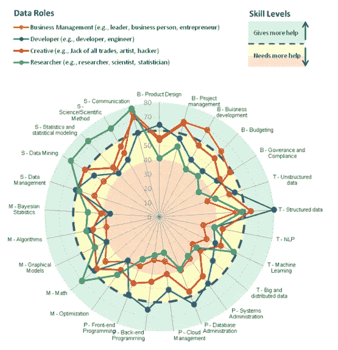
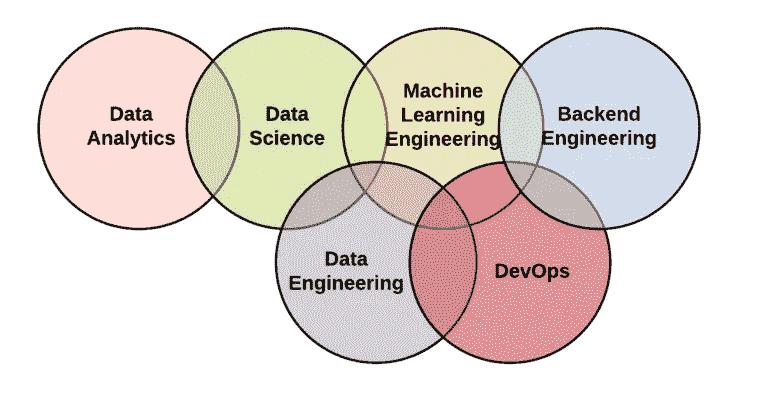
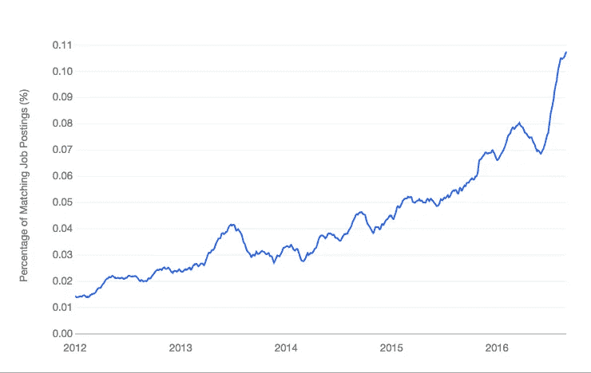

# A 型数据科学家的颂歌

> 原文：<https://towardsdatascience.com/ode-to-the-type-a-data-scientist-78d11456019?source=collection_archive---------4----------------------->

## 分解他们提供的影响，以及为什么下一代不关心

# 神话中的独角兽

你现在可能已经听说过难以捉摸的科学独角兽 d*a*了。如果你还没有，独角兽是在数据科学领域及其周围掌握了几种跨学科技能的专业人士。他们有你关于数据分析、机器学习、产品指标、大数据、实验、深度学习、商业敏锐度、领域知识等问题的所有答案。

这一罕见壮举的更好的可视化可以在下面的的[研究中看到，调查了 400 多名数据专家，他们对不同区域的舒适度进行了调查，这些区域可以被归类为真正的独角兽。](http://businessoverbroadway.com/data-science-skills-and-the-improbable-unicorn)

Source: [Business Over Broadway](http://businessoverbroadway.com/investigating-data-scientists-their-skills-and-team-makeup)

正如你可能想象的那样，找到一个在这些方面都擅长*的人肯定不容易；这几乎是不可能的。由于领先公司中的这种认识，我们开始看到在更广泛的数据科学领域中形成了专门的角色。*

这些[专业化](https://www.datasciencecentral.com/profiles/blogs/400-categorized-job-titles-for-data-scientists)包括机器学习工程师、数据工程师、数据分析师、产品科学家、核心数据科学家、数据研究员、定量分析师等职位，以及其他已经与更知名的数据科学家一起成为常见固定职位的角色。

Source: [Mindful Machines](https://mindfulmachines.io/blog/2018/3/17/the-flavors-of-data-science-and-data-engineering)

正如您在上面所看到的，这些角色之间总会有一些重叠。这通常取决于[每家公司](https://eng.lyft.com/whats-in-a-name-ce42f419d16c)、他们的数据生态系统以及他们的未来目标。信不信由你，事情不会就此停止。我们可以进一步分解它。

# A 型与 B 型

数据科学界许多备受尊敬的人士尝试对不同类型的数据科学家进行分类。然而，没有人比潘多拉公司的前研究主管迈克尔·霍彻斯特博士更有效了，他在 Quora 上给出了以下答案:

> **A 型数据科学家:A 是做分析的。**这种类型主要与理解数据或以相当静态的方式处理数据有关。A 型数据科学家非常类似于统计学家(也可能是一名统计学家)，但他们知道统计学课程中没有教授的所有数据处理的实际细节:数据清理、处理非常大的数据集的方法、可视化、特定领域的深入知识、写好数据等等。
> 
> B 型数据科学家:B 代表建筑。B 型数据科学家与 A 型共享一些统计背景，但他们也是非常强的编码员，可能是训练有素的软件工程师。B 型数据科学家主要对“在生产中”使用数据感兴趣他们建立与用户互动的模型，通常提供推荐(产品、你可能认识的人、广告、电影、搜索结果)。

这些描述主要适用于在行业中使用数据科学，但我发现它们在我的经验中非常准确。同样值得注意的是，这些分类不是确定的，当然也不是一成不变的。你可能拥有两种类型的[混合技能](https://www.quora.com/profile/Michael-Hochster)，这没什么不好。事实上，如果做得正确，它实际上可以带来独特的、无价的技能组合，有助于创造性和有效的解决方案。

# 下一代

如果你在最近的新闻中看到数据科学，无论是《T4》《纽约时报》的一篇特写还是 TechCrunch 的一篇文章，都有可能关注机器学习和人工智能的影响。

这是有充分理由的。人工智能和机器学习的发展将继续对我们所有人的生活产生越来越深远的影响。这种现象以这样或那样的方式影响着地球上的每个人，大量的媒体报道反映了这一点。考虑到这一点，让我们来探讨一个该领域的任何领导者都应该牢记的重要问题:

> **这对下一代数据科学家意味着什么？**

如果您还记得我们对数据科学家的深入分类，这些令人兴奋的新技能非常符合*类型 B* 的描述，重点是在生产中处理数据时构建和部署模型。

很明显，像机器学习这样的数据技能目前被更多的炒作和吸引力所包围。出于这个原因，有抱负的数据科学家正在进入这个领域，他们的目光瞄准了这个基于 ML 的特殊技能集。

我的意思是，谁不想建立让你预测未来的机器学习模型？谁不对模仿人脑的推荐系统和神经网络着迷呢？

Source: [Machine Learning Mastery](https://machinelearningmastery.com/python-growing-platform-applied-machine-learning/)

对这些技能的需求肯定是存在的，正如大量数据驱动的[教育](https://www.cmu.edu/news/stories/archives/2018/may/ai-undergraduate-degee.html)倡议和目前[快速增长的](https://www.theverge.com/2017/12/5/16737224/global-ai-talent-shortfall-tencent-report)人工智能和人工智能工程师库所证实的那样。

但是，这种心态有点短视。尽管标题和[流行语](https://www.makebullshit.com/)暗示，大多数问题都不能用机器学习来解决。

我想利用这篇文章的剩余部分来论证与经常被忽视和低估的*A 型*数据科学家*相关的技能和行动所提供的价值。*

**我为什么要关心 A 型数据科学家？很高兴你问了…**

# 他们回答困难的问题

*A 型*数据科学家从数据中提取信息，以探索和回答通常由领域专家、商业领袖或管理层提出的复杂问题。这看起来并不那么迷人，数据科学也是如此——事实并非如此。您几乎总是需要处理和清理一些数据。

然而，一旦你过了这个阶段，事情就会很快变得有趣起来。对于提出的问题，很少有直接的答案。你必须有创造力，想出一条看似无限的路线来往下走。

> “批判性思维技能将黑客与真正的科学家区分开来”——杰克·波威

这是这个职业给许多人带来的后果。然而，我不敢苟同。分析和解决问题的无限方法在很大程度上使得数据科学对如此庞大的人群如此具有挑战性和趣味性。

# 他们让复杂变得简单

可以说，数据科学家可能拥有的最重要也是最容易被忽视的技能是简单而彻底的沟通。解构复杂的解决方案并将其打包，以便业务领导、产品经理或用户能够理解，这不是一个小任务。

> “数字本身无法说明问题。我们为他们说话。在我们要求更多的数据之前，我们需要对自己提出更高的要求。”——Nate Silver

我们[表达数字](http://www.martinsights.com/?p=1256)的方式可以有很大的不同；这些包括演示技巧、数据故事、数据可视化、商业洞察力和技术写作。能够决定使用这些工具中的哪一个，并以一种有效的方式这样做并不容易，但这非常令人满意。

# 他们始终推动影响

很自然，你的结果取决于他们的影响力。*A 型*数据科学家通常会有机会比他们的*B 型*同行在日常工作中产生更多影响。你不用花时间在特性工程和迭代模型上，而是探索直接影响业务或产品决策的问题。

> "没有任何伟大的营销决策是基于定性数据做出的."—约翰·斯卡利

对于*A 型*数据科学家来说，增值的转变也要快得多。您将会得到一致的工作反馈，因此，您将有机会作为一名数据科学家快速成长。

# 强行推销

这篇文章的重点不是阻止任何人专注于开发机器学习工具包来构建强大的模型。就我个人而言，我每天都花时间来发展这些技能。我还认为，在生产中使用数据是一个非常有用的工具，可以以独特的方式扩展您的项目并影响业务。

简而言之，*B 型*数据科学无疑也有它的优势。每种技能组合处理生态系统中非常不同的部分。这两种类型都生活在更大的、快速发展的数据科学城市的不同社区。

然而，我相信，由于围绕机器学习和人工智能的炒作，目前绝大多数即将到来的数据人才都被吸引到 B 型工作。出于这个原因，我担心与*A 类*数据科学相关的有效技能，主要是处理分析和交流的技能，会被忽视。

> 虽然分析和交流可能不像机器学习那样性感，但现实是它们在行业中提供了最一致的影响。

在一个数据是新石油的世界里，利用分析来解决问题是一件非常有力量的事情。当然，你有时会被卡住。这就是努力工作的好处。总有另一个挑战需要解决。另一个需要解决的问题。另一个要回答的问题。

**对于那些问题，我们有*A 型*数据科学家。**

感谢阅读！如果你喜欢这篇文章，请继续向鼓掌按钮展示你的爱。如果你对未来的更多帖子感兴趣，请确保[关注我](https://twitter.com/cdeweyx)并订阅下面的[我的简讯](https://www.conordewey.com/)以接收任何新内容。更多关于我和我在做什么，请查看[我的网站](https://www.conordewey.com/)。