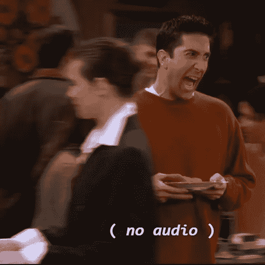
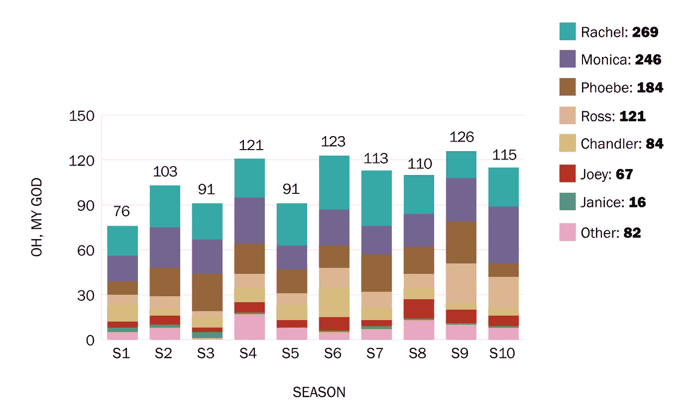
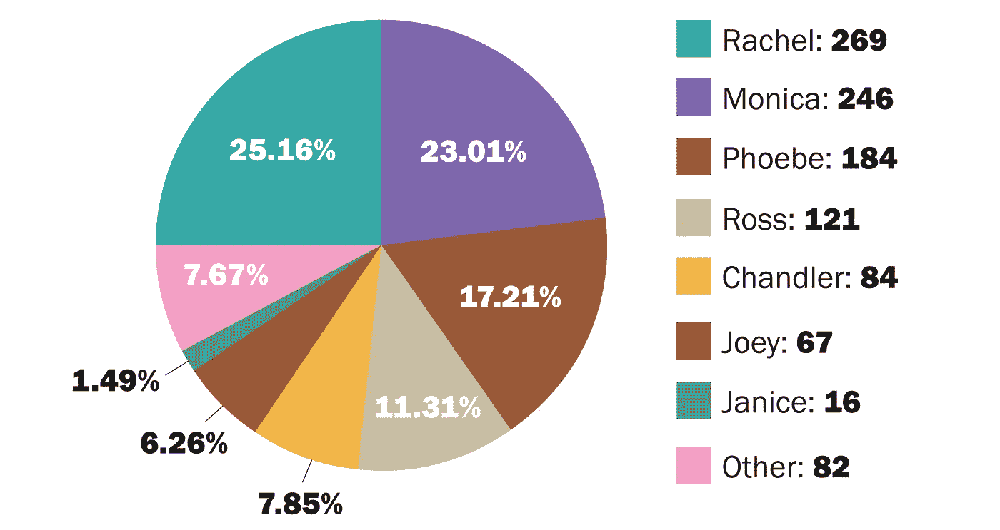
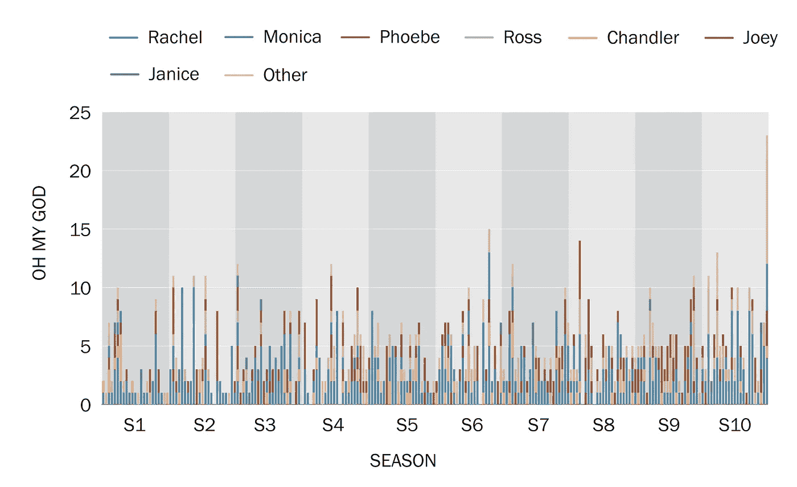
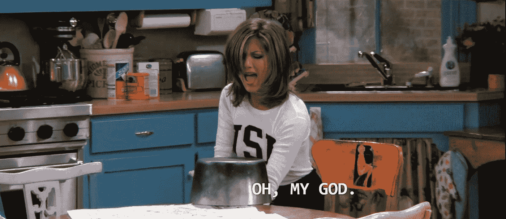
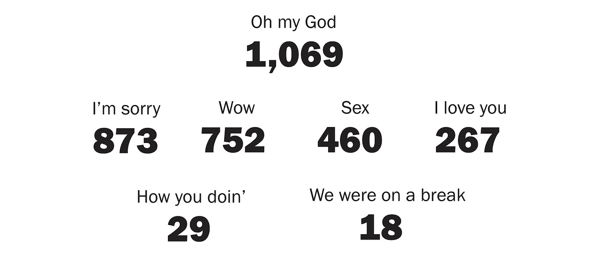
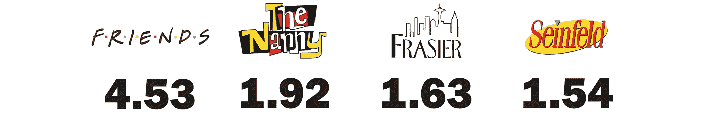
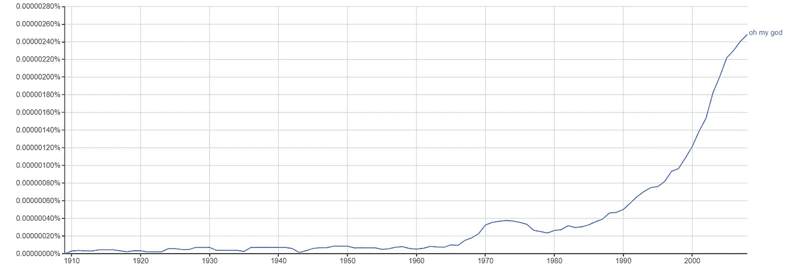
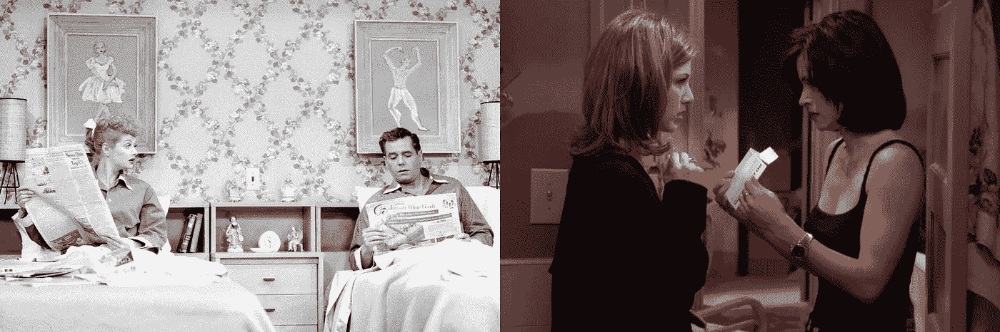

# 哦，我的天啊！

> 原文：<https://towardsdatascience.com/oh-my-god-cb69dd74839c?source=collection_archive---------9----------------------->

## 最近看了 90 年代的经典电视节目《老友记》之后，我认为“哦，我的上帝”这句话说得太离谱了——现在我有数据可以证明这一点。

> “‘哦，我的上帝！’常用作感叹词，强调惊讶、愤怒或震惊。"
> 
> — [Quora](https://www.quora.com/What-is-the-origin-of-the-common-phrase-%E2%80%9COh-My-God%E2%80%9D)

# 汇编数据

利用《老友记》电视节目的 [**抄本**](https://fangj.github.io/friends/) ，我搜索了全部 236 集的对话，以确定每个角色说“哦，我的上帝”的频率。

## 包括什么？

必须说出“哦”、“我的”和“上帝”这三个词(按此顺序)才能包含在计数中。允许字符暂停或向短语添加额外的单词。以下是一些可接受的例子:

## 不包括什么？

其他提到上帝，但不符合上述要求的短语将不会被计算在内。下面列出了一些例子:

[Season 3, Episode 5](http://www.livesinabox.com/friends/season3/305frank.htm): Sorry Ross — Mouthing the words “Oh my God” will not be tallied.

# 结果呢

《老友记》在 NBC 电视台成功播出了 10 季(1992-2003)。在此期间，这句话“哦，我的上帝”被说了 1069 次*。下面我们来看看详细的结果:

第九季以 126 分代表了“天啊”狂潮的巅峰。

一些粉丝可能会认为扮演贾尼斯的女演员玛姬·惠勒会是我们的“哦，我的上帝”冠军(因为这是她的标志性对白)。

Maggie Wheeler portrayed Janice in 19 episodes of Friends.

然而，惠勒女士只在《老友记》的 19 集中出现过，她根本没有机会对抗我们过于戏剧化的主角。

莫妮卡和瑞秋占了“哦，我的上帝”话语总数的近 50%。

罗斯在大结局时非常激动，他说了 9 次“哦，我的上帝”。

## 有趣的发现

*   《老友记》一集的平均时长是 20-22 分钟。因此，“哦，我的上帝”大约每 5 分钟说一次！
*   只有 8 集“我的天啊”是*不是*说的。
*   该系列的大结局一集包含了在一集里最多提及的“哦，我的上帝”，共有 23 次。公平地说，这一集被认为是两集。
*   在第十季中，莫妮卡拥有单季 38 次“哦，我的上帝”惊呼的记录。
*   瑞秋是《哦，我的上帝》中被提及次数最多的角色，共有 269 次。在 10 季中的 6 季里，瑞秋是说“哦，我的上帝”最多的人。她也是在 10 集的单集中被提及次数最多的角色。👇

[Season 2, Episode 4](https://fangj.github.io/friends/season/0204.html): Rachel encounters a pigeon and shouts “Oh my God” (at least) 10 times.

# 重要比较

好吧，那么这些年轻的、令人难以置信的朋友们说了 1050 多次“哦，我的上帝”——是不是很多？让我们比较一下“哦，我的上帝”和《老友记》中其他一些流行的美国英语单词/短语。

A search of the Friends transcripts indicates that “Oh my God” was said much more frequently than these other common words, phrases, and Friends-specific catch phrases.

> “表达‘哦，我的上帝！’…[是]20 世纪 80 年代圣费尔南多“山谷语”流行文化兴起的一部分。"
> 
> — [Quora](https://www.quora.com/What-is-the-origin-of-the-common-phrase-%E2%80%9COh-My-God%E2%80%9D)

因为“哦，我的上帝”这一表达方式在 20 世纪末变得更加流行，也许它也经常出现在那个时代其他流行的情景喜剧中？

没有。《老友记》似乎自成一类。

The estimated average amount of times “Oh my God” is spoken per script in popular ’90s sitcoms.**

# 结论

“哦，我的上帝”似乎经常出现在《老友记》中，对此我很恼火，于是我在网上搜索了一下，看看是否有傻瓜统计过这个短语在节目中出现了多少次。当搜索没有返回确定的答案时，我意识到我可能就是那个傻瓜！完成任务后，我开始在指标中寻找更深层次的意义。

自从《老友记》第一集播出以来，文本中提到“哦，我的上帝”的次数增加了两倍，这是巧合吗？

[Google Ngram](https://books.google.com/ngrams/graph?content=oh+my+god&year_start=1909&year_end=2008&corpus=15&smoothing=3&share=&direct_url=t1%3B%2Coh%20my%20god%3B%2Cc0) measures the frequency of an phrase in text sources printed between 1500 and 2008.

许多人认为说“哦，我的上帝”[违反了第十条戒律](https://radicallychristian.com/is-it-wrong-to-say-oh-my-god)并且轻视了上帝的名字。《老友记》是否对保守价值观的急剧转变负有部分责任？

1951: Married couple Lucy and Ricky sleep in separate beds (left). 1996: Roommates Monica and Rachel argue over who will use the last condom (right) to engage in premarital sex. An argument that is ultimately settled with a game of Rock-Paper-Scissors.

《老友记》是否描绘了一种过于随意和进步的不切实际的生活方式？从而导致近年来美国的钟摆向相反的方向摆动？

🤔我认为这些问题最好改天在另一篇文章中回答，可能由比我聪明得多的博客作者来回答。

*数据假设记录完整准确。我尽了最大努力获得准确的人工计数。

* *估计基于对每部情景喜剧一季的分析。《弗雷泽》(第二季)、《宋飞正传》(第四季)和《保姆》(第二季)。季节是随机选择的，但为了确保可比的样本量，精选了 20 多集。