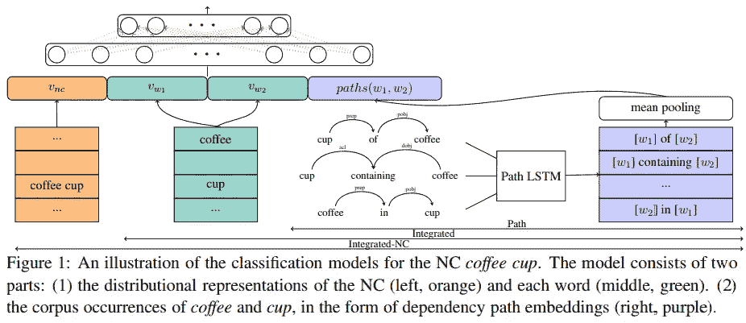
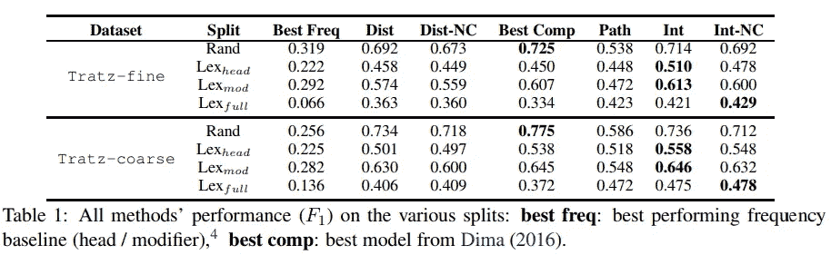
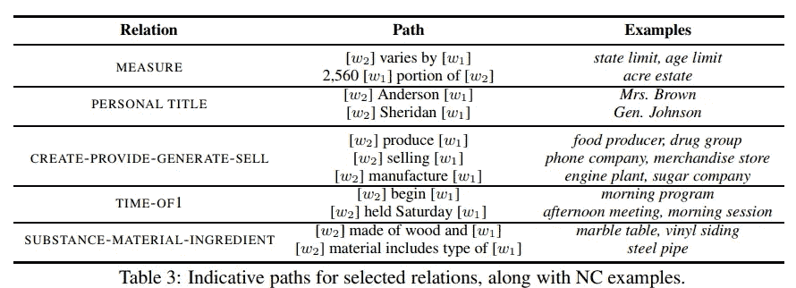
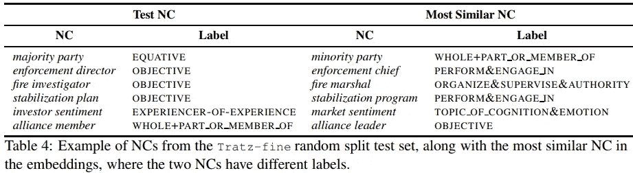

# 橄榄油是橄榄做的，婴儿油是给婴儿做的[论文摘要]

> 原文：<https://towardsdatascience.com/olive-oil-is-made-of-olives-baby-oil-is-made-for-babies-paper-summary-265bea33605b?source=collection_archive---------10----------------------->

本文总结了一种新颖的技术，用于自然语言处理中的一项非常复杂的任务，即名词复合分类。

***论文题目***

[橄榄油是由橄榄制成的，婴儿油是为婴儿制造的:用神经模型中的释义解释名词复合词](https://arxiv.org/pdf/1803.08073.pdf)*——Vered shw artz 和 Chris Waterson*

***基本概述***

这篇[论文](https://arxiv.org/pdf/1803.08073.pdf)解决了一个重要的自然语言处理任务——自动解释名词复合成分之间的关系。

***动机***

考虑下面的名词复合词例子: ***橄榄油*** 和 ***婴儿油*** 。可以观察到， ***【橄榄油】*** 中的 ***【橄榄】*** 一词描述的是来源关系， ***【婴儿油】*** 中的 ***【婴儿】*** 一词描述的是目的关系。换句话说，就婴儿在现实世界中所代表的意义而言，他们永远不应该被放在与橄榄相同的环境中。这种区别很重要，因为它可以用于需要复杂文本理解能力的各种应用程序。

**例子*例子*例子**

想象一下，你问谷歌搜索橄榄油是由什么组成的。如果谷歌搜索是聪明的，它应该回应“橄榄”。现在想象一下，你问谷歌婴儿油是由什么组成的。绝对不是婴儿！答案应该是油的其他成分或者油的主要成分。这是一个非常重要的区别！这是一项具有挑战性的任务，因为这两种油的含义都不容易解释给定其组成单词的含义。

你能想出更多的例子吗？试一试，你就会明白为什么 NLP 研究的这个领域很重要。作为一名 NLP 研究人员，我甚至可以看到这对于消除情感短语之间的歧义是多么有用。(在另一篇文章中有更多关于这方面的内容。)

***文献综述***

两种非常常见的方法被用来解决这个问题: ***释义*** 和 ***名词复合表示*** 。第一种方法映射成分之间的关系，后一种方法利用单个成分的分布表示。(不要慌，我一会儿解释他们的意思。)

最近的一项工作[(马頔，2016)](https://doi.org/10.18653/v1/W16-1604) 表明，成分嵌入可以有效地表示名词性复合词(以下简称 NCs)。这种方法有效的主要原因在于一种被称为[词汇记忆](http://www.aclweb.org/anthology/N15-1098)的现象。

***贡献***

本文提出了一种结合路径嵌入(代表名词短语之间的关系)和分布信息(直接从单词嵌入中获得)的神经释义方法来执行名词短语分类任务。作者还对避免词汇记忆的设置进行了实验，以表明他们的方法更加稳健，他们的结果与这一现象无关。

***型号***

作者使用 [HypeNET](http://www.aclweb.org/anthology/P16-1226) 来学习连接语料库中成分实例的联合出现的模式。这些也被称为*路径嵌入*。

结合三种模型进行 NCs 关系分类:*基于路径的*、*集成的*和*集成的-NC* 。每个模型递增地添加新的特征(在这种情况下是不同的分布式输入),这实质上向整个输入向量添加了更多上下文化的信息。在下图中可以更清楚地看到这一过程:

路径嵌入(图中紫色部分)是用一个普通的 LSTM 学习的，输入向量表示下列向量的连接:*引理*、*词性标签*、*依存标签*和*方向向量*。(详见论文)。NC 标签(关系)通过 LSTM 的输出使用[远程监控](https://en.wikipedia.org/wiki/Semi-supervised_learning)方法获得。

***评价***

从 [Tratz (2011)](http://digitallibrary.usc.edu/cdm/ref/collection/p15799coll3/id/176191) 获得的两个数据集用于评估提出的神经释义模型。提出了几个比较模型，包括几个基线模型和从以前的工作和最新方法中采用的重新训练模型。(有关实验设置的更多详细信息，请参见论文)。

表 1 显示，在大多数情况下，集成模型( *Int* 和 *Int-NC* )在使用不同的数据拆分策略方面优于所有其他模型(显示在拆分列中)。从 ***Int*** 模型和 ***Int-NC*** 模型获得的结果之间几乎没有差别，表明 NC 嵌入对分类任务没有太大贡献。

***分析***

对随机分裂策略进行了进一步的分析，以分析不同模型的结果的变化。在表 3 中，您可以观察到产生合理性能的一些关系(例如，度量和个人头衔)

作者还发现复杂关系表现不佳，如 NC 的词汇化，“*肥皂剧”*和 NC 的目标，“*恢复计划”。*(见文中更有趣的例子)。

下面的表 4 提供了从测试集获得的 NC 嵌入的例子(*左*)和嵌入中最相似 NC 的例子(*右*)。作者观察到只有 27.61%的 NCs 与具有相同标签的 NCs 非常相似。他们将这种行为归因于不一致的注释，而不是嵌入的质量。

***我的*** ***进一步的想法和结论***

*   可视化 NC 向量嵌入，以观察可能具有相似属性的关系簇和模式。
*   更仔细地研究词汇记忆现象，本文使用整个模型中基于路径的部分来帮助*【轻微】*解决这个问题。
*   总体而言，性能得到了提高，但在数据质量和建模方面仍有很大的改进空间。
*   NC 嵌入对当前模型没有帮助，因此它在不改变模型整体结构的情况下提供了一个可行的未来研究方向。

***资源***

*   [原文](https://arxiv.org/pdf/1803.08073.pdf)|[|*代码库*](https://github.com/tensorflow/models/tree/master/research/lexnet_nc) *(Tensorflow 实现)*