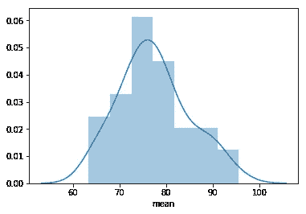
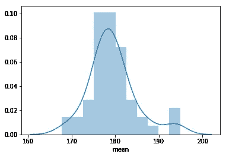
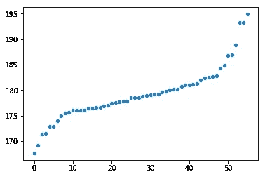
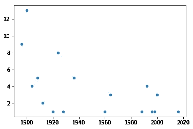

# 使用 Python 的 Pandas 和 SeaBorn 从 Kaggle 数据集提取洞察

> 原文：<https://towardsdatascience.com/olympics-kaggle-dataset-exploratory-analysis-part-2-understanding-sports-4b8d73a8ec30?source=collection_archive---------10----------------------->


Data Science is the science of patterns. Source: [Pixabay](https://pixabay.com/en/peacock-feathers-feather-color-3617474/)

好奇心和直觉是数据科学家最有力的工具。第三个可能是熊猫。

在我的上一篇文章中，我向你展示了如何了解一个数据集有多完整，如何绘制一些变量，以及如何观察一段时间内的趋势和倾向。
为此，我们在 Jupyter 笔记本上使用 [Python 的熊猫框架](/exploratory-data-analysis-with-pandas-and-jupyter-notebooks-36008090d813)进行数据分析和处理，使用 Seaborn 框架进行可视化。

在上一篇文章中，就像在这篇文章中一样，我们使用了 Kaggle 的 [120 年奥运会数据集，并观察了女性随时间的参与情况、运动员的体重和身高分布以及其他变量，但没有使用关于每位运动员参加哪项运动的数据。
这一次，我们将关注数据集的 Sport 列，并获得一些关于它的见解。](https://www.kaggle.com/heesoo37/120-years-of-olympic-history-athletes-and-results#athlete_events.csv)

我能想到的几个问题是:

*   什么运动适合胖人？高个子呢？
*   哪些运动比较新，哪些比较老？有什么运动实际上失去了奥运会的青睐，不再被玩了吗？
*   有没有一些运动总是相同的队伍赢？最多样化的运动呢，获胜者来自许多不同的地方？

和以前一样，我们将使用[这个 Github 项目](https://github.com/StrikingLoo/Olympics-analysis-notebook)进行分析，您可以派生它并添加您自己的分析和见解。让我们开始吧！

# 体重和身高

对于我们的第一个分析，我们将看看哪些运动有最重和最高的运动员，哪些运动有最轻或最矮的运动员。
正如我们在上一篇文章中看到的，身高和体重在很大程度上取决于性别，我们对男运动员的数据比对女运动员的多。因此，我们将对男性进行分析，但同样的代码只需切换“性别”过滤器就可以对两者进行分析。

如你所见，如果我按运动项目分组，我可以得到每个运动项目的运动员的最小、最大和平均体重和身高。
然后，我查看了前 5 项最重的运动，发现如下(以千克为单位):

```
Sport             min  max  average 
Tug-Of-War       75.0 118.0  95.61 
Basketball       59.0 156.0  91.68 
Rugby Sevens     65.0 113.0  91.00 
Bobsleigh        55.0 145.0  90.38 
Beach Volleyball 62.0 110.0  89.51
```

不算太意外吧？拔河练习者，篮球运动员，橄榄球运动员都很重。有趣的是，篮球和橄榄球运动员的体重差异很大，从 59 公斤到 156 公斤不等，而大多数拔河运动员都超过 80 公斤。
然后我画出了每项运动的平均体重，发现它呈正态分布:

```
sns.distplot(sport_weight_height_metrics.Weight.dropna()['mean'])
```



身高具有类似的正态分布，但其方差要小得多，高度集中于平均值:



接下来，我开始用有序散点图绘制所有单个平均值，看看是否有异常值。


事实上,“最重”的运动相对于图表的其他部分来说是非常异常的，同样的情况也发生在“最轻”的运动上。如果我们观察身高，尽管方差明显较小，但该图揭示了“异常值”和接近平均值的人之间更大的差异，强调了大多数人并没有真正偏离它很多的事实。



对于最轻的运动，可以使用之前生成的变量 *plot_data* 获得结果。

结果(忽略最重的，因为我们已经看到了)如下:

```
lightest: 
Gymnastics:      63.3436047592 
Ski Jumping:     65.2458805355 
Boxing:          65.2962797951 
Trampolining:    65.8378378378 
Nordic Combined: 66.9095595127
```

所以体操运动员，即使是男运动员，也是迄今为止最轻的选手！紧随其后的是跳台滑雪、拳击(这让我有点吃惊)和蹦床，这实际上很有意义。

如果我们转而寻找最高和最矮的运动员，结果就没那么令人惊讶了。我想我们都期望同样的运动会出现在顶部，不出所料，它确实出现了。至少我们现在可以说这不是一个刻板印象。

```
shortest (cm): 
Gymnastics:    167.644438396 
Weightlifting: 169.153061224 
Trampolining:  171.368421053 
Diving:        171.555352242 
Wrestling:     172.870686236 tallest (cm): 
Rowing:           186.882697947 
Handball:         188.778373113 
Volleyball:       193.265659955 
Beach Volleyball: 193.290909091 
Basketball:       194.872623574
```

所以我们看到体操练习者很轻，而且很矮。但是这些排名中的一些项目并没有出现在重量级项目中。我想知道每项运动的“体格”(体重/身高)如何？

该图看起来非常线性，直到我们到达最大离群值所在的顶部:


Build (Weight/Height) distribution of Olympics’ athletes

以下是建造最少和最多的体育项目:

```
**Smallest Build** (Kg/centimeters) 
Alpine Skiing    0.441989 
Archery          0.431801 
Art Competitions 0.430488 
Athletics        0.410746 
Badminton        0.413997 
**Heaviest Build** 
Tug-Of-War     0.523977 
Rugby Sevens   0.497754 
Bobsleigh      0.496656 
Weightlifting  0.474433 
Handball       0.473507
```

所以橄榄球和拔河仍然是最重要的运动，这次高山滑雪是最不重要的，射箭和艺术比赛(我刚刚知道这是奥运会项目，需要进一步研究)紧随其后。

# 运动随时间推移

现在我们已经用这三列做了所有我能想到的有趣的事情，我想开始看看时间变量。具体是哪一年。我想看看奥运会是否引入了新的运动项目，什么时候引入的。但也不赞成使用。

这段代码通常在我们需要查看某件事情第一次发生的任何时候都很有用，尤其是当我们想要查看变量的异常增长时。

图表向我们展示了每年有多少项运动首次出现在奥运会上。或者，换句话说，每年有多少运动被引进:



因此，尽管许多运动在 1910 年以前就有了，而且大部分是在 1920 年以前引进的，但也有许多相对较新的引进。查看数据，我看到 1936 年引入了许多新运动，之后它们总是以小规模(少于五个运动)引入。【1936 年至 1960 年间没有任何新的运动项目，冬季两项被引入，然后他们很有规律地增加新项目:

```
Sport           introduced
Biathlon           1960
Luge               1964
Volleyball         1964
Judo               1964
Table Tennis       1988
Baseball           1992
Short Track Speed Skating 1992
Badminton           1992
Freestyle Skiing    1992
Beach Volleyball    1996
Snowboarding        1998
Taekwondo           2000
Trampolining        2000
Triathlon           2000
Rugby Sevens        2016
```

对被否决的运动的类似分析(其中 max year 不是最近的)显示了这些运动的列表，其中大多数我从未听说过(尽管这绝不是一项运动是否受欢迎的好指标！)

```
Basque Pelota    1900
Croquet          1900
Cricket          1900
Roque            1904
Jeu De Paume     1908
Racquets         1908
Motorboating     1908
Lacrosse         1908
Tug-Of-War       1920
Rugby            1924
Military Ski Patrol 1924
Polo             1936
Aeronautics      1936
Alpinism         1936
Art Competitions 1948
```

我们看到艺术比赛在 1948 年被取消，马球从 1936 年起就没有在奥运会上出现过，航空学也是如此。如果有人知道航空学到底是什么，请让我知道，我在想象飞机上的人，但不知道竞争会是什么样的。也许是飞机比赛？让我们把那些拿回来！

各位，今天就到这里吧！我希望你喜欢这篇教程，也许你会在下次家庭聚餐时提出一个新的有趣的事实。
像往常一样，随意从这个分析中分叉代码，添加自己的见解。作为跟进，我正在考虑训练一个小型机器学习模型，根据运动、体重和身高栏预测运动员的性别，告诉我你会使用什么模型！如果你觉得这篇文章中的任何内容没有得到恰当的解释，或者仅仅是错误的，也请告诉我，因为我也在从中学习！

*关注我，获取更多数据分析文章、Python 教程和其他任何与数据相关的东西！如果你喜欢这篇文章，请在 twitter 上与你的数据朋友分享。*

*最初发表于*[*www . dataden . tech*](http://www.dataden.tech/olympics-kaggle-dataset-exploratory-analysis-part-2-understanding-sports/)*。*