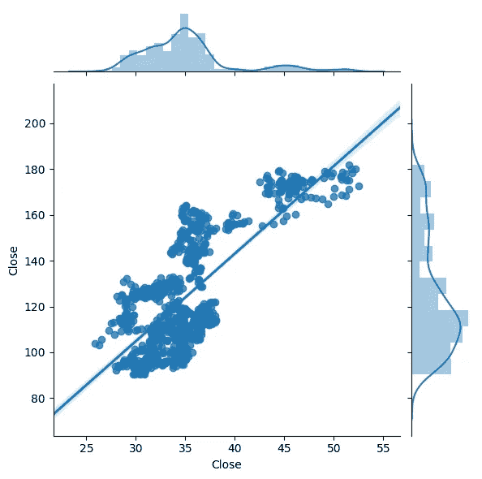

# 用 Python 和数据科学赚钱— 1:设置和统计

> 原文：<https://towardsdatascience.com/on-making-money-with-python-and-data-science-1-setup-and-statistics-1d69f1a68661?source=collection_archive---------4----------------------->

# 介绍

在我目前与 [Metis](https://www.thisismetis.com) 的研究休假期间，我有了一个惊人的机会——早就应该——将我每天教授给金融部门的数据科学和机器学习技术应用于实践。在这一系列的文章中，我将向您展示如何开始构建您自己的财务模型！

首先，我要感谢 [Quandl](https://www.quandl.com) 的团队，感谢他们令人惊叹的、易于使用的平台，以及 Quantopian 社区提供的丰富资源和灵感！

这绝不是一本“高级”指南，在这里，我应该提到:

> 此处提供的信息和附带材料仅供参考。不应将其视为法律或财务建议。您应该咨询律师或其他专业人士，以确定什么最适合您的个人需求。
> 
> 对于使用其内容可能获得的任何结果，Jonathan 不作任何保证或其他承诺。在没有咨询自己的财务顾问、进行自己的研究和尽职调查之前，任何人都不应做出任何投资决定。在法律允许的最大范围内，如果任何信息、评论、分析、意见、建议和/或推荐被证明是不准确、不完整或不可靠的，或导致任何投资或其他损失，Jonathan Balaban 概不负责。
> 
> 哦，还有，过去的表现不是未来结果的可靠指标等等等等…

很好，现在我们来看看定义和设置！

# 定义和假设

## 什么是交易算法？

来自 Quantopian:

> 交易算法是一个计算机程序，它定义了一套买卖资产的规则。大多数交易算法基于数学或统计模型做出决策，这些模型来自对历史数据的研究。

## 我们使用的是什么平台？

我使用 [Anaconda](https://anaconda.org) 、 [Jupyter Notebooks](http://jupyter.org) 和 [PyCharm](https://www.jetbrains.com/pycharm/) 在 Python 中建模，使用这些工具最容易理解。然而，您可以使用 Quantopian 平台的内置内核，或者如果您愿意，甚至可以将代码修改为 R 或其他语言。

我也在 Mac 电脑上，并且将全程分享 UNIX 命令；Windows 用户，必应是你的朋友！

## 我们关注哪些资产？

苹果(AAPL)是一只值得依赖的好股票，因为它是目前(2018 年 9 月)世界上最有价值的公司，股价相对稳定，有大量的数量、新闻和与品牌相关的情绪。

请记住:这里涉及的原则可能对较小的股票、不同的行业等有不同的作用。

# 设置

要在本地机器上获得 Quantopian 平台，请在终端中运行以下命令:

```
# create conda py35 since that's the newest version that works
conda create -n py35 python=3.5conda install -c quantopian/label/ci -c quantopian zipline
```

要让 Quandl 工作，请按照帐户创建说明和 [API 文档](https://docs.quandl.com/)开始加载财务数据。此外，保存您的 API 密钥，因为您将需要它来加载任何有意义的内容。

## 加载数据

让我们从代码库开始:

```
import pandas as pd
import numpy as np
import patsypd.core.common.is_list_like = pd.api.types.is_list_like
from pandas_datareader import data
import quandl
quandl.ApiConfig.api_key = "##############"
```

现在让我们拉一些苹果股票:

```
df = quandl.get("WIKI/" + 'AAPL', start_date="2014-01-01")
```

看一下这些列，注意一个叫做“分流比”的列。这是一个非常重要的指标；它表示[股票分割](https://en.wikipedia.org/wiki/Stock_split)发生的地方。2014 年，苹果决定 7:1 拆分，我们可以使用 Python 和 pandas 来查找发生的日期:

```
len(df)
df['Split Ratio'].value_counts()
df[df['Split Ratio'] == 7.0]
```

我们的罪魁祸首是**2014–06–09**。为了简单起见，我们只提取该日期之后的股票价格:

```
aapl_split = quandl.get("WIKI/" + 'AAPL', start_date="2014-06-10")
aapl_split.head()
```

顺便说一句，我在 GitHub 上找到了一份财富 500 强的列表。如果你想将你的分析扩展到股票集合，你可以将它们载入如下列表:

```
f500 = pd.read_csv('[https://raw.githubusercontent.com/datasets/s-and-p-500-companies/master/data/constituents.csv'](https://raw.githubusercontent.com/datasets/s-and-p-500-companies/master/data/constituents.csv'))tickers = f500.Symbol.tolist()
```

# 关键统计数据

## 增广的迪基-富勒

我们应该检查的一件事是*单位根*的存在，这可以通过[增强的 Dickey-Fuller](https://en.wikipedia.org/wiki/Augmented_Dickey–Fuller_test) 测试来完成。简而言之，单位根的存在意味着有一个驱动 AAPL 的潜在趋势，因此我们可以提取并用于预测的模式。

```
# run ADF to determine unit root
import statsmodels.tsa.stattools as ts
cadf = ts.adfuller(aapl_split.Close)print('Augmented Dickey Fuller:')
print('Test Statistic =',cadf[0])
print('p-value =',cadf[1])
print('Critical Values =',cadf[4])
```

> 扩充的 Dickey Fuller:
> 检验统计量= -0.731194982176
> p 值= 0.83850304527
> 临界值= { ' 1% ':-3.43722314744848，3499，' 5% ':-2.8645743684

我们将上面的测试统计与临界值进行比较；如果它低于我们选择的阈值，我们*拒绝*存在单位根的无效假设。正如你所看到的我们的大 p 值，我们必须*接受*空值:*AAPL*有一个单位根。这是一件好事，因为我们可以利用潜在的趋势和模式进行预测。

## 与其他股票的相关性

苹果被认为是奢侈的科技品牌。如果我们能确定与其他股票有很强的相关性呢？

请注意*相关性并不意味着因果关系*，可能会有哪只股票是先行者的问题，但模式和关系对于提升我们的模型性能总是一件好事。

我建议你看看三只股票，以及 AAPL 是如何相互关联的:

*   微软(MSFT)
*   英特尔(INTC)
*   蒂芙尼公司(TIF)

```
import matplotlib.pyplot as plt
import seaborn as sns
%matplotlib inlineMSFT = quandl.get("WIKI/" + 'MSFT', start_date="2014-06-10")
INTC = quandl.get("WIKI/" + 'INTC', start_date="2014-06-10")
TIF = quandl.get("WIKI/" + 'TIF', start_date="2014-06-10")
```

为了节省时间，我们将只关注英特尔数据；让我们画出 AAPL 和 INTC 的收盘价:

```
sns.jointplot(INTC.Close, aapl_split.Close, kind="reg");
```



Intel vs. Apple

我们还可以看看我们的相关值:

```
np.corrcoef(INTC.Close, aapl_split.Close)
```

我们注意到 r 值为 0.7434；对于预测来说还不错，但是我们需要记住一个重要的事实:如果我们知道 INTC 的收盘价，我们就可以查 AAPL 的收盘价！因此，让我们提前 7 天检查与 INTC 收盘价的相关性，以获得更可行的指标:

```
# seven day lead
np.corrcoef(INTC.Close[:-7], aapl_split.Close[7:])
```

对于这次运行，我们注意到 r 值为 0.7332；还是蛮不错的！

## 谷歌趋势

我们可以比较 Twitter 和其他情绪库如何影响股票价格。现在，让我们看看谷歌趋势是否与 AAPL 相关。确保指定时间范围或使用[这个链接](https://trends.google.com/trends/explore?date=2014-06-10%202018-04-02&q=%2Fm%2F0k8z)进行精确搜索(注意，我添加了 4 月的几天来处理半周的问题)，然后将 CSV 加载到 Python 中:

```
# Google Trendsaapl_trends = pd.read_csv('/Users/jb/Desktop/multiTimeline.csv', header=1)aapl_trends.tail()
```

注意周线格式，所以我们需要使用`[pandas.resample()](http://pandas.pydata.org//pandas-docs//stable//generated/pandas.DataFrame.resample.html):`来转换我们的股票价格数据集

```
aapl_split_week = aapl_split.resample('W', convention='end').last()
```

现在，让我们检查给定一周内 Google 搜索请求总数与该周最后一个工作日的收盘价之间的相关性并绘制图表:

```
# trend and price corr
np.corrcoef(aapl_trends['Apple: (Worldwide)'], aapl_split_week.Close)
```

Oy！我们得到一个微不足道的 0.0454，这在我们思考时是有意义的:AAPL 新闻/活动/聊天并不意味着股票价格是积极的。像情绪这样有极性的东西应该会提供一个更强的信号，但我们会在另一个时间看这个问题。

# 最后的想法

我们只是触及了财务分析的探索性数据分析(EDA)部分的表面，但在下一篇文章中，我们将过渡到构建预测模型，并让高级包为我们完成繁重的工作。

我希望这能对你有所帮助，我很乐意在评论中听到你的意见:

*   运行这段代码有问题吗？有时环境和版本会把事情搞砸…
*   你用什么包和技术？
*   什么样的视觉效果最有助于理解股票价格的运动？
*   你认为哪些因素会使模型预测最大化？

最后，如果你碰巧知道一种持续赚大钱的建模技术，请直接给我发信息😉