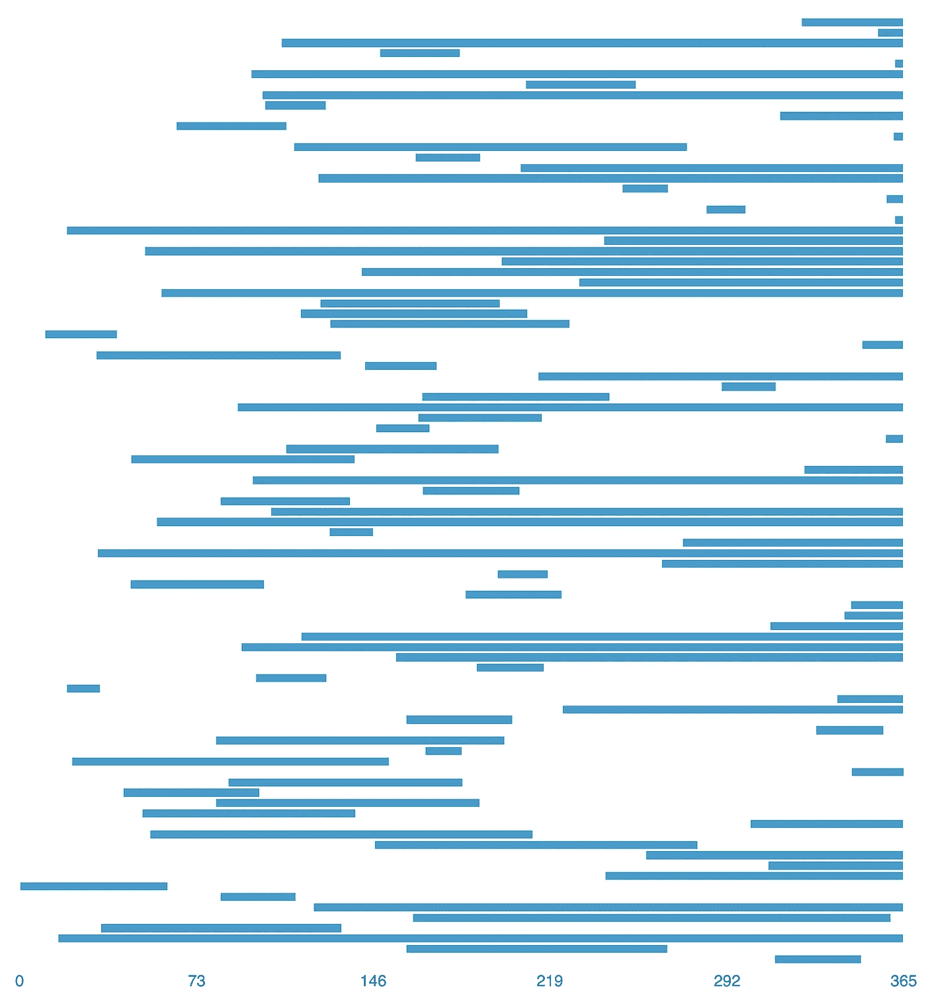
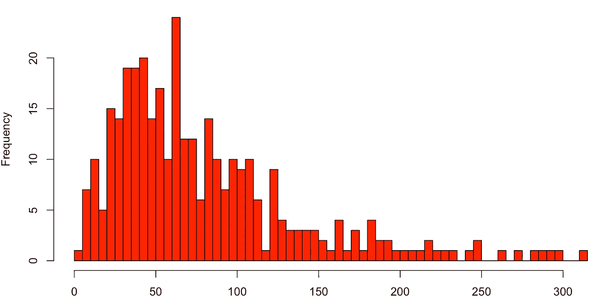

# 衡量经常性用户

> 原文：<https://towardsdatascience.com/on-measuring-recurring-users-ca4142be8efa?source=collection_archive---------3----------------------->

> 每个人都在谈论数据驱动。设置度量标准是困难的，即使在选择了要度量的东西之后，正确地度量它仍然是困难的！在这里，我将通过多种方法来衡量流失错误。

当你在开发一个产品时，最重要的一个指标就是你的用户中有多少会回来重复使用。这个指标有很多种，流失(给定时间后有多大比例的用户不再是用户)是最常见的一种。

在 [Peergrade](http://www.peergrade.io) 我们正在为教师制作一个产品，我们有兴趣确定我们的用户是否对该产品足够满意，以便回来再次使用它。我们面临的挑战之一是，一些教师经常使用 Peergrade，而一些教师(主要是大学教师)一年只使用我们的产品一次或两次。这里的问题是，我们不知道用户是否已经离开我们，或者用户是否只是处于使用期的中间。

当我们查看我们的数据时，它看起来像这样(这不是实际数据):

每个蓝条对应一个不使用我们产品的用户(横轴是天)。在结束前停止的蓝色条意味着相应的用户再次回来使用我们的产品。延伸到图表末端的蓝色条(本例中为 365)意味着用户要么还没有回来，要么已经永远离开了我们。

一个**简单的**方法是计算在第 365 天之前结束的棒线数量和没有结束的棒线数量之间的比率，来衡量有多大比例的用户回到我们的产品。这样做的明显问题是，我们会高估流失的人数，把还没有回来的人都算成永远不会回来了。一个**更好的**策略是设置一个固定的最大值(例如 2 个月),并把在这段时间后没有回来的人算作被搅动——这个最大值可以从数据中确定，例如通过将其设置为已知已经回来的用户的不活动持续时间的第 95 个百分位数。

# 估计误差的影响

使用不正确的评估策略会导致非常错误的结果。下面我将描述一种不同的方法来计算客户流失，这种方法在相当合理的假设下会产生更好的结果。在我们的实验中，上面的简单方法导致 11%的平均估计误差，更好的版本导致 5.4%的平均误差，而我们改进的方法导致仅 1.2%的平均误差。

# 长尾理论和不同的方法

上述较好策略的问题是，当用户的不活动持续时间分布具有长尾时，即当一些用户的不活动时间非常长时，设置这样的最大值可能会很不幸地出现问题。我们的用户就是这种情况。

为了尝试以更好的方式解决这个问题，我们从制作一个小的合成数据集开始。我们设置了一个*产品质量*参数(称之为 *q* )，这是一个用户回来重复使用的概率(这是我们有兴趣测量的参数)。

然后，我们创建了 2000 个虚拟用户，并使用我们的 *q* 参数来确定他们是否会回来。我们将合成数据集的时间跨度设置为 365 天。对于每个用户，我们在 0 到 365 之间随机选择一个不活动期的开始日期(上面的条形开始的位置)。为了以现实的方式模拟非活动持续时间，我们从伽玛分布中采样非活动持续时间，如下所示:

对于被选择不返回的用户，不活动期被延长到第 365 天(我们的时间跨度结束)。对于经常性用户，等待时间从上述分布中取样，并添加到开始时间中，以获得非活动间隔的结束时间。如果高于 365，则上限为 365。

这样做的结果是帖子顶部的图中所示的数据，其中可以观察到一些用户返回，一些是非经常性用户或经常性用户，他们的返回超出了时间跨度(在第 365 天之后)。

# 不同的方法

我们估计流失率的方法是使用下面的简单算法:

*   用 1 标记我们知道用户返回的每个时间间隔
*   按长度对时间间隔进行排序，从最长的间隔开始
*   如果最长的间隔没有标签 1，则给它标签 0
*   对于每个区间(按排序顺序)，用所有更长区间标签的平均值对其进行标记。
*   将重复出现的概率确定为所有区间的平均标签。

这里的概念是，为了估计用户在 X 天不活动后返回的概率，我们查看所有不活动超过 X 天的用户，并查看有多少用户返回。

# 结果和其他想法

在合成数据集上，我们可以测试简单的估计，看看它们与我们的新方法相比表现如何。产品质量参数 *q* 在 0 到 1 之间随机抽样，并进行不同的推断方法。这样做了 100 次，以限制数据中随机噪声的影响。最终结果显示，简单方法的平均估计误差为 11%，更好的版本的平均误差为 5.4%，而我们改进的方法的平均误差仅为 1.2%。

解决这个问题的一个有趣的方法是用完全概率的方式建模，例如使用 [PyMC3](https://github.com/pymc-devs/pymc3) 。这种建模将导致一种不那么特别的解决方案，并且还将给出估计量的不确定性的度量。此外，可能有可能以某种方式对产品的开发建模(并且有希望以某种方式增加*q**)——这将有可能估计您是否以显著影响度量的方式改进产品。最后，研究其他因素的建模会很有趣，比如季节性(对我们来说，夏季是一个低活动期)，并可能引入其他因素，以便更准确地预测用户流失。*

**