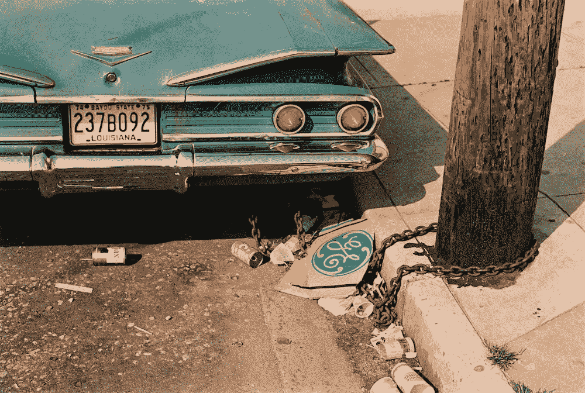
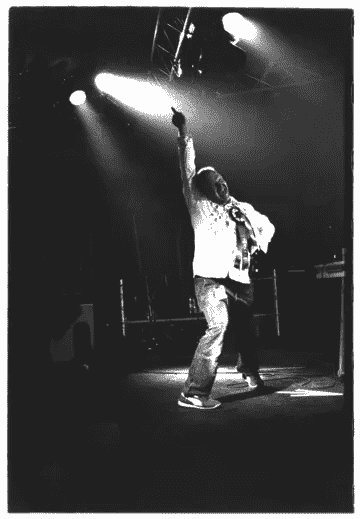
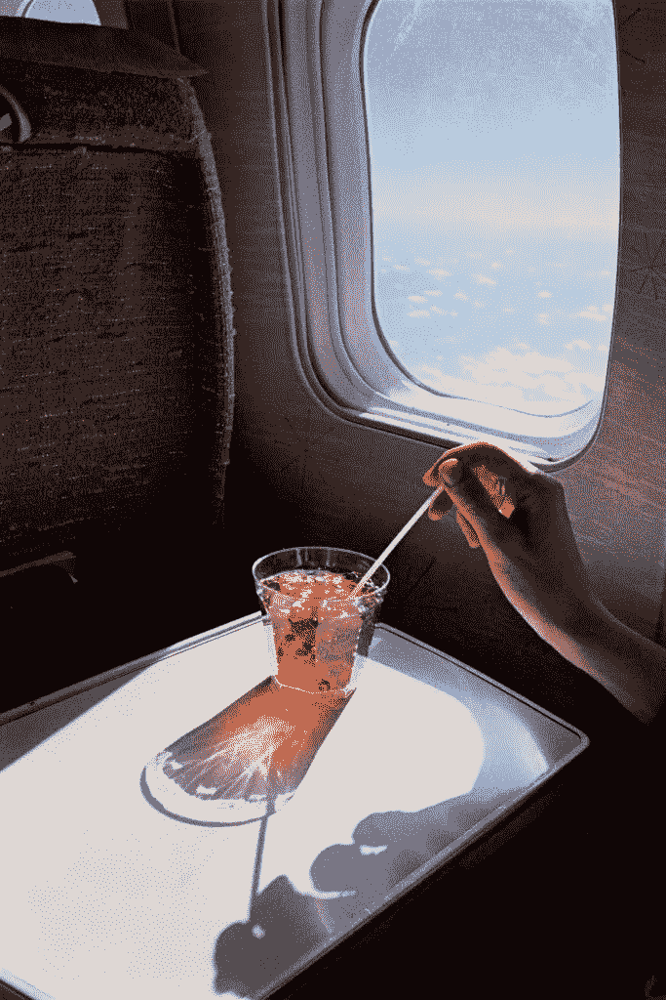
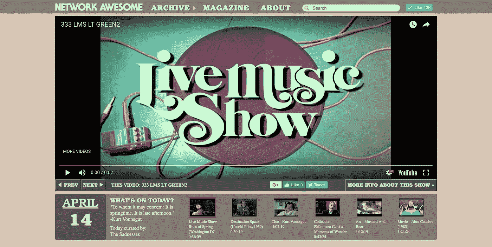
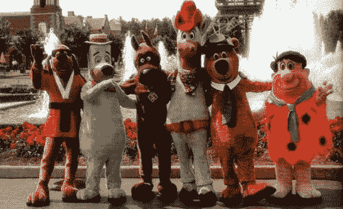

# 关于我的“奇特经历”以及它将走向何方

> 原文：<https://towardsdatascience.com/on-my-peculiar-experience-and-where-it-goes-from-here-f3478d7f25f6?source=collection_archive---------12----------------------->

我上大学是为了成为一名摄影师。昨天，我有幸看到了我最喜欢的摄影师之一威廉·埃格尔斯顿的一些照片。当然，这让我偏离了摄影的主题，就像生活中的大多数事情一样，我发现了一些建立在我正在思考的其他事情上的东西。

William Eggelston, “[Louisiana](https://www.metmuseum.org/exhibitions/view?exhibitionId=%7b6ca8d7bb-2b70-4373-9833-5927c4a0b47d%7d&amp;oid=757101&amp;pkgids=467&amp;pg=0&amp;rpp=100&amp;pos=70&amp;ft=*&offset=100)” (from the series *Los Alamos*, 1965–1974) © Eggleston Artistic Trust / Courtesy David Zwirner, New York/London

埃格尔斯顿是一个真正的怪人，他有一种独特的世界观，一种具有挑战性的民主视野，图像中的东西与构图、颜色、社会意义，甚至是不知道是什么的抽象一样重要。也就是说，他是一个帮助定义和推动“摄影”的摄影师。他也有一套用词方式:

> “无论是一张照片、一首音乐、一幅画还是我可能做的任何其他东西——最终都是我独特经历的抽象。”—威廉·埃格尔斯顿

这是我对生活中几乎所有事情的看法，尤其是我作为 UX 软件产品开发设计师的职业经历。

Performing at the Pukkelpop festival, Belgium, 2003

# 到目前为止，我的生活中有很多事情:

*   一位相当有名的电子音乐家
*   美国一家主要报纸的艺术评论家
*   创建了两个唱片公司(公鸡摇滚迪斯科，夜班)
*   共同组织和举办了一个音乐节(浪费)
*   哈克贝利猎犬在游乐园吗
*   WFMU 的 DJ
*   从事摄影和雕塑的视觉艺术家
*   共同创办了 2 家创业公司(Network Awesome、Radosaur Productions)
*   视觉设计师和业余爱好者印刷工人
*   和一名 UX 设计师(过去十年)

…所以可以说我认为自己是一个“多面手”。

2007 年，当我还是一名职业音乐家的时候，一个有趣的发现让我开始涉足科技行业。我在荷兰布雷达的一个地方开演唱会，演出很棒，演出结束后我去领薪水。经理问我是否想和酒吧员工喝最后一杯(这通常是一场成功演出的标志)。当我们加入他们时，我意识到，36 岁的我很可能是当晚整个会场中最年长的人。我的意思是，这真的没什么大不了的，但我一直觉得我的生活还有其他的篇章，这种意识冷酷地提醒我，我可能需要继续下去，开始探索音乐之外的兴趣。

*William Eggleston, “En Route to New Orleans”* (from the series *Los Alamos*, 1965–1974) © Eggleston Artistic Trust / Courtesy David Zwirner, New York/London

从艺术学校开始，我就有了“一切本质上都是一样的”的想法，这意味着大多数学科背后的思维模式都是相似的。所以艺术家就像作家，建筑师就像馆长。我从来没有一条真正的“线”来区分我的假定能力和任务的需求。毫无疑问，现在是 20 年后的今天，虽然我仍然认为这是真的，但我现在明白了“细节”对于理解不同领域和思维模式的重要性。

随着年龄的增长，我认为我身上的艺术家气质使我身上的多面手能够适应和应用我在各种生活中学到的东西，然后将它们应用到我现在正在做的任何事情上。我相信我可以写更多关于自我、灵感、市场力量之间的相互作用，以及最终它们如何应用于移情和技术的内容——也许有一天我会写的——但现在我宁愿抓住要点。

# 数据就是一切

不到一年前，我意识到:数据就是一切。我意识到，未来不严重依赖数据的技术(或依赖技术的学科或市场)都不会存在。

作为一名 UX 设计师，我意识到我知道如何发现用户需求，并运用设计技巧将其转化为提供解决方案的产品。我与工程师合作，学习使产品具有响应性的系统，这些系统适合记录和检索数据的生态系统。但是我不明白利用这些数据来帮助组织制定战略和决策的逻辑和技术。是改变的时候了。

最近，我做了一个改变，从与开发团队一起工作，到将我的 UX 背景带到一个由高技能数据科学家组成的“实验室”，从事人员分析工作。设计师迫切需要学习数据科学家使用的方法，了解我们如何利用数据，并将其应用于解决和满足人类需求。

当 Eggleston 说“我的特殊经历的抽象”时，这是另一种说法，我们的故事建立在他们自己的基础上；我们的道路很少是直的，但总是直线的。

所以我又来了，我独特的经历再次曲折，但这次我想记录我的发现。我打算将 medium 作为一个地方，在这里我将写关于 UX 设计、高级分析、数据可视化和当代艺术的交集的博客。

*好的，我想把我的链接放在这里，但是当我整理这个列表的时候，我意识到它太多了，所以我把它们都放在这里:

*   当我链接到我的音乐时，我总是链接到[我在 Pitchfork](https://pitchfork.com/artists/1613-jason-forrest/) 上的个人资料，因为那个网站可能比其他任何网站都更能促进我的事业。管它呢，这也是我的一个“大”视频:

*   我曾经为《亚特兰大宪法报》以及艺术报纸和《新艺术检查者》撰写摄影和录像艺术的文章。
*   我创立了 2 个唱片公司:[公鸡摇滚迪斯科](http://www.cockrockdisco.net/)(仍然活跃！)和[夜班工人](https://www.xlr8r.com/tag/nightshifters/)(现已退休)
*   我非常自豪地与我的联合创始人&合作者 Pure 和 Jan Rohlf 一起主持了 6 届[浪费节](http://www.ctm-festival.de/projects/wasted/)。
*   这是我的[维基百科页面](https://en.wikipedia.org/wiki/Jason_Forrest)
*   2011 年，我与 Greg Sadetsky 共同创立了[网络 Awesome](http://networkawesome.com/) ，这是一个在线电视网络，从 Youtube 收集内容，积累了大量的每日观众。去看看吧，它仍然在线，每天都有新的内容。

*   2012 年晚些时候，我与科里·维尔玛共同创立了 Radosaur Productions。我们专门从事视频制作和直播。我们有幸制作了几年的《柏林锅炉房》(事实上，我们还拍摄了一些他们收视率最高的剧集),还与 Pitchfork 和 Vans 合作。
*   我过去性格的一个例子:

Huckleberry Hound aka “Slushy dawg” or “the blue one”, second from left

*   我非常幸运能在 WFMU——世界上最伟大的广播电台之一——做 DJ，当时在线广播刚刚起步。令人惊讶的是，我的节目《高级 D&D》仍然可以在网上收听:[http://wfmu.org/playlists/su](http://wfmu.org/playlists/su)
*   至于我的作品，5 秒钟的搜索没有提供任何例子。也许有一天我会上传一些图片。我的工作主要基于摄影，偶尔也有雕塑或视频装置。
*   至于我在 UX 的设计工作，你知道它是怎样的——大部分我实际上不能炫耀，因为它都是为客户/公司设计的。但是我这里有一个非常不完整的投资组合:[http://cargocollective.com/jasonforrest](http://cargocollective.com/jasonforrest)这也是我的 [LinkedIn](https://www.linkedin.com/in/jasonforrestftw/) 。
*   我做设计师已经很长时间了，但是直到最近我才真正喜欢上我的平面设计工作。一月份，我制作了一本名为“好奇型”的印刷杂志。它有 5 种免费字体，所以去我的网站上下载吧。见鬼，也给一个关注。

 [## 杰森·福里斯特代表汉斯

### 我是一个创造性的问题解决者、设计师和连续创业者。在另一种生活中，我是一个全球公认的电子音乐家…

www.behance.net](https://www.behance.net/cockrockdi9a9d)