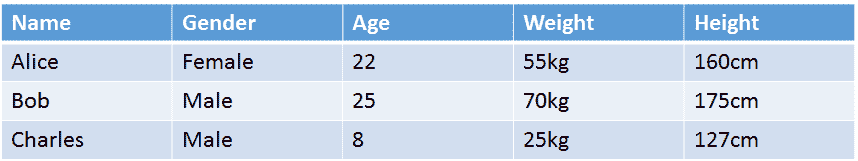
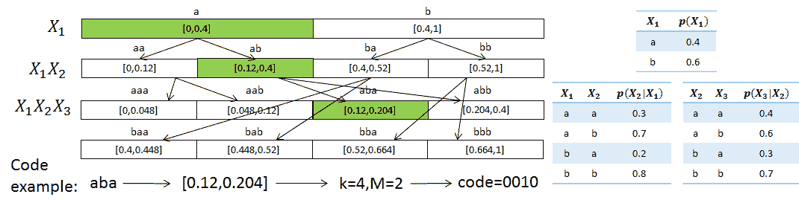
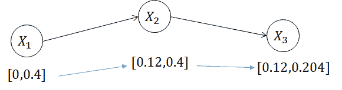
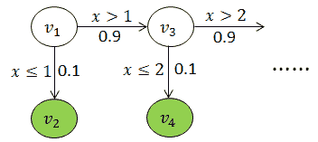

# 大型数据集的优化挤压

> 原文：<https://towardsdatascience.com/on-optimally-squishing-large-datasets-9276776cf0cb?source=collection_archive---------0----------------------->

*这篇博文主要由我的三年级博士生高撰写，是对我们 16 年论文的高度概括，题为“挤:关系数据集存档的近优压缩”，github 上的* [*代码*](https://github.com/Preparation-Publication-BD2K/db_compress) *，arXiv 上的* [*论文*](http://arxiv.org/abs/1602.04256) *。*

由于从对话机器人和物联网到大规模物理模拟和高通量基因组测序，数据生成的速度越来越快，*数据压缩*，尤其是用于存档的数据压缩，仍然极其重要。

传统的压缩算法是为二进制字符串设计的，通过查找这些字符串中的重复模式来识别压缩机会。因为文件本质上是以二进制字符串的形式存储的，所以这些算法普遍适用于所有类型的数据。

然而，通过对通用二进制字符串表示进行操作，这些算法失去了细粒度压缩的机会。其中一个设置是关系数据集或表格数据集的非常重要的设置:在这里，一般的压缩算法最终表现很差。我们提出了 **Squish** :压缩关系数据集的*渐近最优算法。与针对关系数据集的其他算法以及更传统的算法相比，我们的算法实现了*更高的压缩率*，并且*可针对特殊目的数据集和需求*进行定制，我们将在后面进行描述。*

# 动机

以一个本地人口普查数据集为例，其属性为姓名、性别、年龄、体重和身高。先前工作中提出的关系数据集压缩算法能够利用域约束(例如，名称是字符串；性别只有两种可能的值；年龄、体重和身高是数字字段)。但是还有其他压缩的机会:

1.属性值之间存在软*依赖*。比如性别通常可以从名字中推断出来，个体的性别往往影响身高体重。

2.数值可能与*相关联*。例如，高个子通常更重。儿童(年龄 12 岁)通常比成人矮得多。

通过利用这些机会，我们可以用更少的空间来存储相同的信息。然而，这不是一个简单的任务，因为我们不知道我们将处理什么样的数据集。我们需要开发一种算法，它可以在不假设数据集的任何特定结构的情况下捕获依赖关系，并找到一种利用这些依赖关系来压缩数据集的方法。

# **使用贝叶斯网络捕获依赖关系**

让我们处理第一个任务:我们如何在不假设任何结构的情况下捕获数据集中的依赖关系？由于依赖是软的或“模糊的”，我们需要一个概率模型来捕捉这些依赖。为此，我们使用一个*贝叶斯网络*。

简而言之，我们使用贝叶斯网络中的每个随机变量来表示元组的一个属性值，使得数据集中的每个元组对应于来自贝叶斯网络的随机样本。

因此，我们的压缩算法的第一步是从关系数据集中学习贝叶斯网络。然后，我们的问题变成:我们如何使用贝叶斯网络来压缩数据集？在回答这个问题之前，我们先来回顾一下算术编码的一些基本概念。

# **算术编码基础复习**

算术编码是一种自适应的字符串压缩方案。它需要字符串中每个字符的条件概率模型，并为所有可能的固定长度字符串生成唯一可解码的代码。我们用一个例子来说明这种编码方案。

在这个例子中，右边是字符串的概率模型。首先，算术编码为每个字符串分配一个概率区间，其长度等于该字符串的概率。比如 *aaa* 对应 *0* ， *0.048* ， *aba* 对应 *0.12* ， *0.204* 。接下来，给定概率区间[ *l* ， *r* ，我们找到最小的整数 *k* ，以及另一个整数 *M* 使得，*l*<=*2*^{-*k*}*m*<*2*^{-*k*}(【t38 *M* 的二进制表示是字符串的代码。

Illustrative Example for Arithmetic Coding

# **结合贝叶斯网络和算术编码**

即使它是为字符串开发的，算术编码过程实际上只需稍加修改就可以用于贝叶斯网络。这种构造只需要两件事:随机变量之间的排序，以及给定所有先前变量的每个随机变量的条件概率分布。有趣的是，贝叶斯网络为我们提供了两者。下面是一个如何在贝叶斯网络上应用相同过程的例子。请注意，计算基本上与之前相同。

Combining Bayesian Networks and Arithmetic Coding

# **处理复杂属性**

上面的例子说明了我们如何使用贝叶斯网络和算术编码来压缩只有分类属性的关系数据集。现在，最后一个缺失的部分来了:我们如何处理像数字和字符串这样的复杂属性？

为了能够处理复杂的属性，我们为所有数据类型开发了一个抽象接口，称为 SquID(数据类型 Squish 接口的缩写)。SquID 用于对属性进行编码，使它们的行为类似于分类属性，然后我们可以使用算术编码来压缩它们。

SquID 是概率分布的树形模型。本质上，它是一个概率与边相关的决策树。这里以鱿鱼为例，描述了分布 pr(*x*in(*k*-*1*，*k*)=*0.9*^{*k*-*1*} **0.1*。

要使用 SquID 对属性进行编码，我们只需构造一个决策序列，这样在最后一个决策结束时，我们就可以确切地知道属性值是什么。例如，要使用 SquID 对一个数字属性进行编码，我们可以模拟对分过程，并在[ *log n* ]步骤中确定属性的值。

# **支持用户自定义数据类型**

SquID 接口还使我们能够支持用户定义的属性。即使数据集包含不属于我们实现的原始数据类型(分类、数字和字符串)的属性，用户仍然可以通过为新数据类型实现 SquID 接口来使用 Squish 压缩数据集。它相对简单，并且提供了很好的机会将特定领域的知识包含到 Squish 中，以获得更好的压缩结果。

# **外卖**

1.我们开发了关系数据集的压缩算法 ***Squish*** 。它使用贝叶斯网络和算术编码的组合来利用属性之间的软依赖性和相关性。

2.Squish 的数据类型接口 SquID 允许我们对复杂的属性应用算术编码。SquID 还允许用户定义新的属性类型，使用 Squish 可以压缩具有非原始属性类型的数据集。

3.Squish 支持具有用户指定的错误阈值的有损压缩。

4.Squish 对于所有可以使用贝叶斯网络有效描述的数据集来说都是渐近最优的，并且在 4 个现实数据集上的表现要比最先进的关系数据集压缩算法好得多，存储减少了 50%。