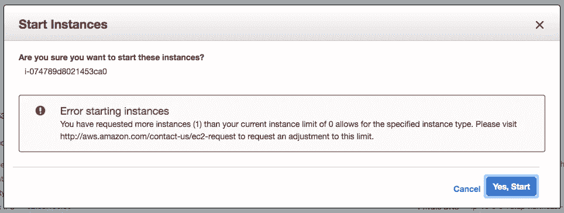
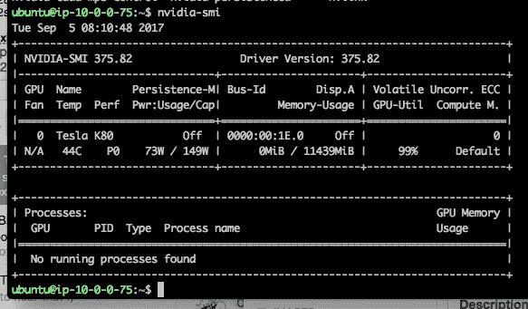
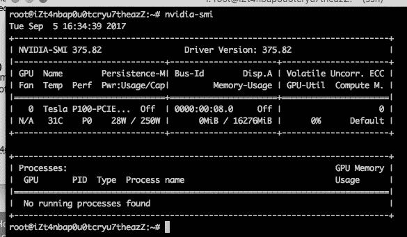
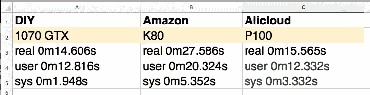
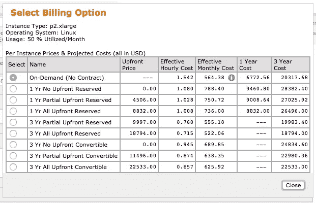
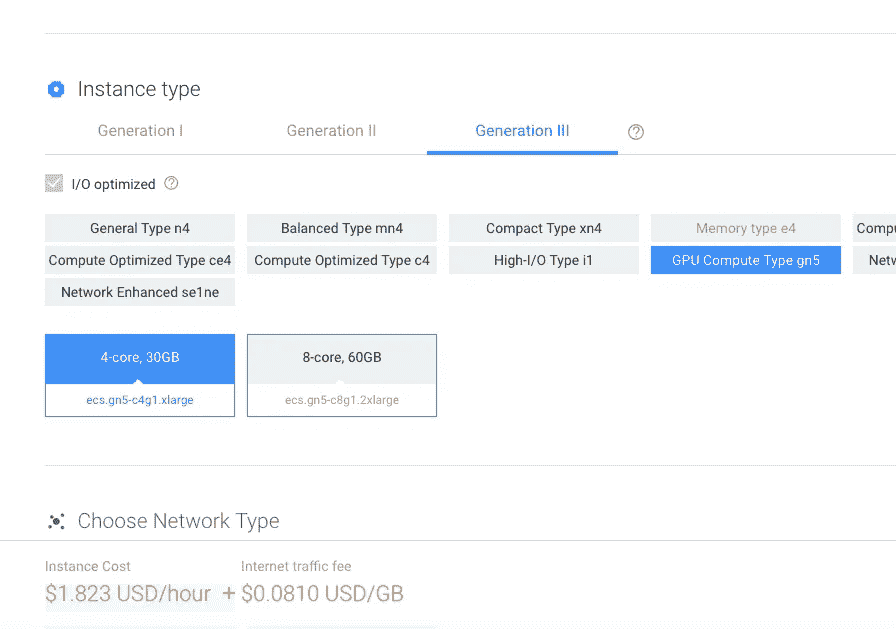
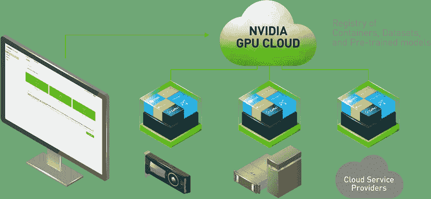

# 内部部署(DIY)与云 GPU

> 原文：<https://towardsdatascience.com/on-premise-diy-vs-cloud-gpu-d5280320d53d?source=collection_archive---------3----------------------->


早些时候，我的第一个故事在 CPU 和 GPU 之间做了一个非常简单的比较，对于这个故事，我将在速度和价格比较方面对 DIY GPU 和 cloud one 进行更多的比较。

目前我将介绍[亚马逊](https://aws.amazon.com/ec2/elastic-gpus/)和[阿里云](https://blogs.nvidia.com/blog/2016/01/21/alicloud-artificial-intelligence-gpu/)，亚马逊使用的是 [NVIDIA K80](http://www.nvidia.com/object/tesla-k80.html) 和实例类型 **p2.xlarge** ，而阿里云使用的是 [NVIDIA P100](http://www.nvidia.com/object/tesla-p100.html) 和实例类型 **ecs.gn5-c4g1.xlarge** 。最后，现场 DIY 的是[英伟达 1070 GTX](https://www.nvidia.com/en-us/geforce/products/10series/geforce-gtx-1070/) 。

基本上，测试使用的是利用 GPU 进行处理的[快速风格传输](https://github.com/lengstrom/fast-style-transfer)。测试将使用 rain-princess.ckpt 处理一个分辨率为 4242 × 2828 的 JPEG，命令如下

```
time python evaluate.py — checkpoint ./rain-princess.ckpt — in-path lesu-0596.jpg — out-path lesu-0596-style.jpg
```

关于 Amazon 的一个快速提示是，我们需要申请增加限制，否则我们将无法启动 gpu 实例！



阿里云是一个相当麻烦的改变实例类型，因为我们需要释放和重新创建实例。至于亚马逊是相当直截了当，没有破坏实例，希望阿里云将在这段时间内改善。当我们的脚本只改变深度学习的实例类型，而不是全天候运行时，这是非常有利的，因为对于云中的 GPU 实例类型来说，这非常昂贵。

用于 Amazon 输出的 nvidia-smi 命令



阿里云如下



每个平台的时间如下



至于定价，亚马逊有以下定价层



目前，阿里云的 gpu 没有基于订阅/保留的定价



对价格的粗略估计如下，假设我们每天只使用该实例 12 小时，持续 30 天


与 [DIY 方式](https://pcpartpicker.com/list/Dwcpcc)相比，DIY 方式初始投资【USD1305.33 美元，不含电费，可能在 2 个月内收回成本。但是我使用的版本是酷睿 i3，而不是拥有更好 CPU 的云。

最后，我想我们总是在使用成本更高的云选项之前尝试在内部进行培训以节省成本。内部部署的另一个优势是我们不会与其他人共享资源。我一直相信混合方法可以最大限度地提高性能和成本，就像 [Nvidia Cloud](https://www.nvidia.com/en-us/gpu-cloud/) 提供的一样

