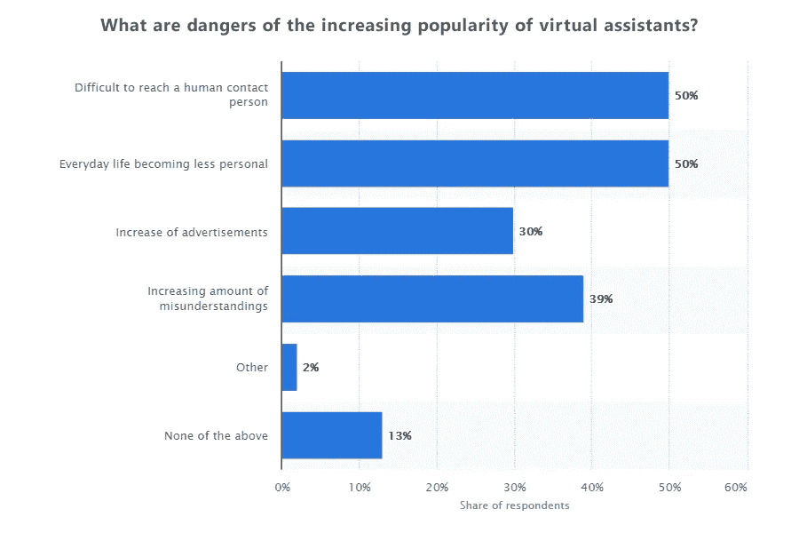

# 在技术龙卷风的前夜

> 原文：<https://towardsdatascience.com/on-the-eve-of-technological-tornado-e19aa7d307bb?source=collection_archive---------15----------------------->

Source: [Unsplash](https://unsplash.com/photos/Ae5jmF2PJXg).

在达沃斯举行的 2017 年世界经济论坛上，克劳斯·施瓦布教授[说](https://www.weforum.org/about/the-fourth-industrial-revolution-by-klaus-schwab)，*“人类正站在一场技术革命的边缘，这场革命将从根本上改变我们的生活、工作和相互联系的方式。就其规模、范围和复杂性而言，这一转变将不同于人类以前经历过的任何事情。当然，不可能预测它将如何发展，但已经清楚的是，它将影响所有群体、社会阶层、职业等。”*

我们现在生活在第三次人工智能浪潮的时代。第一波(1950-1960)与机器翻译和电脑游戏有关，第二波(1980)与专家系统的开发有关。第三次浪潮始于 20 世纪 90 年代末，不仅受到计算机效率提高的推动，也受到人工智能和机器人程序许多领域取得的重大进展的推动。

## 什么是人工智能？

*人工智能*是好莱坞电影和小说创造的幻觉。它在我们的脑海中形成了一个人形机器人的形象，这些机器人要么反抗人类，要么生活在家庭中，体验情感，与人类没有区别。这些都和现实生活无关。

*人工智能*是模拟或执行人类认知功能的工程学科。换句话说，它执行信息处理功能。这只是一套机器学习优化方法，允许系统采用这个函数，并学习如何在计算机上执行它。智能手机上的 T9 功能、搜索引擎、拼写检查、Shazam 中的旋律识别、防病毒和反垃圾邮件程序等等——这些都是复杂的人工智能程序，现在看起来很平常。然而，在机器中创造意识很可能是不可能的。因为人类还不明白什么是意识。

## 人工智能的利与弊

人工智能的积极方面是创建特定的程序来帮助做某事，而消极方面是风险，风险相当高。其中最重要的是，人工智能可以抢走人类的工作。当然，炒人的是公司，不是 AI。以电梯为例，它已经永久性地取代了电梯操作员，并增加了对电梯维修技术人员的需求。一些职业消失了，但是新的职业总会取代它们。

接下来，人工智能被用于分析大量数据。如果你收集了足够多的关于人的数据，那么计算任何东西都是可能的。隐私完全消失。这不是一个很好的情况。

## 技术旋风

The books by Geoffrey Moore.

有一位作者，杰弗里·摩尔，他写了一些关于科技行业尤其是创业公司发展原则的精彩书籍。其中之一是*跨越鸿沟*。也许你们中的一个已经读过了。如果没有，那么我们强烈推荐。他的第二本书《龙卷风中的 T2》也涉及了同样的问题。在书中，他介绍了**技术旋风**的概念，这是一个新技术产业的爆炸式发展。

我们已经在乔布斯和盖茨的个人电脑上看到了这样一场龙卷风。后来是 80 年代末 90 年代初的软件旋风。然后，互联网在 90 年代中期爆发了。大型公司出现了。巨大的事业和财富是白手起家的。然后我们看到了手机，接着是智能手机和平板电脑。

在所有这些案例中，都有共同的过程和模式。对我们来说，最有趣的事情是未来行业在**“龙卷风前夕”**的状态。这期间发生了什么？首先，它的特点是缺乏市场，最重要的是“脑雾”。每个人都感觉到有事情要发生，但没人知道是什么。

## 使用说明—龙卷风的基本条件

龙卷风的起因在于有人提出了一种使用设备或技术的方法。提供使用说明是史蒂夫·乔布斯对智能手机所做的，在 iPhone 出现之前，智能手机已经生产了好几年。他不需要发明这项技术。他不得不把这些都收集起来，然后说，“这里有一个东西。这就是它的名字，这就是你如何使用它。”人们必须给用户概念，并指导制造商的发展。那就是市场和用户出现的时候。然后，技术龙卷风来了，并在头顶爆炸。

再比如汽车行业。就在福特制造出他的传送带并开始生产我们所知道的汽车之前，“前夕”它一直处于完全相同的状态。让我们不要忘记来自吉姆·克拉克的互联网。也许你们中没有人知道吉姆·克拉克，或者也许你们并不知道所有的事情，但这是真正创造了互联网的人。他为第一个非商业浏览器聘请了一位作者，制作了一个真正的浏览器，即网景导航器，在那之后一切都毁了。

## 关于机器人和虚拟助手

机器人领域将出现一场真正的技术风暴，涉及数百万甚至数亿用户。最有可能的是，它将是某种与人生活在一起的个人机器人助理，像 Jeeves 或 Jarvis，并参与一切:在家庭或个人的日常生活中，在商业中等等。每个人都将拥有或正在努力拥有一个这样的个人机器人。那就是下一次龙卷风会发生的时候。这就是所谓的“下一件大事”。

我们在 2000 年初开始制作虚拟助手。它们非常简单，当时我们仍然使用 **AIML** (人工智能标记语言)，而许多爱好者仍然利用它和理查德·华莱士教授本人(A.L.I.C.E .项目作者)。

现有通信系统的经验是，虚拟助手会一直存在，但它们最终也会变老。因为它们不完整。虚拟助手既是识别系统，也是搜索引擎。然而，准确性在搜索引擎中是很重要的。前十名的排名，也就是说，完整性远没有那么重要，因为互联网上总有 1000 万页关于你问的问题。

有了虚拟助手，就完全相反了。它的准确率总是 100%——如果它理解了问题，答案总是相关的。这就是很难涵盖完整性的地方，因为一个人可能会问的问题的多样性是如此之大，以至于不可能预测所有的选项。它必须从一个特定的答案到一个逻辑答案构建同心圆。

The result of a survey conducted in the US in April 2017 by Statista. [Source](https://www.statista.com/statistics/702947/united-states-digital-voice-assistants-survey-disadvantages/).

虚拟助理必须能够采取主动，这意味着它的语言智能必须相当高。它必须自我学习，发现更多关于它主人的信息，并记住他们的信息。这种记忆将有助于它根据主人的生活方式提供建议、帮助做家务或制定计划。它必须有计算机视觉来识别它的主人或检测有人进入房间，这样它就可以和那个人开始对话。

哪个是正确的——虚拟助理应该有有用的功能，比如回答明天天气如何、现在几点、是否堵车等等。对于不同的话题和合作玩法应该有多种互动。捕捉音频频道同样重要，例如，当你需要在早上醒来时。或者当你手头没有设备时，你可以向空中询问你需要什么。当我们在 2015 年制造机器人 Lexy 时，我们使用了能够过滤掉外来噪音的麦克风阵列。一个人站在离设备很远的地方发出命令，系统就会准确地识别它。

# 语音助手的前景

## 电话应用将会消亡。没有人会使用它们。

语音识别将被嵌入到几乎所有能够接收语音并在狭窄的主题区域(在水壶、洗衣机、微波炉等)进行处理的设备中。大多数人不阅读他们设备的说明书，通常只使用其功能的百分之几。如果在系统中嵌入一个语音助手，这个设备可以被更有效地使用。

## 哪里有服务线，哪里就有语音助手。

语音助手将会出现在自动取款机、商场等等。我们已经向大公司销售聊天机器人，以提供技术支持或接受订单。这将会继续和进步，但是要结合语音技术。很快，你会在商店门口遇到一个机械女人，她会问你需要什么，并为他们选择商品和服务提供建议。

## 最终，我们会成为一个家庭伴侣。

这本指南不仅适合儿童，也适合成年人。它可以访问维基百科、搜索引擎和教育课程。它将能够教授英语、古希腊历史、机械技能等等。最重要的是，它能够用简单的语言进行自然对话。这不容易做到。我们知道这是事实，因为我们自己也在做这样的项目。我们相信再过两三年我们就会看到这种助手。

*作者:* [*斯坦尼斯拉夫·阿什马诺夫*](https://medium.com/u/b57561f280e1?source=post_page-----e19aa7d307bb--------------------------------) *，SOVA.AI 公司首席执行官*