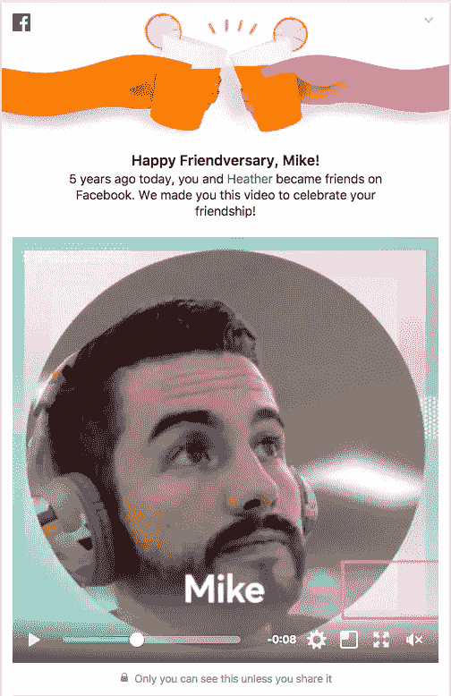

# 在地平线上:营销的未来——以及我的测试，看看它是否在这里。

> 原文：<https://towardsdatascience.com/on-the-horizon-the-future-of-marketing-and-my-test-to-see-if-its-here-58e89ea48c7a?source=collection_archive---------8----------------------->

gorgeous imagery found on Unsplash (thx)

我个人的浅见是，我们今天听到的所有营销策略、战术和方法——“基于客户的营销”、“集客营销”、“增长黑客”——只是一种描述营销世界未来的手段。前面提到的每一个营销术语——通过实践、奉献和合适的才能——任何组织都可以实现。每一个都为您的业务发展提供了宝贵的机会。这篇文章并不是要“废黜”任何这些类型的营销和增长策略…

然而，我相信这些不同的营销方法、策略等。只会让我们离未来更近一步。渐渐地，它们让我们更深入地思考我们如何影响我们与之互动的企业和客户。这是一件非常好的事情。

我承认，除了我通过网络上伟大的营销人员和品牌观察和听到的以外，我没有太多的研究来证实我的预测，但正如你将在下面看到的那样，营销的未来已经在社交媒体世界中崭露头角。

未来(依我拙见)是关于数据、创造力和策略的交集。它是关于为顾客提供独特的有价值的体验或洞察力，这是*只有* *你*才能提供的。

我认为营销的未来将随着三个关键要素的融合而展开…

# 1.营销的未来始于技术。

数据的激增和我们对数据前所未有的访问开始塑造营销的未来。此外，随着基于云的处理成本下降，人工智能(AI)和数据科学迅速发展，营销的未来才刚刚开始出现。

# 2.营销的未来取决于关键人物。

如果你没有数据科学家或数据分析师*(我肯定角色的差异是实质性的，但我还不知道是什么)*，那么你最好排队。这是一个热门话题，也是一个难以填补的角色。在我看来，这是市场营销未来的关键。

> 别担心，我会讲到我认为市场营销的未来是什么的那一部分……继续读下去。

数据科学和扮演这一关键角色的员工并不是未来营销的唯一关键角色。你仍然需要创造性和战略性的营销角色。没有创意和营销策略，数据只是一堆 1 和 0。

# 3.营销的未来需要“必备”产品。

肖恩·埃利斯和许多其他企业家会告诉你，除非你首先建立产品的市场适应性，并且理想地创造一个“必须拥有”的产品，否则你将没有任何东西可以营销。

注意:我认为营销的未来之美在于，它将有助于保持你的产品/服务成为“必备”的粘性和可能性。

# _________ 营销

我相信这三个要素的融合意味着我们正走向一种新的营销方法。我不知道如何描述这种新的营销方法，但现在，我将把它称为“基于洞察力”或“反馈”营销。

正如我在介绍中承诺的那样，营销的未来已经在社交媒体世界中崭露头角。

**这里有一个来自脸书的例子:**
我们都在订阅源中看到过通知或内容。

“这是你去年这个时候做的！”“迈克，朋友周年快乐！”

btw I never login to Facebook anymore and I deleted the app from my phone, but sure enough while writing this post I logged in to see If i could find an old reference to illustrate my point and this is what came up…

看到那些视频和为我们制作的那种内容绝对是一种享受。它很有见地，令人愉快，是脸书增加病毒式传播和粘性所需要的一切。*——虽然我不再在手机上使用脸书，但我仍然看到了它的价值；)*

所以，真正的问题是，你如何将这样的见解应用到你的 B2B 或 SaaS 业务中？我们如何利用我们的数据和创意来增加粘性，并最终提高我们营销活动的有效性？

答案是数据、创意和营销策略。

# 下一步是什么？

我的使命是为数据驱动的客户提供价值和洞察力。我希望科学地、战略性地和创造性地调整我们的数据，以创建一个透明和有价值的洞察力的反馈回路，以一种他们在竞争产品中看不到的方式让我们的客户受益。但是我一个人做不到。我真的相信营销的未来是关于数据、创意和战略营销团队的合作。

在我的职业生涯中，我将检验我的理论——基于洞察力/反馈的营销是帮助我们的客户和公司取得新的成功的关键。

# 以下是我将要做的…

我不会告诉你细节，因为我不想破坏测试(或者让我的竞争对手过早地参与我的计划)。

我将利用数据为我们的客户提供关于他们表现的有见地的反馈，并且我将使利用我们发现的见解变得极其容易。通过这样做，我相信我们的客户和我们的企业都将看到积极的财务成果，我希望我们将被视为一个值得信赖和重视的合作伙伴。

我认为很多企业都可以做我打算做的事情，但他们都尝试一下只是时间问题。我确信其他人已经在测试这个理论了，但是在接下来的一年里，我希望开始这个测试并报告结果。

如果你正在这样做或者你已经看到一个公司这样做，请提供一个评论和描述你所看到的和你的想法！

