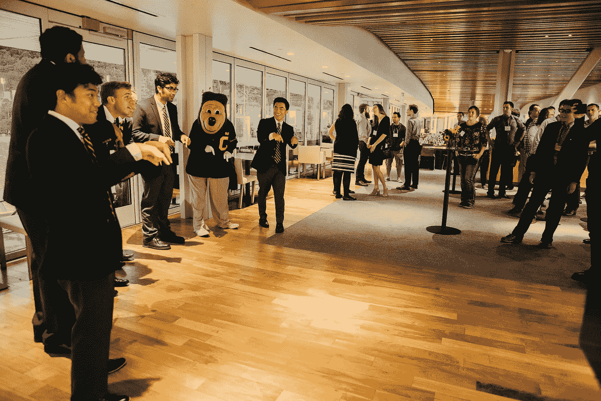
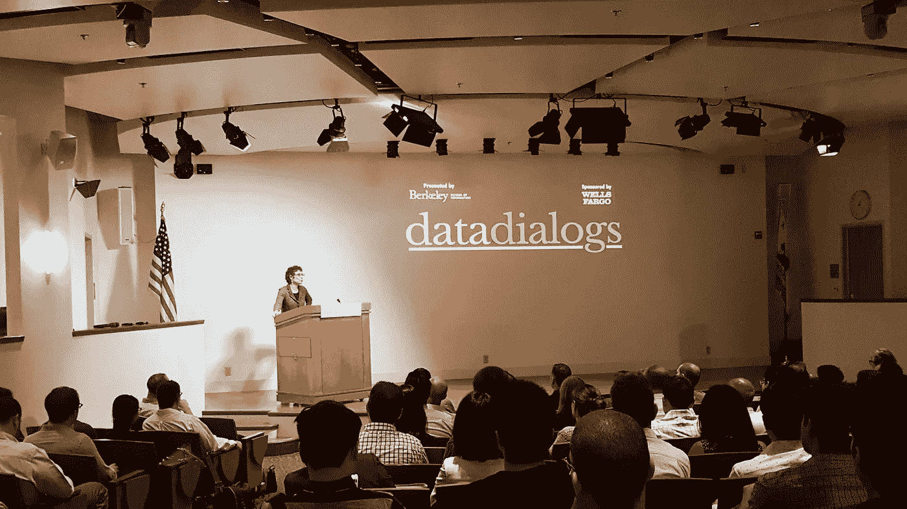
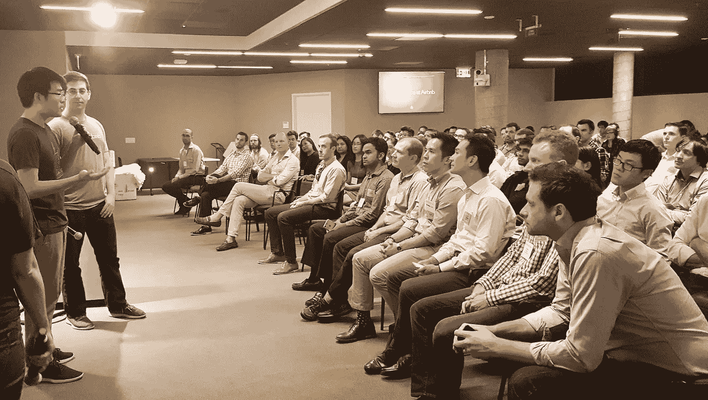
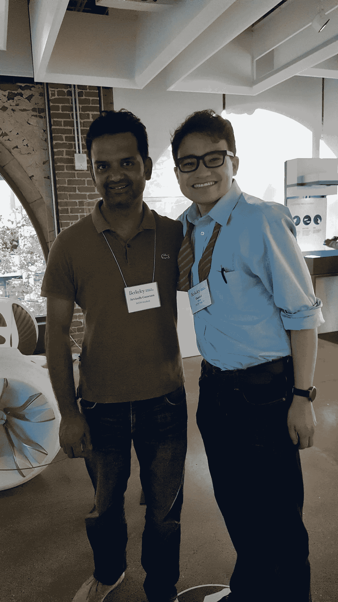
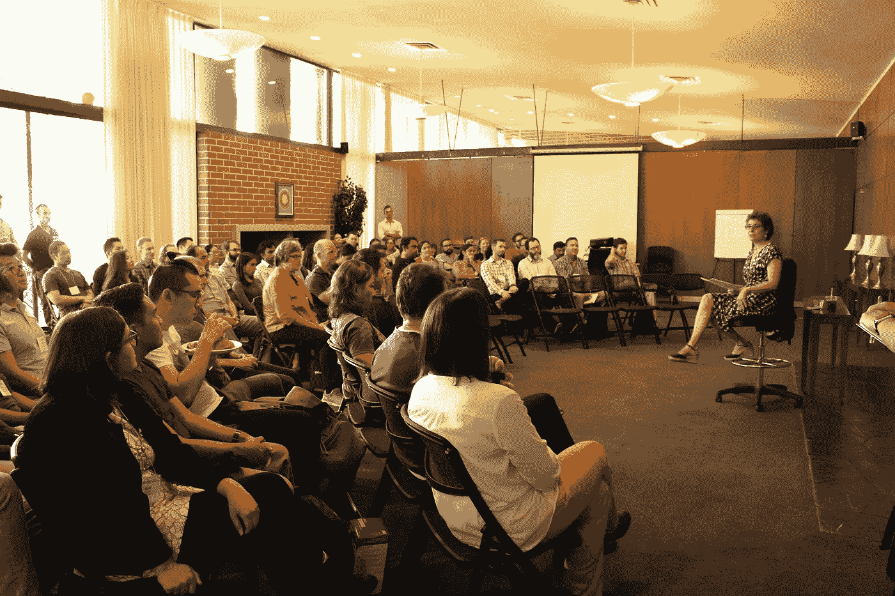

# 加州大学伯克利分校 MIDS 沉浸式教学——2017 年秋季

> 原文：<https://towardsdatascience.com/on-uc-berkeley-mids-immersion-fall-2017-ffde381af7d1?source=collection_archive---------10----------------------->

## *由* [*丹尼尔·肯特*](https://www.ischool.berkeley.edu/people/daniel-kent#profile-main) *，现任* **信息与数据科学硕士(MIDS)学生**

T 加州大学伯克利分校的[信息和数据科学硕士(MIDS)项目](https://www.ischool.berkeley.edu/programs/mids)是一个特殊的项目，因为它结合了加州大学伯克利分校信息学院的优秀教师和社区、学术和行业领导者开发的深度和广度的内容，以及为工作专业人士量身定制的课程的灵活性。目前，我是一家初创公司[Jobwell.co](https://www.jobwell.co/)的联合创始人，我们正在为求职者开发一个 CRM。**MIDS 项目让我能够灵活地学习数据科学，并开始将我在初创公司学到的知识应用于实践**。

*Getting in to the Cal spirit — Go Bears!*

MIDS 项目不受地点限制，利用互联网将来自世界各地所有学科的有抱负的数据科学家聚集到 15 名或更少学生的亲密教室中。虽然这种分布式全球课堂的好处很多，但当来自在线课堂的熟悉面孔聚集在一起时更好，尤其是在加州大学伯克利分校的校园里。当我在 MIDS 项目的第一个任期时，我有机会在参加 [2017 MIDS 沉浸式活动](https://www.ischool.berkeley.edu/news/2017/fall-immersion-program-brings-100-data-scientists-berkeley)时会见了来自世界各地的近 100 名其他 MIDS 候选人。这是一场为期 4 天的数据科学“ [Chautauqua](https://en.wikipedia.org/wiki/Chautauqua) ”沉浸式学习，充满了专家演讲、公司参观以及与加州大学教授、校友和其他学生的交流。在我的 100 个同学中，我已经通过课堂或活跃的业余渠道认识了几十个。

当我住在离校园不远的地方时，一位好心的 MIDS 考生带我第一次参观了大学校园，他以前是加州大学的本科生。她带我们参观了校园，并向我们介绍了这些建筑的背景和历史。当我们的旅行结束时，是时候去纪念体育场的大学俱乐部了，这是认识更多同学、教师和职员的绝佳场所。我们欣赏了加州大学乐队演奏的音乐，并由阿卡贝拉乐队演唱了小夜曲，随后是伯克利的吉祥物奥斯卡的欢迎仪式！

虽然我们教室里的在线教学时间挤满了课程材料和问题，但我们中的许多人利用这个机会了解了更多关于我们教授的研究，并更多地了解了我们令人惊叹的 MIDS 项目和信息学院的工作人员。利用这些机会，我和一些新认识的朋友去了酒店的酒吧，聊了聊我们的课程、职业和兴趣。

Dean AnnaLee Saxenian introduces the Data Dialogs conference

第二天以一顿精心准备的早餐开始，在早餐中，我们互相聊天，了解新课程和一些教授这些课程的优秀教授，以及优化我们课程负荷的策略。然后，我们开始了为期一天的[数据对话会议](https://datadialogs.ischool.berkeley.edu/)，沉浸式参与者和加州大学伯克利分校和数据科学社区的其他成员听取了学术界和工业界领袖对数据科学的不同应用、我们作为数据科学家使用的工具的更新、该学科可能引领我们成为专业人士的方向以及人类的角色的讨论。详细回顾一下，我鼓励你去探索[蒂芙尼·贾亚](https://medium.com/@tiffanyjaya)的精彩[帖子](https://medium.com/@BerkeleyISchool/data-dialogs-2017-conference-recap-265f9bdcb8b1)。

第二天是我最喜欢的一天:我们开始了由学院院长 AnnaLee Saxenian 主持的关于深度学习的教师小组讨论。听到关于数据科学的应用和方面以及学校的一些教职员工对它的看法和经验是很有趣的。会议结束后，同学们向小组成员提出了一系列问题，然后我们开始参观公司。

我们的小组被分成两个小组，每个小组先去吃午餐，然后向 Dropbox 或 WorkDay 的数据科学团队学习。我的团队从拜访 Dropbox 团队开始，我们听说了他们正在解决的一些棘手的数据科学问题；这是在 Dropbox 了解数据科学以及他们如何发展团队的绝佳机会。

At Airbnb

在 Dropbox 之后，我们去了 Airbnb，在那里，一位 MIDS 校友和他在 Airbnb 的几个同事给我们做了一场颇有见地的演讲。他们提供了关于他们在 Airbnb 的项目的深刻见解，以及他们将项目嵌入公司业务线不同组成部分的方法。

Letting loose at Autodesk Gallery!

离开 Airbnb 后，我们有一些空闲时间探索这座城市，我们一群人前往旧金山最具标志性的建筑之一——渡轮大厦，品尝了餐馆、商店和摊位，同时进一步了解了每个人。当大楼塔楼上的时钟敲响六点时，我们前往 Autodesk Gallery，这是一个互动的博物馆，展示了 Autodesk 软件的新技术、知识产权和应用程序，还有小吃和开胃小菜，在那里我们可以进一步与我们的教授交流，并会见当地的学生和校友。谈话一直持续到博物馆关门，晚上我们才回到伯克利。

我们沉浸在其中的最后一个上午是我们经历的一个突出的顶点——首先是加州大学伯克利分校的一位讲师带领我们进行了一系列互动的领导力练习，以寻找我们作为领导者的真实声音，然后是社区午餐，在那里我们遇到了更多来自信息学院的学生和教职员工。这一天以市政厅结束，在那里，院长 Saxenian 向社区简要介绍了即将发生的一些令人兴奋的新进展，并回答了我们社区的问题。在我们的市政厅之后，大家真诚地道别，拥抱，然后我们开始了我们的离开。

MIDS Townhall

沉浸式学习是一次非常宝贵的经历，为我的在线学习提供了额外的背景和社区。我期待着我能参加的下一次沉浸式学习，但在那之前，我很高兴能继续成为加州大学伯克利分校 MIDS 分校学生和校友全球社区的一员，并知道我的朋友遍布世界各地。