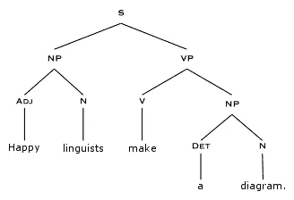

# 从前…

> 原文：<https://towardsdatascience.com/once-upon-a-time-dcfb5badd192?source=collection_archive---------16----------------------->

…我不知道长大后想做什么。

从很小的时候起，我们都会考虑这样一个问题:“你长大后想成为什么样的人？”当你小的时候，这是一个有趣的游戏，你决定你想成为女超人。或者医生。或者一只猫。答案会有所不同。但随着时间的推移，人们期待对这个问题给出更具体的答案。

高中的时候，我一直想不出答案。我擅长数学、自然科学和西班牙语，但我不想让*长期委身于其中任何一门课程。选择大学专业似乎是一个“成年人”的决定，而我不是其中之一。*

直到我参加了一个随机的暑期课程，我才最终坚定地爱上了一门学科:语言学。

不要问我任何关于语言学的问题，因为我向你保证，你没有足够的时间来听我想说的一切。然而，要注意的一件重要事情是，语言学学生生活和呼吸着数据。语言学家的梦是一组令人困惑的语言数据，需要被检查和分析；揭示语言中的模式以及随之而来的见解。我总是将语言数据问题视为一个复杂且不断变化的难题，需要我去挖掘和解决。在一堂课上，我通过观察和记录一个说本族语的人来获取数据，从而对阿尔巴尼亚语进行了语音和音位分析。你可能觉得这并不令人兴奋，但请相信我——的确如此。

快进到大学，我发现自己问了一个和以前一样的问题:你长大后想成为什么样的*？语言学毕业生比其他人更少具体的职业道路并不奇怪。2014 年，当我决定开始大学毕业后的求职时，我甚至没有考虑过寻找语言学方面的职业，因为我担心除了继续读研之外，我不会找到太多东西。近年来，越来越需要语言学家帮助推动自然语言处理的新创新(Dragon Speech、Alexa、Siri 等)。)，但当时我没有这方面的技术能力。*

*那我做了什么？我最终决定搬到威斯康星州的麦迪逊，在一家医疗保健 IT 公司做软件测试员。现实点吧，我这么做是为了奶酪。但老实说，我去是因为他们提供金钱、福利和无限量的免费爆米花。所以我这么做是为了爆米花。*

*在 Epic 工作是一个做一些完全不同的事情的机会，我想如果有一天我想成为一名“技术人员”，作为一名质量保证分析师工作可能是一个好的开始。我们在 Epic 的医疗记录软件上进行了 6 个月的广泛培训，同时还学习了如何浏览他们的数据库和创建质量测试计划。在任期间，我学习过，笑过，哭过，失败过，成功过，又失败过。我和我的同事建立了惊人的工作关系，并成为我团队中最有效的测试人员之一，一切看起来都很完美。*

*一年半后，我开始疯狂地想念波士顿，我渴望新的精神挑战。虽然测试医疗软件很有教育意义，也是一份很棒的第一份工作，但这并不是我热衷的事情。我最终搬回波士顿，离家人和朋友近一些，并在 Wayfair 开始了一个分析师的职位。*

*由于我已经在一家大型科技公司工作过，我认为随着我继续探索我的职业兴趣和个人优势，Wayfair 将是一个相对平稳的过渡。起初，我的工作职责并不明确，最终我在供应商运营团队中帮助完成了各种特别的 EDI 项目。一两个月后，我的新团队成立了，他们的唯一目的是对供应商的库存数据进行数据分析，我非常兴奋。*

*库存质量团队的总体目标是利用 Wayfair 庞大的数据仓库来揭露那些没有为我们提供准确库存信息的供应商。如果没有准确的最新库存信息，客户可以在我们的网站上购买受影响的产品。一旦订单被发送到提供该商品的特定公司，我们就会收到该商品实际缺货的通知。订单会延期交货，有时不止一次，客户会被告知发货延迟。在更大的范围内，库存质量问题大大降低了全公司的平均满意度。当不清楚一件只需点击一下按钮就能买到的商品是否有货时，你为什么会选择使用 Wayfair 而不是其他在线零售商呢？*

*在没有进入更多细节的情况下，当我很快学会使用 SQL 和 Excel 数据透视表操作和分析数据时，我被反复抛入了深水区。这是最好的。我感觉自己回到了语言学教室，在我面前的数据中寻找模式和意义。最重要的是，我有这些有用的技术工具，可以用来更聪明地工作，而不是更努力。随着我作为数据分析师的技能的磨练，我很清楚这不仅是我擅长的事情，也是激发我内心喜悦的事情，我想学习更多。*

*不幸的是，当所有这些难以置信的学习和自我发现正在进行时，我的身体却不配合。在我搬回马萨诸塞州之前，我已经开始周期性地偏头痛，我不清楚在我的生活中我应该优先考虑什么:工作还是健康。开始的时候，我大约每两周就会偏头痛一次，所以我在必要的时候会利用我的病假/假期，在我可以工作的时候会拼命工作。然而，在高峰期，偏头痛至少每隔一天发作一次。很明显，我的病假和无薪休假快结束了，是时候做出一些艰难的决定了。*

*在经理的建议下，我决定休一个月的病假。我就不说细节了，但是当我回去工作的时候，并没有太大的改善。我剩下的几天无薪假期很快就用完了，我递交了辞呈。在一个不断以你做了什么来衡量成功的社会里，我什么也没做。*

*在我考虑找新工作之前，变得更健康是我的首要任务。除了治疗，在接下来的一年里，我做了一些重要的自我探索。我长大后想做什么？那时我刚满 24 岁，很难合理化自己 24 岁却不知道到底发生了什么。对我来说，重要的是退一步，在我和我从大学开始就培养的分析问题解决技巧之间留出一些空间。*

*于是，我开始为 Lyft 开车。星期天，我在我的寺庙里当了一名希伯来语老师。我在一家蛋糕店兼职，看看自己是否有激情成为小企业的一员。因为我得到了免费的羊角面包。我还在哈佛商学院做过三个月的行政临时工，因为，为什么不呢？那份临时任务结束后，我在另一家面包店工作，大部分时间都在做鳄梨吐司，同时参加在线课程。*

*在这一切发生的同时，我在我的神经科医生、治疗师、精神病医生和大量药物的帮助下，积极地与我的偏头痛作斗争。我是否在服用一种新的偏头痛药物后，不记得自己是如何到达波士顿公共花园的？是的。是的，我做到了。有没有几天我觉得自己再也不会感到身体健康了？是的。很多都是。但我学会了接受这是我正在走的路，我需要挺过去，因为尽管这听起来很老套，但隧道的尽头总有一线光明。*

*就在我去哈佛商学院做临时工之前，我的偏头痛得到了很好的控制，我可以度过一天 8 个小时，而不想蜷缩着消失。我联系了一家临时机构，这样我就可以试试正常的工作周时间表，而不用做出永久的承诺。他们让我在 HBS 做了一周的行政工作。那一周之后，他们需要一个有很强 Excel 技能的人提供更多帮助，所以我留了下来。突然之间，我在那里呆了 3 个月，Excel 和我的关系达到了一个新的水平。更重要的是，通过我为完成任务而访问的所有哈佛网页，我了解了公众可以使用的在线 HBS 课程。*

*我们再快进一遍。*

*我的工作任务结束了，是时候采取下一步行动了，HBS 的商业分析课程是一次完美的表演。在花了一年时间尝试一些新的和不同的东西后，我终于觉得准备好重新审视数据分析的一般领域了。在将近一年的时间里，我第一次在精神上受到了刺激，并且真正为某事感到兴奋。有一天我突然想到:我爱上了数据科学。我终于知道我长大后想做什么了！！！！*

*课程结束时，我开始申请波士顿各地的数据分析师和数据科学家职位；我的大脑已经准备好(不止一种方式)回到正题。*

*然后没有一家公司联系我。*

*结束了。*

*开玩笑的。不是关于没人联系我的那部分——是关于结束的那部分。是的，这是最糟糕的，我觉得自己完全失败了，但我知道我不会那么容易就放弃。我的技术技能范围狭窄，这是最有可能让我在一群具有 Python 知识的有竞争力的申请者中止步不前的原因。*

*我做了研究，发现了许多方法来磨练我在数据科学领域的技能。我看节目评论。我在 LinkedIn 上随机跟踪了一些人，他们实际上已经经历了一些潜在的数据科学项目选择。我从以前的经理、以前的同事、朋友和家人那里得到建议。然后我做了一个决定。*

*我们都花了很多时间担心未来会是什么样子。我没完没了地描述的经历告诉我，跟随你的心，倾听你的身体，用你热爱的一切充实你的头脑，比担心你长大后会成为什么样的人重要得多。解决难题是我最喜欢做的事情，所以我要去做！*

*我来到了联大数据科学沉浸式训练营(多么拗口)，现在我已经在这里呆了 2 周多了。*

*我长大后要成为一名数据科学家。如果因为某种原因天塌了，而这并不奏效，我的计划是继续一步一步向前。*

**