# 一个气泡图，比较 10 种数据可视化工具

> 原文：<https://towardsdatascience.com/one-bubble-chart-comparing-9-data-visualization-tools-7308b893950a?source=collection_archive---------0----------------------->


# 介绍

对于任何想学习数据分析和可视化的人来说，网上不乏“最佳工具”文章，建议你选择什么。我不会尝试创建一个列表，因为有太多的工具可以列举。但是，我确实想向您展示一些我遇到的用于数据可视化的工具和编程语言，并让您进行比较。大部分都很容易学，灵活性很高，而且是免费的或者有免费版本(我就是这样选择学什么工具的)。所以你很快就能弄脏自己的手。让我们开始吧。

让我们试着重现[汉斯·罗斯林](https://en.wikipedia.org/wiki/Hans_Rosling)著名的[泡沫图](https://www.youtube.com/watch?v=jbkSRLYSojo)来讲述国家财富和健康的故事。也就是说，散点图具有第三个气泡维度。它让你一次比较三个变量。一个在 x 轴(人均 GDP)，一个在 y 轴(预期寿命)，第三个用泡沫的面积大小(人口)来表示。

# 数据

数据来自最新的[世界银行指标](https://data.worldbank.org/indicator)。下载过程如下:

```
library(WDI)
indicator2 <- WDI(country="all", indicator=c("NY.GDP.PCAP.CD", "SP.POP.TOTL", "SP.DYN.LE00.IN"), start=2015, end=2015, extra = TRUE)drops <- c("iso2c","iso3c", "capital", "longitude", "latitude", "income", "lending")
indicator2 <- indicator2[ , !(names(indicator2) %in% drops)]colnames(indicator2) <- c("country","year", "GDP_per_capita", "population_total", "life_expectancy", "region")indicator2 <- indicator2[-c(1, 2, 3, 4, 5, 6, 19, 66, 67, 159, 178, 179, 180, 181, 182, 201, 202, 203, 204, 205, 206, 207, 225, 226, 227, 228, 236, 237, 238, 239, 240, 241, 242, 243, 245, 246, 247, 248, 249, 250, 251, 252, 253, 254, 255, 256, 257, 258, 259, 260, 262, 263), ]
```

就是这样，这是我们的数据！

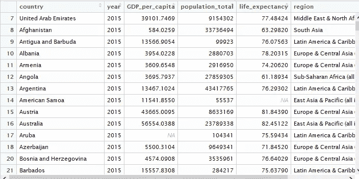

# 形象化

1.  [**基 R**](http://www.r-graph-gallery.com/portfolio/basics/)

R 最强大的功能之一是它能够生成各种各样的图形，只需几个命令就可以快速轻松地可视化数据。

symbols()函数在绘图上绘制符号。我们将使用一组指定的 x(人均 GDP)和 y(预期寿命)坐标来绘制圆，并自定义圆的大小(面积的平方根)。

```
options(scipen=999)radius <- sqrt( indicator2$population_total/ pi )
symbols(indicator2$GDP_per_capita, indicator2$life_expectancy, circles=radius, inches=0.35, fg="white", bg="red", xlab="GDP per Capita(USD)", ylab="Life Expectancy(years)", main = "GDP per Capita vs. Life Expectancy 2015", ylim = c(0, 100))
```

给出了这个图:

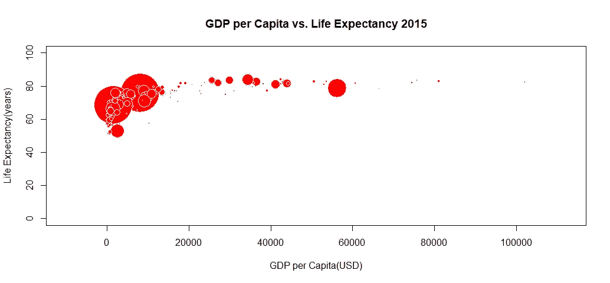

Base R

2.[gg plot 2](http://ggplot2.org/)

[ggplot2](http://ggplot2.org/) 成为近年来 R 社区最流行的绘图包。它允许您以直观的方式创建表示单变量和多变量数值和分类数据的图表。分组可以用颜色、符号、大小和透明度来表示，但是要为陡峭的学习曲线做好准备。

```
library(ggplot2)
library(ggthemes)
ggplot(indicator2, aes(x = GDP_per_capita, y = life_expectancy, size = population_total/1000000, fill = region)) +
  geom_point(shape = 21) +
  ggtitle("GDP per Capita vs. Life Expectancy") +
  labs(x = "GDP per Capita(USD)", y = "Life Expectancy(years)") +
  scale_y_continuous(limits = c(0, 90)) +
  scale_size(range = c(1, 10)) +
  labs(size = "Population(Millions)", fill = "Region") +
  theme_classic()
```

给出了这个图:

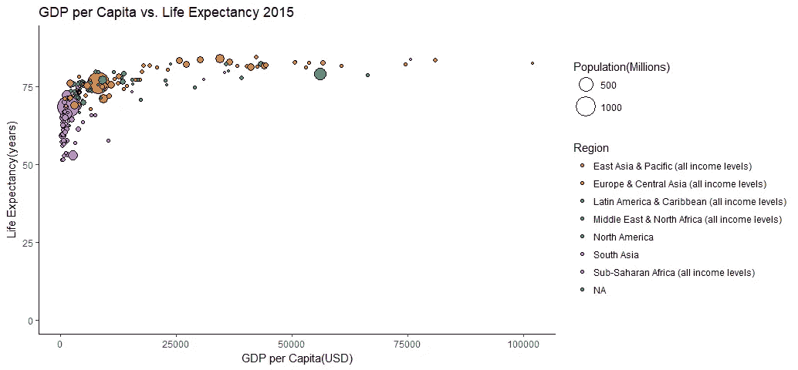

ggplot2

与 base R 相比， [ggplot2](http://ggplot2.org/) 的许多优点之一是我们不会在映射图例中迷失，因为 [ggplot2](http://ggplot2.org/) 为我们生成了它们。

3.[**ggvis**](http://ggvis.rstudio.com/ggvis-basics.html)

ggvis 包用于交互式数据可视化。它结合了[闪亮的](https://shiny.rstudio.com/tutorial/)的反应式编程模型和 [dplyr](https://cran.r-project.org/web/packages/dplyr/vignettes/dplyr.html) 的数据转换语法，使其成为数据科学家的有用工具。

```
library(ggvis)
indicator2 %>%
  ggvis(~GDP_per_capita, ~life_expectancy, fill=~factor(region)) %>%
  layer_points(size= ~population_total/1000000,opacity:=0.6) %>%
  add_legend(scales = "size", properties = legend_props(legend = list(y = 200))) %>%
  scale_numeric("y", domain = c(0, 90), nice = FALSE) %>%
  add_axis("x", title = "GDP per Capita(USD)") %>%
  add_axis("x", orient = "top", ticks = 0, title = "GDP per Capita vs. Life Expectancy 2015",
           properties = axis_props(
             axis = list(stroke = "white"),
             labels = list(fontSize = 0)))
```

给出了这个图:

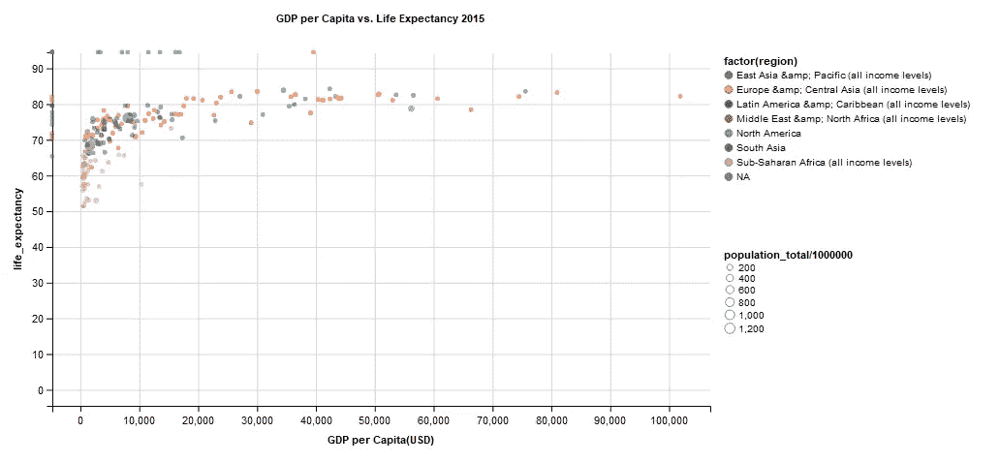

ggvis

与 ggplot2 不同，默认情况下，ggvis 不会将基于相同基础变量的比例合并到单个图例或多个图例中。相反，我们必须手动设置图例。

4. [**Plotly for R**](https://plot.ly/r/)

r 包 plotly 是开源 JavaScript 绘图库 [plotly.js](https://plot.ly/javascript/) 的高级接口。有了 Plotly，R 用户只需几行代码就可以轻松地在线创建交互式的、出版物质量的图形。

```
library(plotly)p <- plot_ly(indicator2, x = ~GDP_per_capita, y = ~life_expectancy,
  color = ~region, size = ~population_total) %>%
  layout(yaxis = list(range = c(0, 90)))
p
```

给出了这个图:

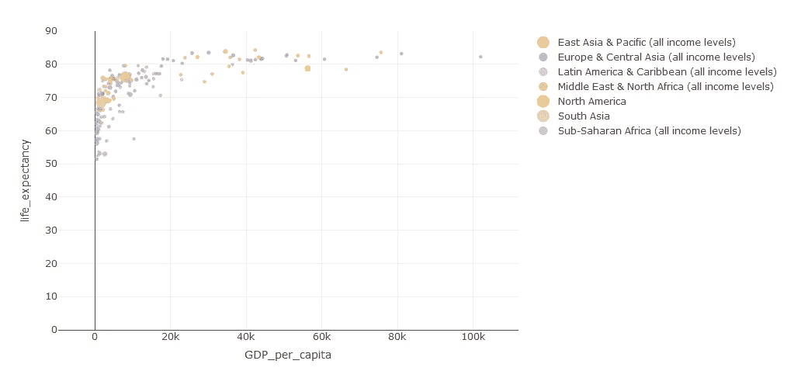

Plotly for R

5. [**默认熊猫剧情**](https://pandas.pydata.org/pandas-docs/stable/generated/pandas.DataFrame.plot.html)

[Pandas 的内置绘图](https://pandas.pydata.org/pandas-docs/stable/generated/pandas.DataFrame.plot.html) DataFrame.plot()有多种图表类型可用(折线图、散点图、历史图等)。如果你喜欢熊猫，这是一个有用的探索工具。

```
import pandas as pd
indicator2 = pd.read_csv('indicator2.csv')indicator2.plot(kind='scatter', x='GDP_per_capita', y='life_expectancy', s = indicator2['population_total']/1000000, 
                title = 'GDP per Capita vs. Life Expectancy 2015', ylim=(0,90))
plt.savefig('base_pandas.png')
```

给出了这个图:

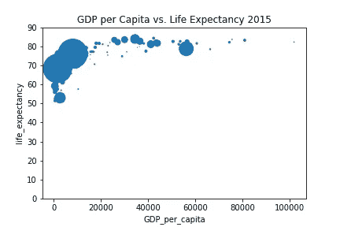

Base Pandas

6.[**Matplotlib**](https://matplotlib.org/)

Matplotlib 是一个 Python 绘图库，可生成出版物质量数字。然而，对于一个新用户来说，这可能是一个令人沮丧的工具，因为要获得看起来合理的图形需要做大量的工作。你会明白我的意思。

```
%matplotlib inline
import pandas as pd
import matplotlib.pyplot as plt
import matplotlib.lines as mlines
import numpy as np
indicator2 = pd.read_csv('indicator2.csv')plt.figure(figsize=(10,8))
colors = ("red", "green", "blue", "yellow", "orange", "black", "gray")def attribute_color(region):
    colors = {
        'East Asia & Pacific (all income levels)':'red',
        'Europe & Central Asia (all income levels)':'green',
        'Latin America & Caribbean (all income levels)':'blue',
        'Middle East & North Africa (all income levels)':'yellow',
        'North America':'orange', 
        'South Asia':'black', 
        'Sub-Saharan Africa (all income levels)':'gray'
    }
    return colors.get(region, 'white')
color_region = list()
qty_states = len(indicator2['region'])

for state in range(qty_states):
    color_region.append(attribute_color(indicator2['region'][state]))
plt.scatter(x = indicator2['GDP_per_capita'],
            y = indicator2['life_expectancy'],
            s = indicator2['population_total']/1000000,
            c = color_region,
            alpha = 0.6)
plt.title('GDP per Capita vs. Life Expectancy 2015', fontsize=20)
plt.xlabel('GDP per Capita(USD)')
plt.ylabel('Life Expectancy(years)')
plt.ylim(0, 100)regions = ['East Asia & Pacific (all income levels)', 'Europe & Central Asia (all income levels)', 'Latin America & Caribbean (all income levels)', 
           'Middle East & North Africa (all income levels)', 'North America', 'South Asia', 'Sub-Saharan Africa (all income levels)']legend1_line2d = list()
for step in range(len(colors)):
    legend1_line2d.append(mlines.Line2D([0], [0],
                                        linestyle='none',
                                        marker='o',
                                        alpha=0.6,
                                        markersize=6,
                                        markerfacecolor=colors[step]))
legend1 = plt.legend(legend1_line2d,
                     regions,
                     numpoints=1,
                     fontsize=10,
                     loc='lower right',
                     shadow=True)legend2_line2d = list()
legend2_line2d.append(mlines.Line2D([0], [0],
                                    linestyle='none',
                                    marker='o',
                                    alpha=0.6,
                                    markersize=np.sqrt(10),
                                    markerfacecolor='#D3D3D3'))
legend2_line2d.append(mlines.Line2D([0], [0],
                                    linestyle='none',
                                    marker='o',
                                    alpha=0.6,
                                    markersize=np.sqrt(100),
                                    markerfacecolor='#D3D3D3'))
legend2_line2d.append(mlines.Line2D([0], [0],
                                    linestyle='none',
                                    marker='o',
                                    alpha=0.6,
                                    markersize=np.sqrt(1000),
                                    markerfacecolor='#D3D3D3'))

legend2 = plt.legend(legend2_line2d,
                     ['1', '10', '100'],
                     title='Population (in million)',
                     numpoints=1,
                     fontsize=10,
                     loc='lower left',
                     frameon=False, 
                     labelspacing=3,
                     handlelength=5,
                     borderpad=4  
                    )
plt.gca().add_artist(legend1)

plt.setp(legend2.get_title(),fontsize=10)
plt.savefig('matplotlib.png')
```

给出了这个图:

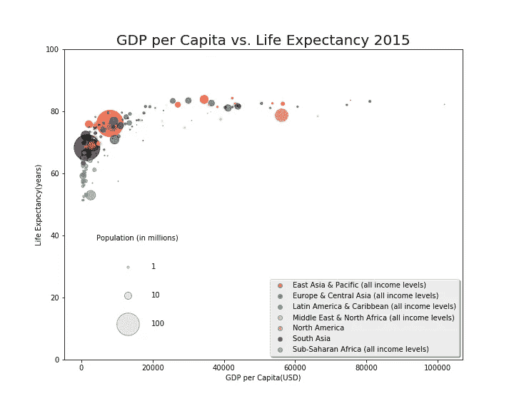

Matplolib

如您所见，Matplotlib 的绘图命令非常冗长，获取图例也很麻烦。对我们大多数人来说，这可能是太多的工作了。

7. [**海波**](https://seaborn.pydata.org/)

如果你正在寻找一种简单的方法来用 Python 绘制合理的图表，那么你会喜欢 Seaborn。

```
import seaborn as sns
plt.figure(figsize=(10,8))
sns.set_context("notebook", font_scale=1.1)
sns.set_style("ticks")sizes = [10, 60, 90, 130, 200] 
marker_size = pd.cut(indicator2['population_total']/1000000, [0, 100, 200, 400, 600, 800], labels=sizes) 
sns.lmplot('GDP_per_capita', 'life_expectancy', data=indicator2, hue='region', fit_reg=False, scatter_kws={'s':marker_size})
plt.title('GPD_per Capita vs. Life Expectancy 2015')
plt.xlabel('GDP per Capita(USD)')
plt.ylabel('Life Expectancy(years)')
plt.ylim((0, 100))
plt.savefig('sns.png')
```

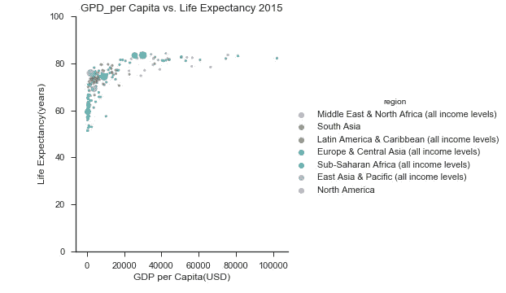

Seaborn

8. [**画面**](https://www.tableau.com/)

Tableau 已经变得如此受欢迎，以至于许多组织甚至要求你在简历中加入 Tableau 来申请他们的数据分析师职位。好消息是 Tableau 非常容易学。这是一个非常直观的工具，你可以很快学会。然而，如果你想擅长它，你将需要练习、练习、练习，并钻研(在 [Tableau Public](https://public.tableau.com/en-us/s/) 上)成千上万的 Tableau 练习册，以研究其他人做了什么。

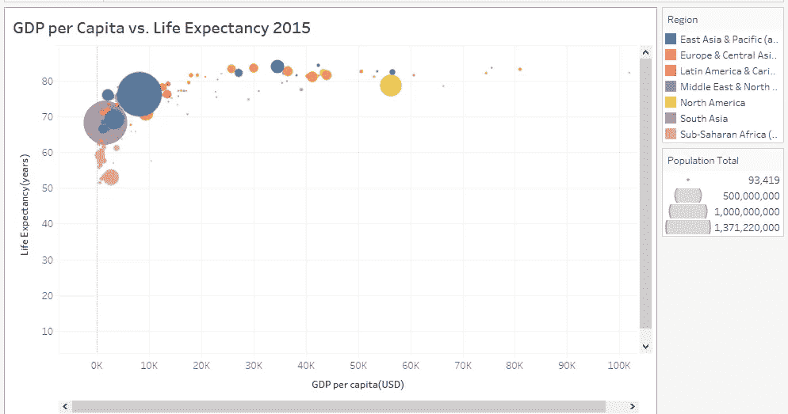

Tableau

9. [**动力匕**](https://powerbi.microsoft.com/en-us/)

Power BI 是微软进入[自助式商业智能](https://www.pcmag.com/article2/0,2817,2491954,00.asp) (BI)领域的入口。作为一种基于云的服务，它很快在数据科学专业人士中流行起来，这有助于他们使用组织的数据轻松地可视化和分享见解。

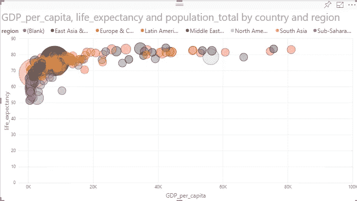

Power BI

10. [**微观策略**](https://www.microstrategy.com/us)

几年前， [MicroStrategy](https://www.microstrategy.com/us) 推出了一款免费的数据可视化软件。名为“ [MicroStrategy Analytics 桌面](https://www.microstrategy.com/us/desktop)”。它旨在与 Tableau 和其他公司提供的越来越流行的自助式数据发现桌面可视化工具竞争。让我们快速浏览一下。

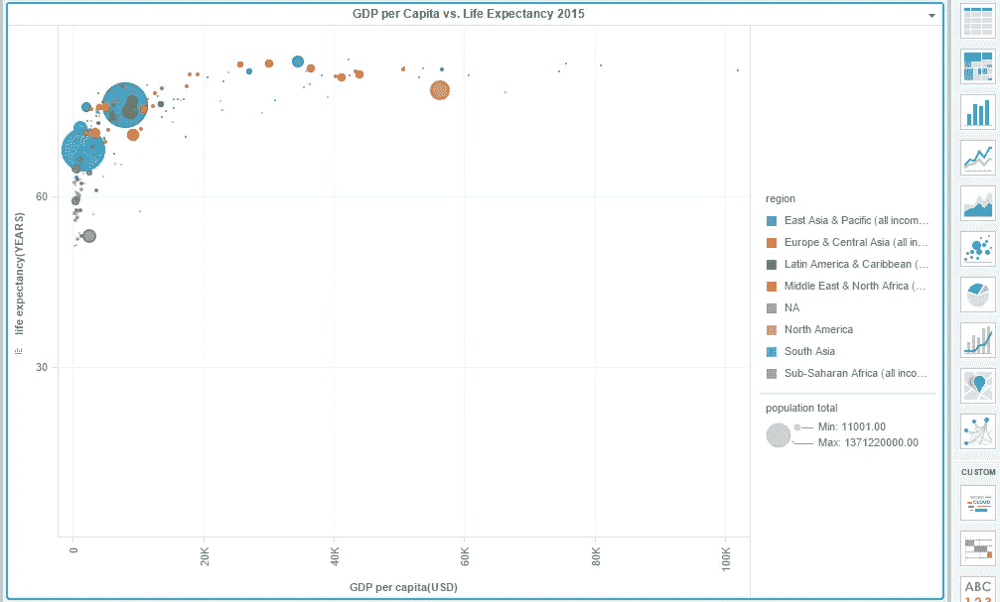

MicroStrategy

**结论**

我就说这些。如果你想了解更多关于数据可视化工具的知识，可以看看 Lisa Charlotte Rost 的[我从使用 24 种工具重建一个图表中学到的东西](https://source.opennews.org/articles/what-i-learned-recreating-one-chart-using-24-tools/)。

所有这些图表的 R 和 Python 源代码可以在 [GitHub](https://github.com/susanli2016) 上找到。我将很高兴收到关于上述任何反馈或问题。在那之前，享受视觉化吧！