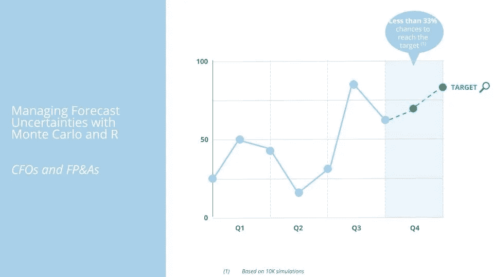
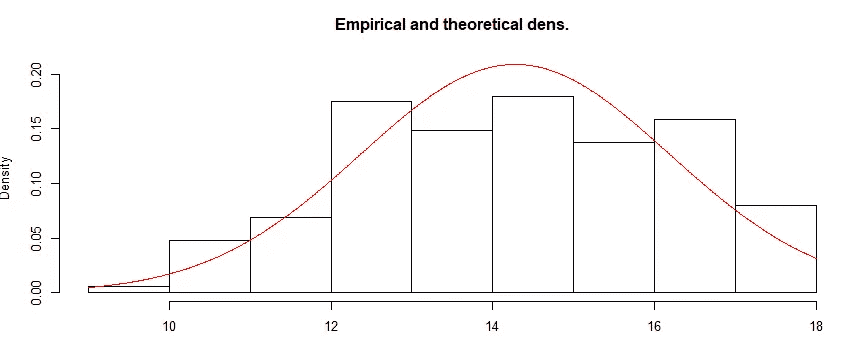
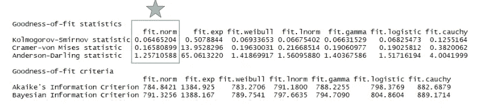
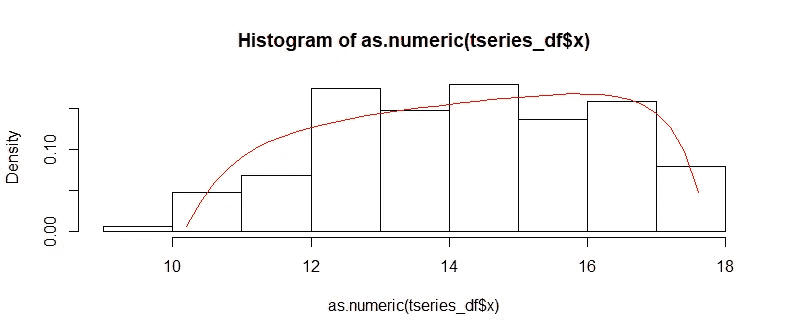
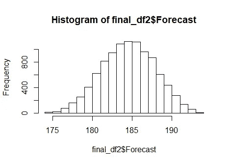
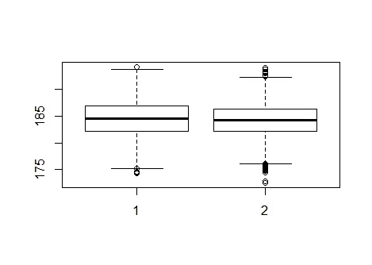

# 首席财务官管理预测不确定性的一个简单方法(使用蒙特卡罗和 R)

> 原文：<https://towardsdatascience.com/one-simple-way-for-cfos-to-manage-forecast-uncertainties-using-monte-carlo-and-r-148e9b75c87c?source=collection_archive---------7----------------------->



财务专业人士有无数种方法来预测销售，但我们并不想涵盖这些方法。本文的目标是帮助财务专业人员使用蒙特卡罗和 R 更好地管理预测不确定性，能够回答以下业务问题之一:

> "你的组织达到目标的可能性有多大？"
> 
> “您组织的预测风险状况如何？”

这不再仅仅是估计目标(例如:根据我们知道的过去发生的事情重新预测第四季度)。它是关于评估目标内的风险水平，并进行数据驱动的业务对话，讨论我们如何做才能实现预期的结果。它还将为财务专业人员提供机会，使他们在管理预测的方式上更具战略性(例如，是时候考虑纳入即将到来的新机会了吗？我们应该等吗？我们是否过多或过少的承诺？).

虽然在 Excel 中进行蒙特卡洛模拟相对容易，但我个人更喜欢使用 R，因为可以利用 R 库来拟合分布和生成蒙特卡洛模拟的样本数据。

对于这个练习，我们将使用一个简化的案例，它需要很少的库。通过几行代码，我们将能够清楚地回答这个问题:

> “风险很高。就目前的情况来看，我们不太可能达到目标(例如，不到 33%的可能性)。让我们想出一个计划来弥合这一差距。”

本例中我们需要的是:

*   **一个商业问题/背景** —“我们在第三季度完成了 1.417 亿部，我们的年度目标是 1.860 亿部；我们实现它的概率有多大？”
*   **一个观察到的时间序列**——某产品 ABC 按月销售的数量。
*   **年度目标** —到年底，ABC 至少售出 1.86 亿件产品。

我们将使用以下方法来回答这个问题:

*   **第一步:**准备数据。
*   **步骤 2 A:** 对观察到的时间序列进行传统分布拟合。
*   **步骤 2 B:** 对观察到的时间序列进行“补充”分布拟合。
*   **步骤 3:** 为 10 月、11 月和 12 月生成一个包含 10，000 个样本的数据表。
*   **第四步:**生成概率，比较两个选项(选项 A = 26.75% /选项 B = 33.2%)。在这个例子中，一个很大的收获是，通过利用更好的拟合分布变得更精确不会显著改变业务结果(例如，两种方法之间 5%的风险差异)。
*   **第 5 步:**向业务部门报告风险很高，而且就目前的情况来看，他们不太可能达到目标(例如，低于 33%的可能性)。然后，想出一个缩小差距的计划。

**第一步:**准备数据

```
| library(RCurl)# Read data
mydata <- read.csv(text = getURL("https://raw.githubusercontent.com/tristanga/MonteCarlo_ForecastRisk/master/TS.csv"))# Create time serie
tseries <- ts(mydata$x, frequency = 12, start = c(2000, 1))# Check the time serie
start(tseries)
end(tseries)
frequency(tseries)# Remove Q4
tseries_sub <- window(tseries, start=c(2000, 1), end=c(2015,9))# Define your target
mytarget = 186.0000# Calculate actuals
actualYTD <- sum(window(tseries, start=c(2015, 1), end=c(2015,9)))# Check the distribution of your time serie
hist(tseries_sub)
boxplot(tseries_sub)
tseries_df = as.data.frame(tseries_sub)
```



**步骤 2 A:** 对观察到的时间序列进行传统分布拟合。

```
|library(fitdistrplus)
fit.norm <- fitdist(as.numeric(tseries_df$x), "norm")
fit.exp <- fitdist(as.numeric(tseries_df$x), "exp")
fit.weibull <- fitdist(as.numeric(tseries_df$x), "weibull")
fit.lnorm <- fitdist(as.numeric(tseries_df$x), "lnorm")
fit.gamma <- fitdist(as.numeric(tseries_df$x), "gamma")
fit.logistic <- fitdist(as.numeric(tseries_df$x), "logis")
fit.cauchy <- fitdist(as.numeric(tseries_df$x), "cauchy")# Compare Goodness-of-fit statistics
gofstat(list(fit.norm, fit.exp, fit.weibull,fit.lnorm,fit.gamma,fit.logistic,fit.cauchy),
        fitnames = c("fit.norm", "fit.exp", "fit.weibull","fit.lnorm","fit.gamma","fit.logistic","fit.cauchy"))# the best Goodness-of-fit statistics is for the normal distribution
option1 = fit.norm
summary(option1)
```



**第二步 B:** 对观察到的时间序列进行“补充”分布拟合。

```
|# Using Supplementary Distributions to fit the second option
library(SuppDists)
parms<-JohnsonFit(as.numeric(tseries_df$x), moment="quant")# plot the distribution
hist( as.numeric(tseries_df$x) , freq=FALSE)
plot(function(x)dJohnson(x,parms), 0, 20, add=TRUE, col="red")# let's create samples for october, november and december
option2 <- function(x)qJohnson(x,parms)
```



**第三步:**为 10 月、11 月和 12 月生成一个包含 10，000 个样本的数据表。

```
|#Option 1
library(truncnorm)
fit.coef <- coef(fit.norm)
final_df1 <- as.data.frame(rtruncnorm(n=10^4, a=min(tseries_df$x), b=max(tseries_df$x), mean=fit.coef["mean"], sd=fit.coef["sd"]))
colnames(final_df1) <- 'Oct'
final_df1$Nov <- rtruncnorm(n=10^4, a=min(tseries_df$x), b=max(tseries_df$x), mean=fit.coef["mean"], sd=fit.coef["sd"])
final_df1$Dec <- rtruncnorm(n=10^4, a=min(tseries_df$x), b=max(tseries_df$x), mean=fit.coef["mean"], sd=fit.coef["sd"])
final_df1$Forecast <- actualYTD + final_df1$Oct + final_df1$Nov +final_df1$Dec#plot histogram of forecasted quantities
hist(final_df1$Forecast)#Option 2
option2 <- function(x)qJohnson(x,parms)
option2sample <- option2(runif(10000))
hist(option2sample)
boxplot(option2sample,as.numeric(tseries_df$x) )
final_df2 <- as.data.frame(option2(runif(10000)))
colnames(final_df2) <- 'Oct'
final_df2$Nov <- option2(runif(10000))
final_df2$Dec <- option2(runif(10000))
final_df2$Forecast <- actualYTD + final_df2$Oct + final_df2$Nov +final_df2$Dec# Plot Option 2
hist(final_df2$Forecast)
```



**第四步:**生成概率，比较两个选项(选项 A = 26.75% /选项 B = 33.2%)。

```
|boxplot(final_df1$Forecast,final_df2$Forecast)
myproba1 <- sum( final_df1$Forecast >= 186 ) / 100
myproba2 <- sum( final_df2$Forecast >= 186 ) / 100
```



**第 5 步:**向业务部门报告风险很高，就目前的情况来看，他们不太可能达到目标(例如，低于 33%的可能性)。然后，想出一个缩小差距的计划。

后续步骤:

*   增加复杂性(每个月的分布与整个时间序列，利润与销售量，在模型中包括增长/CAGR，外部变量等。).
*   为金融专业人士写一写预测定量时间序列的其他相关统计方法。

请注意，蒙特卡罗方法有一些风险/注意事项需要牢记:1)我们使用过去来预测未来，而不考虑除先前销售数量分布(人口、价格等)之外的任何外部因素。)，2)观测到的时间序列分布会随时间而变化；虽然选项 2 中的模型应遵循这些变化，但重要的是要不时检查它是否仍然紧密遵循选定的分布。

该代码可在 [Github](https://github.com/tristanga/Managing-Forecast-Uncertainty-Monte-Carlo-R) 上获得。谢谢你看我的帖子。这是我在媒体上的第一篇文章。如果您遇到过类似的挑战，或者您希望在您的组织中得到帮助，请随时联系我。