# [仅 Numpy ]通过 Numpy 中的 ZCA 白化反向传播[手动反向传播]

> 原文：<https://towardsdatascience.com/only-numpy-back-propagating-through-zca-whitening-in-numpy-manual-back-propagation-21eaa4a255fb?source=collection_archive---------9----------------------->

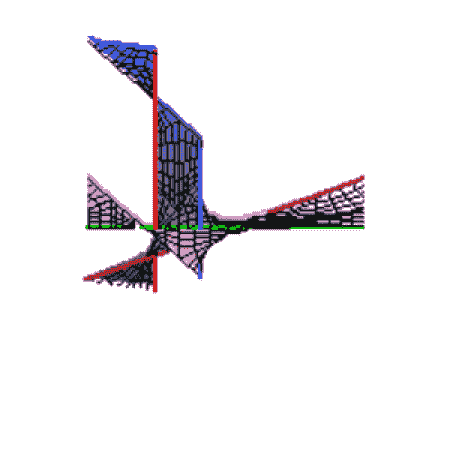

gif from this [website](https://giphy.com/gifs/geometry-algebraic-FPYOP2CGlgZB6)

阅读前，请注意几件事。

1.  这篇帖子的灵感来自 2018 年 CVPR 论文“[去相关批次标准化](https://arxiv.org/abs/1804.08450)”。
2.  我一直很懒，结果我已经在这个帖子上工作了三个星期，因此很多不同的材料混杂在一起。(换句话说，这篇文章对我来说更像是一篇个人笔记。又名这是我做过的最垃圾/无意义的帖子。)

最后，在这篇文章中，我将看到 3 个全连接神经网络(带有 zca 白化层)在时尚 mnist 数据集上的表现。

> **请注意，这篇帖子是为了我未来的自己查阅相关资料，并回顾我做的一些个人笔记。**

**去相关批量归一化**

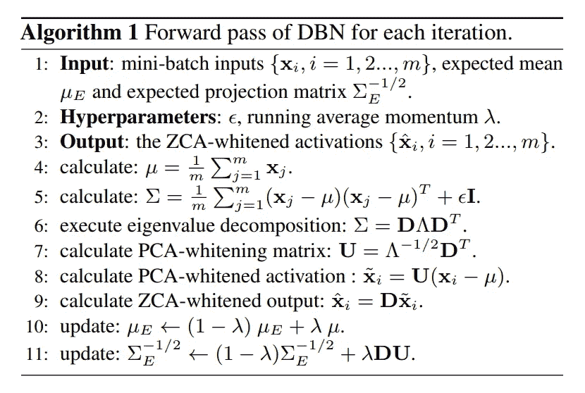

Algorithm from this [paper](https://arxiv.org/pdf/1804.08450.pdf)

我就开门见山了，批量规范化对给定的数据执行标准化。我们可以根据每个示例或每个维度进行标准化，这取决于用户。现在让我们用 ZCA 美白手术来代替。(我不会解释什么是 ZCA 美白手术，但这里有一些阅读材料。[ZCA 白化和 PCA 白化有什么区别](https://stats.stackexchange.com/questions/117427/what-is-the-difference-between-zca-whitening-and-pca-whitening)、[协方差矩阵和数据分布](https://theclevermachine.wordpress.com/2013/03/29/covariance-matrices-and-data-distributions/)、[白化](http://ufldl.stanford.edu/wiki/index.php/Whitening)和[统计白化](http://joelouismarino.github.io/blog_posts/blog_whitening.html)。)这就是论文“去相关批处理规范化”的作者所做的，这种去相关批处理规范化不仅使给定数据居中，而且使它们白化。(并且从该论文中呈现的前馈操作可以在上面看到。).现在，我不打算将数据居中，而是只打算创建一个执行 zca 白化的层。

**ZCA 增白层(前馈/反向传播)**

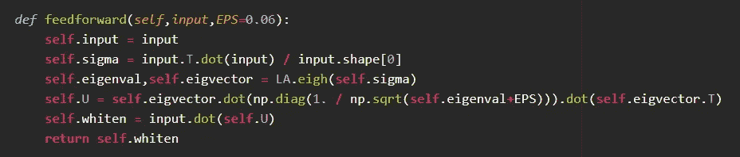

如上所述，当在 numpy 中实现 zca 白化时，它看起来像上面一样，其中我们首先计算协方差矩阵(或者每个例子或者每个维度，由您决定。)，执行特征值分解并创建白化矩阵，最后执行矩阵之间的点积。(输入和白化操作。)

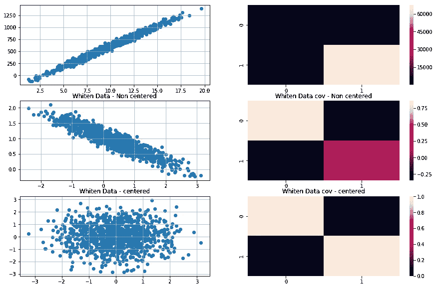

**第一行** →原始数据
**第二行** →白化数据(不居中)
**第三行** →白化数据(居中)

为了确认我的实现，让我们看看其他人实现的白化操作是否会产生相同的结果。

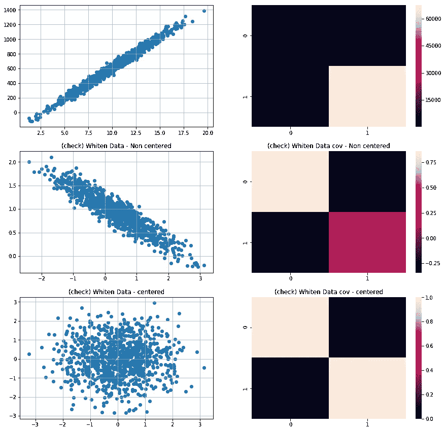

Used the code from this [website](https://gist.github.com/dmaniry/5170087)

好的，看起来是可行的，现在让我们实现反向传播算法。

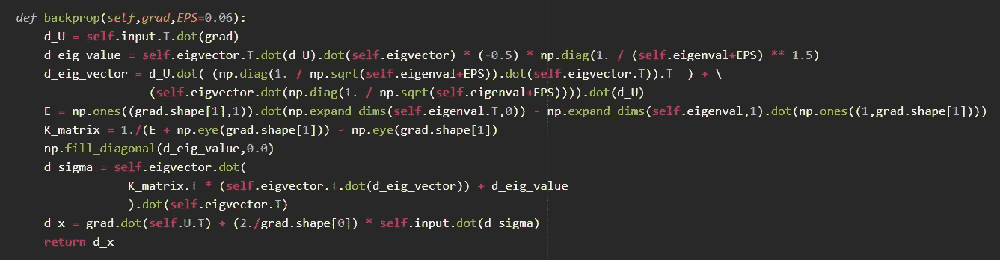

If anyone asks, I will do a more detailed mathy? post on driving this

这里有一件事我想提一下，在 sigma 后执行反向传播时，我们可以对称化矩阵。如下所示。

image from this [paper](https://arxiv.org/pdf/1709.06079.pdf)

诸如“正交权重归一化:深度神经网络中多个依赖 Stiefel 流形的优化解决方案”的论文已经提出了这一点。但是我不打算用它。还有，论文'[线性代数:矩阵演算](https://www.colorado.edu/engineering/CAS/courses.d/IFEM.d/IFEM.AppC.d/IFEM.AppC.pdf)'给了我很多帮助。现在让我们移动到一些不同的层，如中心层。

**居中层(前馈/反向传播)**

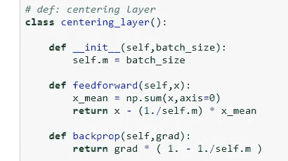

如果我们只想很好地将数据居中(即居中层),我们可以定义一个如上的层。我们可以选择通过示例或维度来确定给定矩阵的中心。现在让我们看看这一层如何影响给定的数据。

Original Data

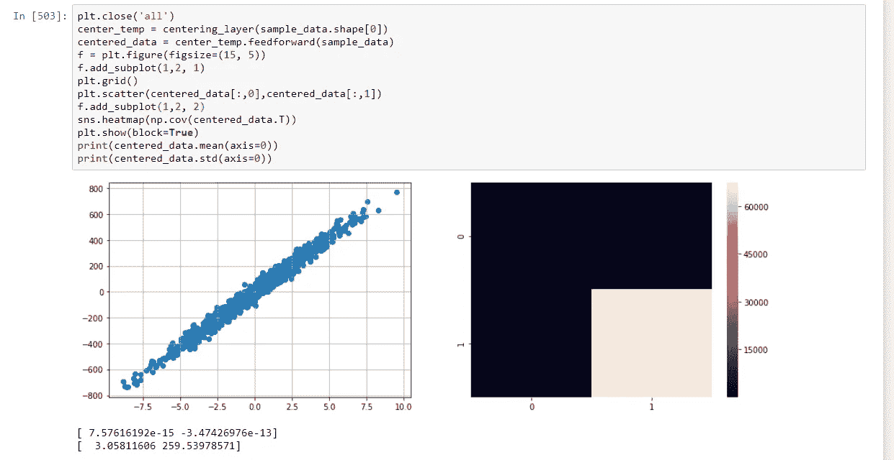

Centered Data

如上所述，中心层只移动数据，使每个轴的平均值为零，就这样，它对协方差矩阵没有任何影响。该操作在快速 ICA 之前完成，如这里的[所示](http://cis.legacy.ics.tkk.fi/aapo/papers/IJCNN99_tutorialweb/node25.html)。然而，这样做并不是 100%必要的。通过这一层的反向传播实际上非常容易，因为这是批量标准化的第一步。

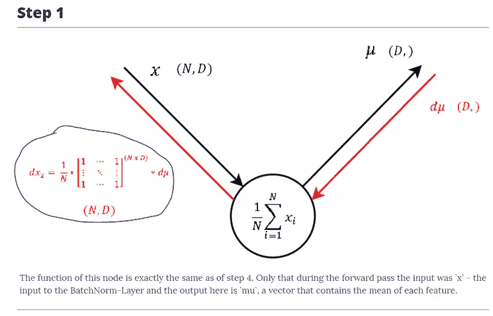

image from this [website](https://kratzert.github.io/2016/02/12/understanding-the-gradient-flow-through-the-batch-normalization-layer.html) and this [website](https://costapt.github.io/2016/06/26/batch-norm/)

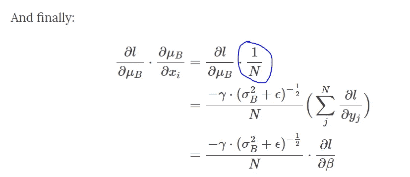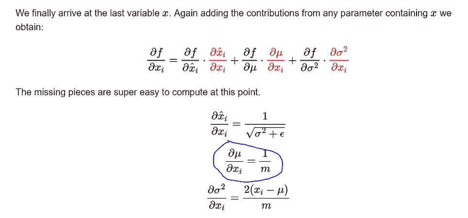

image from this [website](http://Efficient Batch Normalization - Pedro Costa. (2018). Costapt.github.io. Retrieved 21 August 2018, from https://costapt.github.io/2016/07/09/batch-norm-alt/) and this [website](https://kevinzakka.github.io/2016/09/14/batch_normalization/)

我不会深入细节，但是从很多不同的来源，我们可以知道，对 dmu/dx 的导数就是 1/m，其中 m 是例子的数量。因此，如果我们的中心层具有公式 f(x) = x-mu，其中 mu 是平均向量。我们可以说 df(x)/dx = 1-(1/m)。

**ZCA 美白层实验**

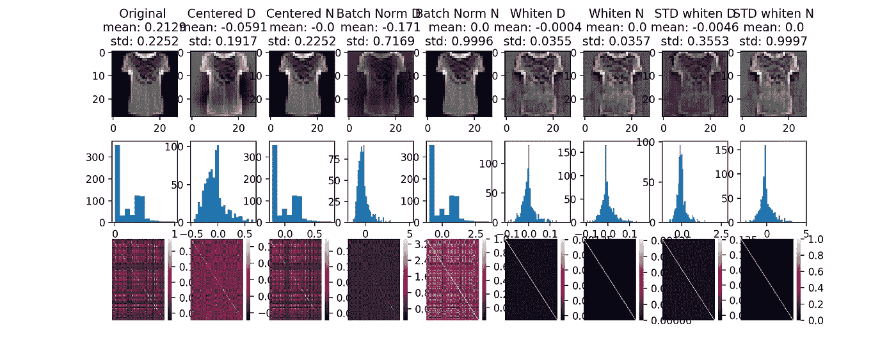

*图像顺序为，原始、居中、标准化、zca 白化、两者均标准化白化。(维度方面，示例方面)。*

上面的图像只是为了显示每一个变换的效果，我按照图像的顺序显示它们，直方图和协方差矩阵。(在 100 个例子中)在修改了很多值之后，我发现只使用增白层可以得到最好的效果。(最后，我还比较了不同的图像。)

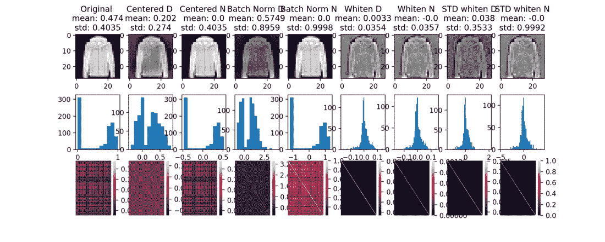

在仅仅 15 个纪元之后，我们可以观察到，这个简单的 3 全连接层网络能够在时尚 mnist 数据集上胜过 GRU + SVM。

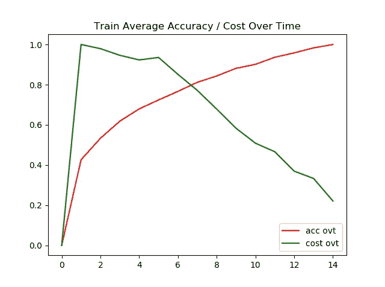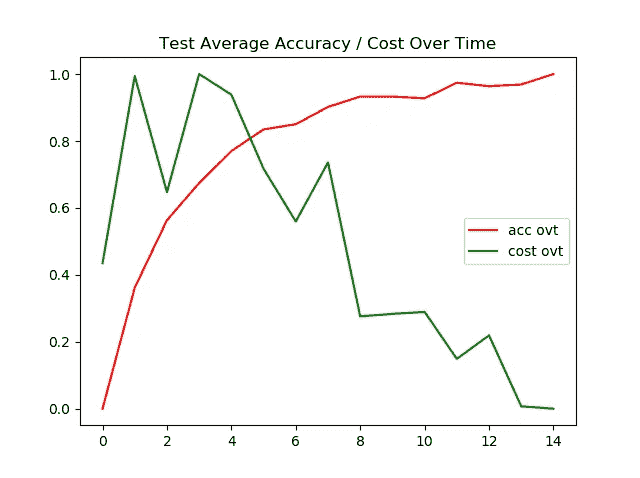

**左图** →训练图像的平均精度/成本
**右图** →测试图像的平均精度/成本

测试图像的最终精度是 89.51(如下所示)，如果我们考虑到我们只使用了一个简单的三个完全连接的神经网络，没有数据增强或任何类型的预处理，这似乎是非常有竞争力的。

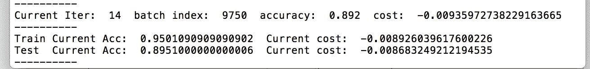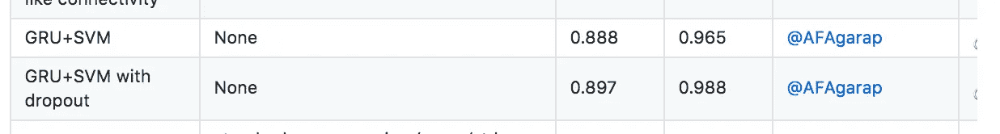

Image from this [website](https://github.com/zalandoresearch/fashion-mnist)

然而，当 GRU + SVM 与辍学层配对时，它的表现比我们的网络高出 0.2%。

**交互代码**

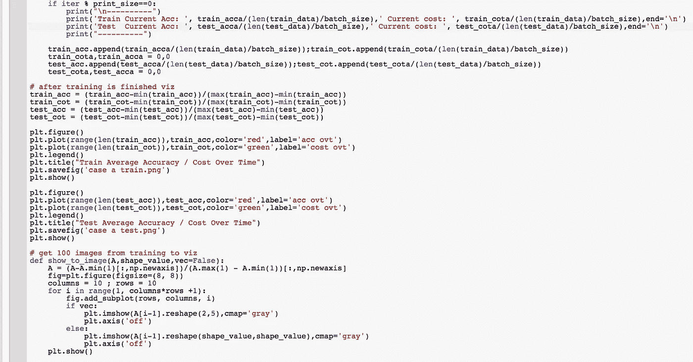

对于 Google Colab，你需要一个 Google 帐户来查看代码，而且你不能在 Google Colab 中运行只读脚本，所以在你的操场上复制一份。最后，我永远不会请求允许访问你在 Google Drive 上的文件，仅供参考。编码快乐！

要访问这篇文章的代码，请[点击这里](https://colab.research.google.com/drive/1HCOxZrym0h8VO_JvezQP62rHylicgqoY)，要访问培训日志，请[点击这里](https://github.com/JaeDukSeo/Daily-Neural-Network-Practice-2/blob/master/Understanding_Concepts/EIG_Layer/casea/case%20a%20log.txt)。

**有点奇怪？作者原始论文的发现**

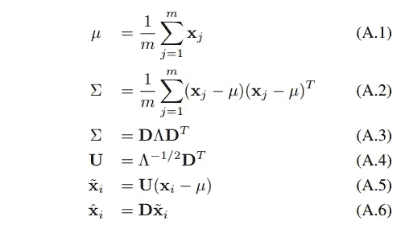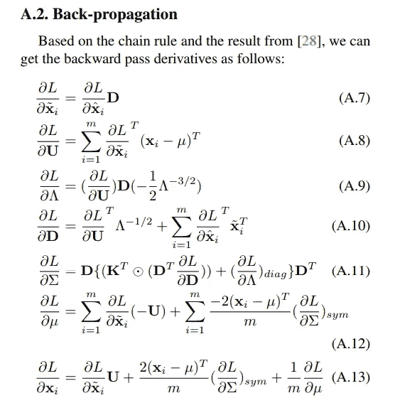

Image from this [website](https://arxiv.org/pdf/1804.08450.pdf)

在研究这个课题时，我意识到作者可能犯了一个错误。如上所述，我们可以看到作者的前馈操作和反向传播的方法。现在让我们把这个拆开…

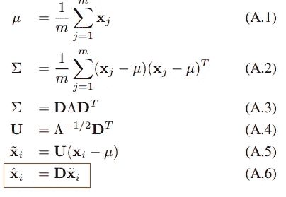

在前馈操作的最后一行，我们用白化矩阵 D 和原始数据 x 执行点积。例如，我们说每个矩阵的维数大约为 D 的(N*N)和(N*D ),其中 N 是示例的数量，D 是数据的维数。(同样，我们可以通过示例数量或维度方式对数据进行白化。)

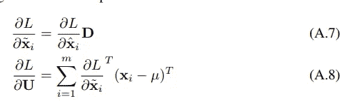

我们知道白化层的输出维数是(D*N)，因此关于 x_hat 的梯度将具有相同的维数。然而，我们正在尝试执行矩阵(N*D)和(N*N)之间的点积。(答 7)。所以我认为这些符号有点不对劲…另外，我认为对 x_hat 的求导是错误的，因为它不仅需要与 D 交换空间，而且 D 必须被转置。

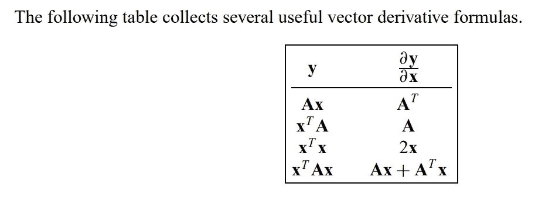

Image from this [website](https://www.colorado.edu/engineering/CAS/courses.d/IFEM.d/IFEM.AppC.d/IFEM.AppC.pdf)

如上所述，当方程为 y = Ax 时，我们对 x 求导，得到转置(A)。

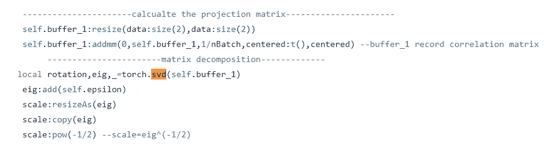

Image from this [website](https://github.com/umich-vl/DecorrelatedBN/blob/master/module/DecorelateBN_Advance.lua)

此外，我发现了一些奇怪的事情，正如上面所看到的，作者实际上使用了奇异值分解来寻找特征值和向量。(在他们的[实现中](https://github.com/umich-vl/DecorrelatedBN/blob/master/module/DecorelateBN_Advance.lua))。然而，没有提到使用奇异值分解，而是特征值分解。

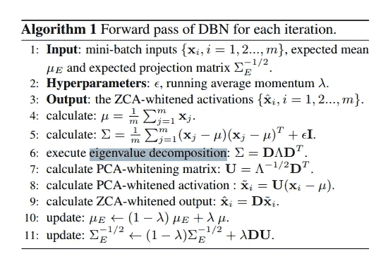

Image from the [paper](https://arxiv.org/pdf/1804.08450.pdf)

之所以引起我的注意，是因为关于 svd 的导数和特征值分解是不同的。(上图是 svd 的导数，下图是特征值分解。)我觉得这些有点奇怪。

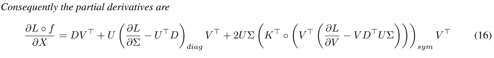

Image from this [paper](https://arxiv.org/pdf/1509.07838.pdf)

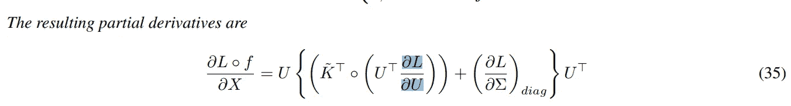

Image from this [paper](https://arxiv.org/pdf/1509.07838.pdf)

最后，符号非常混乱，如下图所示，蓝色区域矩阵是一个元素乘法，但是没有任何符号指定这个操作。(我以为是⊙，*或者∘)。

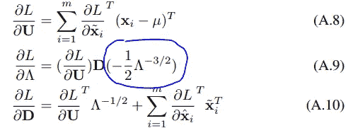

上面的例子非常混乱，但是这是一个简单的例子，我展示了我们必须执行元素乘法而不是点积。我对作者没有负面的感觉，但是我很惊讶 CVPR 最负盛名的计算机视觉会议论文之一竟然有这些错误。我**完全承认我有可能用不同的符号错了**，或者仅仅是我的错误。

**我应该用特征值分解还是奇异值分解？**

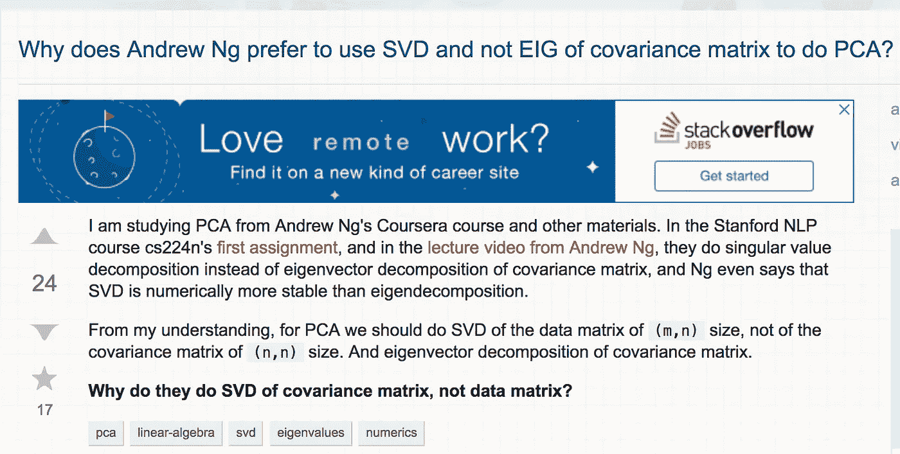

Image from this [website](https://stats.stackexchange.com/questions/314046/why-does-andrew-ng-prefer-to-use-svd-and-not-eig-of-covariance-matrix-to-do-pca)

如上所述，即使 Andrew NG 也喜欢使用 svd，因为它在数值上更稳定。另外，看到下面的回答…

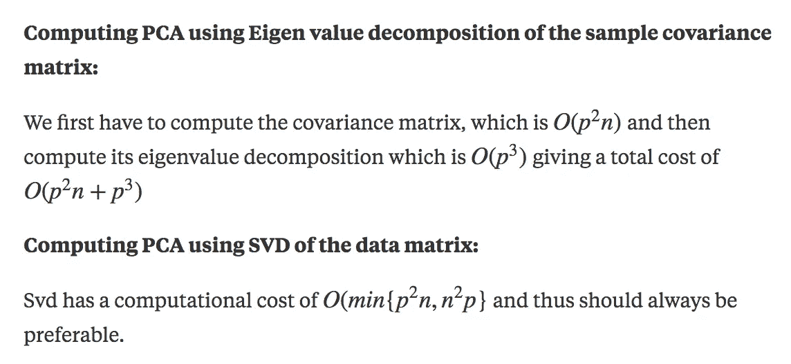

Image from this [website](https://www.quora.com/Why-dont-people-use-SVD-in-PCA-rather-than-eigen-value-decomposition)

我们知道，SVD 不仅更稳定，而且更快，此外，对输入的导数(没有对 U 或 V 的梯度)。反向传播稍微容易一些。

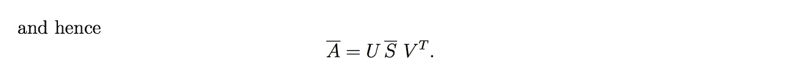

Image from this [website](https://people.maths.ox.ac.uk/gilesm/files/NA-08-01.pdf)

然而，似乎有些衍生产品还没有得到完全的支持。

Image from this [website](https://github.com/tensorflow/tensorflow/issues/13641)

但是我认为我们不应该仅仅使用 svd 来进行特征值分解。虽然 svd 确实更灵敏，但并不总是更快。

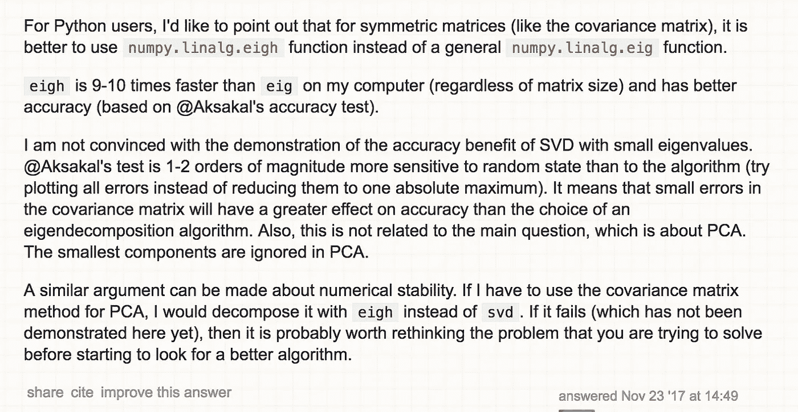

image from this [website](https://stats.stackexchange.com/questions/314046/why-does-andrew-ng-prefer-to-use-svd-and-not-eig-of-covariance-matrix-to-do-pca)

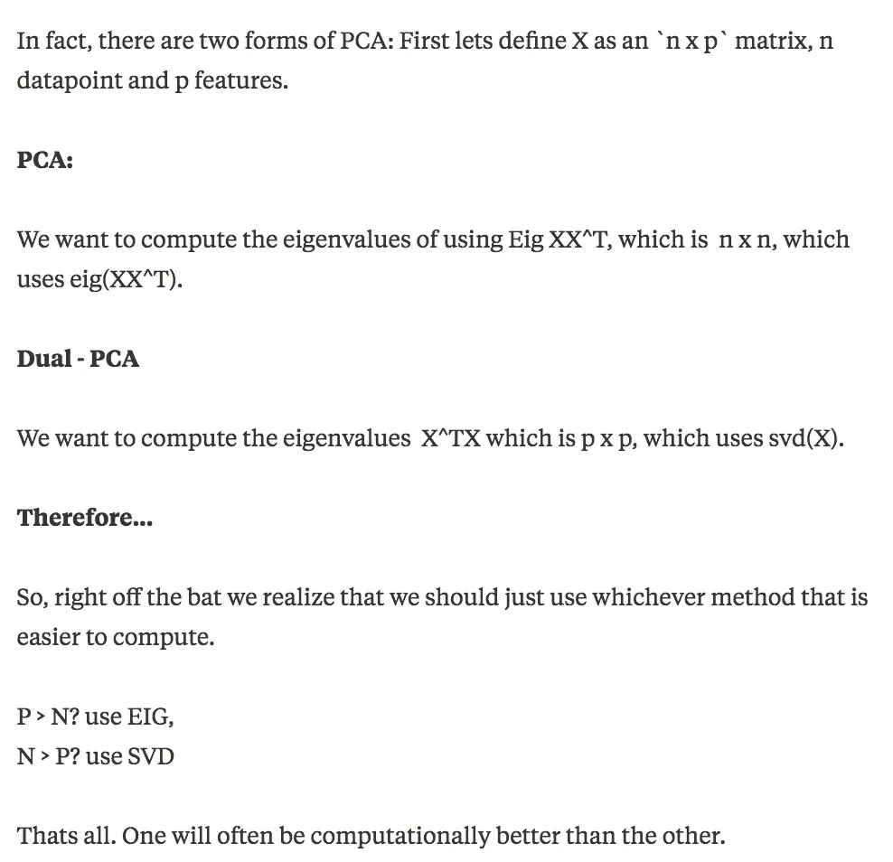

image from this [website](https://www.quora.com/Why-dont-people-use-SVD-in-PCA-rather-than-eigen-value-decomposition)

所以看起来没有明显的赢家…我个人更喜欢特征值分解，因为我更了解它。另外作为旁注，目前(2018 . 8 . 29)tensor flow 中特征值分解和奇异值分解都相当慢。

# **最后的话**

# **(以下是我的个人笔记，如果需要可以跳过。)**

我会用这一部分为我未来的自己做一个笔记，关于我理解有困难的部分。在通过批处理规范化的反向传播过程中，有一个术语神秘消失了。(如下图。).

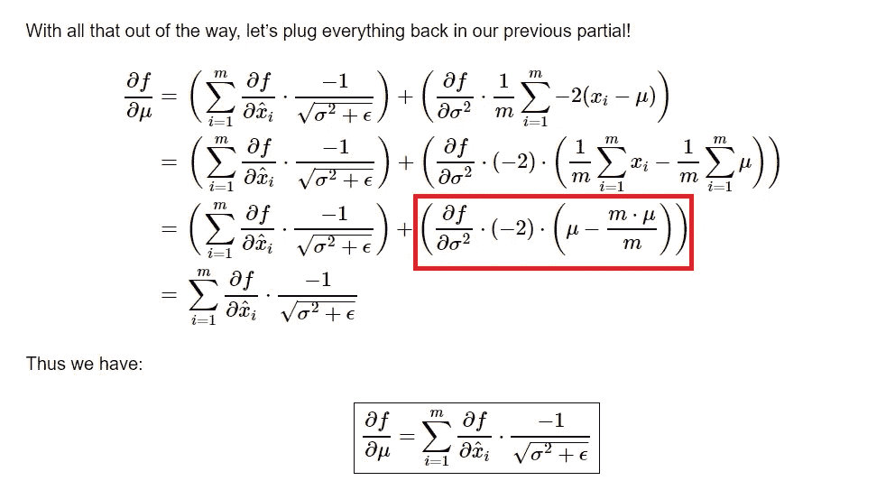

Image from this [website](https://kevinzakka.github.io/2016/09/14/batch_normalization/)

起初可能会令人困惑，但事实证明非常简单，在我们继续之前，让我们回顾一些西格玛规则，可以在这里找到。

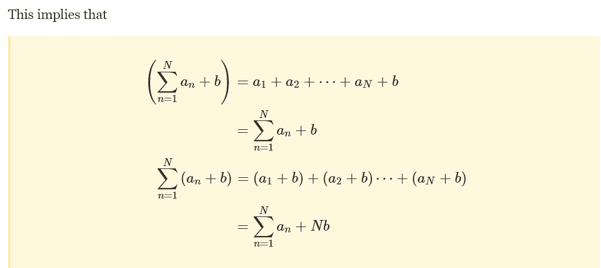

Image from this [website](https://math.stackexchange.com/questions/2348132/notation-where-to-put-brackets-around-summation-or-product-what-is-the-convent)

啊，所以，如果第二项“b”不是矩阵，(或者与 sigma 符号无关)，我们可以认为第二项只是重复次数(N)和原始值“b”的乘积。这就是为什么在批处理范数中，平均向量(mu)不会被(1/m)除，因为我们要乘以它。记住，mu 是相对于行的向量。(如在中，我们将矩阵设置为 N*D，其中 N 是示例的数量，D 是维度，mu 正好是(1*D))。或者我们也可以把它想成类似下图的东西。

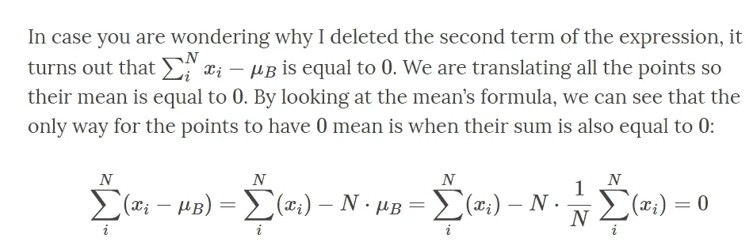

Image from this [website](https://costapt.github.io/2016/07/09/batch-norm-alt/)

***简单回顾一下软 Max 与交叉熵损失***

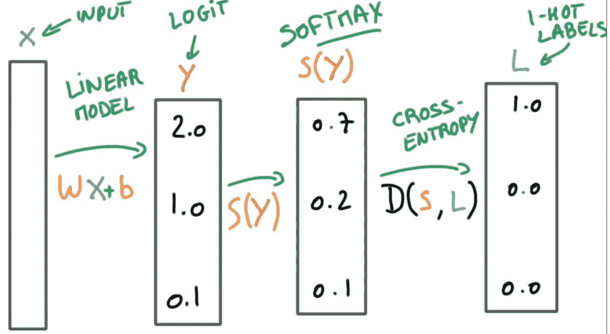

Image from this [website](https://www.ritchieng.com/machine-learning/deep-learning/neural-nets/)

我不喜欢依赖高级 api 的原因之一是，我忘记了如何实现其中的一些。(尴尬但是挺真实的。).如上所述，多标签损失包括两项，软最大层和交叉熵损失。软最大值很容易，只需归一化给定的向量，使总和为 1，但是我们需要注意数值稳定性。

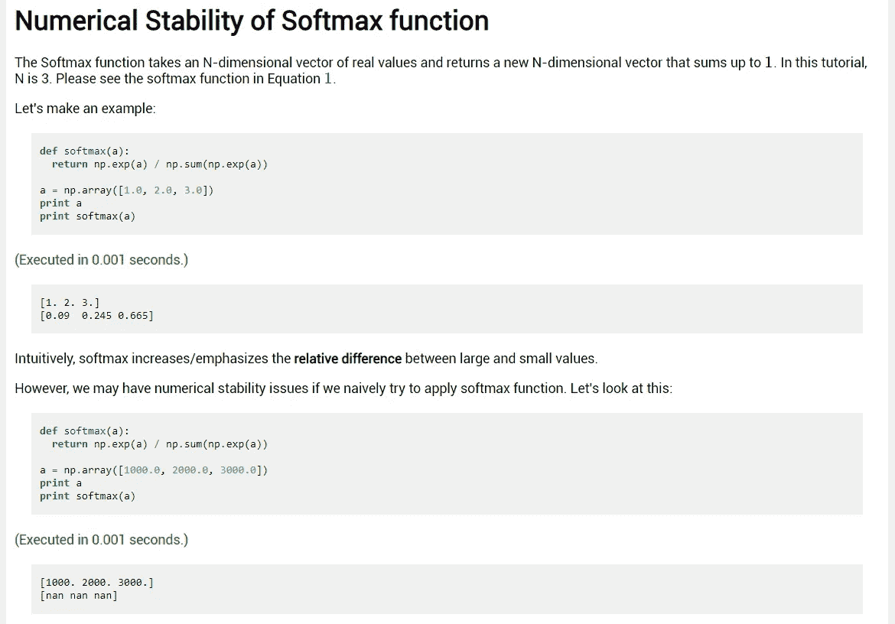

Image from this [website](http://saitcelebi.com/tut/output/part2.html)

如上所述，减去最大值是个好主意，但不是全局最大值，而是每个向量的最大值。(N*D)然后是(N*1)个最大值。

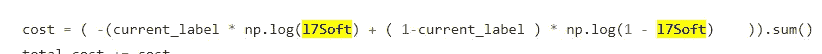

Image from this [website](https://github.com/JaeDukSeo/Personal_Daily_NeuralNetwork_Practice/blob/master/a_vgg/1_mini_vgg_16.py)

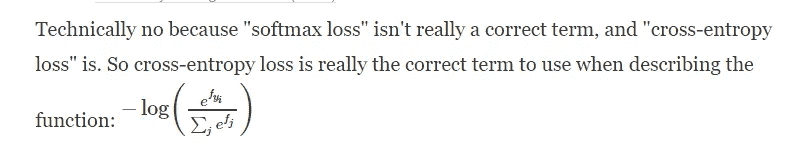

Image from this [website](https://www.quora.com/Is-the-softmax-loss-the-same-as-the-cross-entropy-loss)

如上所述，在计算预测成本时，我们忽略了平均值或总值。最后，我希望提醒自己关于实现的危险，如下所示，实现可能看起来是正确的(确实如此)。

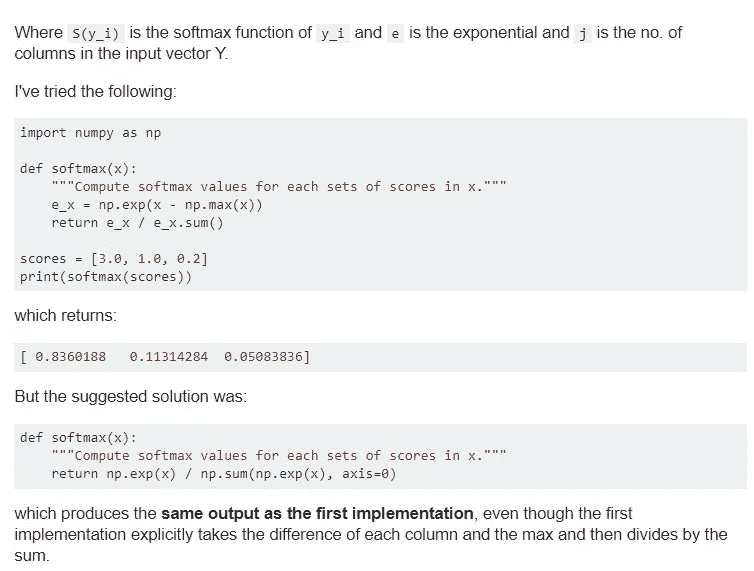

Image from this [website](https://stackoverflow.com/questions/34968722/how-to-implement-the-softmax-function-in-python)

然而，上面的实现对 2D 矩阵实现不起作用，如果我们有最终预测矩阵为(N*D ),其中 N 是例子的数量，D 是最终预测，则必须使用下面的实现。

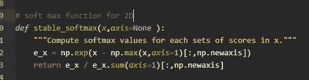

最后，以防万一矩阵的一些基本概念，和一个矩阵演算的 pdf。和批量标准化的完全反向传播。

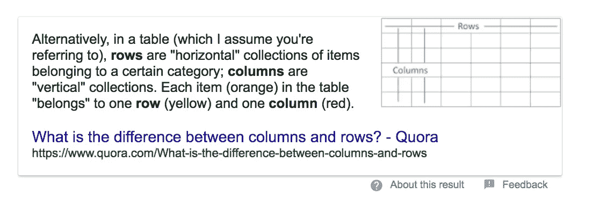

Image from this [website](https://www.google.co.kr/search?q=row+vs+column&oq=row+vs+col&aqs=chrome.1.69i57j0l5.3550j0j7&sourceid=chrome&ie=UTF-8)

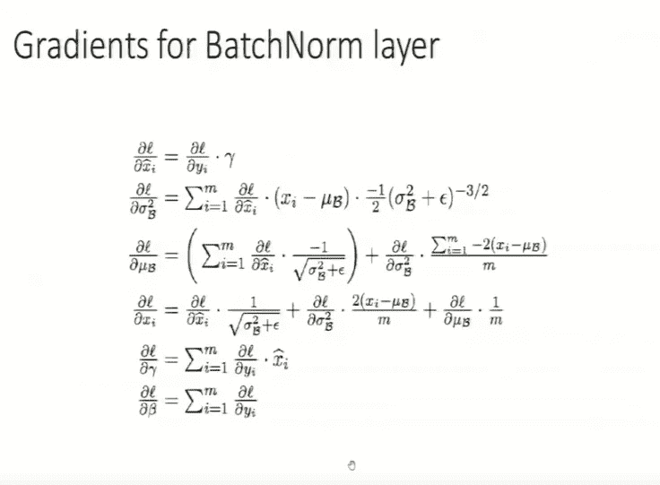

Final resource for back prop in BN, from [here](https://www.youtube.com/watch?v=Zz98nDE5b8E)

Paper from this [website](https://www.colorado.edu/engineering/CAS/courses.d/IFEM.d/IFEM.AppC.d/IFEM.AppC.pdf)

如果发现任何错误，请发电子邮件到 jae.duk.seo@gmail.com 给我，如果你希望看到我所有写作的列表，请[在这里查看我的网站](https://jaedukseo.me/)。

同时，在我的 twitter [这里](https://twitter.com/JaeDukSeo)关注我，并访问[我的网站](https://jaedukseo.me/)，或我的 [Youtube 频道](https://www.youtube.com/c/JaeDukSeo)了解更多内容。我也实现了[广残网，请点击这里查看博文 pos](https://medium.com/@SeoJaeDuk/wide-residual-networks-with-interactive-code-5e190f8f25ec) t。

**参考**

1.  NumPy . linalg . EIG—NumPy 1.15 版手册。(2018).Docs.scipy.org。检索于 2018 年 8 月 19 日，来自[https://docs . scipy . org/doc/numpy/reference/generated/numpy . Lina LG . EIG . html](https://docs.scipy.org/doc/numpy/reference/generated/numpy.linalg.eig.html)
2.  熊猫，C. (2018)。与熊猫相关矩阵的计算及可视化。数据科学堆栈交换。检索于 2018 年 8 月 19 日，来自[https://data science . stack exchange . com/questions/10459/computation-and-visualization-of-correlation-matrix-with-pandas](https://datascience.stackexchange.com/questions/10459/calculation-and-visualization-of-correlation-matrix-with-pandas)
3.  NumPy . cov—NumPy 1.15 版手册。(2018).Docs.scipy.org。检索于 2018 年 8 月 19 日，来自[https://docs . scipy . org/doc/numpy/reference/generated/numpy . cov . html](https://docs.scipy.org/doc/numpy/reference/generated/numpy.cov.html)
4.  统计白化。(2018).joelouismmarino . github . io .检索于 2018 年 8 月 19 日，来自[http://joelouismmarino . github . io/blog _ posts/blog _ whitening . html](http://joelouismarino.github.io/blog_posts/blog_whitening.html)
5.  内联，H. (2018)。如何让 IPython 笔记本 matplotlib 内联绘图？堆栈溢出。检索于 2018 年 8 月 20 日，来自[https://stack overflow . com/questions/19410042/how-to-make-ipython-notebook-matplotlib-plot-inline](https://stackoverflow.com/questions/19410042/how-to-make-ipython-notebook-matplotlib-plot-inline)
6.  matplotlib？，H. (2018)。如何改变用 matplotlib 绘制的图形的大小？。堆栈溢出。检索于 2018 年 8 月 20 日，来自[https://stack overflow . com/questions/332289/how-do-you-change-the-size-of-figures-drawn-with-matplotlib](https://stackoverflow.com/questions/332289/how-do-you-change-the-size-of-figures-drawn-with-matplotlib)
7.  随机抽样(numpy.random) — NumPy v1.14 手册。(2018).Docs.scipy.org。检索于 2018 年 8 月 20 日，来自[https://docs . scipy . org/doc/numpy-1 . 14 . 0/reference/routines . random . html](https://docs.scipy.org/doc/numpy-1.14.0/reference/routines.random.html)
8.  sk learn . datasets . make _ regression-sci kit-learn 0 . 19 . 2 文档。(2018).Scikit-learn.org。检索于 2018 年 8 月 20 日，来自[http://sci kit-learn . org/stable/modules/generated/sk learn . datasets . make _ regression . html # sk learn . datasets . make _ regression](http://scikit-learn.org/stable/modules/generated/sklearn.datasets.make_regression.html#sklearn.datasets.make_regression)
9.  j . brown lee(2018 年)。如何用 scikit-learn 在 Python 中生成测试数据集？机器学习精通。检索于 2018 年 8 月 20 日，来自[https://machine learning mastery . com/generate-test-datasets-python-sci kit-learn/](https://machinelearningmastery.com/generate-test-datasets-python-scikit-learn/)
10.  美白？，W. (2018)。ZCA 美白和 PCA 美白有什么区别？。交叉验证。检索于 2018 年 8 月 20 日，来自[https://stats . stack exchange . com/questions/117427/zca-whiting-and-PCA-whiting 的区别是什么](https://stats.stackexchange.com/questions/117427/what-is-the-difference-between-zca-whitening-and-pca-whitening)
11.  协方差矩阵和数据分布。(2013).聪明的机器。2018 年 8 月 20 日检索，来自[https://theclevermachine . WordPress . com/2013/03/29/协方差矩阵和数据分布/](https://theclevermachine.wordpress.com/2013/03/29/covariance-matrices-and-data-distributions/)
12.  内联，H. (2018)。如何让 IPython 笔记本 matplotlib 内联绘图？堆栈溢出。检索于 2018 年 8 月 21 日，来自[https://stack overflow . com/questions/19410042/how-to-make-ipython-notebook-matplotlib-plot-inline](https://stackoverflow.com/questions/19410042/how-to-make-ipython-notebook-matplotlib-plot-inline)
13.  使用 matplotlib (pylab)并排显示两幅图像。(2018).要点。检索于 2018 年 8 月 21 日，来自[https://gist . github . com/mstankie/71e 49 f 628 beac 320953 e 0460 b 8e 78 c 2](https://gist.github.com/mstankie/71e49f628beac320953e0460b8ee78c2)
14.  在西马特普罗提卜(2018)。在 Matplotlib 中，fig.add_subplot(111)中的参数是什么意思？。堆栈溢出。检索于 2018 年 8 月 21 日，来自[https://stack overflow . com/questions/3584805/in-matplotlib-what-the-argument-mean-in-fig-add-subplot 111](https://stackoverflow.com/questions/3584805/in-matplotlib-what-does-the-argument-mean-in-fig-add-subplot111)
15.  推导批次标准化的后向传递的梯度。(2018).kevinzakka . github . io . 2018 年 8 月 21 日检索，来自[https://kevinzakka . github . io/2016/09/14/batch _ normalization/](https://kevinzakka.github.io/2016/09/14/batch_normalization/)
16.  符号:在求和或乘积的周围放括号，w. (2018)。符号:求和或乘积的括号在哪里，约定是什么？。数学栈交换。检索于 2018 年 8 月 21 日，来自[https://math . stack exchange . com/questions/2348132/notation-where-to-put-brackets-around-summation-or-product-what-the-convent](https://math.stackexchange.com/questions/2348132/notation-where-to-put-brackets-around-summation-or-product-what-is-the-convent)
17.  高效批次标准化-佩德罗·科斯塔。(2018).Costapt.github.io，检索日期:2018 年 8 月 21 日，自[https://costapt.github.io/2016/07/09/batch-norm-alt/](https://costapt.github.io/2016/07/09/batch-norm-alt/)
18.  umich-VL/de related bn。(2018).GitHub。检索日期:2018 年 8 月 21 日，自[https://git hub . com/umich-VL/decorated bn/blob/master/module/decorated bn _ advance . Lua](https://github.com/umich-vl/DecorrelatedBN/blob/master/module/DecorelateBN_Advance.lua)
19.  (2018).Arxiv.org。检索于 2018 年 8 月 21 日，来自[https://arxiv.org/pdf/1509.07838.pdf](https://arxiv.org/pdf/1509.07838.pdf)
20.  (2018).Colorado.edu。检索日期:2018 年 8 月 21 日，来自[https://www . Colorado . edu/engineering/CAS/courses . d/ifem . d/IFEM。AppC.d/IFEM。AppC.pdf](https://www.colorado.edu/engineering/CAS/courses.d/IFEM.d/IFEM.AppC.d/IFEM.AppC.pdf)
21.  居中。(2018).Cis.legacy.ics.tkk.fi .检索自 2018 年 8 月 21 日[http://cis . legacy . ics . tkk . fi/aapo/papers/Ijcnn 99 _ tutorialWeb/node 25 . html](http://cis.legacy.ics.tkk.fi/aapo/papers/IJCNN99_tutorialweb/node25.html)
22.  CVPR2018。(2018).Cvpr2018.thecvf.com。检索自 2018 年 8 月 21 日，http://cvpr2018.thecvf.com/
23.  扩展 SVD 梯度以支持通过复杂和(强)矩形 U 和 V 的反向传播问题#13641 张量流/张量流。(2018).GitHub。检索自 2018 年 8 月 21 日，https://github.com/tensorflow/tensorflow/issues/13641
24.  PCA？，W. (2018)。为什么吴恩达更喜欢用奇异值分解而不是协方差矩阵的 EIG 来进行 PCA？。交叉验证。检索日期:2018 年 8 月 21 日，自[https://stats . stackexchange . com/questions/314046/为什么-andrew-ng 更喜欢-SVD-而不是-EIG-of-协方差矩阵-to-PCA](https://stats.stackexchange.com/questions/314046/why-does-andrew-ng-prefer-to-use-svd-and-not-eig-of-covariance-matrix-to-do-pca)
25.  PCA？，W. (2018)。为什么吴恩达更喜欢用奇异值分解而不是协方差矩阵的 EIG 来进行 PCA？。交叉验证。检索日期:2018 年 8 月 21 日，自[https://stats . stackexchange . com/questions/314046/为什么-andrew-ng 更喜欢-SVD-而不是-EIG-of-协方差矩阵-to-PCA](https://stats.stackexchange.com/questions/314046/why-does-andrew-ng-prefer-to-use-svd-and-not-eig-of-covariance-matrix-to-do-pca)
26.  达哈尔，P. (2017 年)。分类和损失评估— Softmax 和交叉熵损失。深度笔记。检索于 2018 年 8 月 22 日，来自[https://deepnotes.io/softmax-crossentropy](https://deepnotes.io/softmax-crossentropy)
27.  [在线]见:[https://www . quora . com/Is-the-soft max-loss-the-same-as-the-cross-entropy-loss](https://www.quora.com/Is-the-softmax-loss-the-same-as-the-cross-entropy-loss)[2018 年 8 月 22 日访问]。
28.  对深层神经网络的归纳。(2018).ritchieng . github . io . 2018 年 8 月 22 日检索，来自[https://www . ritchieng . com/machine-learning/deep-learning/neural-nets/](https://www.ritchieng.com/machine-learning/deep-learning/neural-nets/)
29.  第 2 部分:Softmax 回归。(2018).Saitcelebi.com。检索于 2018 年 8 月 22 日，来自[http://saitcelebi.com/tut/output/part2.html](http://saitcelebi.com/tut/output/part2.html)
30.  JaeDukSeo/个人 _ 日常 _ 神经网络 _ 实践。(2018).GitHub。检索于 2018 年 8 月 22 日，来自[https://github . com/JaeDukSeo/Personal _ Daily _ neural network _ Practice/blob/master/a _ vgg/1 _ mini _ vgg _ 16 . py](https://github.com/JaeDukSeo/Personal_Daily_NeuralNetwork_Practice/blob/master/a_vgg/1_mini_vgg_16.py)
31.  \frac{1}{1+e^{-x}}$特区(2018 年)。sigmoid 函数的导数$\sigma (x) = \frac{1}{1+e^{-x}}$.数学栈交换。检索于 2018 年 8 月 22 日，来自[https://math . stack exchange . com/questions/78575/derivative-of-sigmoid-function-sigma-x-frac 11 e-x](https://math.stackexchange.com/questions/78575/derivative-of-sigmoid-function-sigma-x-frac11e-x)
32.  Python，H. (2018)。如何用 Python 实现 Softmax 函数？堆栈溢出。检索于 2018 年 8 月 22 日，来自[https://stack overflow . com/questions/34968722/how-to-implementation-the-soft max-function-in-python](https://stackoverflow.com/questions/34968722/how-to-implement-the-softmax-function-in-python)
33.  在 Python，c. (2018)。在 Python 中，使用 numpy 按列计算数组的 softmax。堆栈溢出。检索于 2018 年 8 月 22 日，来自[https://stack overflow . com/questions/36738754/in-python-calculate-the-soft max-of-an-array-column-wise-using-numpy](https://stackoverflow.com/questions/36738754/in-python-calculate-the-softmax-of-an-array-column-wise-using-numpy)
34.  行与列——谷歌搜索。(2018).Google.co.kr。检索 2018 年 8 月 22 日，来自[https://www.google.co.kr/search?q=row+vs+column&OQ = row+vs+col&aqs = chrome . 1.69 i57 j0l 5.3550 j0j 7&sourceid = chrome&ie = UTF-8](https://www.google.co.kr/search?q=row+vs+column&oq=row+vs+col&aqs=chrome.1.69i57j0l5.3550j0j7&sourceid=chrome&ie=UTF-8)
35.  无，N. (2018)。Numpy fill_diagonal return 无。堆栈溢出。检索于 2018 年 8 月 22 日，来自[https://stack overflow . com/questions/46445894/numpy-fill-diagonal-return-none](https://stackoverflow.com/questions/46445894/numpy-fill-diagonal-return-none)
36.  numpy.fill_diagonal — NumPy v1.14 手册。(2018).Docs.scipy.org。检索于 2018 年 8 月 22 日，来自[https://docs . scipy . org/doc/numpy-1 . 14 . 0/reference/generated/numpy . fill _ diagonal . html](https://docs.scipy.org/doc/numpy-1.14.0/reference/generated/numpy.fill_diagonal.html)
37.  已实施？，H. (2018)。numpy.cov()函数是如何实现的？。堆栈溢出。检索于 2018 年 8 月 23 日，来自[https://stack overflow . com/questions/27448352/how-numpy-cov-function-is-implemented](https://stackoverflow.com/questions/27448352/how-numpy-cov-function-is-implemented)
38.  Python，H. (2018)。如何使用 Python 并排绘制两个图？堆栈溢出。检索于 2018 年 8 月 23 日，来自[https://stack overflow . com/questions/42818361/how-to-make-two-plots-side-by-side-using-python](https://stackoverflow.com/questions/42818361/how-to-make-two-plots-side-by-side-using-python)
39.  NumPy . STD—NumPy 1.15 版手册。(2018).Docs.scipy.org。检索于 2018 年 8 月 25 日，来自[https://docs . scipy . org/doc/numpy/reference/generated/numpy . STD . html](https://docs.scipy.org/doc/numpy/reference/generated/numpy.std.html)
40.  Convnet:用 Numpy 实现卷积层— Agustinus Kristiadi 的博客。(2018).wise odd . github . io . 2018 年 8 月 26 日检索，来自[https://wise odd . github . io/tech blog/2016/07/16/conv net-conv-layer/](https://wiseodd.github.io/techblog/2016/07/16/convnet-conv-layer/)
41.  wiseodd/hipsternet。(2018).GitHub。检索于 2018 年 8 月 26 日，来自[https://github . com/wise odd/hipsternet/blob/master/hipsternet/layer . py](https://github.com/wiseodd/hipsternet/blob/master/hipsternet/layer.py)
42.  день二号，лекция四号。Евгений Соколов.Регуляризация нейронных сетей.(2018).YouTube。检索于 2018 年 8 月 26 日，来自[https://www.youtube.com/watch?v=Zz98nDE5b8E](https://www.youtube.com/watch?v=Zz98nDE5b8E)
43.  (2018).Colorado.edu。检索于 2018 年 8 月 27 日，来自[https://www . Colorado . edu/engineering/CAS/courses . d/ifem . d/IFEM。AppC.d/IFEM。AppC.pdf](https://www.colorado.edu/engineering/CAS/courses.d/IFEM.d/IFEM.AppC.d/IFEM.AppC.pdf)
44.  [复本]，H. (2018)。如何在一个图中正确显示多个图像？。堆栈溢出。检索于 2018 年 8 月 29 日，来自[https://stack overflow . com/questions/46615554/how-to-display-multiple-images-in-one-figure-right](https://stackoverflow.com/questions/46615554/how-to-display-multiple-images-in-one-figure-correctly)